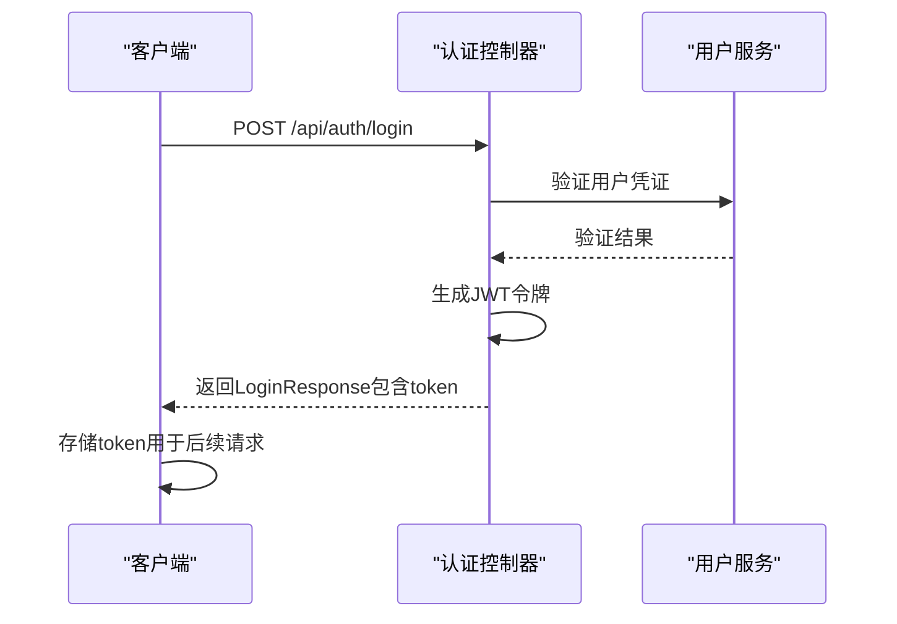

# API接口参考

<cite>
**本文档引用的文件**  
- [SecurityConfiguration.java](file://jcpp-app/src/main/java/sanbing/jcpp/app/service/security/SecurityConfiguration.java)
- [BaseController.java](file://jcpp-app/src/main/java/sanbing/jcpp/app/adapter/controller/BaseController.java)
- [UserController.java](file://jcpp-app/src/main/java/sanbing/jcpp/app/adapter/controller/UserController.java)
- [StationController.java](file://jcpp-app/src/main/java/sanbing/jcpp/app/adapter/controller/StationController.java)
- [PileController.java](file://jcpp-app/src/main/java/sanbing/jcpp/app/adapter/controller/PileController.java)
- [GunController.java](file://jcpp-app/src/main/java/sanbing/jcpp/app/adapter/controller/GunController.java)
- [RpcController.java](file://jcpp-app/src/main/java/sanbing/jcpp/app/adapter/controller/RpcController.java)
- [ProtocolController.java](file://jcpp-app/src/main/java/sanbing/jcpp/app/adapter/controller/ProtocolController.java)
- [DownlinkController.java](file://jcpp-protocol-api/src/main/java/sanbing/jcpp/protocol/adapter/DownlinkController.java)
- [DownlinkGrpcService.java](file://jcpp-protocol-api/src/main/java/sanbing/jcpp/protocol/adapter/DownlinkGrpcService.java)
- [ApiResponse.java](file://jcpp-app/src/main/java/sanbing/jcpp/app/adapter/response/ApiResponse.java)
- [LoginResponse.java](file://jcpp-app/src/main/java/sanbing/jcpp/app/adapter/response/LoginResponse.java)
- [JCPPErrorCode.java](file://jcpp-app/src/main/java/sanbing/jcpp/app/exception/JCPPErrorCode.java)
- [JCPPErrorResponseHandler.java](file://jcpp-app/src/main/java/sanbing/jcpp/app/exception/JCPPErrorResponseHandler.java)
- [StationCreateRequest.java](file://jcpp-app/src/main/java/sanbing/jcpp/app/adapter/request/StationCreateRequest.java)
- [PileCreateRequest.java](file://jcpp-app/src/main/java/sanbing/jcpp/app/adapter/request/PileCreateRequest.java)
- [StartChargeDTO.java](file://jcpp-app/src/main/java/sanbing/jcpp/app/adapter/dto/StartChargeDTO.java)
- [StopChargeDTO.java](file://jcpp-app/src/main/java/sanbing/jcpp/app/adapter/dto/StopChargeDTO.java)
- [RpcRequest.java](file://jcpp-app/src/main/java/sanbing/jcpp/app/adapter/request/RpcRequest.java)
- [downlink.proto](file://jcpp-infrastructure-proto/src/main/proto/downlink.proto)
- [grpc.proto](file://jcpp-infrastructure-proto/src/main/proto/grpc.proto)
</cite>

## 目录

1. [简介](#简介)
2. [RESTful API](#restful-api)
    1. [认证与安全](#认证与安全)
    2. [设备管理接口](#设备管理接口)
    3. [协议管理接口](#协议管理接口)
    4. [RPC接口](#rpc接口)
3. [gRPC接口](#grpc接口)
4. [通用响应结构](#通用响应结构)
5. [错误码体系](#错误码体系)
6. [速率限制](#速率限制)

## 简介

本文档为JChargePointProtocol项目提供全面的API接口参考，涵盖RESTful API和gRPC两种通信方式。系统为充电桩管理平台提供完整的设备管理、协议交互和远程控制能力。

**Section sources**

- [BaseController.java](file://jcpp-app/src/main/java/sanbing/jcpp/app/adapter/controller/BaseController.java)

## RESTful API

### 认证与安全

系统采用JWT（JSON Web Token）进行身份验证，支持两种认证方式：

1. **请求头认证**（推荐）：
    - `Authorization: Bearer <token>`
    - 或 `X-Authorization: <token>`

2. **查询参数认证**：
    - `?token=<token>`

认证端点：

- **POST /api/auth/login**：用户登录获取JWT令牌
- **GET /api/user/info**：获取当前用户信息

成功登录后，系统返回包含JWT令牌的响应，后续请求需在请求头中携带该令牌。



**Diagram sources**

- [SecurityConfiguration.java](file://jcpp-app/src/main/java/sanbing/jcpp/app/service/security/SecurityConfiguration.java#L40-L70)
- [LoginResponse.java](file://jcpp-app/src/main/java/sanbing/jcpp/app/adapter/response/LoginResponse.java)

### 设备管理接口

#### 充电站管理

提供对充电站的CRUD操作和查询功能。

| HTTP方法 | URL路径                 | 描述                |
|--------|-----------------------|-------------------|
| GET    | /api/stations         | 分页查询充电站列表         |
| GET    | /api/stations/{id}    | 根据ID获取充电站详情       |
| POST   | /api/stations         | 创建新的充电站           |
| PUT    | /api/stations/{id}    | 更新充电站信息           |
| DELETE | /api/stations/{id}    | 删除充电站             |
| GET    | /api/stations/options | 获取充电站选项列表（用于下拉选择） |
| GET    | /api/stations/search  | 搜索充电站选项（支持关键字）    |

**请求体 (POST /api/stations) - StationCreateRequest:**

```json
{
  "stationName": "string, 充电站名称, 必填",
  "stationCode": "string, 充电站编码, 必填",
  "longitude": "number, 经度",
  "latitude": "number, 纬度",
  "province": "string, 省份",
  "city": "string, 城市",
  "county": "string, 区县",
  "address": "string, 详细地址"
}
```

**响应体:**

```json
{
  "success": true,
  "message": "创建成功",
  "data": {
    "id": "uuid, 充电站ID",
    "stationName": "string, 充电站名称",
    "stationCode": "string, 充电站编码",
    "longitude": "number, 经度",
    "latitude": "number, 纬度",
    "province": "string, 省份",
    "city": "string, 城市",
    "county": "string, 区县",
    "address": "string, 详细地址",
    "createdTime": "datetime, 创建时间"
  },
  "timestamp": "number, 时间戳"
}
```

**curl示例:**

```bash
curl -X POST "http://localhost:8080/api/stations" \
  -H "Authorization: Bearer your-jwt-token" \
  -H "Content-Type: application/json" \
  -d '{
    "stationName": "高新科技园充电站",
    "stationCode": "ST001",
    "longitude": 113.944,
    "latitude": 22.543,
    "province": "广东省",
    "city": "深圳市",
    "county": "南山区",
    "address": "科技园南区1号"
  }'
```

#### 充电桩管理

提供对充电桩的管理功能。

| HTTP方法 | URL路径                        | 描述              |
|--------|------------------------------|-----------------|
| POST   | /api/piles                   | 创建新的充电桩         |
| GET    | /api/piles/{id}              | 根据ID获取充电桩详情     |
| PUT    | /api/piles/{id}              | 更新充电桩信息         |
| DELETE | /api/piles/{id}              | 删除充电桩           |
| GET    | /api/piles                   | 分页查询充电桩列表（包含状态） |
| GET    | /api/piles/options           | 获取充电桩选项列表       |
| GET    | /api/piles/status/{pileCode} | 根据桩编号获取充电桩状态    |

**curl示例:**

```bash
curl -X GET "http://localhost:8080/api/piles/status/P001" \
  -H "Authorization: Bearer your-jwt-token"
```

#### 充电枪管理

提供对充电枪的管理功能。

| HTTP方法 | URL路径                      | 描述              |
|--------|----------------------------|-----------------|
| POST   | /api/guns                  | 创建新的充电枪         |
| GET    | /api/guns/{id}             | 根据ID获取充电枪详情     |
| PUT    | /api/guns/{id}             | 更新充电枪信息         |
| DELETE | /api/guns/{id}             | 删除充电枪           |
| GET    | /api/guns                  | 分页查询充电枪列表（包含状态） |
| GET    | /api/guns/status/{gunCode} | 根据枪编号获取充电枪运行状态  |
| GET    | /api/guns/code/{gunCode}   | 根据充电枪编码获取详细信息   |

**curl示例:**

```bash
curl -X GET "http://localhost:8080/api/guns/code/G001" \
  -H "Authorization: Bearer your-jwt-token"
```

**Section sources**

- [StationController.java](file://jcpp-app/src/main/java/sanbing/jcpp/app/adapter/controller/StationController.java)
- [PileController.java](file://jcpp-app/src/main/java/sanbing/jcpp/app/adapter/controller/PileController.java)
- [GunController.java](file://jcpp-app/src/main/java/sanbing/jcpp/app/adapter/controller/GunController.java)
- [StationCreateRequest.java](file://jcpp-app/src/main/java/sanbing/jcpp/app/adapter/request/StationCreateRequest.java)

### 协议管理接口

提供协议相关的查询功能。

| HTTP方法 | URL路径                    | 描述          |
|--------|--------------------------|-------------|
| GET    | /api/protocols/supported | 获取所有支持的协议列表 |

**响应体:**

```json
{
  "success": true,
  "message": "查询成功",
  "data": [
    {
      "value": "string, 协议标识符",
      "label": "string, 显示名称"
    }
  ],
  "timestamp": "number, 时间戳"
}
```

**curl示例:**

```bash
curl -X GET "http://localhost:8080/api/protocols/supported" \
  -H "Authorization: Bearer your-jwt-token"
```

**Section sources**

- [ProtocolController.java](file://jcpp-app/src/main/java/sanbing/jcpp/app/adapter/controller/ProtocolController.java)

### RPC接口

提供通用化的充电桩远程过程调用接口，支持多种控制命令。

| HTTP方法 | URL路径                  | 描述                |
|--------|------------------------|-------------------|
| POST   | /api/rpc/oneway        | 单向RPC调用（不等待响应）    |
| POST   | /api/rpc/bidirectional | 双向RPC调用（等待响应，待实现） |

**请求体 - RpcRequest:**

```json
{
  "method": "string, RPC方法名, 必填",
  "parameter": "object, 方法参数, JSON格式, 必填",
  "timeoutMs": "number, 超时时间（毫秒），仅用于双向RPC"
}
```

支持的`method`值：

- `startCharge`: 启动充电
- `stopCharge`: 停止充电
- `restartPile`: 重启充电桩
- `setPricing`: 设置计费策略
- `setQrcode`: 设置二维码
- `otaRequest`: OTA升级
- `offlineCardBalanceUpdate`: 离线卡余额更新
- `offlineCardSync`: 离线卡同步
- `offlineCardClear`: 离线卡清除
- `offlineCardQuery`: 离线卡查询
- `timeSync`: 时间同步

#### 启动充电

**method**: `startCharge`

**parameter结构 - StartChargeDTO:**

```json
{
  "pileCode": "string, 充电桩编码, 必填",
  "gunNo": "string, 充电枪编号, 必填",
  "limitYuan": "number, 限制金额（元）, 必填",
  "orderNo": "string, 订单号, 必填",
  "logicalCardNo": "string, 逻辑卡号",
  "physicalCardNo": "string, 物理卡号",
  "parallelNo": "string, 并充序号"
}
```

**curl示例:**

```bash
curl -X POST "http://localhost:8080/api/rpc/oneway" \
  -H "Authorization: Bearer your-jwt-token" \
  -H "Content-Type: application/json" \
  -d '{
    "method": "startCharge",
    "parameter": {
      "pileCode": "P001",
      "gunNo": "G001",
      "limitYuan": 100.00,
      "orderNo": "ORD20240101001",
      "logicalCardNo": "LC001",
      "physicalCardNo": "PC001"
    }
  }'
```

#### 停止充电

**method**: `stopCharge`

**parameter结构 - StopChargeDTO:**

```json
{
  "pileCode": "string, 充电桩编码, 必填",
  "gunNo": "string, 充电枪编号, 必填"
}
```

**curl示例:**

```bash
curl -X POST "http://localhost:8080/api/rpc/oneway" \
  -H "Authorization: Bearer your-jwt-token" \
  -H "Content-Type: application/json" \
  -d '{
    "method": "stopCharge",
    "parameter": {
      "pileCode": "P001",
      "gunNo": "G001"
    }
  }'
```

**Section sources**

- [RpcController.java](file://jcpp-app/src/main/java/sanbing/jcpp/app/adapter/controller/RpcController.java)
- [StartChargeDTO.java](file://jcpp-app/src/main/java/sanbing/jcpp/app/adapter/dto/StartChargeDTO.java)
- [StopChargeDTO.java](file://jcpp-app/src/main/java/sanbing/jcpp/app/adapter/dto/StopChargeDTO.java)
- [RpcRequest.java](file://jcpp-app/src/main/java/sanbing/jcpp/app/adapter/request/RpcRequest.java)

## gRPC接口

系统提供gRPC接口用于高效的双向通信，主要服务于DownlinkGrpcService。

### 服务定义

在`grpc.proto`文件中定义了`ProtocolInterface`服务：

```protobuf
service ProtocolInterface {
  rpc onDownlink(stream RequestMsg) returns (stream ResponseMsg) {}
}
```

### 消息类型

#### RequestMsg

```protobuf
message RequestMsg {
  int64 ts = 1;
  TracerProto tracer = 2;
  ConnectRequestMsg connectRequestMsg = 10;
  DownlinkRequestMessage downlinkRequestMessage = 11;
}
```

#### ResponseMsg

```protobuf
message ResponseMsg {
  TracerProto tracer = 2;
  ConnectResponseMsg connectResponseMsg = 12;
  DownlinkResponseMessage downlinkResponseMsg = 13;
}
```

### 连接流程

1. 客户端建立gRPC连接到服务器
2. 发送包含`ConnectRequestMsg`的`RequestMsg`
3. 服务器返回包含`ConnectResponseMsg`的`ResponseMsg`
4. 连接建立成功后，可发送`DownlinkRequestMessage`进行下行指令

### DownlinkRequestMessage

定义在`downlink.proto`中，包含各种充电桩控制指令。

### Java客户端调用示例

```java
// 创建gRPC通道
ManagedChannel channel = ManagedChannelBuilder
    .forAddress("localhost", 6001)
    .usePlaintext()
    .build();

// 创建Stub
ProtocolInterfaceGrpc.ProtocolInterfaceStub stub = 
    ProtocolInterfaceGrpc.newStub(channel);

// 创建流观察者
StreamObserver<RequestMsg> requestObserver = stub.onDownlink(
    new StreamObserver<ResponseMsg>() {
        @Override
        public void onNext(ResponseMsg response) {
            // 处理服务器响应
            System.out.println("收到响应: " + response);
        }

        @Override
        public void onError(Throwable t) {
            // 处理错误
            System.err.println("gRPC错误: " + t.getMessage());
        }

        @Override
        public void onCompleted() {
            // 流完成
            System.out.println("连接关闭");
        }
    }
);

// 发送连接请求
requestObserver.onNext(
    RequestMsg.newBuilder()
        .setConnectRequestMsg(
            ConnectRequestMsg.newBuilder()
                .setNodeId("client-001")
                .build()
        )
        .build()
);

// 发送下行指令
UUID sessionId = UUID.randomUUID();
requestObserver.onNext(
    RequestMsg.newBuilder()
        .setDownlinkRequestMessage(
            DownlinkRequestMessage.newBuilder()
                .setSessionIdMSB(sessionId.getMostSignificantBits())
                .setSessionIdLSB(sessionId.getLeastSignificantBits())
                // 设置具体指令内容
                .build()
        )
        .build()
);
```

**Diagram sources**

- [DownlinkGrpcService.java](file://jcpp-protocol-api/src/main/java/sanbing/jcpp/protocol/adapter/DownlinkGrpcService.java)
- [grpc.proto](file://jcpp-infrastructure-proto/src/main/proto/grpc.proto)
- [downlink.proto](file://jcpp-infrastructure-proto/src/main/proto/downlink.proto)

## 通用响应结构

所有RESTful API响应均采用统一的`ApiResponse`结构：

```json
{
  "success": "boolean, 操作是否成功",
  "errorCode": "string, 错误码（失败时存在）",
  "message": "string, 响应消息",
  "data": "object, 响应数据（成功时存在）",
  "timestamp": "number, 时间戳"
}
```

**Section sources**

- [ApiResponse.java](file://jcpp-app/src/main/java/sanbing/jcpp/app/adapter/response/ApiResponse.java)

## 错误码体系

系统定义了统一的错误码体系`JCPPErrorCode`，用于标准化错误响应。

| 错误码 | HTTP状态码 | 描述      |
|-----|---------|---------|
| 2   | 500     | 通用错误    |
| 10  | 401     | 认证失败    |
| 11  | 401     | JWT令牌过期 |
| 15  | 401     | 凭证过期    |
| 20  | 403     | 权限拒绝    |
| 30  | 400     | 无效参数    |
| 31  | 400     | 请求参数错误  |
| 32  | 404     | 项目未找到   |
| 33  | 429     | 请求过多    |
| 34  | 429     | 更新过多    |
| 35  | 409     | 版本冲突    |
| 40  | 403     | 订阅违规    |
| 45  | 401     | 密码违规    |
| 46  | 500     | 数据库错误   |

错误响应示例：

```json
{
  "success": false,
  "errorCode": "AUTHENTICATION",
  "message": "认证失败",
  "timestamp": 1700000000000
}
```

**Section sources**

- [JCPPErrorCode.java](file://jcpp-app/src/main/java/sanbing/jcpp/app/exception/JCPPErrorCode.java)
- [JCPPErrorResponseHandler.java](file://jcpp-app/src/main/java/sanbing/jcpp/app/exception/JCPPErrorResponseHandler.java)

## 速率限制

系统实现了速率限制机制，防止API被滥用。速率限制通过`@RateLimit`注解实现，配置在需要限制的接口上。

当请求超过限制时，系统返回`429 Too Many Requests`状态码，错误码为`TOO_MANY_REQUESTS`（33）。

**Section sources**

- [RateLimit.java](file://jcpp-infrastructure-util/src/main/java/sanbing/jcpp/infrastructure/util/validation/RateLimit.java)