# JChargePointProtocol gRPC API 文档

<cite>
**本文档引用的文件**
- [downlink.proto](file://jcpp-infrastructure-proto/src/main/proto/downlink.proto)
- [grpc.proto](file://jcpp-infrastructure-proto/src/main/proto/grpc.proto)
- [DownlinkGrpcService.java](file://jcpp-protocol-api/src/main/java/sanbing/jcpp/protocol/adapter/DownlinkGrpcService.java)
- [DownlinkGrpcClient.java](file://jcpp-app/src/main/java/sanbing/jcpp/app/service/grpc/DownlinkGrpcClient.java)
- [ProtoConverter.java](file://jcpp-infrastructure-proto/src/main/java/sanbing/jcpp/infrastructure/proto/ProtoConverter.java)
- [GrpcDownlinkCallService.java](file://jcpp-app/src/main/java/sanbing/jcpp/app/service/impl/GrpcDownlinkCallService.java)
- [protocol-service.yml](file://jcpp-protocol-bootstrap/src/main/resources/protocol-service.yml)
- [app-service.yml](file://jcpp-app-bootstrap/src/main/resources/app-service.yml)
</cite>

## 目录

1. [简介](#简介)
2. [项目架构概览](#项目架构概览)
3. [gRPC服务定义](#grpc服务定义)
4. [消息类型详解](#消息类型详解)
5. [Protobuf序列化机制](#protobuf序列化机制)
6. [ProtoConverter转换器](#protoconverter转换器)
7. [gRPC客户端实现](#grpc客户端实现)
8. [服务端点实现](#服务端点实现)
9. [错误处理机制](#错误处理机制)
10. [性能优化配置](#性能优化配置)
11. [适用场景对比](#适用场景对比)
12. [最佳实践指南](#最佳实践指南)

## 简介

JChargePointProtocol是一个基于gRPC的充电桩通信协议系统，专门设计用于电动汽车充电站的高效通信。该系统采用Protocol
Buffers作为序列化机制，提供了高性能、低延迟的双向流式通信能力。

### 核心特性

- **高性能通信**：基于gRPC和Protocol Buffers的高效序列化
- **双向流式通信**：支持实时数据传输和状态同步
- **可扩展架构**：模块化的服务设计，便于功能扩展
- **强类型安全**：编译时类型检查，减少运行时错误
- **跨语言兼容**：支持多种编程语言的客户端开发

## 项目架构概览

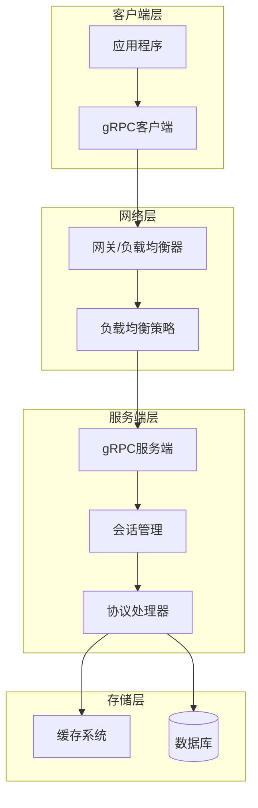

**图表来源**

- [DownlinkGrpcService.java](file://jcpp-protocol-api/src/main/java/sanbing/jcpp/protocol/adapter/DownlinkGrpcService.java#L42-L184)
- [DownlinkGrpcClient.java](file://jcpp-app/src/main/java/sanbing/jcpp/app/service/grpc/DownlinkGrpcClient.java#L33-L297)

## gRPC服务定义

### ProtocolInterface服务

系统的核心gRPC服务定义在`grpc.proto`文件中，提供了统一的通信接口。

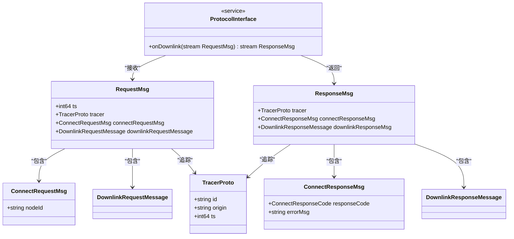

**图表来源**

- [grpc.proto](file://jcpp-infrastructure-proto/src/main/proto/grpc.proto#L13-L57)

### 核心RPC方法

#### onDownlink方法

这是系统的主要RPC方法，实现了双向流式通信：

| 参数类型               | 名称       | 描述               |
|--------------------|----------|------------------|
| stream RequestMsg  | request  | 流式请求消息，支持持续的数据传输 |
| stream ResponseMsg | response | 流式响应消息，实时返回处理结果  |

**节来源**

- [grpc.proto](file://jcpp-infrastructure-proto/src/main/proto/grpc.proto#L13-L14)

## 消息类型详解

### RequestMsg请求消息

RequestMsg是gRPC通信的入口消息，包含了完整的上下文信息。

| 字段                     | 类型                     | 标签 | 描述              |
|------------------------|------------------------|----|-----------------|
| ts                     | int64                  | 必需 | 时间戳，用于消息排序和过期检测 |
| tracer                 | TracerProto            | 可选 | 追踪信息，支持分布式链路追踪  |
| connectRequestMsg      | ConnectRequestMsg      | 可选 | 连接请求消息          |
| downlinkRequestMessage | DownlinkRequestMessage | 可选 | 下行请求消息          |

### ResponseMsg响应消息

ResponseMsg是服务端对请求的响应消息。

| 字段                  | 类型                      | 标签 | 描述              |
|---------------------|-------------------------|----|-----------------|
| tracer              | TracerProto             | 可选 | 追踪信息，保持请求响应的一致性 |
| connectResponseMsg  | ConnectResponseMsg      | 可选 | 连接响应消息          |
| downlinkResponseMsg | DownlinkResponseMessage | 可选 | 下行响应消息          |

### ConnectRequestMsg连接请求

用于建立和维护gRPC连接。

| 字段     | 类型     | 标签 | 描述      |
|--------|--------|----|---------|
| nodeId | string | 必需 | 节点唯一标识符 |

### ConnectResponseMsg连接响应

连接建立后的确认消息。

| 字段           | 类型                  | 标签 | 描述                    |
|--------------|---------------------|----|-----------------------|
| responseCode | ConnectResponseCode | 必需 | 连接状态码：ACCEPTED或REFUSE |
| errorMsg     | string              | 可选 | 错误信息（仅在连接被拒绝时提供）      |

### DownlinkRequestMessage下行请求

这是最复杂的消息类型，包含了各种充电桩操作指令。

| 字段                              | 类型                              | 标签 | 描述        |
|---------------------------------|---------------------------------|----|-----------|
| messageIdMSB                    | int64                           | 必需 | 消息ID高64位  |
| messageIdLSB                    | int64                           | 必需 | 消息ID低64位  |
| sessionIdMSB                    | int64                           | 必需 | 会话ID高64位  |
| sessionIdLSB                    | int64                           | 必需 | 会话ID低64位  |
| protocolName                    | string                          | 必需 | 协议名称      |
| pileCode                        | string                          | 必需 | 充电桩编码     |
| requestIdMSB                    | int64                           | 可选 | 请求ID高64位  |
| requestIdLSB                    | int64                           | 可选 | 请求ID低64位  |
| requestData                     | bytes                           | 可选 | 原始请求数据    |
| downlinkCmd                     | string                          | 必需 | 下行命令类型    |
| LoginResponse                   | LoginResponse                   | 可选 | 登录响应      |
| VerifyPricingResponse           | VerifyPricingResponse           | 可选 | 计费校验响应    |
| QueryPricingResponse            | QueryPricingResponse            | 可选 | 计费查询响应    |
| SetPricingRequest               | SetPricingRequest               | 可选 | 设置计费请求    |
| RemoteStartChargingRequest      | RemoteStartChargingRequest      | 可选 | 远程启动充电请求  |
| RemoteStopChargingRequest       | RemoteStopChargingRequest       | 可选 | 远程停止充电请求  |
| TransactionRecordResponse       | TransactionRecordResponse       | 可选 | 交易记录响应    |
| RestartPileRequest              | RestartPileRequest              | 可选 | 重启充电桩请求   |
| OtaRequest                      | OtaRequest                      | 可选 | OTA升级请求   |
| OfflineCardBalanceUpdateRequest | OfflineCardBalanceUpdateRequest | 可选 | 离线卡余额更新请求 |
| OfflineCardSyncRequest          | OfflineCardSyncRequest          | 可选 | 离线卡同步请求   |
| TimeSyncRequest                 | TimeSyncRequest                 | 可选 | 时间同步请求    |
| StartChargeResponse             | StartChargeResponse             | 可选 | 启动充电响应    |
| SetQrcodeRequest                | SetQrcodeRequest                | 可选 | 设置二维码请求   |
| OfflineCardClearRequest         | OfflineCardClearRequest         | 可选 | 离线卡清除请求   |
| OfflineCardQueryRequest         | OfflineCardQueryRequest         | 可选 | 离线卡查询请求   |
| WorkParamSettingRequest         | WorkParamSettingRequest         | 可选 | 工作参数设置请求  |

**节来源**

- [grpc.proto](file://jcpp-infrastructure-proto/src/main/proto/grpc.proto#L15-L57)
- [downlink.proto](file://jcpp-infrastructure-proto/src/main/proto/downlink.proto#L10-L282)

## Protobuf序列化机制

### 序列化优势

Protocol Buffers提供了以下核心优势：

1. **紧凑的二进制格式**：相比JSON等文本格式，体积更小，传输更快
2. **向前向后兼容**：新版本可以读取旧版本数据，反之亦然
3. **类型安全**：编译时检查，避免运行时类型错误
4. **多语言支持**：自动生成多种语言的代码

### 序列化流程

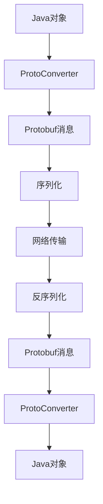

**图表来源**

- [ProtoConverter.java](file://jcpp-infrastructure-proto/src/main/java/sanbing/jcpp/infrastructure/proto/ProtoConverter.java#L20-L141)

### 数据类型映射

| Protobuf类型 | Java类型  | 描述       |
|------------|---------|----------|
| int32      | int     | 32位整数    |
| int64      | long    | 64位整数    |
| string     | String  | UTF-8字符串 |
| bytes      | byte[]  | 字节数组     |
| bool       | boolean | 布尔值      |
| enum       | Enum    | 枚举类型     |
| message    | Message | 嵌套消息     |

**节来源**

- [downlink.proto](file://jcpp-infrastructure-proto/src/main/proto/downlink.proto#L1-L282)

## ProtoConverter转换器

### 转换器架构

ProtoConverter负责在Java业务对象和Protobuf消息之间进行转换，确保类型安全和数据完整性。

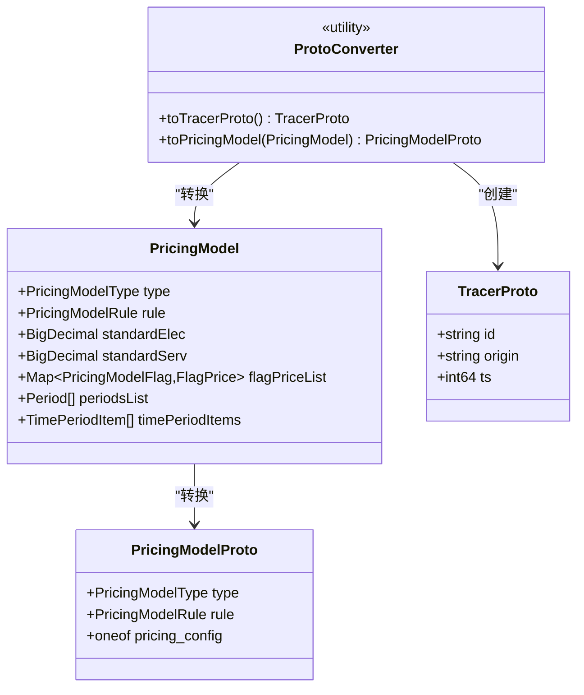

**图表来源**

- [ProtoConverter.java](file://jcpp-infrastructure-proto/src/main/java/sanbing/jcpp/infrastructure/proto/ProtoConverter.java#L20-L141)

### 计费模型转换

ProtoConverter特别擅长处理复杂的计费模型转换，支持三种计费规则：

1. **标准计费**：全天统一价格
2. **峰谷计费**：按电网峰谷政策分时段
3. **时段计费**：运营商自定义时段价格

### 追踪信息转换

```java
// 追踪信息转换示例
public static TracerProto toTracerProto() {
    Tracer currentTracer = TracerContextUtil.getCurrentTracer();
    return TracerProto.newBuilder()
            .setId(currentTracer.getTraceId())
            .setOrigin(currentTracer.getOrigin())
            .setTs(currentTracer.getTracerTs())
            .build();
}
```

**节来源**

- [ProtoConverter.java](file://jcpp-infrastructure-proto/src/main/java/sanbing/jcpp/infrastructure/proto/ProtoConverter.java#L20-L30)

## gRPC客户端实现

### DownlinkGrpcClient架构

DownlinkGrpcClient是系统中的gRPC客户端实现，负责与远程gRPC服务建立连接并发送下行请求。

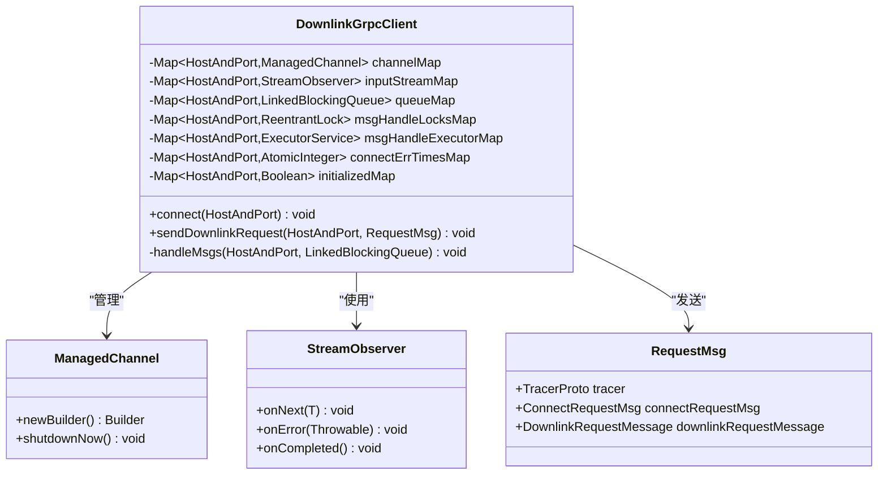

**图表来源**

- [DownlinkGrpcClient.java](file://jcpp-app/src/main/java/sanbing/jcpp/app/service/grpc/DownlinkGrpcClient.java#L33-L297)

### 连接管理

客户端实现了智能的连接管理机制：

1. **自动重连**：连接断开时自动尝试重新连接
2. **连接池**：维护多个连接以提高并发能力
3. **心跳检测**：定期发送心跳保持连接活跃
4. **故障转移**：连接失败时自动切换到备用节点

### 消息队列机制

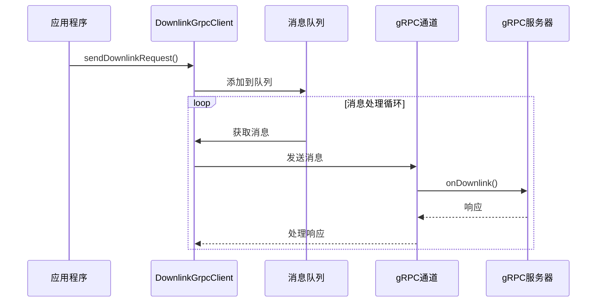

**图表来源**

- [DownlinkGrpcClient.java](file://jcpp-app/src/main/java/sanbing/jcpp/app/service/grpc/DownlinkGrpcClient.java#L105-L185)

### 客户端配置

| 配置项                      | 默认值      | 描述            |
|--------------------------|----------|---------------|
| rpcNettyEventLoop        | 动态计算     | Netty事件循环线程数  |
| rpcNettySoSndbuf         | 65535    | 发送缓冲区大小       |
| rpcNettySoRcvbuf         | 65535    | 接收缓冲区大小       |
| rpcNoDelay               | true     | TCP_NODELAY选项 |
| rpcMaxInboundMessageSize | 33554432 | 最大消息大小（32MB）  |
| keepAliveTimeSec         | 300      | 心跳间隔（秒）       |
| maxRecordsSize           | 102400   | 最大队列大小        |
| batchRecordsCount        | 1024     | 批量处理数量        |
| recordsTtl               | 600000   | 消息生存时间（毫秒）    |

**节来源**

- [DownlinkGrpcClient.java](file://jcpp-app/src/main/java/sanbing/jcpp/app/service/grpc/DownlinkGrpcClient.java#L45-L77)

## 服务端点实现

### DownlinkGrpcService架构

DownlinkGrpcService是gRPC服务的服务器端实现，继承自ProtocolInterfaceImplBase。

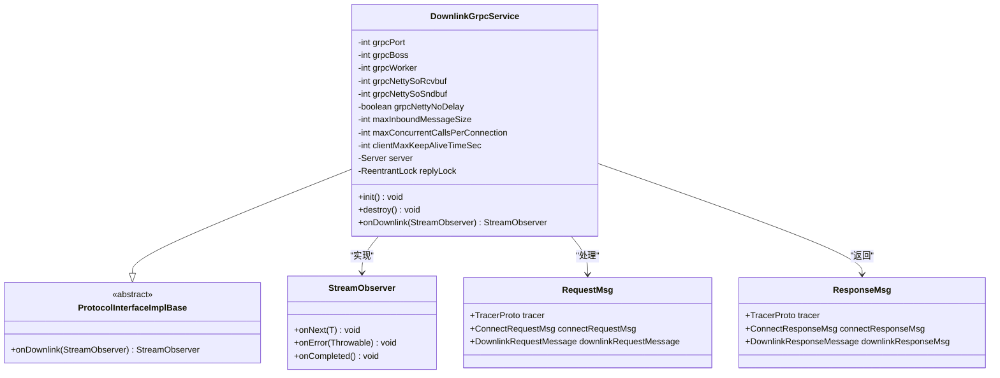

**图表来源**

- [DownlinkGrpcService.java](file://jcpp-protocol-api/src/main/java/sanbing/jcpp/protocol/adapter/DownlinkGrpcService.java#L42-L184)

### 服务初始化

服务启动时会进行以下初始化步骤：

1. **配置验证**：检查必要的配置参数
2. **Netty服务器构建**：配置TCP参数和性能参数
3. **服务注册**：将服务注册到gRPC框架
4. **启动监听**：开始监听指定端口的连接

### 请求处理流程

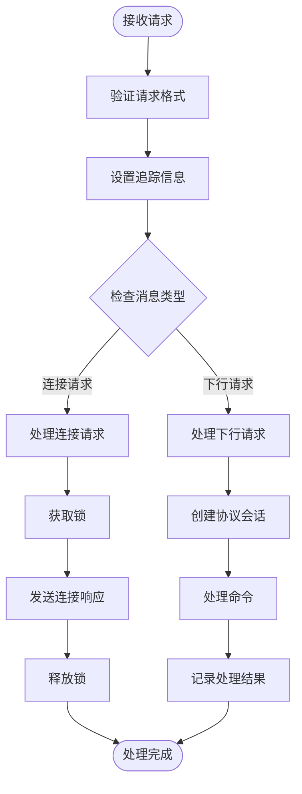

**图表来源**

- [DownlinkGrpcService.java](file://jcpp-protocol-api/src/main/java/sanbing/jcpp/protocol/adapter/DownlinkGrpcService.java#L123-L184)

### 服务配置参数

| 参数                              | 默认值      | 描述            |
|---------------------------------|----------|---------------|
| grpcPort                        | 9090     | gRPC服务端口      |
| grpcBoss                        | 4        | Boss线程数       |
| grpcWorker                      | 64       | Worker线程数     |
| grpcNettySoRcvbuf               | 65535    | 接收缓冲区大小       |
| grpcNettySoSndbuf               | 65535    | 发送缓冲区大小       |
| grpcNettyNoDelay                | true     | TCP_NODELAY选项 |
| maxInboundMessageSize           | 33554432 | 最大消息大小（32MB）  |
| maxConcurrentCallsPerConnection | 4        | 每连接最大并发调用数    |
| clientMaxKeepAliveTimeSec       | 30       | 客户端最大保活时间     |

**节来源**

- [DownlinkGrpcService.java](file://jcpp-protocol-api/src/main/java/sanbing/jcpp/protocol/adapter/DownlinkGrpcService.java#L47-L60)

## 错误处理机制

### gRPC状态码

gRPC定义了标准的状态码体系，系统遵循这些规范：

| 状态码 | 名称                  | 描述      |
|-----|---------------------|---------|
| 0   | OK                  | 操作成功完成  |
| 1   | CANCELLED           | 操作被取消   |
| 2   | UNKNOWN             | 未知错误    |
| 3   | INVALID_ARGUMENT    | 无效参数    |
| 4   | DEADLINE_EXCEEDED   | 超时      |
| 5   | NOT_FOUND           | 资源未找到   |
| 6   | ALREADY_EXISTS      | 资源已存在   |
| 7   | PERMISSION_DENIED   | 权限不足    |
| 8   | RESOURCE_EXHAUSTED  | 资源耗尽    |
| 9   | FAILED_PRECONDITION | 前置条件不满足 |
| 10  | ABORTED             | 操作中止    |
| 11  | OUT_OF_RANGE        | 范围错误    |
| 12  | UNIMPLEMENTED       | 未实现     |
| 13  | INTERNAL            | 内部错误    |
| 14  | UNAVAILABLE         | 服务不可用   |
| 15  | DATA_LOSS           | 数据丢失    |
| 16  | UNAUTHENTICATED     | 未认证     |

### 异常处理策略

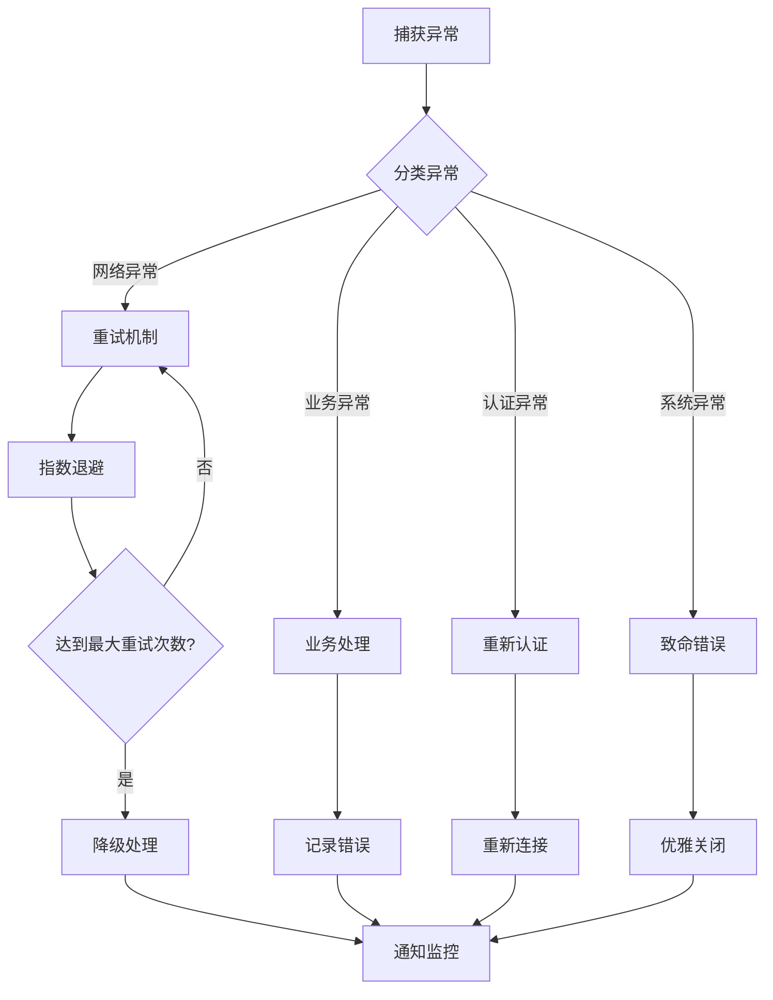

### 客户端错误处理

DownlinkGrpcClient实现了多层次的错误处理机制：

1. **连接级错误**：连接断开时的处理
2. **消息级错误**：单条消息发送失败的处理
3. **会话级错误**：会话状态异常的处理
4. **系统级错误**：系统资源不足的处理

### 服务端错误处理

DownlinkGrpcService的错误处理重点关注：

1. **请求验证**：确保请求格式正确
2. **会话管理**：处理会话状态异常
3. **资源保护**：防止资源耗尽
4. **优雅降级**：在异常情况下保持服务可用

**节来源**

- [DownlinkGrpcClient.java](file://jcpp-app/src/main/java/sanbing/jcpp/app/service/grpc/DownlinkGrpcClient.java#L250-L297)
- [DownlinkGrpcService.java](file://jcpp-protocol-api/src/main/java/sanbing/jcpp/protocol/adapter/DownlinkGrpcService.java#L160-L184)

## 性能优化配置

### 网络参数优化

系统提供了丰富的网络参数配置，以适应不同的网络环境和性能需求：

| 参数类别  | 配置项         | 推荐值      | 说明        |
|-------|-------------|----------|-----------|
| 线程池   | boss线程数     | CPU核心数×2 | 处理新连接     |
| 线程池   | worker线程数   | CPU核心数×4 | 处理I/O操作   |
| 缓冲区   | SO_RCVBUF   | 65535    | 接收缓冲区     |
| 缓冲区   | SO_SNDBUF   | 65535    | 发送缓冲区     |
| TCP选项 | TCP_NODELAY | true     | 禁用Nagle算法 |
| 消息大小  | 最大消息大小      | 32MB     | 根据实际需求调整  |
| 并发控制  | 最大并发调用      | 4        | 防止资源耗尽    |

### 连接管理优化

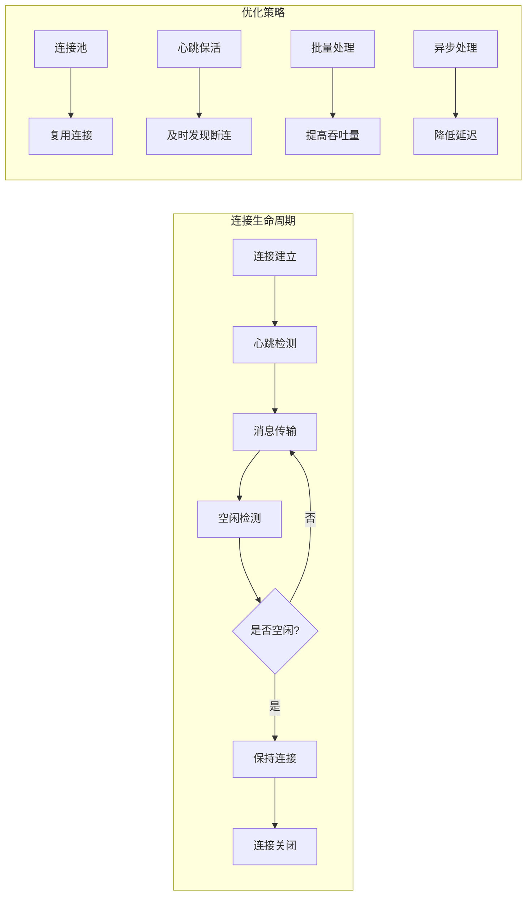

### 消息处理优化

1. **批量处理**：将多个小消息合并为大批量消息
2. **异步处理**：使用独立线程池处理gRPC消息
3. **内存管理**：合理控制消息队列大小
4. **压缩传输**：启用消息压缩减少网络开销

### 监控指标

系统监控的关键性能指标：

| 指标类型 | 指标名称   | 描述           |
|------|--------|--------------|
| 吞吐量  | 消息处理速率 | 每秒处理的消息数量    |
| 延迟   | 响应时间   | 从请求到响应的时间    |
| 错误率  | 失败请求比例 | 失败请求占总请求的比例  |
| 资源使用 | CPU使用率 | gRPC服务的CPU占用 |
| 资源使用 | 内存使用率  | gRPC服务的内存占用  |
| 连接状态 | 活跃连接数  | 当前活跃的gRPC连接数 |

**节来源**

- [protocol-service.yml](file://jcpp-protocol-bootstrap/src/main/resources/protocol-service.yml#L50-L59)
- [app-service.yml](file://jcpp-app-bootstrap/src/main/resources/app-service.yml#L271-L280)

## 适用场景对比

### gRPC vs REST API

| 对比维度  | gRPC             | REST API         |
|-------|------------------|------------------|
| 序列化格式 | Protocol Buffers | JSON/XML         |
| 性能    | 更快，更小的包体积        | 较慢，较大的包体积        |
| 类型安全  | 编译时检查            | 运行时检查            |
| 流式通信  | 支持双向流式           | 通常为请求-响应模式       |
| 版本控制  | 向前向后兼容           | 需要URL版本控制        |
| 跨语言支持 | 自动生成代码           | 需要手动实现           |
| 生态系统  | 较新的生态系统          | 成熟稳定的生态系统        |
| 学习曲线  | 中等               | 较低               |
| 适用场景  | 实时通信，微服务间通信      | Web API，传统HTTP应用 |

### 选择建议

#### 使用gRPC的场景：

1. **高频通信**：需要频繁交换大量数据
2. **实时性要求高**：需要低延迟的实时通信
3. **微服务架构**：服务间需要高效通信
4. **移动应用**：需要节省带宽和电量
5. **IoT设备**：资源受限的设备通信

#### 使用REST API的场景：

1. **浏览器访问**：需要通过Web浏览器访问
2. **简单查询**：简单的CRUD操作
3. **公开API**：面向公众的API服务
4. **现有系统集成**：与已有REST系统集成
5. **调试友好**：需要易于调试和测试

### 性能对比

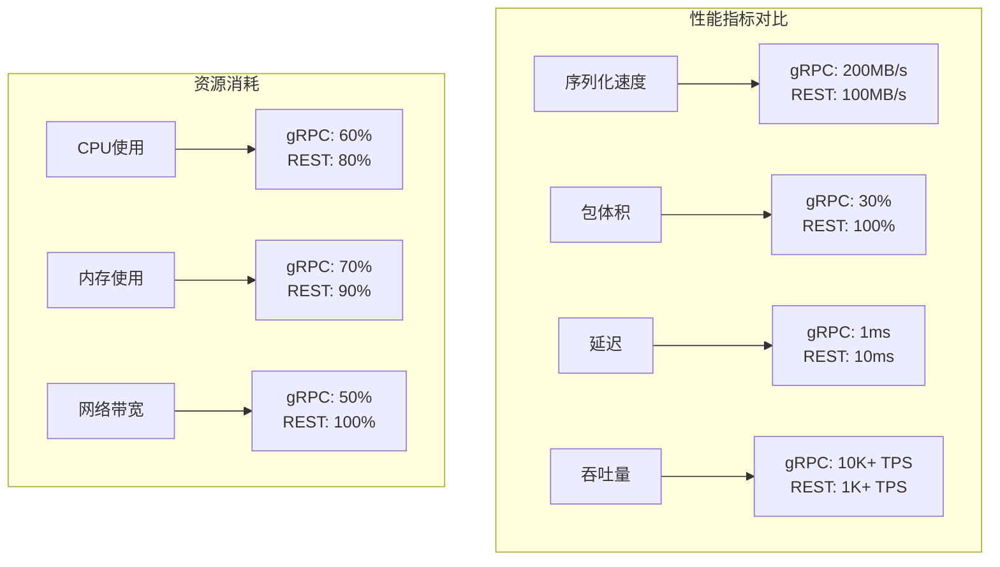

## 最佳实践指南

### 客户端开发最佳实践

1. **连接池管理**
   ```java
   // 推荐：使用连接池而非每次都创建新连接
   ManagedChannel channel = channelMap.computeIfAbsent(hostAndPort, 
       key -> createNewChannel(key));
   ```

2. **错误处理**
   ```java
   // 推荐：实现重试机制
   @Retryable(maxAttempts = 3, backoff = @Backoff(delay = 1000))
   public void sendRequestWithRetry(RequestMsg request) {
       // 实现重试逻辑
   }
   ```

3. **资源清理**
   ```java
   // 推荐：确保资源正确释放
   @PreDestroy
   public void cleanup() {
       channelMap.values().forEach(ManagedChannel::shutdownNow);
       inputStreamMap.values().forEach(StreamObserver::onCompleted);
   }
   ```

### 服务端开发最佳实践

1. **并发控制**
   ```java
   // 推荐：限制并发连接数
   @Value("${grpc.maxConcurrentCallsPerConnection:4}")
   private int maxConcurrentCallsPerConnection;
   ```

2. **资源隔离**
   ```java
   // 推荐：使用独立线程池处理业务逻辑
   ExecutorService businessExecutor = Executors.newFixedThreadPool(
       Runtime.getRuntime().availableProcessors());
   ```

3. **监控告警**
   ```java
   // 推荐：添加监控指标
   @Monitor(name = "grpc.request.count")
   public void monitorRequests() {
       // 实现监控逻辑
   }
   ```

### 性能调优建议

1. **网络层面**
    - 调整TCP缓冲区大小
    - 启用TCP_NODELAY
    - 优化网络拓扑结构

2. **应用层面**
    - 合理设置线程池大小
    - 使用连接池复用连接
    - 实现消息批处理

3. **系统层面**
    - 监控系统资源使用
    - 设置合理的超时时间
    - 实现优雅的降级策略

### 安全考虑

1. **传输安全**
    - 在生产环境中使用TLS加密
    - 实施证书验证
    - 定期更新加密算法

2. **访问控制**
    - 实施身份认证
    - 设置权限控制
    - 记录访问日志

3. **数据保护**
    - 敏感数据加密
    - 实施数据脱敏
    - 定期备份恢复

### 调试和诊断

1. **日志记录**
   ```java
   // 推荐：添加详细的日志记录
   log.info("Sending gRPC request: {}", request);
   log.debug("Received gRPC response: {}", response);
   ```

2. **追踪监控**
   ```java
   // 推荐：实施分布式追踪
   TracerContextUtil.newTracer(traceId, origin, timestamp);
   ```

3. **性能分析**
   ```java
   // 推荐：监控关键性能指标
   Metrics.counter("grpc.requests.total").increment();
   Metrics.timer("grpc.response.time").record(duration);
   ```

通过遵循这些最佳实践，可以充分发挥gRPC的优势，构建高性能、可靠的充电桩通信系统。