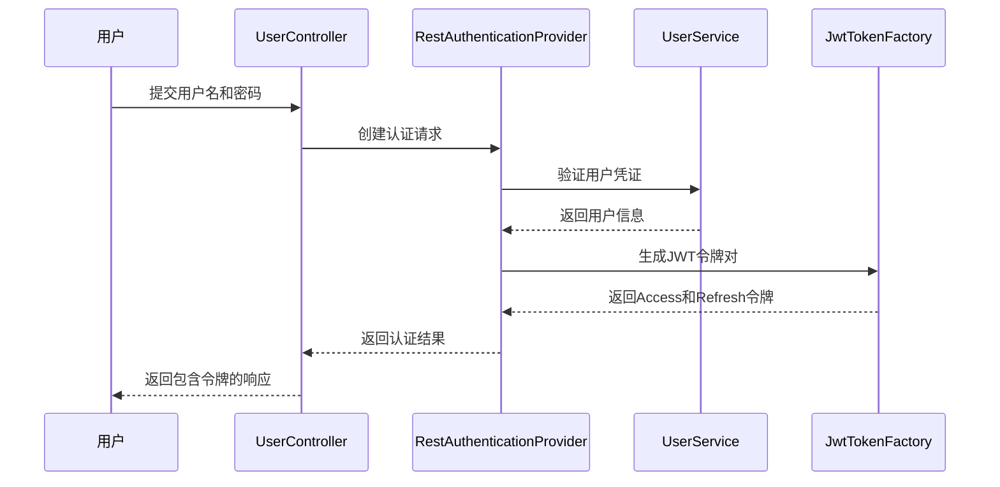
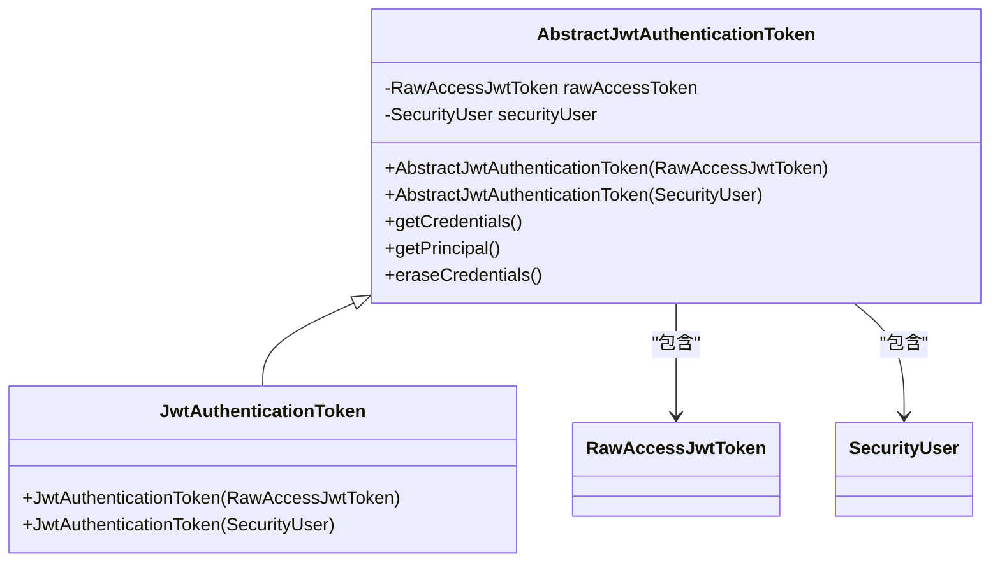
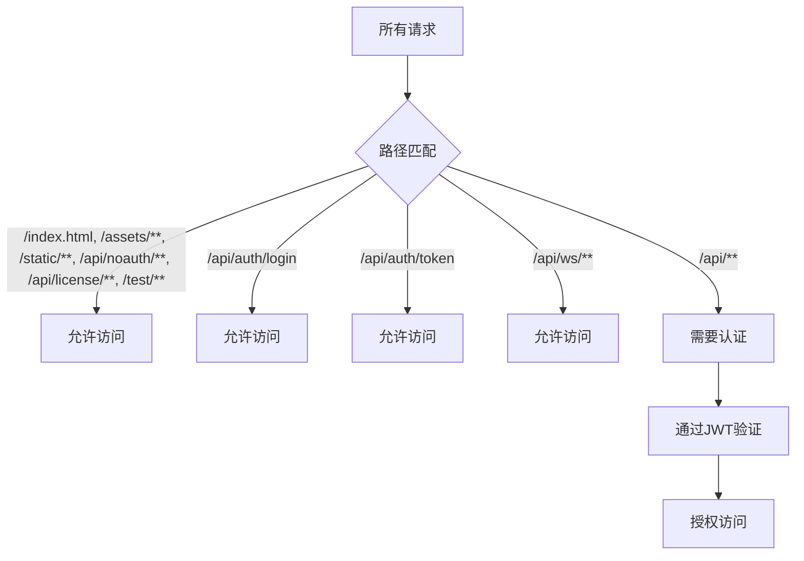
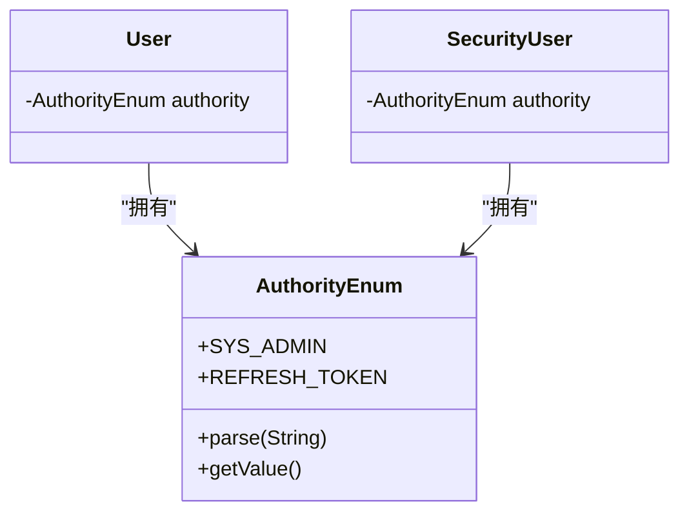
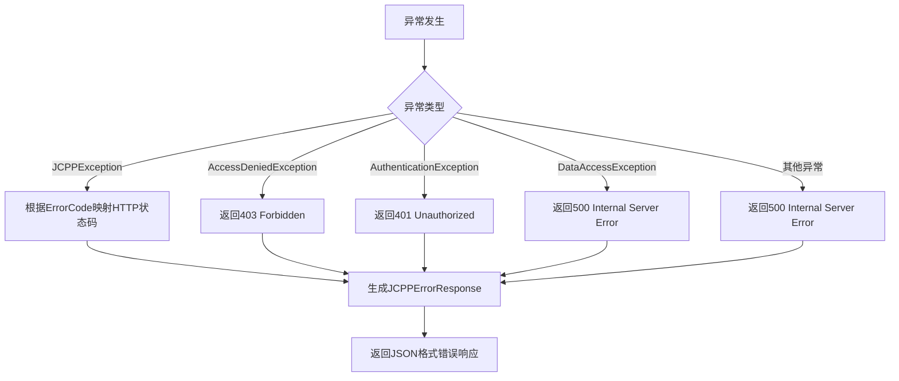

# 安全机制

<cite>
**本文档中引用的文件**  
- [User.java](file://jcpp-app/src/main/java/sanbing/jcpp/app/dal/entity/User.java)
- [SecurityConfiguration.java](file://jcpp-app/src/main/java/sanbing/jcpp/app/service/security/SecurityConfiguration.java)
- [JwtAuthenticationToken.java](file://jcpp-app/src/main/java/sanbing/jcpp/app/service/security/auth/JwtAuthenticationToken.java)
- [AbstractJwtAuthenticationToken.java](file://jcpp-app/src/main/java/sanbing/jcpp/app/service/security/auth/AbstractJwtAuthenticationToken.java)
- [JCPPErrorResponseHandler.java](file://jcpp-app/src/main/java/sanbing/jcpp/app/exception/JCPPErrorResponseHandler.java)
- [RestAuthenticationProvider.java](file://jcpp-app/src/main/java/sanbing/jcpp/app/service/security/auth/rest/RestAuthenticationProvider.java)
- [JwtAuthenticationProvider.java](file://jcpp-app/src/main/java/sanbing/jcpp/app/service/security/auth/jwt/JwtAuthenticationProvider.java)
- [UserCredentials.java](file://jcpp-app/src/main/java/sanbing/jcpp/app/service/security/model/UserCredentials.java)
- [AuthorityEnum.java](file://jcpp-app/src/main/java/sanbing/jcpp/app/dal/config/ibatis/enums/AuthorityEnum.java)
- [NoXss.java](file://jcpp-infrastructure-util/src/main/java/sanbing/jcpp/infrastructure/util/validation/NoXss.java)
</cite>

## 目录

1. [简介](#简介)
2. [JWT认证流程](#jwt认证流程)
3. [安全配置](#安全配置)
4. [异常处理机制](#异常处理机制)
5. [安全最佳实践](#安全最佳实践)
6. [安全审计日志](#安全审计日志)

## 简介

JChargePointProtocol（JCPP）系统实现了一套完整的安全机制，基于JWT（JSON Web
Token）进行身份认证和授权。系统通过多层安全防护，包括基于角色的访问控制、密码加密存储、输入验证和异常处理，确保充电桩管理平台的安全性。本文档详细说明系统的安全架构和实现细节。

## JWT认证流程

JCPP系统采用基于JWT的无状态认证机制，包含Access Token和Refresh Token两种令牌，实现安全的用户会话管理。

### 认证流程概述



**Diagram sources**

- [RestAuthenticationProvider.java](file://jcpp-app/src/main/java/sanbing/jcpp/app/service/security/auth/rest/RestAuthenticationProvider.java)
- [JwtTokenFactory.java](file://jcpp-app/src/main/java/sanbing/jcpp/app/service/security/model/token/JwtTokenFactory.java)

**Section sources**

- [RestAuthenticationProvider.java](file://jcpp-app/src/main/java/sanbing/jcpp/app/service/security/auth/rest/RestAuthenticationProvider.java#L20-L85)
- [JwtAuthenticationToken.java](file://jcpp-app/src/main/java/sanbing/jcpp/app/service/security/auth/JwtAuthenticationToken.java#L1-L25)

### Access Token和Refresh Token生成

当用户成功登录时，系统生成一对JWT令牌：

- **Access Token**：短期有效的访问令牌，用于后续API请求的身份验证
- **Refresh Token**：长期有效的刷新令牌，用于获取新的Access Token

令牌中包含用户信息和权限，通过`JwtTokenFactory`组件生成，确保令牌的安全性和完整性。

### JwtAuthenticationToken身份验证

后续请求通过`JwtAuthenticationToken`进行身份验证。系统使用`JwtTokenAuthenticationProcessingFilter`
拦截请求，从请求头或查询参数中提取JWT令牌，并通过`JwtAuthenticationProvider`验证令牌的有效性。



**Diagram sources**

- [AbstractJwtAuthenticationToken.java](file://jcpp-app/src/main/java/sanbing/jcpp/app/service/security/auth/AbstractJwtAuthenticationToken.java)
- [JwtAuthenticationToken.java](file://jcpp-app/src/main/java/sanbing/jcpp/app/service/security/auth/JwtAuthenticationToken.java)

**Section sources**

- [AbstractJwtAuthenticationToken.java](file://jcpp-app/src/main/java/sanbing/jcpp/app/service/security/auth/AbstractJwtAuthenticationToken.java#L1-L58)
- [JwtAuthenticationProvider.java](file://jcpp-app/src/main/java/sanbing/jcpp/app/service/security/auth/jwt/JwtAuthenticationProvider.java#L1-L47)

## 安全配置

### URL路径访问权限控制

`SecurityConfiguration`类定义了系统的安全策略，通过Spring Security配置不同URL路径的访问权限：



**Diagram sources**

- [SecurityConfiguration.java](file://jcpp-app/src/main/java/sanbing/jcpp/app/service/security/SecurityConfiguration.java)

**Section sources**

- [SecurityConfiguration.java](file://jcpp-app/src/main/java/sanbing/jcpp/app/service/security/SecurityConfiguration.java#L1-L183)

### AuthorityEnum权限控制

系统通过`AuthorityEnum`枚举定义用户权限级别：



**Diagram sources**

- [AuthorityEnum.java](file://jcpp-app/src/main/java/sanbing/jcpp/app/dal/config/ibatis/enums/AuthorityEnum.java)
- [User.java](file://jcpp-app/src/main/java/sanbing/jcpp/app/dal/entity/User.java)

**Section sources**

- [AuthorityEnum.java](file://jcpp-app/src/main/java/sanbing/jcpp/app/dal/config/ibatis/enums/AuthorityEnum.java#L1-L50)
- [User.java](file://jcpp-app/src/main/java/sanbing/jcpp/app/dal/entity/User.java#L1-L73)

### JWT令牌解析和验证

系统支持多种方式传递JWT令牌：

- 请求头 `X-Authorization`
- 请求头 `Authorization`
- 查询参数 `token`

`JwtTokenAuthenticationProcessingFilter`负责提取和验证令牌，确保只有有效的令牌才能访问受保护的API端点。

## 异常处理机制

### JCPPErrorResponseHandler异常处理

`JCPPErrorResponseHandler`是系统的核心异常处理器，负责将各种业务异常转换为标准化的HTTP响应：



**Diagram sources**

- [JCPPErrorResponseHandler.java](file://jcpp-app/src/main/java/sanbing/jcpp/app/exception/JCPPErrorResponseHandler.java)

**Section sources**

- [JCPPErrorResponseHandler.java](file://jcpp-app/src/main/java/sanbing/jcpp/app/exception/JCPPErrorResponseHandler.java#L1-L220)

### ErrorCode标准化

系统定义了统一的`ErrorCode`枚举，确保错误信息的一致性：

| 错误码                 | HTTP状态码 | 描述     |
|---------------------|---------|--------|
| GENERAL             | 500     | 通用错误   |
| AUTHENTICATION      | 401     | 认证失败   |
| JWT_TOKEN_EXPIRED   | 401     | 令牌已过期  |
| CREDENTIALS_EXPIRED | 401     | 凭证已过期  |
| PERMISSION_DENIED   | 403     | 权限不足   |
| BAD_REQUEST_PARAMS  | 400     | 请求参数错误 |
| ITEM_NOT_FOUND      | 404     | 项目未找到  |

**Section sources**

- [JCPPErrorResponseHandler.java](file://jcpp-app/src/main/java/sanbing/jcpp/app/exception/JCPPErrorResponseHandler.java#L20-L70)
- [JCPPErrorCode.java](file://jcpp-app/src/main/java/sanbing/jcpp/app/exception/JCPPErrorCode.java)

## 安全最佳实践

### 密码加密存储

系统使用BCryptPasswordEncoder对用户密码进行加密存储，确保即使数据库泄露，攻击者也无法轻易获取明文密码。

```java
@Bean
public BCryptPasswordEncoder passwordEncoder() {
    return new BCryptPasswordEncoder();
}
```

**Section sources**

- [SecurityConfiguration.java](file://jcpp-app/src/main/java/sanbing/jcpp/app/service/security/SecurityConfiguration.java#L150-L153)

### 防止XSS攻击

系统通过`@NoXss`注解防止跨站脚本攻击（XSS），对用户输入进行严格验证：

```java
@Target({ElementType.FIELD, ElementType.PARAMETER})
@Retention(RetentionPolicy.RUNTIME)
@Constraint(validatedBy = NoXssValidator.class)
public @interface NoXss {
    String message() default "Input contains XSS attack patterns";
    Class<?>[] groups() default {};
    Class<? extends Payload>[] payload() default {};
}
```

**Section sources**

- [NoXss.java](file://jcpp-infrastructure-util/src/main/java/sanbing/jcpp/infrastructure/util/validation/NoXss.java)

### 敏感信息脱敏

系统对敏感信息进行脱敏处理，确保日志和响应中不包含完整的敏感数据。`UserCredentials`类中的密码字段在日志输出时会被自动脱敏。

```java
@Data
@ToString(callSuper = true)
public class UserCredentials {
    private boolean enabled;
    private String password;
    private String activateToken;
    // 其他字段...
}
```

**Section sources**

- [UserCredentials.java](file://jcpp-app/src/main/java/sanbing/jcpp/app/service/security/model/UserCredentials.java#L1-L26)

## 安全审计日志

系统通过SLF4J和Log4j2框架记录安全相关的审计日志，包括：

- 用户登录成功/失败事件
- 权限访问拒绝事件
- 异常处理事件
- 数据库访问事件

日志记录在`JCPPErrorResponseHandler`和相关安全组件中实现，确保所有安全相关事件都有迹可循。

```java
@Slf4j
@Controller
@RestControllerAdvice
public class JCPPErrorResponseHandler extends ResponseEntityExceptionHandler implements AccessDeniedHandler, ErrorController {
    // 日志记录实现
}
```

**Section sources**

- [JCPPErrorResponseHandler.java](file://jcpp-app/src/main/java/sanbing/jcpp/app/exception/JCPPErrorResponseHandler.java#L1-L220)
- [log4j2.xml](file://jcpp-app-bootstrap/src/main/resources/log4j2.xml)