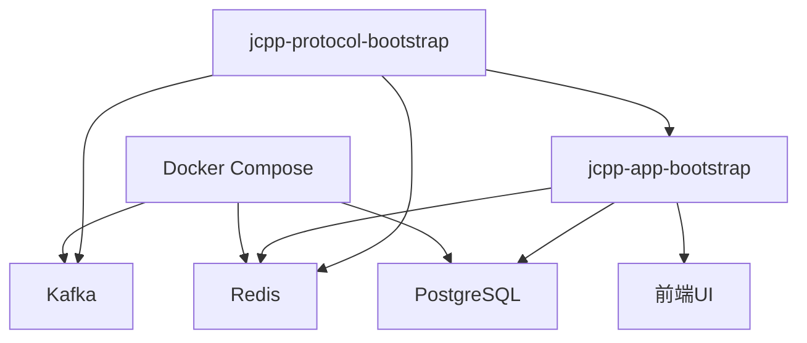
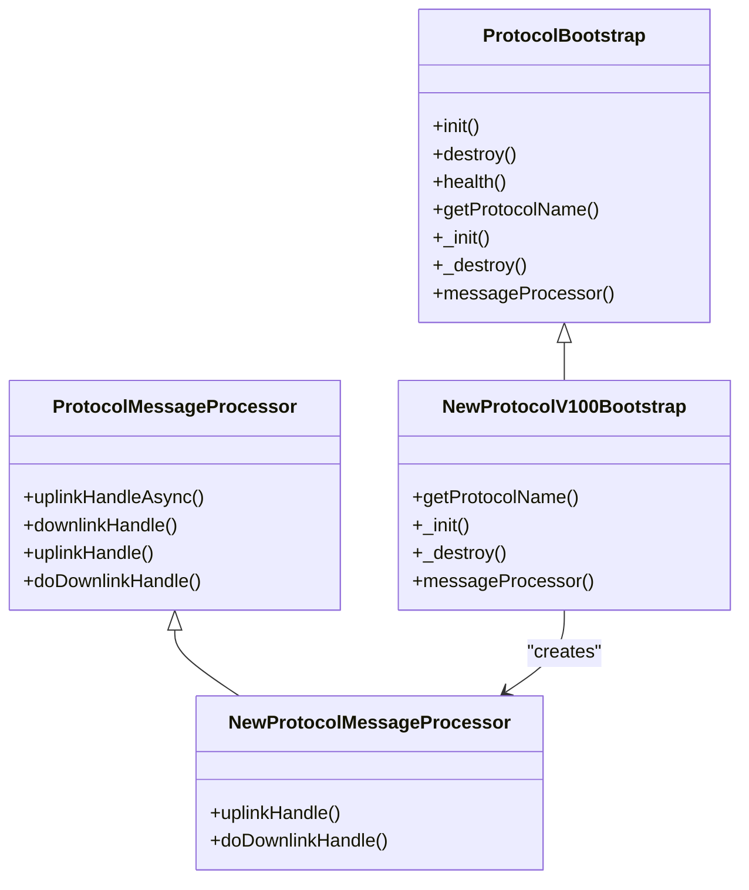
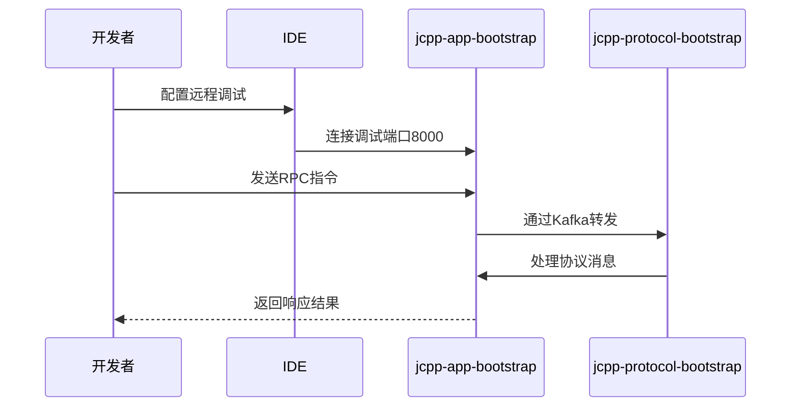

# 开发者指南

<cite>
**本文档中引用的文件**  
- [README.md](file://README.md)
- [pom.xml](file://pom.xml)
- [docker/start.sh](file://docker/start.sh)
- [docker/docker-compose.monolith.yml](file://docker/docker-compose.monolith.yml)
- [jcpp-app-bootstrap/src/main/resources/app-service.yml](file://jcpp-app-bootstrap/src/main/resources/app-service.yml)
- [jcpp-protocol-bootstrap/src/main/resources/protocol-service.yml](file://jcpp-protocol-bootstrap/src/main/resources/protocol-service.yml)
- [jcpp-app-bootstrap/src/main/java/sanbing/jcpp/JCPPServerApplication.java](file://jcpp-app-bootstrap/src/main/java/sanbing/jcpp/JCPPServerApplication.java)
- [jcpp-protocol-bootstrap/src/main/java/sanbing/jcpp/protocol/JCPPProtocolServiceApplication.java](file://jcpp-protocol-bootstrap/src/main/java/sanbing/jcpp/protocol/JCPPProtocolServiceApplication.java)
- [jcpp-protocol-api/src/main/java/sanbing/jcpp/protocol/ProtocolBootstrap.java](file://jcpp-protocol-api/src/main/java/sanbing/jcpp/protocol/ProtocolBootstrap.java)
- [jcpp-protocol-api/src/main/java/sanbing/jcpp/protocol/ProtocolMessageProcessor.java](file://jcpp-protocol-api/src/main/java/sanbing/jcpp/protocol/ProtocolMessageProcessor.java)
- [jcpp-protocol-yunkuaichong/src/main/java/sanbing/jcpp/protocol/yunkuaichong/v150/YunkuaichongV150ProtocolBootstrap.java](file://jcpp-protocol-yunkuaichong/src/main/java/sanbing/jcpp/protocol/yunkuaichong/v150/YunkuaichongV150ProtocolBootstrap.java)
- [jcpp-protocol-lvneng/src/main/java/sanbing/jcpp/protocol/lvneng/v340/LvnengV340ProtocolBootstrap.java](file://jcpp-protocol-lvneng/src/main/java/sanbing/jcpp/protocol/lvneng/v340/LvnengV340ProtocolBootstrap.java)
- [jcpp-app/src/main/java/sanbing/jcpp/app/service/impl/DefaultPileProtocolService.java](file://jcpp-app/src/main/java/sanbing/jcpp/app/service/impl/DefaultPileProtocolService.java)
- [jcpp-app/src/main/java/sanbing/jcpp/app/adapter/controller/RpcController.java](file://jcpp-app/src/main/java/sanbing/jcpp/app/adapter/controller/RpcController.java)
- [jcpp-web-ui/package.json](file://jcpp-web-ui/package.json)
</cite>

## 目录

1. [环境搭建](#环境搭建)
2. [代码获取与构建](#代码获取与构建)
3. [本地运行](#本地运行)
4. [开发新协议](#开发新协议)
5. [调试技巧](#调试技巧)

## 环境搭建

在开始开发之前，需要安装以下必要的开发工具：

1. **JDK 21**：本项目基于Java 21开发，需安装JDK 21并配置JAVA_HOME环境变量。
2. **Maven**：用于构建Java后端模块，建议使用最新稳定版本。
3. **Node.js**：用于构建前端项目，建议使用LTS版本（如v18或v20）。
4. **Docker**：用于启动依赖服务（PostgreSQL, Redis, Kafka等），建议安装最新稳定版。

安装完成后，可通过以下命令验证：

```bash
java -version
mvn -version
node --version
docker --version
```

**Section sources**

- [pom.xml](file://pom.xml#L15-L20)
- [jcpp-web-ui/package.json](file://jcpp-web-ui/package.json#L1-L10)

## 代码获取与构建

### 代码获取

使用Git克隆项目仓库：

```bash
git clone https://github.com/sanbing-java/JChargePointProtocol.git
cd JChargePointProtocol
```

### 后端构建

项目包含多个Maven模块，主要后端模块包括`jcpp-app`和`jcpp-protocol-*`系列模块。

构建所有模块：

```bash
mvn clean install -DskipTests
```

仅构建特定模块（如`jcpp-app`）：

```bash
cd jcpp-app
mvn clean package -DskipTests
```

### 前端构建

前端项目位于`jcpp-web-ui`目录，使用npm进行构建。

进入前端目录并安装依赖：

```bash
cd jcpp-web-ui
npm install
```

构建生产版本：

```bash
npm run build
```

启动开发服务器：

```bash
npm start
```

**Section sources**

- [pom.xml](file://pom.xml#L100-L120)
- [jcpp-web-ui/package.json](file://jcpp-web-ui/package.json#L10-L20)

## 本地运行

### 启动依赖服务

项目依赖PostgreSQL、Redis和Kafka等服务，可通过Docker Compose一键启动。

使用提供的启动脚本：

```bash
bash docker/start.sh
```

或手动执行Docker Compose命令：

```bash
docker-compose -f docker/docker-compose.postgres.yml -f docker/docker-compose.redis-standalone.yml -f docker/docker-compose.kafka.yml up -d
```

### 启动应用服务

项目包含两个核心启动模块：`jcpp-app-bootstrap`（应用后端）和`jcpp-protocol-bootstrap`（协议前置）。

1. 启动应用后端服务：

```bash
cd jcpp-app-bootstrap
mvn spring-boot:run
```

2. 启动协议前置服务：

```bash
cd jcpp-protocol-bootstrap
mvn spring-boot:run
```

服务启动后，可通过以下地址访问：

- 应用后端API：http://localhost:8080
- 协议服务gRPC端口：9090
- 管理后台：http://localhost:8080/page/dashboard



**Diagram sources**

- [docker/docker-compose.monolith.yml](file://docker/docker-compose.monolith.yml#L1-L20)
- [jcpp-app-bootstrap/src/main/resources/app-service.yml](file://jcpp-app-bootstrap/src/main/resources/app-service.yml#L1-L50)
- [jcpp-protocol-bootstrap/src/main/resources/protocol-service.yml](file://jcpp-protocol-bootstrap/src/main/resources/protocol-service.yml#L1-L50)

**Section sources**

- [docker/start.sh](file://docker/start.sh#L1-L20)
- [jcpp-app-bootstrap/src/main/java/sanbing/jcpp/JCPPServerApplication.java](file://jcpp-app-bootstrap/src/main/java/sanbing/jcpp/JCPPServerApplication.java#L1-L20)
- [jcpp-protocol-bootstrap/src/main/java/sanbing/jcpp/protocol/JCPPProtocolServiceApplication.java](file://jcpp-protocol-bootstrap/src/main/java/sanbing/jcpp/protocol/JCPPProtocolServiceApplication.java#L1-L20)

## 开发新协议

以实现一个新的充电桩协议为例，说明开发流程。

### 继承ProtocolBootstrap

创建新的协议启动类，继承`ProtocolBootstrap`抽象类。参考现有协议实现，如`YunkuaichongV150ProtocolBootstrap`。

```java
@ProtocolComponent("NEW_PROTOCOL_V100")
public class NewProtocolV100Bootstrap extends ProtocolBootstrap {
    
    @Override
    protected String getProtocolName() {
        return "NEW_PROTOCOL_V100";
    }
    
    @Override
    protected void _init() {
        // 初始化逻辑
    }
    
    @Override
    protected void _destroy() {
        // 销毁逻辑
    }
    
    @Override
    protected ProtocolMessageProcessor messageProcessor() {
        return new NewProtocolMessageProcessor(forwarder, protocolContext);
    }
}
```

### 实现消息处理器

创建消息处理器类，继承`ProtocolMessageProcessor`，实现上行和下行消息处理逻辑。

```java
public class NewProtocolMessageProcessor extends ProtocolMessageProcessor {
    
    public NewProtocolMessageProcessor(Forwarder forwarder, ProtocolContext protocolContext) {
        super(forwarder, protocolContext);
    }
    
    @Override
    protected void uplinkHandle(ListenerToHandlerMsg listenerToHandlerMsg) {
        // 处理上行消息
    }
    
    @Override
    protected void doDownlinkHandle(SessionToHandlerMsg sessionToHandlerMsg) {
        // 处理下行消息
    }
}
```

### 定义命令类

根据协议规范定义上行和下行命令类，通常包含消息头、消息体、校验等字段。

### 配置文件注册

在`protocol-service.yml`中注册新协议的配置，包括监听端口、转发方式等。

```yaml
service:
  protocols:
    newProtocolV100:
      enabled: true
      listener:
        tcp:
          bind-port: 38021
      forwarder:
        type: kafka
```



**Diagram sources**

- [jcpp-protocol-api/src/main/java/sanbing/jcpp/protocol/ProtocolBootstrap.java](file://jcpp-protocol-api/src/main/java/sanbing/jcpp/protocol/ProtocolBootstrap.java#L1-L50)
- [jcpp-protocol-api/src/main/java/sanbing/jcpp/protocol/ProtocolMessageProcessor.java](file://jcpp-protocol-api/src/main/java/sanbing/jcpp/protocol/ProtocolMessageProcessor.java#L1-L30)
- [jcpp-protocol-yunkuaichong/src/main/java/sanbing/jcpp/protocol/yunkuaichong/v150/YunkuaichongV150ProtocolBootstrap.java](file://jcpp-protocol-yunkuaichong/src/main/java/sanbing/jcpp/protocol/yunkuaichong/v150/YunkuaichongV150ProtocolBootstrap.java#L1-L20)

**Section sources**

- [jcpp-protocol-api/src/main/java/sanbing/jcpp/protocol/ProtocolBootstrap.java](file://jcpp-protocol-api/src/main/java/sanbing/jcpp/protocol/ProtocolBootstrap.java#L1-L127)
- [jcpp-protocol-api/src/main/java/sanbing/jcpp/protocol/ProtocolMessageProcessor.java](file://jcpp-protocol-api/src/main/java/sanbing/jcpp/protocol/ProtocolMessageProcessor.java#L1-L78)
- [jcpp-protocol-yunkuaichong/src/main/java/sanbing/jcpp/protocol/yunkuaichong/v150/YunkuaichongV150ProtocolBootstrap.java](file://jcpp-protocol-yunkuaichong/src/main/java/sanbing/jcpp/protocol/yunkuaichong/v150/YunkuaichongV150ProtocolBootstrap.java#L1-L48)
- [jcpp-protocol-lvneng/src/main/java/sanbing/jcpp/protocol/lvneng/v340/LvnengV340ProtocolBootstrap.java](file://jcpp-protocol-lvneng/src/main/java/sanbing/jcpp/protocol/lvneng/v340/LvnengV340ProtocolBootstrap.java#L1-L48)

## 调试技巧

### 查看日志

应用日志默认输出到控制台，并保存在`logs/`目录下。关键日志文件包括：

- `logs/accesslog/`：HTTP访问日志
- `logs/gc/gc.log`：JVM GC日志
- `logs/heapdump/`：内存溢出时的堆转储文件

可通过配置`app-service.yml`调整日志级别：

```yaml
logging:
  level:
    sanbing: DEBUG
```

### 远程调试

通过JVM参数启用远程调试，修改启动脚本`docker/start.sh`：

```bash
export JAVA_OPTS_EXTEND="-Xdebug -Xrunjdwp:transport=dt_socket,address=0.0.0.0:8000,server=y,suspend=n"
```

在IDE中配置远程调试连接：

- 主机：localhost
- 端口：8000
- 调试器：Java

### RPC调用调试

通过`RpcController`提供的API接口发送调试指令：

```bash
curl -X POST http://localhost:8080/api/rpc/oneway \
  -H "Content-Type: application/json" \
  -d '{
    "method": "startCharge",
    "parameter": {"pileCode": "P123", "gunNo": "1"}
  }'
```



**Diagram sources**

- [jcpp-app/src/main/java/sanbing/jcpp/app/adapter/controller/RpcController.java](file://jcpp-app/src/main/java/sanbing/jcpp/app/adapter/controller/RpcController.java#L1-L70)
- [docker/start.sh](file://docker/start.sh#L15-L18)
- [jcpp-app-bootstrap/src/main/resources/app-service.yml](file://jcpp-app-bootstrap/src/main/resources/app-service.yml#L1-L10)

**Section sources**

- [docker/start.sh](file://docker/start.sh#L15-L18)
- [jcpp-app/src/main/java/sanbing/jcpp/app/adapter/controller/RpcController.java](file://jcpp-app/src/main/java/sanbing/jcpp/app/adapter/controller/RpcController.java#L30-L150)
- [jcpp-app/src/main/java/sanbing/jcpp/app/service/impl/DefaultPileProtocolService.java](file://jcpp-app/src/main/java/sanbing/jcpp/app/service/impl/DefaultPileProtocolService.java#L1-L1000)