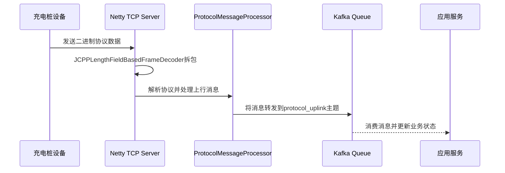
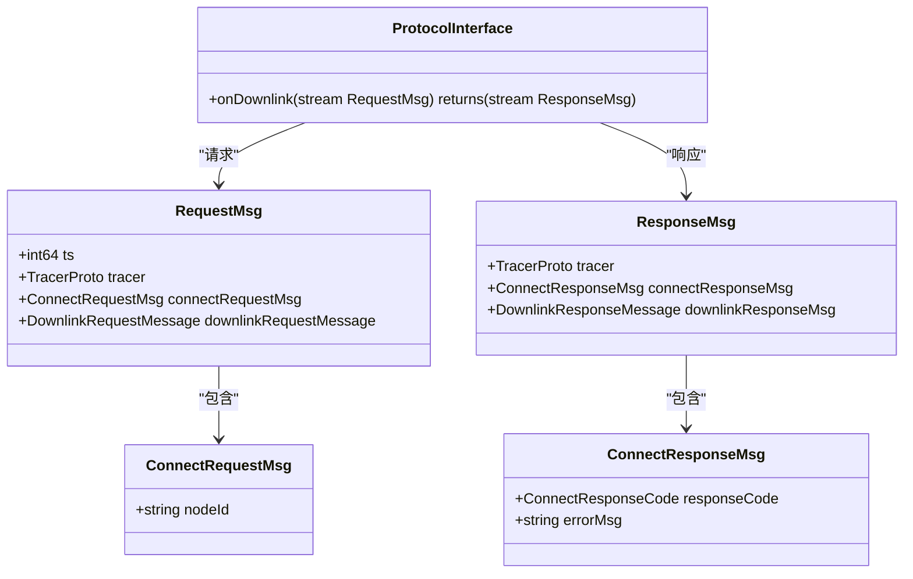
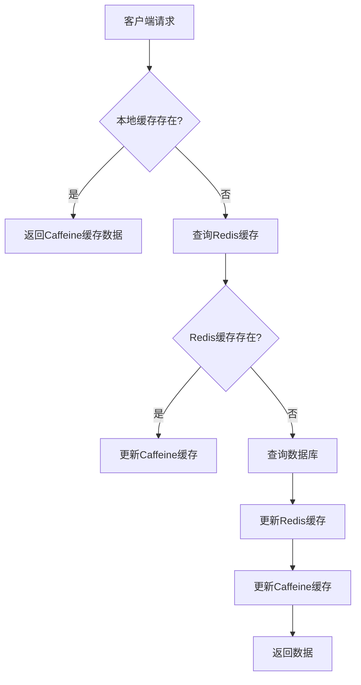
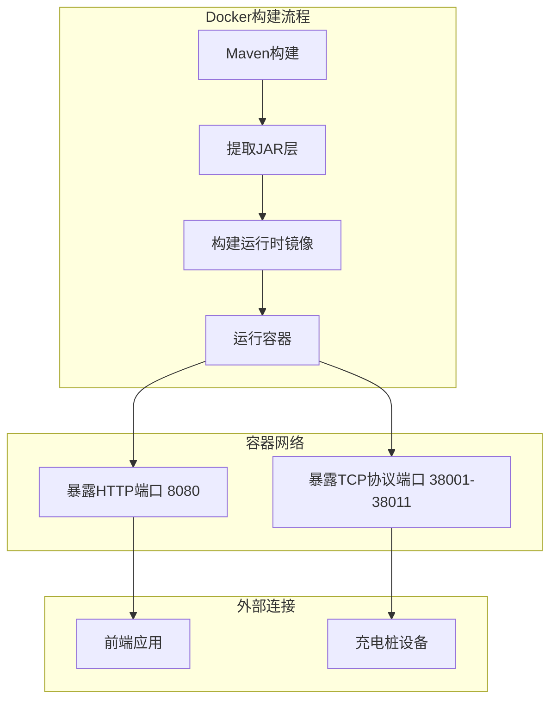

# 技术栈与依赖

<cite>
**本文档引用的文件**  
- [pom.xml](file://pom.xml)
- [jcpp-app/pom.xml](file://jcpp-app/pom.xml)
- [jcpp-infrastructure-cache/pom.xml](file://jcpp-infrastructure-cache/pom.xml)
- [jcpp-infrastructure-queue/pom.xml](file://jcpp-infrastructure-queue/pom.xml)
- [jcpp-app-bootstrap/src/main/resources/app-service.yml](file://jcpp-app-bootstrap/src/main/resources/app-service.yml)
- [jcpp-infrastructure-proto/src/main/proto/grpc.proto](file://jcpp-infrastructure-proto/src/main/proto/grpc.proto)
- [jcpp-protocol-api/src/main/java/sanbing/jcpp/protocol/adapter/DownlinkController.java](file://jcpp-protocol-api/src/main/java/sanbing/jcpp/protocol/adapter/DownlinkController.java)
- [jcpp-protocol-api/src/main/java/sanbing/jcpp/protocol/listener/tcp/TcpListener.java](file://jcpp-protocol-api/src/main/java/sanbing/jcpp/protocol/listener/tcp/TcpListener.java)
- [jcpp-web-ui/package.json](file://jcpp-web-ui/package.json)
- [jcpp-web-ui/tsconfig.json](file://jcpp-web-ui/tsconfig.json)
- [jcpp-web-ui/src/App.tsx](file://jcpp-web-ui/src/App.tsx)
- [docker/app.Dockerfile](file://docker/app.Dockerfile)
- [docker/docker-compose.monolith.yml](file://docker/docker-compose.monolith.yml)
</cite>

## 目录

1. [后端技术栈](#后端技术栈)
2. [前端技术栈](#前端技术栈)
3. [中间件与存储](#中间件与存储)
4. [构建与部署](#构建与部署)

## 后端技术栈

### Spring Boot 基础框架

Spring Boot 作为本项目的核心基础框架，提供了自动配置、起步依赖和嵌入式服务器等特性，极大地简化了Java应用的开发和部署。项目基于Spring
Boot 3.5.6版本构建，利用其强大的生态系统来管理依赖、配置和生命周期。通过`spring-boot-starter-parent`
作为父POM，实现了版本统一管理和标准化构建流程。

**Section sources**

- [pom.xml](file://pom.xml#L10-L15)

### MyBatis 数据库访问机制

项目采用MyBatis-Plus作为持久层框架，基于MyBatis进行了功能增强，提供了CRUD操作的封装，减少了模板代码的编写。通过
`mybatis-plus-spring-boot3-starter`依赖集成，实现了与Spring Boot的无缝对接。项目中的实体类（如`Pile`、`Station`、`Gun`
）通过Mapper接口与XML映射文件进行数据库操作，支持动态SQL和分页查询。

**Section sources**

- [jcpp-app/pom.xml](file://jcpp-app/pom.xml#L25-L30)
- [jcpp-app/src/main/java/sanbing/jcpp/app/dal/mapper](file://jcpp-app/src/main/java/sanbing/jcpp/app/dal/mapper)

### Netty TCP网络通信原理

Netty被用于处理TCP网络通信，特别是在充电桩协议解析模块中。`TcpListener`类使用Netty的`ServerBootstrap`创建TCP服务器，通过
`NioEventLoopGroup`管理事件循环，实现了高性能的异步非阻塞I/O通信。项目中为不同协议（如云快充、绿能）配置了独立的TCP监听端口（38001-38011），并使用自定义的
`JCPPLengthFieldBasedFrameDecoder`进行消息拆包，解决了TCP粘包问题。

**Diagram sources**

- [jcpp-protocol-api/src/main/java/sanbing/jcpp/protocol/listener/tcp/TcpListener.java](file://jcpp-protocol-api/src/main/java/sanbing/jcpp/protocol/listener/tcp/TcpListener.java#L40-L80)
- [jcpp-app-bootstrap/src/main/resources/app-service.yml](file://jcpp-app-bootstrap/src/main/resources/app-service.yml#L300-L350)

### gRPC与Protobuf服务间通信

项目采用gRPC与Protobuf实现高性能的服务间通信。通过`.proto`文件定义服务接口和消息结构，使用Protocol
Buffers进行序列化，相比JSON具有更小的体积和更快的解析速度。`grpc.proto`文件定义了`ProtocolInterface`服务，包含`onDownlink`
双向流式RPC方法，用于处理下行控制指令。这种设计支持实时、低延迟的通信，特别适合充电桩控制系统中需要快速响应的场景。

**Diagram sources**

- [jcpp-infrastructure-proto/src/main/proto/grpc.proto](file://jcpp-infrastructure-proto/src/main/proto/grpc.proto#L10-L30)
- [jcpp-protocol-api/src/main/java/sanbing/jcpp/protocol/adapter/DownlinkController.java](file://jcpp-protocol-api/src/main/java/sanbing/jcpp/protocol/adapter/DownlinkController.java#L40-L60)

## 前端技术栈

### React组件化架构

前端采用React框架构建用户界面，实现了组件化开发模式。项目结构清晰地划分了`components`、`contexts`、`services`等目录，通过
`App.tsx`作为根组件组织路由和布局。使用`React.FC`函数组件和Hooks（如`useEffect`）管理状态和副作用，实现了声明式的UI开发。路由系统基于
`react-router-dom`，通过`ProtectedRoute`组件实现权限控制，确保只有认证用户才能访问特定页面。

**Section sources**

- [jcpp-web-ui/src/App.tsx](file://jcpp-web-ui/src/App.tsx#L1-L50)
- [jcpp-web-ui/src/components](file://jcpp-web-ui/src/components)

### TypeScript类型安全优势

TypeScript为前端开发提供了静态类型检查，增强了代码的可维护性和可靠性。通过`tsconfig.json`配置，启用了严格模式（
`"strict": true`
），确保类型安全。项目中定义了清晰的类型接口，如API响应、表单数据等，减少了运行时错误。与React结合使用，提供了更好的开发体验和智能提示，特别是在处理复杂状态和props传递时，类型系统能有效防止常见错误。

**Section sources**

- [jcpp-web-ui/tsconfig.json](file://jcpp-web-ui/tsconfig.json#L1-L15)
- [jcpp-web-ui/package.json](file://jcpp-web-ui/package.json#L10-L15)

### Ant Design UI组件库

Ant Design作为UI组件库，提供了丰富、美观且功能完整的React组件。项目中使用`antd`版本5.27.4，通过`ConfigProvider`设置中文语言包（
`zhCN`），实现了国际化支持。组件如`Layout`、`Dashboard`、`Form`等被广泛应用于管理后台，提供了统一的设计语言和用户体验。结合
`@ant-design/icons`，实现了现代化的图标展示，提升了界面的视觉效果和交互性。

**Section sources**

- [jcpp-web-ui/package.json](file://jcpp-web-ui/package.json#L5-L10)
- [jcpp-web-ui/src/App.tsx](file://jcpp-web-ui/src/App.tsx#L10-L20)

## 中间件与存储

### PostgreSQL持久化存储

PostgreSQL被选为关系型数据库，用于持久化存储充电桩、站点、用户等核心业务数据。通过`spring-boot-starter-jdbc`和`postgresql`
驱动集成，使用HikariCP连接池管理数据库连接。配置中设置了最大连接池大小为64，优化了数据库访问性能。项目中的`schema-init.sql`
脚本定义了表结构，确保了数据的一致性和完整性。

**Section sources**

- [jcpp-app/pom.xml](file://jcpp-app/pom.xml#L20-L25)
- [jcpp-app/src/main/resources/sql/schema-init.sql](file://jcpp-app/src/main/resources/sql/schema-init.sql)

### Redis多级缓存架构

项目实现了Caffeine+Redis的多级缓存架构，以提高系统性能和响应速度。`jcpp-infrastructure-cache`
模块封装了缓存逻辑，支持Caffeine本地缓存和Redis分布式缓存两种模式。通过`CacheSpecs`配置不同实体（如piles、guns）的缓存策略，包括TTL和最大大小。
`AttributeRedisCache`和`PileRedisCache`等类实现了具体的缓存操作，利用Redis的高性能读写能力，减轻了数据库压力。

**Diagram sources**

- [jcpp-infrastructure-cache/pom.xml](file://jcpp-infrastructure-cache/pom.xml#L20-L30)
- [jcpp-app-bootstrap/src/main/resources/app-service.yml](file://jcpp-app-bootstrap/src/main/resources/app-service.yml#L200-L250)

### Kafka消息解耦与高并发

Kafka在系统中扮演着消息中间件的角色，用于解耦服务和处理高并发消息流。`jcpp-infrastructure-queue`
模块封装了Kafka客户端，支持生产者和消费者模式。配置中设置了`protocol_uplink`
主题，用于接收来自充电桩的上行消息。通过分区（partitions）和消费者组（consumer
groups）实现消息的并行处理，提高了系统的吞吐量。Kafka的持久化特性确保了消息不丢失，即使在服务重启后也能继续处理。

**Section sources**

- [jcpp-infrastructure-queue/pom.xml](file://jcpp-infrastructure-queue/pom.xml#L20-L30)
- [jcpp-app-bootstrap/src/main/resources/app-service.yml](file://jcpp-app-bootstrap/src/main/resources/app-service.yml#L100-L150)

## 构建与部署

### Maven多模块项目管理

项目采用Maven进行多模块管理，通过父POM（`jcpp-parent`）统一管理所有子模块的依赖和插件版本。项目包含多个模块，如`jcpp-app`、
`jcpp-protocol-api`、`jcpp-infrastructure-cache`等，每个模块都有明确的职责。`pom.xml`中配置了`protobuf-maven-plugin`用于编译
`.proto`文件，`frontend-maven-plugin`用于构建前端资源。这种模块化设计提高了代码的可维护性和复用性。

**Section sources**

- [pom.xml](file://pom.xml#L100-L200)
- [jcpp-app/pom.xml](file://jcpp-app/pom.xml)

### Docker容器化部署

系统通过Docker实现容器化部署，使用`app.Dockerfile`
定义应用镜像。采用多阶段构建策略，首先使用基础镜像编译Maven项目，然后提取JAR包的各个层（dependencies、spring-boot-loader等），最后构建运行时镜像。
`docker-compose.monolith.yml`定义了服务网络和端口映射，将应用服务暴露在8080端口，同时开放了多个TCP协议端口（38001-38011）。这种部署方式确保了环境一致性，简化了部署流程。

**Diagram sources**

- [docker/app.Dockerfile](file://docker/app.Dockerfile)
- [docker/docker-compose.monolith.yml](file://docker/docker-compose.monolith.yml)