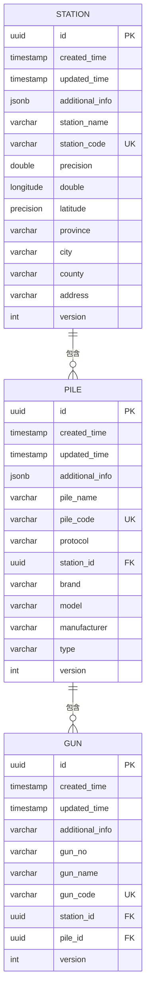

# 数据模型与数据库设计

<cite>
**本文档引用的文件**  
- [Station.java](file://jcpp-app/src/main/java/sanbing/jcpp/app/dal/entity/Station.java)
- [Pile.java](file://jcpp-app/src/main/java/sanbing/jcpp/app/dal/entity/Pile.java)
- [Gun.java](file://jcpp-app/src/main/java/sanbing/jcpp/app/dal/entity/Gun.java)
- [Attribute.java](file://jcpp-app/src/main/java/sanbing/jcpp/app/dal/entity/Attribute.java)
- [schema-init.sql](file://jcpp-app/src/main/resources/sql/schema-init.sql)
- [StationMapper.java](file://jcpp-app/src/main/java/sanbing/jcpp/app/dal/mapper/StationMapper.java)
- [PileMapper.java](file://jcpp-app/src/main/java/sanbing/jcpp/app/dal/mapper/PileMapper.java)
- [GunMapper.java](file://jcpp-app/src/main/java/sanbing/jcpp/app/dal/mapper/GunMapper.java)
- [AttributeMapper.java](file://jcpp-app/src/main/java/sanbing/jcpp/app/dal/mapper/AttributeMapper.java)
- [AttributeMapper.xml](file://jcpp-app/src/main/resources/mapper/AttributeMapper.xml)
- [AttrKeyEnum.java](file://jcpp-app/src/main/java/sanbing/jcpp/app/data/kv/AttrKeyEnum.java)
- [PileTypeEnum.java](file://jcpp-app/src/main/java/sanbing/jcpp/app/dal/config/ibatis/enums/PileTypeEnum.java)
- [StatusCleanupInitializingBean.java](file://jcpp-app/src/main/java/sanbing/jcpp/app/initializing/StatusCleanupInitializingBean.java)
- [SqlBlockingQueueWrapper.java](file://jcpp-app/src/main/java/sanbing/jcpp/app/dal/repository/batch/SqlBlockingQueueWrapper.java)
</cite>

## 目录

1. [核心实体数据模型](#核心实体数据模型)
2. [实体关系与ER图](#实体关系与er图)
3. [属性实体设计](#属性实体设计)
4. [数据库表结构与索引](#数据库表结构与索引)
5. [数据访问层设计](#数据访问层设计)
6. [数据生命周期管理](#数据生命周期管理)

## 核心实体数据模型

### 充电站 (Station)

充电站实体表示物理充电站点，包含站点的基本信息和地理位置。

**属性说明：**

- `id`: UUID类型，主键，全局唯一标识符
- `createdTime`: 时间戳，记录创建时间
- `updatedTime`: 时间戳，记录最后更新时间
- `additionalInfo`: JSON类型，存储额外的扩展信息
- `stationName`: 字符串类型，站点名称，非空
- `stationCode`: 字符串类型，站点编码，全局唯一，非空
- `longitude`: 浮点类型，经度坐标
- `latitude`: 浮点类型，纬度坐标
- `province`: 字符串类型，省份信息
- `city`: 字符串类型，城市信息
- `county`: 字符串类型，区县信息
- `address`: 字符串类型，详细地址
- `version`: 整数类型，版本号，用于乐观锁控制

**Section sources**

- [Station.java](file://jcpp-app/src/main/java/sanbing/jcpp/app/dal/entity/Station.java#L1-L65)

### 充电桩 (Pile)

充电桩实体表示充电站内的具体充电设备，与充电站存在一对多关系。

**属性说明：**

- `id`: UUID类型，主键，全局唯一标识符
- `createdTime`: 时间戳，记录创建时间
- `updatedTime`: 时间戳，记录最后更新时间
- `additionalInfo`: JSON类型，存储额外的扩展信息
- `pileName`: 字符串类型，充电桩名称，非空
- `pileCode`: 字符串类型，充电桩编码，全局唯一，非空
- `protocol`: 字符串类型，通信协议类型，非空
- `stationId`: UUID类型，外键，关联到充电站实体
- `brand`: 字符串类型，品牌信息
- `model`: 字符串类型，型号信息
- `manufacturer`: 字符串类型，制造商信息
- `type`: 枚举类型，充电桩类型（交流AC/直流DC），非空
- `version`: 整数类型，版本号，用于乐观锁控制

**Section sources**

- [Pile.java](file://jcpp-app/src/main/java/sanbing/jcpp/app/dal/entity/Pile.java#L1-L64)
- [PileTypeEnum.java](file://jcpp-app/src/main/java/sanbing/jcpp/app/dal/config/ibatis/enums/PileTypeEnum.java#L1-L22)

### 充电枪 (Gun)

充电枪实体表示充电桩上的具体充电接口，与充电桩存在一对多关系。

**属性说明：**

- `id`: UUID类型，主键，全局唯一标识符
- `createdTime`: 时间戳，记录创建时间
- `updatedTime`: 时间戳，记录最后更新时间
- `additionalInfo`: 字符串类型，存储额外的扩展信息
- `gunNo`: 字符串类型，枪编号，在同一充电桩下唯一，非空
- `gunName`: 字符串类型，充电枪名称，非空
- `gunCode`: 字符串类型，充电枪编码，全局唯一，非空
- `stationId`: UUID类型，外键，关联到充电站实体
- `pileId`: UUID类型，外键，关联到充电桩实体
- `version`: 整数类型，版本号，用于乐观锁控制

**Section sources**

- [Gun.java](file://jcpp-app/src/main/java/sanbing/jcpp/app/dal/entity/Gun.java#L1-L56)

## 实体关系与ER图

充电站、充电桩和充电枪之间存在明确的层次结构关系：一个充电站包含多个充电桩，一个充电桩包含多个充电枪。



**Diagram sources**

- [Station.java](file://jcpp-app/src/main/java/sanbing/jcpp/app/dal/entity/Station.java#L1-L65)
- [Pile.java](file://jcpp-app/src/main/java/sanbing/jcpp/app/dal/entity/Pile.java#L1-L64)
- [Gun.java](file://jcpp-app/src/main/java/sanbing/jcpp/app/dal/entity/Gun.java#L1-L56)
- [schema-init.sql](file://jcpp-app/src/main/resources/sql/schema-init.sql#L45-L130)

## 属性实体设计

### Attribute实体架构

Attribute实体采用灵活的键值对（K-V）存储模式，用于存储设备的动态属性，如电压、电流、状态等实时数据。

**表结构设计特点：**

- **复合主键**: 由`entity_id`和`attr_key`组成，确保每个实体的每个属性键唯一
- **多值类型字段**: 为支持不同数据类型，表中包含多种类型的值字段
- **时间戳**: `last_update_ts`记录属性最后更新时间
- **版本控制**: `version`字段用于乐观锁控制

**多值类型字段：**

- `bool_v`: 布尔值，存储true/false类型数据
- `str_v`: 字符串值，存储文本数据，最大长度10,000,000字符
- `long_v`: 长整型值，存储大整数
- `dbl_v`: 双精度值，存储浮点数
- `json_v`: JSON值，存储复杂结构化数据

**Section sources**

- [Attribute.java](file://jcpp-app/src/main/java/sanbing/jcpp/app/dal/entity/Attribute.java#L1-L102)

### 属性与核心实体的关联

Attribute实体通过`entity_id`字段与Station、Pile和Gun实体关联，实现一对多的关系。

```mermaid
erDiagram
STATION ||--o{ ATTRIBUTE : "拥有"
PILE ||--o{ ATTRIBUTE : "拥有"
GUN ||--o{ ATTRIBUTE : "拥有"
ATTRIBUTE {
uuid entity_id PK,FK
varchar attr_key PK
boolean bool_v
varchar str_v
bigint long_v
double precision dbl_v
json json_v
bigint last_update_ts
int version
}
```

**属性键枚举 (AttrKeyEnum)**
系统定义了标准的属性键枚举，确保属性命名的一致性：

- `STATUS`: 状态
- `CONNECTED_AT`: 连接时间
- `DISCONNECTED_AT`: 断开连接时间
- `LAST_ACTIVE_TIME`: 最后活跃时间
- `GUN_RUN_STATUS`: 充电枪运行状态
- `LOCK_STATUS`: 地锁状态
- `PARK_STATUS`: 车位状态

**Diagram sources**

- [Attribute.java](file://jcpp-app/src/main/java/sanbing/jcpp/app/dal/entity/Attribute.java#L1-L102)
- [AttrKeyEnum.java](file://jcpp-app/src/main/java/sanbing/jcpp/app/data/kv/AttrKeyEnum.java#L1-L69)

## 数据库表结构与索引

### 表结构详情

根据`schema-init.sql`文件，数据库包含以下主要表：

**t_station (充电站表)**

- 主键: `id`
- 唯一索引: `uni_station_code` on `station_code`
- 字段: id, created_time, updated_time, additional_info, station_name, station_code, longitude, latitude, province,
  city, county, address, version

**t_pile (充电桩表)**

- 主键: `id`
- 外键: `station_id` references `t_station(id)`
- 唯一索引: `uni_pile_code` on `pile_code`
- 字段: id, created_time, updated_time, additional_info, pile_name, pile_code, protocol, station_id, brand, model,
  manufacturer, type, version

**t_gun (充电枪表)**

- 主键: `id`
- 外键: `station_id` references `t_station(id)`, `pile_id` references `t_pile(id)`
- 唯一索引: `uni_gun_pile_gun_no` on (`pile_id`, `gun_no`), `uni_gun_code` on `gun_code`
- 字段: id, created_time, updated_time, additional_info, gun_no, gun_name, gun_code, station_id, pile_id, version

**t_attr (属性表)**

- 复合主键: (`entity_id`, `attr_key`)
- 字段: entity_id, attr_key, bool_v, str_v, long_v, dbl_v, json_v, last_update_ts, version

### 索引设计与查询优化

数据库设计了多个索引以优化查询性能：

**唯一性约束索引：**

- `uni_station_code`: 确保充电站编码全局唯一
- `uni_pile_code`: 确保充电桩编码全局唯一
- `uni_gun_code`: 确保充电枪编码全局唯一
- `uni_gun_pile_gun_no`: 确保同一充电桩下枪编号唯一

**查询性能优化：**
这些索引不仅保证了数据的完整性，还显著提升了基于编码的查询性能。例如，通过充电桩编码查询充电桩信息时，可以直接利用
`uni_pile_code`索引进行快速查找。

**Section sources**

- [schema-init.sql](file://jcpp-app/src/main/resources/sql/schema-init.sql#L1-L130)

## 数据访问层设计

### MyBatis Mapper接口设计

数据访问层采用MyBatis框架，通过Mapper接口与XML映射文件配合工作。

**核心Mapper接口：**

- `StationMapper`: 继承自`BaseMapper<Station>`，提供基础的CRUD操作
- `PileMapper`: 扩展了基础操作，包含自定义查询方法
- `GunMapper`: 扩展了基础操作，包含自定义查询方法
- `AttributeMapper`: 提供属性数据的特定访问方法

### Mapper接口与XML映射配合

Mapper接口定义了数据访问方法，而具体的SQL语句在对应的XML文件中实现，这种分离设计提高了代码的可维护性。

**PileMapper示例：**

```java
IPage<PileWithStatusResponse> selectPileWithStatusPage(
    Page<PileWithStatusResponse> page, 
    @Param("request") PileQueryRequest request,
    @Param("statusKey") AttrKeyEnum statusKey,
    @Param("connectedAtKey") AttrKeyEnum connectedAtKey,
    @Param("disconnectedAtKey") AttrKeyEnum disconnectedAtKey,
    @Param("lastActiveTimeKey") AttrKeyEnum lastActiveTimeKey
);
```

对应的SQL在`PileMapper.xml`中定义，但项目中使用了注解方式直接在接口中定义SQL，体现了MyBatis-Plus的特性。

**AttributeMapper XML映射：**

```xml
<mapper namespace="sanbing.jcpp.app.dal.mapper.AttributeMapper">
    <select id="findByEntity" resultType="sanbing.jcpp.app.dal.entity.Attribute">
        SELECT * FROM t_attr WHERE entity_id = #{entityId}
    </select>
    
    <select id="findByEntityAndKey" resultType="sanbing.jcpp.app.dal.entity.Attribute">
        SELECT * FROM t_attr WHERE entity_id = #{entityId} AND attr_key = #{attrKey}
    </select>
    
    <delete id="deleteByEntityIdAndKey">
        DELETE FROM t_attr WHERE entity_id = #{entityId} AND attr_key = #{attrKey}
    </delete>
</mapper>
```

这种设计模式的优势：

1. **关注点分离**: Java接口定义方法签名，XML文件定义SQL实现
2. **可维护性**: SQL语句集中管理，便于修改和优化
3. **类型安全**: MyBatis通过接口提供类型安全的数据访问
4. **灵活性**: 复杂SQL可以在XML中使用动态SQL标签构建

**Section sources**

- [StationMapper.java](file://jcpp-app/src/main/java/sanbing/jcpp/app/dal/mapper/StationMapper.java#L1-L15)
- [PileMapper.java](file://jcpp-app/src/main/java/sanbing/jcpp/app/dal/mapper/PileMapper.java#L1-L77)
- [GunMapper.java](file://jcpp-app/src/main/java/sanbing/jcpp/app/dal/mapper/GunMapper.java#L1-L131)
- [AttributeMapper.java](file://jcpp-app/src/main/java/sanbing/jcpp/app/dal/mapper/AttributeMapper.java#L1-L53)
- [AttributeMapper.xml](file://jcpp-app/src/main/resources/mapper/AttributeMapper.xml#L1-L43)

## 数据生命周期管理

### 状态清洗与初始化

系统在启动时执行状态清洗操作，确保充电桩状态的一致性。

**StatusCleanupInitializingBean组件：**

- 在Spring容器初始化时执行
- 执行充电桩状态的全量清洗
- 如果失败会阻止应用启动，确保数据状态一致性
- 分页处理充电桩，每次处理1000个，避免内存溢出

**状态决策逻辑：**
根据会话状态、数据库状态和超时时间决定目标状态：

- 检查充电桩是否有活跃的会话连接
- 结合当前数据库状态和配置的超时阈值
- 决定最终的目标状态（在线/离线）

**Section sources**

- [StatusCleanupInitializingBean.java](file://jcpp-app/src/main/java/sanbing/jcpp/app/initializing/StatusCleanupInitializingBean.java#L1-L169)

### 批量数据处理与队列机制

系统实现了高效的批量数据处理机制，用于优化数据库写入性能。

**SqlBlockingQueueWrapper设计：**

- 使用阻塞队列实现数据批量处理
- 支持多线程并行处理
- 可配置批处理大小和最大延迟时间
- 提供统计信息打印功能

**批处理参数：**

- `logName`: 日志名称
- `batchSize`: 批处理大小
- `maxDelay`: 最大延迟时间（毫秒）
- `statsPrintIntervalMs`: 统计信息打印间隔
- `statsNamePrefix`: 统计名称前缀
- `batchSortEnabled`: 是否启用批处理排序
- `withResponse`: 是否需要响应

**数据处理流程：**

1. 数据元素被添加到阻塞队列
2. 单线程消费者定期从队列中获取数据
3. 当达到批处理大小或超时后，执行批量保存
4. 支持对批处理数据进行排序，避免集群模式下的死锁

**Section sources**

- [SqlBlockingQueueWrapper.java](file://jcpp-app/src/main/java/sanbing/jcpp/app/dal/repository/batch/SqlBlockingQueueWrapper.java#L1-L58)
- [SqlBlockingQueue.java](file://jcpp-app/src/main/java/sanbing/jcpp/app/dal/repository/batch/SqlBlockingQueue.java#L1-L58)
- [SqlBlockingQueueParams.java](file://jcpp-app/src/main/java/sanbing/jcpp/app/dal/repository/batch/SqlBlockingQueueParams.java#L1-L24)
- [ScheduledLogExecutorComponent.java](file://jcpp-app/src/main/java/sanbing/jcpp/app/dal/repository/batch/ScheduledLogExecutorComponent.java#L1-L40)