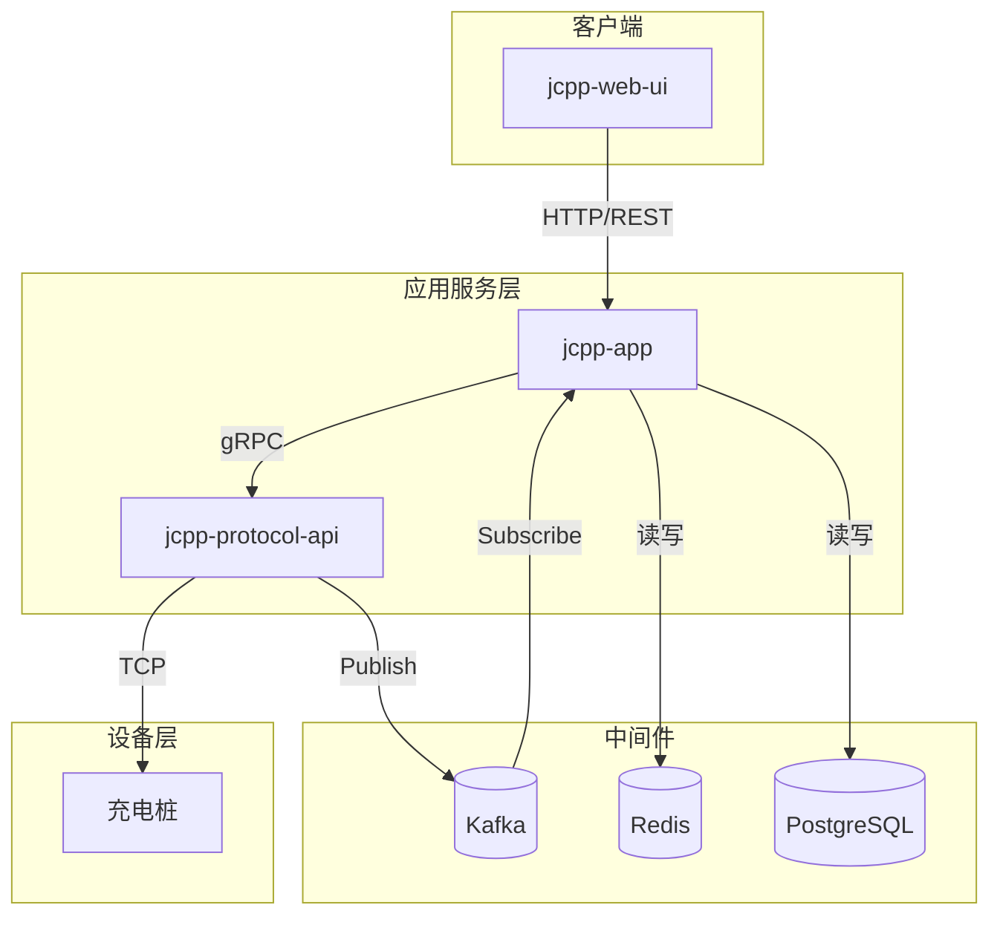

# 微服务架构

<cite>
**本文档引用的文件**   
- [JCPPServerApplication.java](file://jcpp-app-bootstrap/src/main/java/sanbing/jcpp/JCPPServerApplication.java)
- [JCPPProtocolServiceApplication.java](file://jcpp-protocol-bootstrap/src/main/java/sanbing/jcpp/protocol/JCPPProtocolServiceApplication.java)
- [app-service.yml](file://jcpp-app-bootstrap/src/main/resources/app-service.yml)
- [protocol-service.yml](file://jcpp-protocol-bootstrap/src/main/resources/protocol-service.yml)
- [PileController.java](file://jcpp-app/src/main/java/sanbing/jcpp/app/adapter/controller/PileController.java)
- [ProtocolController.java](file://jcpp-app/src/main/java/sanbing/jcpp/app/adapter/controller/ProtocolController.java)
- [DownlinkController.java](file://jcpp-protocol-api/src/main/java/sanbing/jcpp/protocol/adapter/DownlinkController.java)
- [DownlinkGrpcService.java](file://jcpp-protocol-api/src/main/java/sanbing/jcpp/protocol/adapter/DownlinkGrpcService.java)
- [DownlinkGrpcClient.java](file://jcpp-app/src/main/java/sanbing/jcpp/app/service/grpc/DownlinkGrpcClient.java)
- [ProtocolUplinkConsumerService.java](file://jcpp-app/src/main/java/sanbing/jcpp/app/service/queue/consumer/ProtocolUplinkConsumerService.java)
- [ProtocolUplinkMsg.java](file://jcpp-protocol-api/src/main/java/sanbing/jcpp/protocol/domain/ProtocolUplinkMsg.java)
- [app.Dockerfile](file://docker/app.Dockerfile)
- [protocol.Dockerfile](file://docker/protocol.Dockerfile)
- [docker-compose.monolith.yml](file://docker/docker-compose.monolith.yml)
</cite>

## 目录

1. [引言](#引言)
2. [微服务职责划分](#微服务职责划分)
3. [服务启动入口与配置](#服务启动入口与配置)
4. [服务间通信机制](#服务间通信机制)
5. [部署拓扑与中间件依赖](#部署拓扑与中间件依赖)
6. [Docker与容器化部署](#docker与容器化部署)
7. [部署拓扑图](#部署拓扑图)

## 引言

JChargePointProtocol是一个用于充电桩管理的微服务架构系统，采用模块化设计将业务逻辑与协议处理分离。该系统由两个核心微服务组成：jcpp-app（主应用服务）和jcpp-protocol-api（协议处理核心），通过清晰的职责划分实现高内聚、低耦合的系统架构。本文档详细阐述这两个微服务的架构设计、通信机制、配置管理及部署方案。

## 微服务职责划分

### jcpp-app（主应用服务）

jcpp-app微服务负责系统的业务逻辑处理和用户交互，是整个系统的后端核心。其主要职责包括：

- **业务逻辑处理**：实现充电桩、充电枪、充电站等实体的增删改查操作，处理用户管理、权限控制、计费策略等核心业务逻辑。
- **REST API暴露**：通过Spring MVC提供标准的RESTful API接口，供前端UI或其他客户端调用，如充电桩管理、用户认证、数据查询等接口。
- **数据库交互**：使用MyBatis作为持久层框架，与PostgreSQL数据库进行交互，管理充电桩、用户、会话等结构化数据。
- **用户管理**：实现基于JWT的认证授权机制，管理用户登录、权限验证和会话生命周期。

**微服务职责来源**

- [PileController.java](file://jcpp-app/src/main/java/sanbing/jcpp/app/adapter/controller/PileController.java#L1-L112)
- [ProtocolController.java](file://jcpp-app/src/main/java/sanbing/jcpp/app/adapter/controller/ProtocolController.java#L1-L41)

### jcpp-protocol-api（协议处理核心）

jcpp-protocol-api微服务专注于充电桩通信协议的处理，是系统的通信前置。其主要职责包括：

- **TCP长连接处理**：使用Netty框架监听指定端口（如38001-38011），接收来自充电桩的TCP连接请求，维护长连接会话。
- **协议编解码**：针对不同厂商的充电桩协议（如云快充V150/V160/V170、绿能V340），实现消息的编码与解码，处理二进制、JSON等格式的数据包。
- **消息路由**：根据协议类型和消息内容，将上行消息路由到相应的处理器进行业务逻辑处理，并将下行指令正确发送到指定的充电桩。
- **gRPC接口暴露**：提供gRPC服务接口，允许jcpp-app等服务通过高性能的远程过程调用方式向充电桩发送控制指令。

**微服务职责来源**

- [DownlinkController.java](file://jcpp-protocol-api/src/main/java/sanbing/jcpp/protocol/adapter/DownlinkController.java#L1-L76)
- [DownlinkGrpcService.java](file://jcpp-protocol-api/src/main/java/sanbing/jcpp/protocol/adapter/DownlinkGrpcService.java#L1-L185)

## 服务启动入口与配置

### 启动入口

系统通过两个独立的Spring Boot应用作为微服务的启动入口：

- **jcpp-app启动入口**：`JCPPServerApplication`类是jcpp-app微服务的主启动类。它通过`@SpringBootApplication`注解启用Spring
  Boot自动配置，并通过`main`方法启动应用。启动时会自动加载`app-service.yml`配置文件，并在启动完成后输出启动耗时日志。

- **jcpp-protocol-api启动入口**：`JCPPProtocolServiceApplication`类是jcpp-protocol-api微服务的主启动类。它同样基于Spring
  Boot，但通过`scanBasePackages`指定了特定的包扫描范围，确保只加载协议相关的组件。其`main`方法负责启动协议服务。

**启动入口来源**

- [JCPPServerApplication.java](file://jcpp-app-bootstrap/src/main/java/sanbing/jcpp/JCPPServerApplication.java#L1-L55)
- [JCPPProtocolServiceApplication.java](file://jcpp-protocol-bootstrap/src/main/java/sanbing/jcpp/protocol/JCPPProtocolServiceApplication.java#L1-L59)

### 配置文件

每个微服务都有独立的YAML配置文件，实现配置隔离：

- **app-service.yml**
  ：jcpp-app微服务的配置文件，定义了HTTP服务器端口（8080）、数据库连接（PostgreSQL）、缓存配置（Caffeine/Redis）、Kafka队列、安全设置（JWT）等。通过环境变量（如
  `SPRING_DATASOURCE_URL`）支持不同环境的配置注入。

- **protocol-service.yml**
  ：jcpp-protocol-api微服务的配置文件，定义了HTTP服务器端口（8081）、gRPC服务端口（9090）、各协议监听器的TCP端口（如云快充V150在38001端口）、以及Kafka生产者配置。该文件明确将
  `service.type`设置为`protocol`，表明其为纯协议处理服务。

**配置文件来源**

- [app-service.yml](file://jcpp-app-bootstrap/src/main/resources/app-service.yml#L1-L432)
- [protocol-service.yml](file://jcpp-protocol-bootstrap/src/main/resources/protocol-service.yml#L1-L274)

## 服务间通信机制

### 异步消息传递（Kafka）

两个微服务通过Apache Kafka进行异步消息传递，实现解耦和削峰填谷：

- **消息类型**：`ProtocolUplinkMsg`
  是核心的上行消息类型，封装了来自充电桩的原始数据。当jcpp-protocol-api接收到充电桩的上行消息时，会将其序列化为Protobuf格式，并通过Kafka生产者发送到名为
  `protocol_uplink`的主题。

- **消息消费**：jcpp-app微服务中包含`ProtocolUplinkConsumerService`消费者，它订阅`protocol_uplink`主题，从Kafka拉取
  `ProtocolUplinkMsg`消息。消费后，消息会被反序列化并分发到相应的业务处理器，如更新充电桩状态、记录充电数据等。

**异步通信来源**

- [ProtocolUplinkMsg.java](file://jcpp-protocol-api/src/main/java/sanbing/jcpp/protocol/domain/ProtocolUplinkMsg.java#L1-L24)
- [ProtocolUplinkConsumerService.java](file://jcpp-app/src/main/java/sanbing/jcpp/app/service/queue/consumer/ProtocolUplinkConsumerService.java)

### 同步远程调用（gRPC）

对于需要即时响应的控制指令，系统采用gRPC进行同步远程调用：

- **gRPC服务端**：jcpp-protocol-api通过`DownlinkGrpcService`类暴露gRPC服务。它继承自
  `ProtocolInterfaceGrpc.ProtocolInterfaceImplBase`，实现了`onDownlink`方法，用于接收来自jcpp-app的下行控制请求（如启动充电、停止充电、设置电价等）。

- **gRPC客户端**：jcpp-app通过`DownlinkGrpcClient`类作为gRPC客户端。它维护与jcpp-protocol-api的长连接，并提供
  `sendDownlinkRequest`方法。当业务需要向充电桩发送指令时，jcpp-app会构造`RequestMsg`，通过gRPC客户端发送给jcpp-protocol-api。

- **通信流程**：jcpp-app -> (gRPC) -> jcpp-protocol-api -> (TCP) -> 充电桩。gRPC调用确保了指令的可靠、低延迟传输。

**同步通信来源**

- [DownlinkGrpcService.java](file://jcpp-protocol-api/src/main/java/sanbing/jcpp/protocol/adapter/DownlinkGrpcService.java#L1-L185)
- [DownlinkGrpcClient.java](file://jcpp-app/src/main/java/sanbing/jcpp/app/service/grpc/DownlinkGrpcClient.java#L1-L298)

## 部署拓扑与中间件依赖

系统依赖于多种中间件来实现其功能：

- **PostgreSQL**：作为主数据库，由jcpp-app服务连接，用于持久化存储充电桩、用户、站点等核心业务数据。
- **Redis**：作为缓存层，由jcpp-app服务连接，用于缓存充电桩状态、会话信息等高频访问数据，减轻数据库压力。
- **Kafka**：作为消息中间件，是两个微服务间通信的桥梁。jcpp-protocol-api将上行消息发布到Kafka，jcpp-app从Kafka消费这些消息。

**中间件依赖来源**

- [app-service.yml](file://jcpp-app-bootstrap/src/main/resources/app-service.yml#L30-L100)

## Docker与容器化部署

系统通过Docker实现容器化部署，确保环境一致性：

- **Docker镜像构建**：提供了`app.Dockerfile`和`protocol.Dockerfile`
  两个Dockerfile。它们都基于相同的Java基础镜像，采用多阶段构建。首先在构建阶段编译打包应用，然后在运行阶段提取JAR包的分层内容，实现更小的镜像体积和更快的启动速度。

- **Docker Compose**：通过`docker-compose.monolith.yml`文件定义了本地开发环境的多服务部署。它创建了一个名为
  `sanbing-network`的自定义网络，并定义了`jcpp-node-0`服务，该服务使用`app.Dockerfile`
  构建，将容器的8080端口映射到宿主机，并暴露了多个TCP端口（38001等）用于充电桩连接。

**容器化部署来源**

- [app.Dockerfile](file://docker/app.Dockerfile#L1-L47)
- [protocol.Dockerfile](file://docker/protocol.Dockerfile#L1-L47)
- [docker-compose.monolith.yml](file://docker/docker-compose.monolith.yml#L1-L29)

## 部署拓扑图

以下Mermaid图展示了JChargePointProtocol系统的部署拓扑和各组件间的连接关系。

**图示来源**

- [app.Dockerfile](file://docker/app.Dockerfile#L1-L47)
- [protocol.Dockerfile](file://docker/protocol.Dockerfile#L1-L47)
- [docker-compose.monolith.yml](file://docker/docker-compose.monolith.yml#L1-L29)
- [app-service.yml](file://jcpp-app-bootstrap/src/main/resources/app-service.yml#L1-L432)
- [protocol-service.yml](file://jcpp-protocol-bootstrap/src/main/resources/protocol-service.yml#L1-L274)