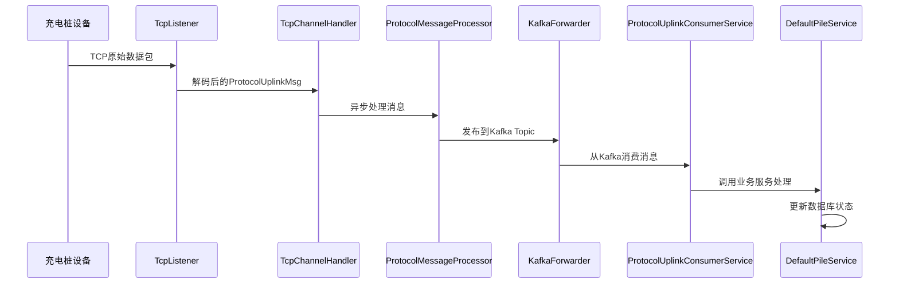
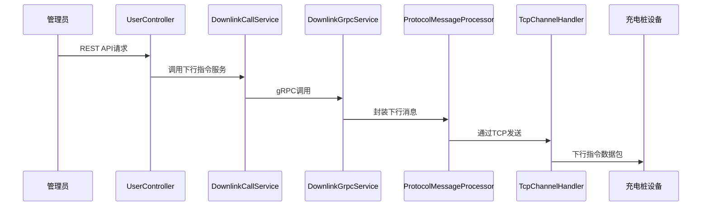
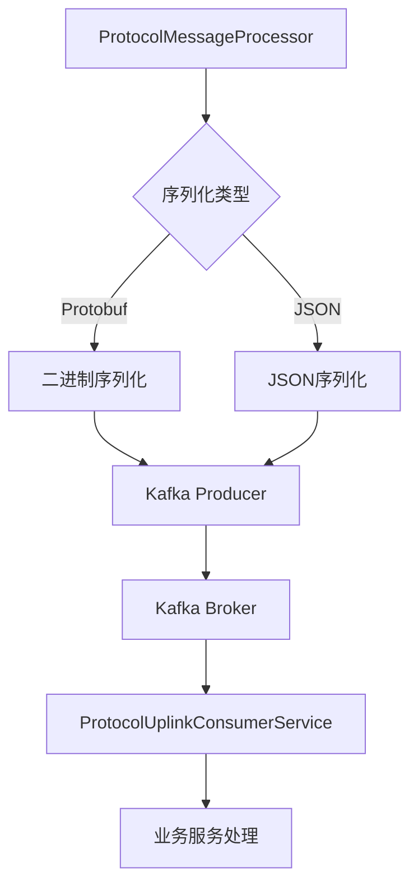
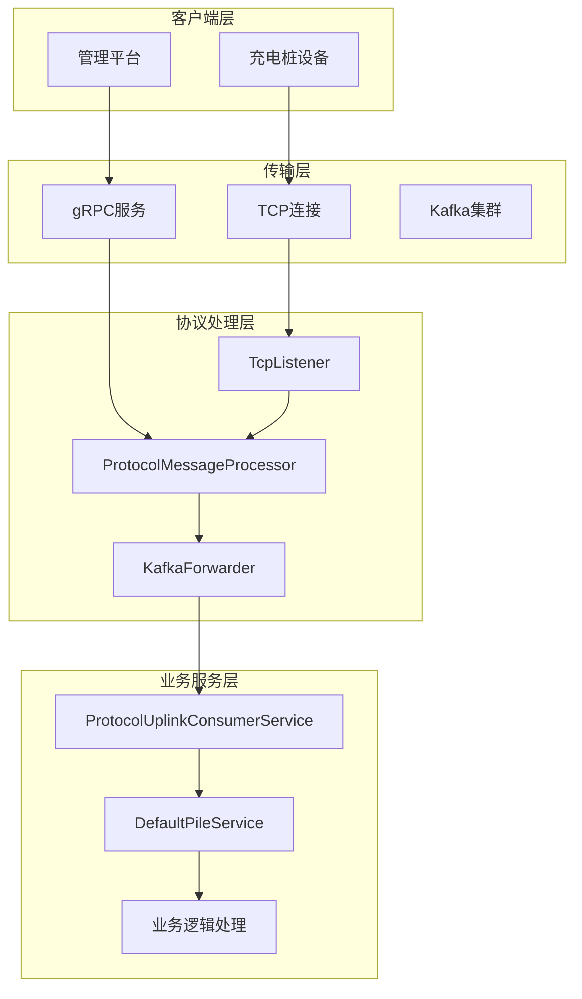
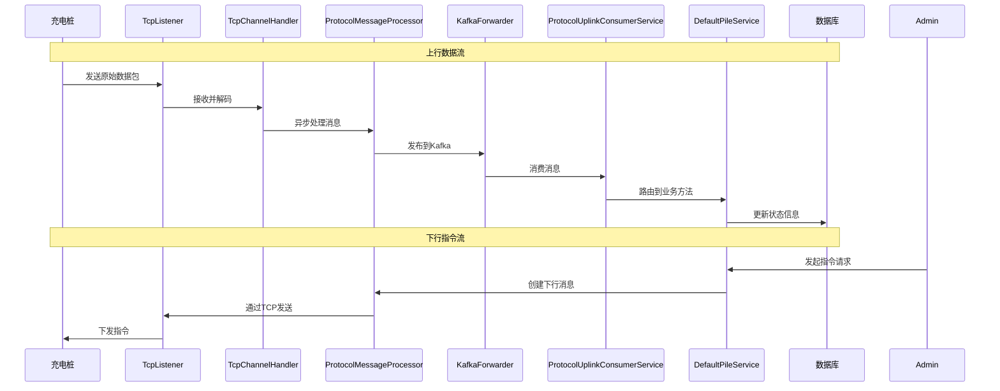

# JChargePointProtocol 数据流分析文档

<cite>
**本文档引用的文件**
- [ProtocolMessageProcessor.java](file://jcpp-protocol-api/src/main/java/sanbing/jcpp/protocol/ProtocolMessageProcessor.java)
- [TcpListener.java](file://jcpp-protocol-api/src/main/java/sanbing/jcpp/protocol/listener/tcp/TcpListener.java)
- [TcpChannelHandler.java](file://jcpp-protocol-api/src/main/java/sanbing/jcpp/protocol/listener/tcp/TcpChannelHandler.java)
- [KafkaForwarder.java](file://jcpp-protocol-api/src/main/java/sanbing/jcpp/protocol/forwarder/KafkaForwarder.java)
- [ProtocolUplinkConsumerService.java](file://jcpp-app/src/main/java/sanbing/jcpp/app/service/queue/consumer/ProtocolUplinkConsumerService.java)
- [DownlinkController.java](file://jcpp-protocol-api/src/main/java/sanbing/jcpp/protocol/adapter/DownlinkController.java)
- [DownlinkGrpcService.java](file://jcpp-protocol-api/src/main/java/sanbing/jcpp/protocol/adapter/DownlinkGrpcService.java)
- [UserController.java](file://jcpp-app/src/main/java/sanbing/jcpp/app/adapter/controller/UserController.java)
- [DownlinkCallService.java](file://jcpp-app/src/main/java/sanbing/jcpp/app/service/DownlinkCallService.java)
- [DefaultPileService.java](file://jcpp-app/src/main/java/sanbing/jcpp/app/service/impl/DefaultPileService.java)
- [uplink.proto](file://jcpp-infrastructure-proto/src/main/proto/uplink.proto)
- [downlink.proto](file://jcpp-infrastructure-proto/src/main/proto/downlink.proto)
- [grpc.proto](file://jcpp-infrastructure-proto/src/main/proto/grpc.proto)
</cite>

## 目录

1. [概述](#概述)
2. [上行数据流分析](#上行数据流分析)
3. [下行指令流分析](#下行指令流分析)
4. [消息序列化与传输](#消息序列化与传输)
5. [关键组件架构](#关键组件架构)
6. [数据流时序图](#数据流时序图)
7. [性能考虑](#性能考虑)
8. [故障排除指南](#故障排除指南)
9. [总结](#总结)

## 概述

JChargePointProtocol是一个基于Java的企业级充电桩通信协议框架，采用微服务架构设计，支持多种通信协议和消息传输机制。该系统主要包含两个核心数据流：上行数据流（充电桩→服务器）和下行指令流（服务器→充电桩），通过TCP连接、Kafka消息队列和gRPC等多种技术实现高效可靠的消息传递。

## 上行数据流分析

### 数据流路径

上行数据流从充电桩设备开始，经过多个处理阶段最终到达业务服务层：

**图表来源**

- [TcpListener.java](file://jcpp-protocol-api/src/main/java/sanbing/jcpp/protocol/listener/tcp/TcpListener.java#L30-L70)
- [TcpChannelHandler.java](file://jcpp-protocol-api/src/main/java/sanbing/jcpp/protocol/listener/tcp/TcpChannelHandler.java#L99-L128)
- [KafkaForwarder.java](file://jcpp-protocol-api/src/main/java/sanbing/jcpp/protocol/forwarder/KafkaForwarder.java#L145-L169)
- [ProtocolUplinkConsumerService.java](file://jcpp-app/src/main/java/sanbing/jcpp/app/service/queue/consumer/ProtocolUplinkConsumerService.java#L120-L200)

### 关键处理节点

#### 1. TCP监听器层

TCP监听器负责建立与充电桩的网络连接，处理原始字节流并将其转换为结构化的消息对象。

**节来源**

- [TcpListener.java](file://jcpp-protocol-api/src/main/java/sanbing/jcpp/protocol/listener/tcp/TcpListener.java#L30-L70)

#### 2. 消息处理器层

消息处理器负责解析不同格式的上行消息（字节数组、JSON、字符串），并异步处理这些消息以提高系统吞吐量。

**节来源**

- [ProtocolMessageProcessor.java](file://jcpp-protocol-api/src/main/java/sanbing/jcpp/protocol/ProtocolMessageProcessor.java#L25-L45)

#### 3. Kafka转发层

Kafka转发器将处理后的消息发布到指定的Kafka主题，支持Protobuf和JSON两种序列化格式，并添加分布式追踪信息。

**节来源**

- [KafkaForwarder.java](file://jcpp-protocol-api/src/main/java/sanbing/jcpp/protocol/forwarder/KafkaForwarder.java#L145-L169)

#### 4. 消费者服务层

消费者服务从Kafka队列中消费消息，根据消息类型路由到相应的业务处理方法，支持多种充电相关事件的处理。

**节来源**

- [ProtocolUplinkConsumerService.java](file://jcpp-app/src/main/java/sanbing/jcpp/app/service/queue/consumer/ProtocolUplinkConsumerService.java#L120-L200)

### 消息类型与处理

上行消息包含多种类型，每种类型对应不同的业务场景：

| 消息类型                     | 描述      | 处理方法                       |
|--------------------------|---------|----------------------------|
| LoginRequest             | 充电桩登录请求 | pileLogin                  |
| HeartBeatRequest         | 心跳检测    | heartBeat                  |
| GunRunStatusProto        | 枪运行状态   | postGunRunStatus           |
| ChargingProgressProto    | 充电进度    | postChargingProgress       |
| TransactionRecordRequest | 交易记录    | onTransactionRecordRequest |
| BmsChargingErrorProto    | BMS充电错误 | onBmsChargingErrorProto    |

## 下行指令流分析

### 数据流路径

下行指令流从管理平台开始，通过REST API或gRPC接口传递到目标充电桩：

**图表来源**

- [UserController.java](file://jcpp-app/src/main/java/sanbing/jcpp/app/adapter/controller/UserController.java#L30-L50)
- [DownlinkCallService.java](file://jcpp-app/src/main/java/sanbing/jcpp/app/service/DownlinkCallService.java#L72-L109)
- [DownlinkGrpcService.java](file://jcpp-protocol-api/src/main/java/sanbing/jcpp/protocol/adapter/DownlinkGrpcService.java#L123-L151)
- [TcpChannelHandler.java](file://jcpp-protocol-api/src/main/java/sanbing/jcpp/protocol/listener/tcp/TcpChannelHandler.java#L110-L130)

### 关键处理节点

#### 1. 控制器层

控制器接收来自管理平台的REST API请求，验证权限后调用相应的服务处理指令。

**节来源**

- [UserController.java](file://jcpp-app/src/main/java/sanbing/jcpp/app/adapter/controller/UserController.java#L30-L50)

#### 2. 服务调用层

服务调用层负责选择合适的通信方式（REST或gRPC）将指令发送到目标节点。

**节来源**

- [DownlinkCallService.java](file://jcpp-app/src/main/java/sanbing/jcpp/app/service/DownlinkCallService.java#L72-L109)

#### 3. gRPC服务层

gRPC服务层处理双向流式通信，接收来自客户端的下行指令并转发给相应的协议会话。

**节来源**

- [DownlinkGrpcService.java](file://jcpp-protocol-api/src/main/java/sanbing/jcpp/protocol/adapter/DownlinkGrpcService.java#L123-L151)

#### 4. 协议处理器层

协议处理器将下行指令封装为特定格式的消息，并通过TCP连接发送给充电桩。

**节来源**

- [ProtocolMessageProcessor.java](file://jcpp-protocol-api/src/main/java/sanbing/jcpp/protocol/ProtocolMessageProcessor.java#L45-L65)

### 指令类型与处理

下行指令包含多种类型，支持远程控制充电桩的各种功能：

| 指令类型                       | 描述     | 参数                       |
|----------------------------|--------|--------------------------|
| RemoteStartChargingRequest | 远程启动充电 | pileCode, gunNo, tradeNo |
| RemoteStopChargingRequest  | 远程停止充电 | pileCode, gunNo          |
| SetPricingRequest          | 设置计费策略 | pricingModel             |
| RestartPileRequest         | 重启充电桩  | type                     |
| TimeSyncRequest            | 时间同步   | time                     |

## 消息序列化与传输

### Protobuf序列化

系统采用Google Protocol Buffers作为主要的消息序列化格式，提供高效的二进制序列化和跨语言兼容性。

**节来源**

- [uplink.proto](file://jcpp-infrastructure-proto/src/main/proto/uplink.proto#L1-L50)
- [downlink.proto](file://jcpp-infrastructure-proto/src/main/proto/downlink.proto#L1-L50)

### Kafka传输机制

Kafka作为消息中间件，提供高吞吐量、低延迟的消息传递能力：

**图表来源**

- [KafkaForwarder.java](file://jcpp-protocol-api/src/main/java/sanbing/jcpp/protocol/forwarder/KafkaForwarder.java#L169-L200)

### gRPC通信协议

gRPC提供高性能的双向流式通信，支持实时指令下发：

**节来源**

- [grpc.proto](file://jcpp-infrastructure-proto/src/main/proto/grpc.proto#L15-L35)

## 关键组件架构

### 系统架构概览

**图表来源**

- [TcpListener.java](file://jcpp-protocol-api/src/main/java/sanbing/jcpp/protocol/listener/tcp/TcpListener.java#L30-L70)
- [KafkaForwarder.java](file://jcpp-protocol-api/src/main/java/sanbing/jcpp/protocol/forwarder/KafkaForwarder.java#L31-L71)
- [ProtocolUplinkConsumerService.java](file://jcpp-app/src/main/java/sanbing/jcpp/app/service/queue/consumer/ProtocolUplinkConsumerService.java#L60-L100)

### 组件职责分离

每个组件都有明确的职责边界，确保系统的可维护性和扩展性：

| 组件层级 | 主要职责      | 关键特性    |
|------|-----------|---------|
| 传输层  | 网络通信和消息路由 | 高并发、低延迟 |
| 协议层  | 协议解析和消息处理 | 可扩展、标准化 |
| 业务层  | 业务逻辑和状态管理 | 事务性、一致性 |

## 数据流时序图

### 完整数据流时序

**图表来源**

- [TcpChannelHandler.java](file://jcpp-protocol-api/src/main/java/sanbing/jcpp/protocol/listener/tcp/TcpChannelHandler.java#L99-L128)
- [KafkaForwarder.java](file://jcpp-protocol-api/src/main/java/sanbing/jcpp/protocol/forwarder/KafkaForwarder.java#L145-L169)
- [ProtocolUplinkConsumerService.java](file://jcpp-app/src/main/java/sanbing/jcpp/app/service/queue/consumer/ProtocolUplinkConsumerService.java#L120-L200)

### 消息头信息

消息在传输过程中携带重要的追踪和路由信息：

| 字段名称                 | 类型     | 描述      | 示例值             |
|----------------------|--------|---------|-----------------|
| MSG_MD_TRACER_ID     | String | 分布式追踪ID | "trace-12345"   |
| MSG_MD_TRACER_ORIGIN | String | 追踪来源    | "jcpp-protocol" |
| MSG_MD_TRACER_TS     | Long   | 追踪时间戳   | 1640995200000   |
| MessageKey           | String | 消息唯一标识  | "msg-uuid-123"  |

## 性能考虑

### 异步处理机制

系统采用异步处理模式，避免阻塞主线程，提高整体吞吐量：

- **线程池管理**：使用分片线程池处理不同会话的消息
- **批量处理**：支持消息批处理以减少系统开销
- **背压控制**：通过Kafka的缓冲机制防止系统过载

### 缓存策略

- **会话缓存**：使用Caffeine本地缓存和Redis分布式缓存
- **配置缓存**：缓存充电桩配置信息减少数据库查询
- **状态缓存**：缓存充电桩状态信息支持快速查询

### 监控指标

系统提供丰富的监控指标用于性能分析：

- **消息统计**：吞吐量、延迟、错误率
- **连接监控**：活跃连接数、连接池状态
- **队列监控**：Kafka队列积压、消费者滞后

## 故障排除指南

### 常见问题诊断

#### 1. 连接问题

- **症状**：充电桩无法连接到服务器
- **排查步骤**：
    - 检查TCP监听器状态
    - 验证防火墙配置
    - 确认端口可用性

#### 2. 消息丢失

- **症状**：部分消息未能到达目标
- **排查步骤**：
    - 检查Kafka分区分配
    - 验证消费者组配置
    - 监控消息序列化错误

#### 3. 性能问题

- **症状**：消息处理延迟过高
- **排查步骤**：
    - 分析线程池使用情况
    - 检查数据库连接池
    - 监控GC性能

### 日志分析

系统提供详细的日志记录，支持问题定位：

- **TRACE级别**：详细的流程跟踪
- **DEBUG级别**：调试信息和状态变更
- **INFO级别**：正常操作记录
- **WARN级别**：潜在问题警告
- **ERROR级别**：错误和异常信息

## 总结

JChargePointProtocol通过精心设计的多层架构，实现了高效可靠的充电桩通信系统。上行数据流通过TCP连接接收充电桩状态信息，经由Kafka消息队列异步处理后更新业务状态；下行指令流通过REST
API或gRPC接口实现远程控制功能。整个系统采用Protobuf序列化、异步处理和分布式缓存等技术，确保了高并发场景下的稳定性和性能。

系统的主要优势包括：

- **高可靠性**：多重备份和故障恢复机制
- **高性能**：异步处理和优化的序列化格式
- **可扩展性**：模块化设计支持功能扩展
- **可观测性**：完善的监控和日志体系

通过合理的设计和技术选型，该系统能够满足大规模充电桩网络的通信需求，为智能充电基础设施提供坚实的技术支撑。