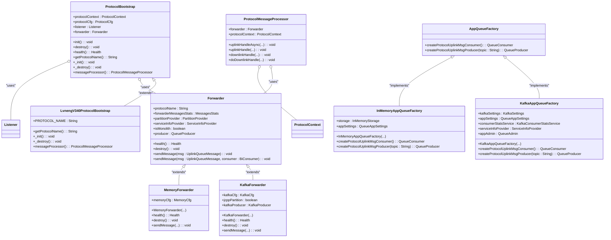

# 架构模式

<cite>
**本文档引用的文件**
- [ProtocolBootstrap.java](file://jcpp-protocol-api/src/main/java/sanbing/jcpp/protocol/ProtocolBootstrap.java)
- [LvnengV340ProtocolBootstrap.java](file://jcpp-protocol-lvneng/src/main/java/sanbing/jcpp/protocol/lvneng/v340/LvnengV340ProtocolBootstrap.java)
- [Forwarder.java](file://jcpp-protocol-api/src/main/java/sanbing/jcpp/protocol/forwarder/Forwarder.java)
- [KafkaForwarder.java](file://jcpp-protocol-api/src/main/java/sanbing/jcpp/protocol/forwarder/KafkaForwarder.java)
- [MemoryForwarder.java](file://jcpp-protocol-api/src/main/java/sanbing/jcpp/protocol/forwarder/MemoryForwarder.java)
- [AppQueueFactory.java](file://jcpp-infrastructure-queue/src/main/java/sanbing/jcpp/infrastructure/queue/provider/AppQueueFactory.java)
- [KafkaAppQueueFactory.java](file://jcpp-infrastructure-queue/src/main/java/sanbing/jcpp/infrastructure/queue/provider/KafkaAppQueueFactory.java)
- [InMemoryAppQueueFactory.java](file://jcpp-infrastructure-queue/src/main/java/sanbing/jcpp/infrastructure/queue/provider/InMemoryAppQueueFactory.java)
- [ProtocolContext.java](file://jcpp-protocol-api/src/main/java/sanbing/jcpp/protocol/ProtocolContext.java)
- [ProtocolMessageProcessor.java](file://jcpp-protocol-api/src/main/java/sanbing/jcpp/protocol/ProtocolMessageProcessor.java)
- [LvnengV340LoginULCmd.java](file://jcpp-protocol-lvneng/src/main/java/sanbing/jcpp/protocol/lvneng/v340/cmd/LvnengV340LoginULCmd.java)
- [YunKuaiChongV150LoginULCmd.java](file://jcpp-protocol-yunkuaichong/src/main/java/sanbing/jcpp/protocol/yunkuaichong/v150/cmd/YunKuaiChongV150LoginULCmd.java)
</cite>

## 目录

1. [引言](#引言)
2. [模板方法模式](#模板方法模式)
3. [策略模式](#策略模式)
4. [工厂模式](#工厂模式)
5. [六边形架构](#六边形架构)
6. [设计模式综合类图](#设计模式综合类图)
7. [结论](#结论)

## 引言

JChargePointProtocol
是一个用于处理充电桩通信协议的系统，其架构设计体现了多种经典的设计模式。本文档深入分析了该系统中应用的四种核心设计模式：模板方法模式、策略模式、工厂模式和六边形架构。这些模式共同构建了一个可扩展、可测试且松耦合的系统，能够灵活支持多种充电桩通信协议（如绿能V3.40、云快充V1.50等）。通过分析这些模式的具体实现，我们可以理解系统如何实现协议初始化的标准化、消息转发的灵活性、对象创建的解耦以及核心业务逻辑与外部适配器的清晰分离。

## 模板方法模式

模板方法模式在 JChargePointProtocol 中通过 `ProtocolBootstrap`
抽象基类实现。该模式定义了一个算法的骨架（固定流程），而将一些步骤的实现延迟到子类中，从而允许子类在不改变算法结构的情况下重新定义算法的某些特定步骤。

在本系统中，`ProtocolBootstrap` 类定义了协议服务启动和销毁的固定流程。其核心方法 `init()` 和 `destroy()` 使用了 Spring 框架的
`@PostConstruct` 和 `@PreDestroy` 注解，确保在 Spring 容器初始化和销毁 Bean 时自动执行。`init()`
方法的流程是固定的：首先记录初始化日志，然后从配置提供者加载协议配置，接着根据配置创建相应的 `Forwarder`（消息转发器）和
`Listener`（监听器），最后调用子类实现的 `_init()` 方法。同样，`destroy()` 方法也遵循固定流程：先销毁 `Listener`，再销毁
`Forwarder`，最后调用子类的 `_destroy()` 方法。

具体的协议实现类，如 `LvnengV340ProtocolBootstrap`，继承了 `ProtocolBootstrap` 并实现了其抽象方法。`getProtocolName()`
方法返回具体的协议名称（如 "LVNENG_V340"），`messageProcessor()` 方法返回该协议专用的消息处理器（
`LvnengProtocolMessageProcessor`）。值得注意的是，`_init()` 和 `_destroy()` 方法在 `LvnengV340ProtocolBootstrap`
中为空实现，这表明对于绿能V3.40协议，除了基类提供的标准初始化流程外，不需要额外的初始化或销毁逻辑。这种设计使得所有协议都遵循统一的生命周期管理，保证了系统的一致性和健壮性，同时为特定协议提供了扩展点。

**本节来源**

- [ProtocolBootstrap.java](file://jcpp-protocol-api/src/main/java/sanbing/jcpp/protocol/ProtocolBootstrap.java#L1-L126)
- [LvnengV340ProtocolBootstrap.java](file://jcpp-protocol-lvneng/src/main/java/sanbing/jcpp/protocol/lvneng/v340/LvnengV340ProtocolBootstrap.java#L1-L41)

## 策略模式

策略模式在 JChargePointProtocol 中通过 `Forwarder` 接口及其具体实现类 `KafkaForwarder` 和 `MemoryForwarder`
来体现。该模式定义了一系列算法，并将每个算法封装起来，使它们可以相互替换，且算法的变化不会影响使用算法的客户端。

在本系统中，消息转发策略是核心功能之一。`Forwarder` 是一个抽象类，它定义了所有转发器必须实现的公共接口，如 `sendMessage()`
用于发送消息，`destroy()` 用于资源清理，以及 `health()` 用于健康检查。`Forwarder` 的构造函数接收通用的配置和依赖项，如
`StatsFactory` 用于统计、`PartitionProvider` 用于分区等。

具体的转发策略由其子类实现。`KafkaForwarder` 实现了通过 Kafka 消息队列进行消息转发的策略。它使用 KafkaProducer 将消息发送到指定的
Kafka 主题，并支持 JSON 或 Protobuf 编码。`MemoryForwarder` 则实现了内存队列的转发策略，它依赖于 `AppQueueFactory`
创建的内存生产者，将消息直接放入内存队列中。这两种策略的切换完全由配置文件决定。在 `ProtocolBootstrap` 的 `init()`
方法中，系统根据配置中的 `ForwarderType`（kafka 或 memory）来实例化相应的 `Forwarder`
子类。这种设计极大地提高了系统的灵活性，开发者可以在不修改核心代码的情况下，通过更改配置来切换消息传输机制，例如在开发和测试环境中使用内存队列以简化部署，在生产环境中使用
Kafka 以保证可靠性和可扩展性。

**本节来源**

- [Forwarder.java](file://jcpp-protocol-api/src/main/java/sanbing/jcpp/protocol/forwarder/Forwarder.java#L1-L113)
- [KafkaForwarder.java](file://jcpp-protocol-api/src/main/java/sanbing/jcpp/protocol/forwarder/KafkaForwarder.java#L1-L200)
- [MemoryForwarder.java](file://jcpp-protocol-api/src/main/java/sanbing/jcpp/protocol/forwarder/MemoryForwarder.java#L1-L85)

## 工厂模式

工厂模式在 JChargePointProtocol 中通过 `AppQueueFactory` 接口及其具体实现类 `KafkaAppQueueFactory` 和
`InMemoryAppQueueFactory` 来实现。该模式提供了一种创建对象的接口，但由子类决定实例化哪一个类，从而将对象的创建与使用分离。

`AppQueueFactory` 是一个简单的工厂接口，它定义了两个方法：`createProtocolUplinkMsgConsumer()` 用于创建上行消息消费者，
`createProtocolUplinkMsgProducer(String topic)` 用于创建指定主题的上行消息生产者。这个接口是客户端（如 `ProtocolBootstrap`
）获取队列组件的统一入口。

具体的对象创建逻辑由实现了 `AppQueueFactory` 的工厂类完成。`KafkaAppQueueFactory` 负责创建基于 Kafka 的消费者和生产者。它的
`createProtocolUplinkMsgConsumer()` 方法会构建一个 `KafkaConsumerTemplate`，并配置 Kafka 的消费者设置、主题、客户端ID、反序列化器等。类似地，
`createProtocolUplinkMsgProducer()` 方法会构建一个 `KafkaProducerTemplate`。`InMemoryAppQueueFactory`
则负责创建基于内存的消费者和生产者，它使用一个共享的 `InMemoryStorage` 实例来存储消息。

这两个工厂类的加载由 Spring 的条件注解 `@ConditionalOnExpression` 控制。当配置项 `queue.type` 为 "kafka" 时，Spring 容器会创建
`KafkaAppQueueFactory` 的 Bean；当 `queue.type` 为 "memory" 时，则创建 `InMemoryAppQueueFactory` 的 Bean。`ProtocolContext`
类通过依赖注入获得正确的 `AppQueueFactory` 实例。这种工厂模式的使用，使得 `ProtocolBootstrap` 等核心组件完全不知道具体创建的是
Kafka 还是内存队列，实现了与具体实现的彻底解耦，简化了代码并提高了可维护性。

**本节来源**

- [AppQueueFactory.java](file://jcpp-infrastructure-queue/src/main/java/sanbing/jcpp/infrastructure/queue/provider/AppQueueFactory.java#L1-L20)
- [KafkaAppQueueFactory.java](file://jcpp-infrastructure-queue/src/main/java/sanbing/jcpp/infrastructure/queue/provider/KafkaAppQueueFactory.java#L1-L84)
- [InMemoryAppQueueFactory.java](file://jcpp-infrastructure-queue/src/main/java/sanbing/jcpp/infrastructure/queue/provider/InMemoryAppQueueFactory.java#L1-L50)
- [ProtocolContext.java](file://jcpp-protocol-api/src/main/java/sanbing/jcpp/protocol/ProtocolContext.java#L1-L65)

## 六边形架构

JChargePointProtocol
系统清晰地体现了六边形架构（也称为端口和适配器架构）的设计思想。该架构的核心是将系统的核心业务逻辑（领域）与外部系统（如数据库、消息队列、用户界面）分离开来，通过定义明确的“端口”（接口）进行通信，外部系统通过“适配器”来实现这些端口。

在本系统中，核心领域是协议处理逻辑，它独立于任何特定的传输或存储技术。`ProtocolMessageProcessor` 是核心领域的一个关键组件，它定义了处理上行（
`uplinkHandle`）和下行（`doDownlinkHandle`）消息的抽象方法。具体的协议实现（如 `LvnengProtocolMessageProcessor`
）继承此类并实现具体的业务逻辑。

外部适配器则负责与核心领域交互。例如，`TcpListener` 是一个适配器，它监听 TCP 端口，接收来自充电桩的原始字节流。当收到消息后，它通过
`ProtocolMessageProcessor` 的端口将消息传递给核心领域进行处理。另一个适配器是 `Forwarder`，它作为核心领域与消息队列（Kafka
或内存）之间的桥梁。当核心领域需要将处理结果转发给后端应用时，它调用 `Forwarder` 的 `sendMessage()` 方法，而具体的
`KafkaForwarder` 或 `MemoryForwarder` 适配器则负责与实际的消息队列系统进行通信。

REST 控制器（如 `DownlinkController`）也是一个适配器，它接收来自管理后台的 HTTP
请求，将其转换为内部消息，并通过核心领域的端口进行处理。这种架构的优势在于，核心业务逻辑不依赖于任何外部框架或技术。如果需要更换消息队列系统，只需编写一个新的
`Forwarder` 适配器并修改配置，而核心的协议处理代码无需改动。这极大地提升了系统的可测试性（可以轻松地为适配器编写模拟对象）和可维护性。

**本节来源**

- [ProtocolMessageProcessor.java](file://jcpp-protocol-api/src/main/java/sanbing/jcpp/protocol/ProtocolMessageProcessor.java#L1-L77)
- [LvnengV340LoginULCmd.java](file://jcpp-protocol-lvneng/src/main/java/sanbing/jcpp/protocol/lvneng/v340/cmd/LvnengV340LoginULCmd.java#L1-L120)
- [YunKuaiChongV150LoginULCmd.java](file://jcpp-protocol-yunkuaichong/src/main/java/sanbing/jcpp/protocol/yunkuaichong/v150/cmd/YunKuaiChongV150LoginULCmd.java#L1-L84)

## 设计模式综合类图

**图示来源**

- [ProtocolBootstrap.java](file://jcpp-protocol-api/src/main/java/sanbing/jcpp/protocol/ProtocolBootstrap.java)
- [LvnengV340ProtocolBootstrap.java](file://jcpp-protocol-lvneng/src/main/java/sanbing/jcpp/protocol/lvneng/v340/LvnengV340ProtocolBootstrap.java)
- [Forwarder.java](file://jcpp-protocol-api/src/main/java/sanbing/jcpp/protocol/forwarder/Forwarder.java)
- [KafkaForwarder.java](file://jcpp-protocol-api/src/main/java/sanbing/jcpp/protocol/forwarder/KafkaForwarder.java)
- [MemoryForwarder.java](file://jcpp-protocol-api/src/main/java/sanbing/jcpp/protocol/forwarder/MemoryForwarder.java)
- [AppQueueFactory.java](file://jcpp-infrastructure-queue/src/main/java/sanbing/jcpp/infrastructure/queue/provider/AppQueueFactory.java)
- [KafkaAppQueueFactory.java](file://jcpp-infrastructure-queue/src/main/java/sanbing/jcpp/infrastructure/queue/provider/KafkaAppQueueFactory.java)
- [InMemoryAppQueueFactory.java](file://jcpp-infrastructure-queue/src/main/java/sanbing/jcpp/infrastructure/queue/provider/InMemoryAppQueueFactory.java)
- [ProtocolMessageProcessor.java](file://jcpp-protocol-api/src/main/java/sanbing/jcpp/protocol/ProtocolMessageProcessor.java)

## 结论

JChargePointProtocol
通过巧妙地组合使用模板方法模式、策略模式、工厂模式和六边形架构，构建了一个高度模块化、可扩展且易于维护的系统。模板方法模式确保了所有协议服务生命周期的一致性；策略模式提供了消息转发机制的灵活切换；工厂模式实现了对象创建的解耦；而六边形架构则清晰地划分了核心业务逻辑与外部依赖。这些设计模式的协同作用，使得系统能够轻松地支持新的充电桩协议，同时保持核心代码的稳定性和可测试性。这种架构设计为处理复杂、多变的物联网通信场景提供了一个优秀的实践范例。