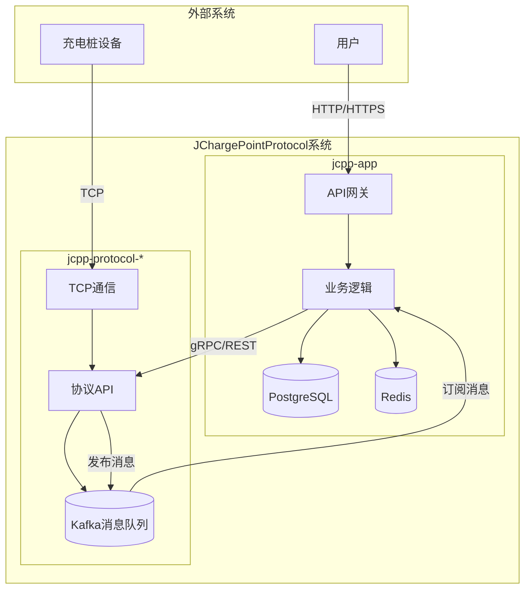
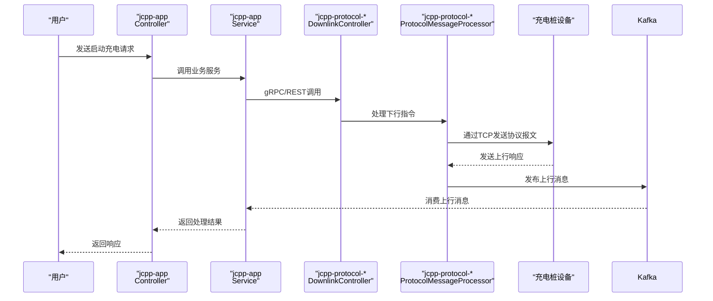

# 架构设计

<cite>
**本文档引用的文件**   
- [jcpp-app-bootstrap/src/main/java/sanbing/jcpp/JCPPServerApplication.java](file://jcpp-app-bootstrap/src/main/java/sanbing/jcpp/JCPPServerApplication.java)
- [jcpp-protocol-bootstrap/src/main/java/sanbing/jcpp/protocol/JCPPProtocolServiceApplication.java](file://jcpp-protocol-bootstrap/src/main/java/sanbing/jcpp/protocol/JCPPProtocolServiceApplication.java)
- [jcpp-app/src/main/java/sanbing/jcpp/app/adapter/controller/BaseController.java](file://jcpp-app/src/main/java/sanbing/jcpp/app/adapter/controller/BaseController.java)
- [jcpp-app/src/main/java/sanbing/jcpp/app/adapter/controller/PileController.java](file://jcpp-app/src/main/java/sanbing/jcpp/app/adapter/controller/PileController.java)
- [jcpp-app/src/main/java/sanbing/jcpp/app/adapter/controller/ProtocolController.java](file://jcpp-app/src/main/java/sanbing/jcpp/app/adapter/controller/ProtocolController.java)
- [jcpp-app/src/main/java/sanbing/jcpp/app/adapter/controller/RpcController.java](file://jcpp-app/src/main/java/sanbing/jcpp/app/adapter/controller/RpcController.java)
- [jcpp-protocol-api/src/main/java/sanbing/jcpp/protocol/ProtocolMessageProcessor.java](file://jcpp-protocol-api/src/main/java/sanbing/jcpp/protocol/ProtocolMessageProcessor.java)
- [jcpp-protocol-api/src/main/java/sanbing/jcpp/protocol/adapter/DownlinkController.java](file://jcpp-protocol-api/src/main/java/sanbing/jcpp/protocol/adapter/DownlinkController.java)
- [jcpp-infrastructure-queue/src/main/java/sanbing/jcpp/infrastructure/queue/kafka/KafkaProducerTemplate.java](file://jcpp-infrastructure-queue/src/main/java/sanbing/jcpp/infrastructure/queue/kafka/KafkaProducerTemplate.java)
- [jcpp-infrastructure-cache/src/main/java/sanbing/jcpp/infrastructure/cache/JCPPRedisCacheConfiguration.java](file://jcpp-infrastructure-cache/src/main/java/sanbing/jcpp/infrastructure/cache/JCPPRedisCacheConfiguration.java)
- [jcpp-app/src/main/java/sanbing/jcpp/app/service/impl/GrpcDownlinkCallService.java](file://jcpp-app/src/main/java/sanbing/jcpp/app/service/impl/GrpcDownlinkCallService.java)
- [jcpp-app/src/main/java/sanbing/jcpp/app/service/impl/RestDownlinkCallService.java](file://jcpp-app/src/main/java/sanbing/jcpp/app/service/impl/RestDownlinkCallService.java)
- [jcpp-app/src/main/java/sanbing/jcpp/app/dal/repository/PileRepository.java](file://jcpp-app/src/main/java/sanbing/jcpp/app/dal/repository/PileRepository.java)
</cite>

## 目录

1. [简介](#简介)
2. [微服务架构划分](#微服务架构划分)
3. [六边形架构实现](#六边形架构实现)
4. [数据流分析](#数据流分析)
5. [系统上下文图](#系统上下文图)
6. [组件交互图](#组件交互图)
7. [架构决策与权衡](#架构决策与权衡)
8. [结论](#结论)

## 简介

JChargePointProtocol
是一个高性能、分布式、支持海量并发量的充电桩服务端系统，旨在为充电应用提供基础能力。该系统采用微服务架构设计，支持多种充电桩协议（如云快充、绿能等），并通过清晰的职责划分和现代化的技术栈实现高可扩展性和可维护性。本文档详细描述了系统的架构设计，包括微服务划分、六边形架构的实现、数据流处理以及关键的架构决策。

**本节不涉及具体源文件分析，因此无来源信息**

## 微服务架构划分

JChargePointProtocol 系统主要划分为两个核心微服务域：`jcpp-app` 和 `jcpp-protocol-*`，每个服务域都有明确的职责边界。

`jcpp-app` 服务作为业务逻辑与API网关的核心，负责处理所有与业务相关的操作。它暴露RESTful
API接口供前端应用和其他外部系统调用，处理用户认证、权限控制、业务规则验证等横切关注点。该服务还负责与数据库进行交互，执行数据的持久化和查询操作，并通过缓存机制提升系统性能。从架构角度看，
`jcpp-app` 是系统的业务中枢，协调各个业务实体（如充电桩、枪口、站点等）的状态和行为。

`jcpp-protocol-*` 服务域则专注于协议处理的核心功能，包括 `jcpp-protocol-api`、`jcpp-protocol-yunkuaichong`、
`jcpp-protocol-lvneng`
等模块。这些服务负责处理与充电桩设备的底层通信，解析和生成特定协议格式的报文。它们通过TCP长连接与设备保持通信，处理上行数据的解码和下行指令的编码。这种分离使得协议相关的复杂性被封装在独立的服务中，便于针对不同协议进行独立开发、测试和部署。

这种架构划分实现了关注点分离的原则：`jcpp-app` 专注于业务领域逻辑，而 `jcpp-protocol-*`
专注于通信协议细节。两者通过定义良好的接口（如Kafka消息队列和gRPC调用）进行通信，降低了系统耦合度，提高了可维护性和可扩展性。

**本节不涉及具体源文件分析，因此无来源信息**

## 六边形架构实现

JChargePointProtocol 系统在代码层面体现了六边形架构（端口与适配器）的设计思想，将核心业务逻辑与外部系统依赖进行解耦。

在该架构中，**控制器（Controller）作为输入适配器**，负责将外部请求适配到内部业务逻辑。例如，`PileController` 类（位于
`jcpp-app`
模块）作为充电桩管理的输入适配器，接收HTTP请求，将其转换为内部服务方法调用。它处理请求参数的验证、异常的统一处理，并将内部服务的响应转换为HTTP响应格式。这种设计使得核心业务逻辑不受HTTP协议和框架的约束，可以轻松替换或扩展不同的输入方式（如gRPC、消息队列等）。

**仓库（Repository）作为输出适配器**，负责将内部业务逻辑与数据存储系统进行解耦。例如，`PileRepository`
接口定义了访问充电桩数据的契约，而具体的实现类（如 `PileRepositoryImpl`
）则负责与MyBatis框架和PostgreSQL数据库进行交互。此外，系统还通过多级缓存（Caffeine本地缓存和Redis分布式缓存）作为另一种输出适配器，
`AttributeRedisCache` 和 `PileCaffeineCache` 等类实现了对缓存系统的访问。这种分层设计使得核心业务逻辑无需关心数据存储的具体实现，可以在不影响业务逻辑的情况下更换数据库或缓存方案。

六边形架构的核心在于将业务逻辑置于中心，所有外部依赖都通过适配器与之交互。这种设计极大地提高了代码的可测试性，因为核心业务逻辑可以在不依赖数据库、网络等外部资源的情况下进行单元测试。同时，它也增强了系统的灵活性，使得系统能够更容易地适应变化，例如支持新的通信协议或更换消息中间件。

**Section sources**

- [jcpp-app/src/main/java/sanbing/jcpp/app/adapter/controller/BaseController.java](file://jcpp-app/src/main/java/sanbing/jcpp/app/adapter/controller/BaseController.java#L1-L117)
- [jcpp-app/src/main/java/sanbing/jcpp/app/adapter/controller/PileController.java](file://jcpp-app/src/main/java/sanbing/jcpp/app/adapter/controller/PileController.java#L1-L112)
- [jcpp-app/src/main/java/sanbing/jcpp/app/dal/repository/PileRepository.java](file://jcpp-app/src/main/java/sanbing/jcpp/app/dal/repository/PileRepository.java#L1-L17)

## 数据流分析

JChargePointProtocol 系统的数据流设计清晰地分离了上行（uplink）和下行（downlink）两个方向，确保了数据处理的高效性和可靠性。

### 上行数据流（Uplink）

上行数据流始于充电桩设备通过TCP连接发送原始报文。`jcpp-protocol-*` 服务中的 `TcpListener` 组件接收这些字节流，并通过
`TcpMsgDecoder` 进行解码，将其转换为结构化的 `ProtocolUplinkMsg` 对象。随后，`ProtocolMessageProcessor` 的
`uplinkHandleAsync` 方法被调用，该方法在独立的线程池中异步处理上行消息，以避免阻塞IO线程。处理后的业务数据通过Kafka消息队列发布，
`jcpp-app` 服务中的 `ProtocolUplinkConsumerService` 作为消费者订阅这些消息，进行业务逻辑处理（如状态更新、计费计算等），最终将结果持久化到PostgreSQL数据库中。

### 下行数据流（Downlink）

下行数据流始于 `jcpp-app` 服务中的业务操作，例如用户通过API请求启动充电。`RpcController` 接收该请求，调用
`PileProtocolService` 服务。该服务通过内部调用决定使用gRPC还是REST方式与 `jcpp-protocol-*` 服务通信。如果使用gRPC，则
`GrpcDownlinkCallService` 被调用，通过 `DownlinkGrpcClient` 发送 `DownlinkRequestMessage`；如果使用REST，则
`RestDownlinkCallService` 通过 `RestTemplate` 发送HTTP请求到 `DownlinkController`。`jcpp-protocol-*` 服务接收到下行指令后，
`ProtocolMessageProcessor` 的 `doDownlinkHandle` 方法将其编码为特定协议的字节流，并通过TCP通道发送到目标充电桩设备。

这种基于消息队列和RPC调用的异步通信模式，不仅解耦了业务处理和协议处理，还提供了良好的可伸缩性和容错能力。Kafka作为消息中间件，保证了上行消息的可靠传递和顺序性。

**Section sources**

- [jcpp-protocol-api/src/main/java/sanbing/jcpp/protocol/ProtocolMessageProcessor.java](file://jcpp-protocol-api/src/main/java/sanbing/jcpp/protocol/ProtocolMessageProcessor.java#L1-L78)
- [jcpp-app/src/main/java/sanbing/jcpp/app/adapter/controller/RpcController.java](file://jcpp-app/src/main/java/sanbing/jcpp/app/adapter/controller/RpcController.java#L1-L197)
- [jcpp-app/src/main/java/sanbing/jcpp/app/service/impl/GrpcDownlinkCallService.java](file://jcpp-app/src/main/java/sanbing/jcpp/app/service/impl/GrpcDownlinkCallService.java#L1-L51)
- [jcpp-app/src/main/java/sanbing/jcpp/app/service/impl/RestDownlinkCallService.java](file://jcpp-app/src/main/java/sanbing/jcpp/app/service/impl/RestDownlinkCallService.java#L1-L64)

## 系统上下文图

**Diagram sources**

- [jcpp-app-bootstrap/src/main/java/sanbing/jcpp/JCPPServerApplication.java](file://jcpp-app-bootstrap/src/main/java/sanbing/jcpp/JCPPServerApplication.java#L1-L55)
- [jcpp-protocol-bootstrap/src/main/java/sanbing/jcpp/protocol/JCPPProtocolServiceApplication.java](file://jcpp-protocol-bootstrap/src/main/java/sanbing/jcpp/protocol/JCPPProtocolServiceApplication.java#L1-L59)

## 组件交互图

**Diagram sources**

- [jcpp-app/src/main/java/sanbing/jcpp/app/adapter/controller/RpcController.java](file://jcpp-app/src/main/java/sanbing/jcpp/app/adapter/controller/RpcController.java#L1-L197)
- [jcpp-protocol-api/src/main/java/sanbing/jcpp/protocol/adapter/DownlinkController.java](file://jcpp-protocol-api/src/main/java/sanbing/jcpp/protocol/adapter/DownlinkController.java#L1-L76)
- [jcpp-protocol-api/src/main/java/sanbing/jcpp/protocol/ProtocolMessageProcessor.java](file://jcpp-protocol-api/src/main/java/sanbing/jcpp/protocol/ProtocolMessageProcessor.java#L1-L78)

## 架构决策与权衡

JChargePointProtocol 系统在架构设计上做出了一系列关键决策，这些决策背后体现了对性能、可靠性、可维护性和可扩展性的权衡。

### 选择Kafka而非RabbitMQ

系统选择Kafka作为消息中间件，主要基于其在高吞吐量和持久化方面的优势。充电桩系统需要处理海量的上行数据（如实时状态、充电记录等），Kafka的分布式架构和分区机制能够轻松应对每秒数万条消息的吞吐量需求。其基于日志的存储模型提供了强大的消息持久化能力，确保即使在消费者处理失败的情况下，消息也不会丢失。相比之下，RabbitMQ虽然在消息路由和灵活性上更胜一筹，但在处理大规模、高频率的流式数据时，其性能和扩展性可能成为瓶颈。Kafka的“发布-订阅”模型也更符合本系统中“一个上行消息可能被多个下游服务消费”的场景。

### 多级缓存策略

系统采用了多级缓存策略（Caffeine +
Redis）来平衡性能和一致性。Caffeine作为本地缓存，提供了极低的访问延迟（纳秒级），用于缓存高频访问且不常变更的数据（如充电桩配置）。Redis作为分布式缓存，解决了多实例部署下的数据共享问题。当本地缓存未命中时，系统会查询Redis。这种设计显著减少了对数据库的直接访问，提升了系统整体性能。然而，这也引入了缓存一致性挑战。系统通过事件驱动的方式（如
`AttributeCacheEvictEvent`）来处理缓存失效，当数据在数据库中被更新时，会发布缓存清除事件，通知所有节点清除本地缓存，从而在一定程度上保证了数据的一致性。这种权衡是在极致性能和强一致性之间找到的平衡点。

### gRPC与REST的并存

系统同时支持gRPC和REST两种服务间通信方式，通过配置项 `service.downlink.rpc.type`
进行动态切换。这为系统部署提供了灵活性：在对性能要求极高的内部网络中，可以选择高效的二进制协议gRPC；而在需要与外部系统集成或调试时，可以选择更通用的RESTful
API。这种设计虽然增加了实现的复杂性（需要维护两套客户端），但极大地提升了系统的适应性和可集成性。

**本节不涉及具体源文件分析，因此无来源信息**

## 结论

JChargePointProtocol 系统通过清晰的微服务划分、六边形架构的实践、高效的数据流设计以及深思熟虑的架构决策，构建了一个高性能、高可扩展且易于维护的充电桩服务端平台。
`jcpp-app` 和 `jcpp-protocol-*`
服务域的职责分离，确保了业务逻辑与协议细节的解耦。六边形架构的实现使得核心业务逻辑独立于外部框架和依赖。基于Kafka的消息队列和多级缓存策略有效解决了海量数据处理和性能瓶颈问题。整体架构设计充分考虑了实际业务场景的需求，在性能、可靠性、可维护性之间取得了良好的平衡，为支持更多充电桩协议和更大规模的部署奠定了坚实的基础。

**本节不涉及具体源文件分析，因此无来源信息**