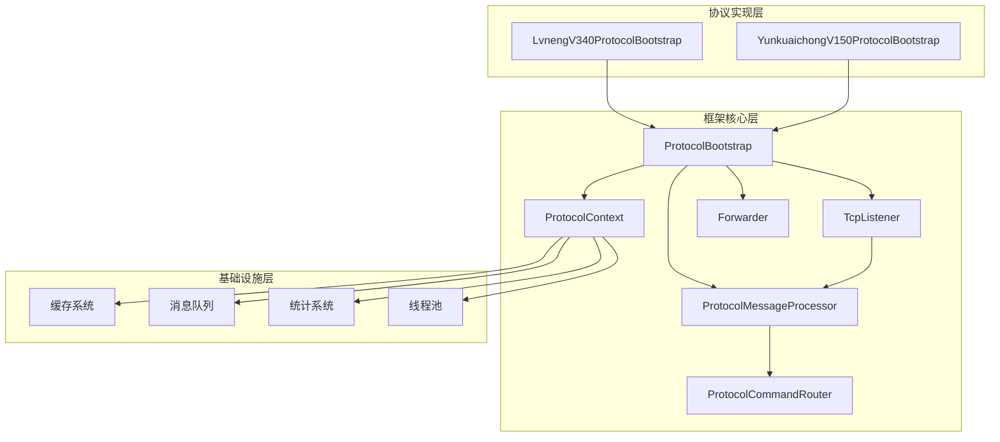
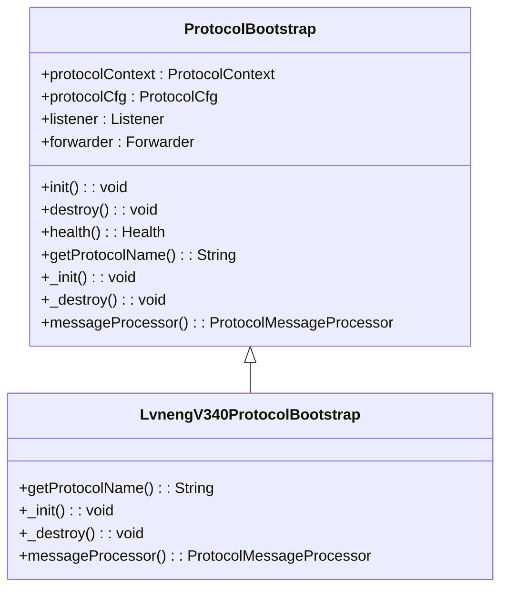
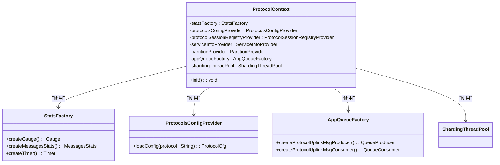
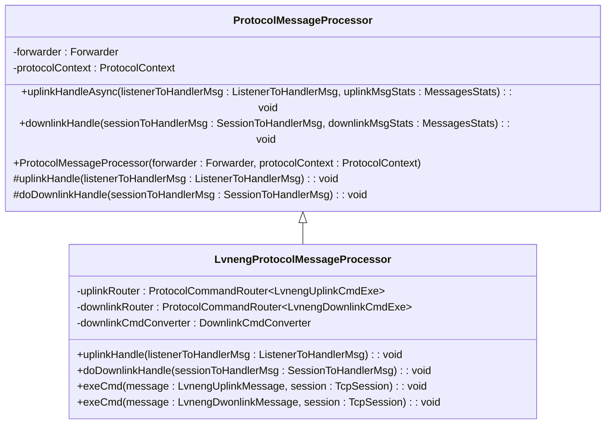
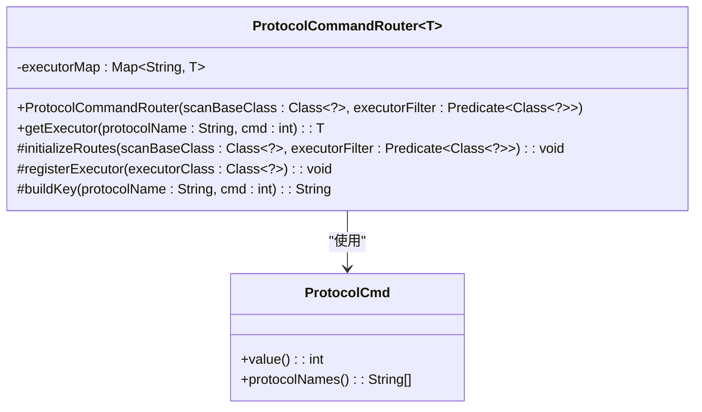
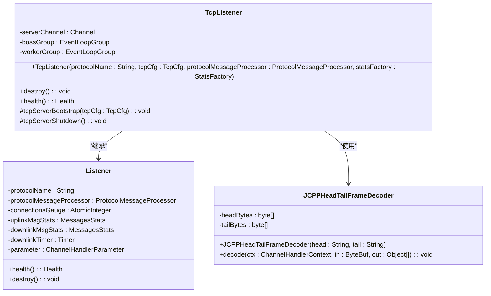
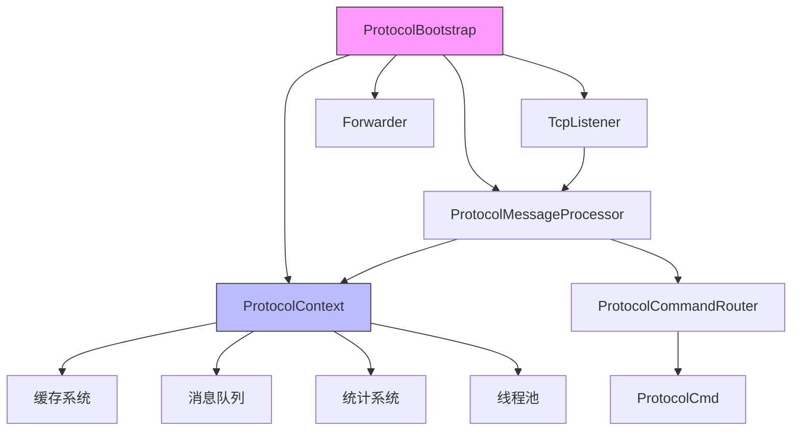

# 协议处理框架

<cite>
**本文档引用的文件**
- [ProtocolBootstrap.java](file://jcpp-protocol-api/src/main/java/sanbing/jcpp/protocol/ProtocolBootstrap.java)
- [ProtocolContext.java](file://jcpp-protocol-api/src/main/java/sanbing/jcpp/protocol/ProtocolContext.java)
- [ProtocolMessageProcessor.java](file://jcpp-protocol-api/src/main/java/sanbing/jcpp/protocol/ProtocolMessageProcessor.java)
- [ProtocolCommandRouter.java](file://jcpp-protocol-api/src/main/java/sanbing/jcpp/protocol/routing/ProtocolCommandRouter.java)
- [TcpListener.java](file://jcpp-protocol-api/src/main/java/sanbing/jcpp/protocol/listener/tcp/TcpListener.java)
- [JCPPHeadTailFrameDecoder.java](file://jcpp-protocol-api/src/main/java/sanbing/jcpp/protocol/listener/tcp/decoder/JCPPHeadTailFrameDecoder.java)
- [LvnengProtocolMessageProcessor.java](file://jcpp-protocol-lvneng/src/main/java/sanbing/jcpp/protocol/lvneng/LvnengProtocolMessageProcessor.java)
- [ProtocolCfg.java](file://jcpp-protocol-api/src/main/java/sanbing/jcpp/protocol/cfg/ProtocolCfg.java)
- [MemoryForwarder.java](file://jcpp-protocol-api/src/main/java/sanbing/jcpp/protocol/forwarder/MemoryForwarder.java)
- [Listener.java](file://jcpp-protocol-api/src/main/java/sanbing/jcpp/protocol/listener/Listener.java)
- [TcpCfg.java](file://jcpp-protocol-api/src/main/java/sanbing/jcpp/protocol/cfg/TcpCfg.java)
- [ProtocolsConfigProvider.java](file://jcpp-protocol-api/src/main/java/sanbing/jcpp/protocol/provider/ProtocolsConfigProvider.java)
</cite>

## 目录

1. [引言](#引言)
2. [核心组件](#核心组件)
3. [架构概述](#架构概述)
4. [详细组件分析](#详细组件分析)
5. [依赖分析](#依赖分析)
6. [性能考虑](#性能考虑)
7. [故障排除指南](#故障排除指南)
8. [结论](#结论)

## 引言

JChargePointProtocol协议处理框架是一个高度可扩展的通信协议处理系统，专为处理充电桩与服务器之间的通信而设计。该框架采用模块化设计，支持多种通信协议（如绿能、云快充等），并提供了完整的生命周期管理、消息处理、路由和基础设施集成能力。本架构文档将深入分析框架的核心组件，包括协议生命周期管理、依赖注入容器、消息处理流程、TCP连接处理等关键方面。

## 核心组件

JChargePointProtocol框架的核心组件包括ProtocolBootstrap抽象类、ProtocolContext依赖注入容器、ProtocolMessageProcessor消息处理器、ProtocolCommandRouter命令路由器和TcpListener
TCP监听器。这些组件协同工作，为各种充电桩通信协议提供统一的处理框架。ProtocolBootstrap定义了协议的初始化和销毁生命周期，ProtocolContext作为依赖注入容器整合了缓存、队列、gRPC客户端等基础设施组件，ProtocolMessageProcessor负责消息的处理流程，ProtocolCommandRouter实现上行和下行指令的路由，而TcpListener则处理TCP长连接和消息帧的解码。

**本节来源**

- [ProtocolBootstrap.java](file://jcpp-protocol-api/src/main/java/sanbing/jcpp/protocol/ProtocolBootstrap.java)
- [ProtocolContext.java](file://jcpp-protocol-api/src/main/java/sanbing/jcpp/protocol/ProtocolContext.java)
- [ProtocolMessageProcessor.java](file://jcpp-protocol-api/src/main/java/sanbing/jcpp/protocol/ProtocolMessageProcessor.java)
- [ProtocolCommandRouter.java](file://jcpp-protocol-api/src/main/java/sanbing/jcpp/protocol/routing/ProtocolCommandRouter.java)
- [TcpListener.java](file://jcpp-protocol-api/src/main/java/sanbing/jcpp/protocol/listener/tcp/TcpListener.java)

## 架构概述

JChargePointProtocol框架采用分层架构设计，各组件之间通过清晰的接口进行交互，实现了高内聚低耦合的设计目标。框架的核心是ProtocolBootstrap抽象类，它定义了协议的生命周期管理。ProtocolContext作为依赖注入容器，为整个框架提供所需的基础设施组件。消息处理流程由ProtocolMessageProcessor负责，通过ProtocolCommandRouter实现命令的路由。TCP通信由TcpListener处理，包括连接管理和消息帧解码。

**图示来源**

- [ProtocolBootstrap.java](file://jcpp-protocol-api/src/main/java/sanbing/jcpp/protocol/ProtocolBootstrap.java)
- [ProtocolContext.java](file://jcpp-protocol-api/src/main/java/sanbing/jcpp/protocol/ProtocolContext.java)
- [ProtocolMessageProcessor.java](file://jcpp-protocol-api/src/main/java/sanbing/jcpp/protocol/ProtocolMessageProcessor.java)
- [ProtocolCommandRouter.java](file://jcpp-protocol-api/src/main/java/sanbing/jcpp/protocol/routing/ProtocolCommandRouter.java)
- [TcpListener.java](file://jcpp-protocol-api/src/main/java/sanbing/jcpp/protocol/listener/tcp/TcpListener.java)

## 详细组件分析

### ProtocolBootstrap 生命周期管理

ProtocolBootstrap是所有协议实现的抽象基类，采用模板方法模式定义了协议的初始化和销毁生命周期。该类通过Spring的@PostConstruct和@PreDestroy注解定义了init和destroy方法，实现了协议服务的标准化生命周期管理。

**图示来源**

- [ProtocolBootstrap.java](file://jcpp-protocol-api/src/main/java/sanbing/jcpp/protocol/ProtocolBootstrap.java)

#### 模板方法模式应用

ProtocolBootstrap采用了模板方法设计模式，其中init和destroy方法为模板方法，定义了协议初始化和销毁的标准流程。这些方法调用抽象方法_getProtocolName、_
init、_destroy和_messageProcessor，由具体的协议实现类提供具体实现。这种设计模式确保了所有协议实现都遵循相同的生命周期管理流程，同时允许各协议根据自身需求定制具体行为。

在init方法中，框架首先加载协议配置，然后根据配置创建相应的转发器（Forwarder），最后初始化监听器（Listener）。destroy方法则负责优雅地关闭监听器和转发器。health方法提供了健康检查功能，监控监听器和转发器的状态。

**本节来源**

- [ProtocolBootstrap.java](file://jcpp-protocol-api/src/main/java/sanbing/jcpp/protocol/ProtocolBootstrap.java)

### ProtocolContext 依赖注入容器

ProtocolContext是框架的核心依赖注入容器，负责整合和管理各种基础设施组件。它通过构造函数注入的方式，将统计工厂、协议配置提供器、会话注册表提供器、服务信息提供器、分区提供器、队列工厂和分片线程池等组件注入到容器中。

**图示来源**

- [ProtocolContext.java](file://jcpp-protocol-api/src/main/java/sanbing/jcpp/protocol/ProtocolContext.java)

#### 基础设施组件整合

ProtocolContext整合了多个关键基础设施组件：

- **StatsFactory**：提供统计功能，用于监控消息处理、连接状态等指标
- **ProtocolsConfigProvider**：提供协议配置加载功能，支持动态配置管理
- **AppQueueFactory**：创建消息队列的生产者和消费者，支持Kafka和内存队列
- **ShardingThreadPool**：提供分片线程池，确保消息处理的顺序性和性能
- **ServiceInfoProvider**：提供服务发现和分区信息，支持分布式部署

这些组件通过ProtocolContext统一管理，为协议实现提供了丰富的基础设施支持，使协议开发者可以专注于业务逻辑的实现，而不必关心底层基础设施的细节。

**本节来源**

- [ProtocolContext.java](file://jcpp-protocol-api/src/main/java/sanbing/jcpp/protocol/ProtocolContext.java)

### ProtocolMessageProcessor 消息处理流程

ProtocolMessageProcessor是框架的消息处理核心，负责处理上行和下行消息。它采用抽象类设计，定义了消息处理的基本流程和异常处理机制，具体的协议实现需要继承此类并实现具体的处理逻辑。

**图示来源**

- [ProtocolMessageProcessor.java](file://jcpp-protocol-api/src/main/java/sanbing/jcpp/protocol/ProtocolMessageProcessor.java)
- [LvnengProtocolMessageProcessor.java](file://jcpp-protocol-lvneng/src/main/java/sanbing/jcpp/protocol/lvneng/LvnengProtocolMessageProcessor.java)

#### 上行消息处理流程

上行消息处理流程从TcpListener接收到原始字节数据开始，经过解码器处理后，由ProtocolMessageProcessor的uplinkHandleAsync方法异步处理。该方法使用分片线程池执行消息处理，确保同一会话的消息按顺序处理。

处理流程包括：

1. 从ListenerToHandlerMsg中提取会话、消息ID和原始数据
2. 调用协议特定的uplinkHandle方法进行消息解析
3. 通过ProtocolCommandRouter路由到相应的命令执行器
4. 执行具体的业务逻辑
5. 将处理结果通过Forwarder转发到消息队列

在LvnengProtocolMessageProcessor的具体实现中，上行消息处理还包括帧头解析、长度校验、校验和验证等步骤，确保消息的完整性和正确性。

**本节来源**

- [ProtocolMessageProcessor.java](file://jcpp-protocol-api/src/main/java/sanbing/jcpp/protocol/ProtocolMessageProcessor.java)
- [LvnengProtocolMessageProcessor.java](file://jcpp-protocol-lvneng/src/main/java/sanbing/jcpp/protocol/lvneng/LvnengProtocolMessageProcessor.java)

#### 下行消息处理流程

下行消息处理流程由ProtocolMessageProcessor的downlinkHandle方法负责，该方法提供统一的异常处理和日志记录。具体的处理逻辑由doDownlinkHandle抽象方法定义，由协议实现类提供具体实现。

处理流程包括：

1. 从SessionToHandlerMsg中提取下行请求和会话信息
2. 通过DownlinkCmdConverter将通用命令转换为协议特定的命令字
3. 通过ProtocolCommandRouter路由到相应的命令执行器
4. 执行具体的业务逻辑
5. 将生成的协议消息发送到客户端

下行消息处理采用同步方式，确保调用方能够及时获取处理结果或异常信息。框架提供了完善的异常处理机制，捕获并记录处理过程中的任何异常，同时通过统计系统记录失败消息的数量。

**本节来源**

- [ProtocolMessageProcessor.java](file://jcpp-protocol-api/src/main/java/sanbing/jcpp/protocol/ProtocolMessageProcessor.java)
- [LvnengProtocolMessageProcessor.java](file://jcpp-protocol-lvneng/src/main/java/sanbing/jcpp/protocol/lvneng/LvnengProtocolMessageProcessor.java)

### ProtocolCommandRouter 命令路由

ProtocolCommandRouter是框架的命令路由核心，负责将上行和下行指令路由到相应的命令执行器。它采用基于协议名和命令字的路由策略，支持多版本协议的共存。

**图示来源**

- [ProtocolCommandRouter.java](file://jcpp-protocol-api/src/main/java/sanbing/jcpp/protocol/routing/ProtocolCommandRouter.java)
- [ProtocolCmd.java](file://jcpp-protocol-api/src/main/java/sanbing/jcpp/protocol/annotation/ProtocolCmd.java)

#### 上行和下行指令路由

ProtocolCommandRouter通过扫描带有@ProtocolCmd注解的类来初始化路由表。每个命令执行器类都必须使用@ProtocolCmd注解，指定命令字值和支持的协议名列表。

在LvnengProtocolMessageProcessor中，创建了两个ProtocolCommandRouter实例：

- uplinkRouter：用于路由上行指令，扫描LvnengUplinkCmdExe类型的类
- downlinkRouter：用于路由下行指令，扫描LvnengDownlinkCmdExe类型的类

当接收到消息时，框架根据协议名和命令字构建路由键（protocolName:
cmd），在executorMap中查找对应的命令执行器。如果找到，则调用执行器的execute方法处理消息；如果未找到，则记录警告日志。

这种路由机制具有良好的扩展性，新增协议命令只需添加相应的命令执行器类并使用@ProtocolCmd注解即可，无需修改路由代码。

**本节来源**

- [ProtocolCommandRouter.java](file://jcpp-protocol-api/src/main/java/sanbing/jcpp/protocol/routing/ProtocolCommandRouter.java)
- [LvnengProtocolMessageProcessor.java](file://jcpp-protocol-lvneng/src/main/java/sanbing/jcpp/protocol/lvneng/LvnengProtocolMessageProcessor.java)

### TcpListener TCP连接处理

TcpListener负责处理TCP长连接和消息帧的解码，基于Netty框架实现高性能的网络通信。它管理服务器引导、事件循环组和通道初始化，确保稳定可靠的TCP连接。

**图示来源**

- [TcpListener.java](file://jcpp-protocol-api/src/main/java/sanbing/jcpp/protocol/listener/tcp/TcpListener.java)
- [Listener.java](file://jcpp-protocol-api/src/main/java/sanbing/jcpp/protocol/listener/Listener.java)
- [JCPPHeadTailFrameDecoder.java](file://jcpp-protocol-api/src/main/java/sanbing/jcpp/protocol/listener/tcp/decoder/JCPPHeadTailFrameDecoder.java)

#### 消息帧解码

JCPPHeadTailFrameDecoder是基于起始域和结束域的拆包解码器，负责将TCP流中的原始字节数据分割成完整的消息帧。解码器使用十六进制字符串配置的起始域和结束域来识别消息边界。

解码流程包括：

1. 检查可读字节长度是否足够（至少包含起始域和结束域）
2. 读取前n个字节与起始域进行比较
3. 如果不匹配，丢弃一个字节并继续
4. 如果匹配，查找结束域的位置
5. 提取起始域和结束域之间的完整消息帧

这种解码方式适用于基于特定起始和结束标记的协议，如绿能协议。解码器还提供了详细的日志记录，便于调试和问题排查。

**本节来源**

- [JCPPHeadTailFrameDecoder.java](file://jcpp-protocol-api/src/main/java/sanbing/jcpp/protocol/listener/tcp/decoder/JCPPHeadTailFrameDecoder.java)
- [TcpListener.java](file://jcpp-protocol-api/src/main/java/sanbing/jcpp/protocol/listener/tcp/TcpListener.java)

## 依赖分析

JChargePointProtocol框架的组件之间存在清晰的依赖关系，体现了高内聚低耦合的设计原则。ProtocolBootstrap作为顶层组件，依赖于ProtocolContext、ProtocolMessageProcessor、Listener和Forwarder。ProtocolContext作为依赖注入容器，为其他组件提供基础设施服务。

**图示来源**

- [ProtocolBootstrap.java](file://jcpp-protocol-api/src/main/java/sanbing/jcpp/protocol/ProtocolBootstrap.java)
- [ProtocolContext.java](file://jcpp-protocol-api/src/main/java/sanbing/jcpp/protocol/ProtocolContext.java)
- [ProtocolMessageProcessor.java](file://jcpp-protocol-api/src/main/java/sanbing/jcpp/protocol/ProtocolMessageProcessor.java)
- [ProtocolCommandRouter.java](file://jcpp-protocol-api/src/main/java/sanbing/jcpp/protocol/routing/ProtocolCommandRouter.java)
- [TcpListener.java](file://jcpp-protocol-api/src/main/java/sanbing/jcpp/protocol/listener/tcp/TcpListener.java)

#### 新协议启动流程

当启动一个新的协议实现时，各组件的协同工作流程如下：

1. Spring容器创建ProtocolBootstrap的子类实例
2. 调用@PostConstruct注解的init方法
3. 从ProtocolContext获取协议配置
4. 根据配置创建Forwarder实例（Kafka或内存）
5. 创建TcpListener实例，启动TCP服务器
6. 调用子类实现的_init方法进行协议特定的初始化
7. 协议服务进入运行状态，开始处理消息

这个流程确保了所有协议实现都遵循相同的标准初始化过程，同时允许各协议根据需要进行定制化初始化。

**本节来源**

- [ProtocolBootstrap.java](file://jcpp-protocol-api/src/main/java/sanbing/jcpp/protocol/ProtocolBootstrap.java)
- [ProtocolContext.java](file://jcpp-protocol-api/src/main/java/sanbing/jcpp/protocol/ProtocolContext.java)

## 性能考虑

JChargePointProtocol框架在设计时充分考虑了性能因素，采用了多种优化策略：

- 使用Netty框架处理TCP通信，确保高并发下的性能表现
- 采用分片线程池处理消息，既保证了消息处理的顺序性，又充分利用了多核CPU的处理能力
- 通过ProtocolContext集中管理基础设施组件，减少资源重复创建和销毁的开销
- 使用高效的序列化和反序列化机制，减少消息处理的CPU消耗
- 提供详细的统计信息，便于性能监控和优化

框架还支持多种部署模式，包括单体部署和微服务部署，可以根据实际需求选择合适的部署方式以优化性能。

## 故障排除指南

当遇到协议处理框架的问题时，可以按照以下步骤进行排查：

1. 检查ProtocolBootstrap的健康状态，确认Listener和Forwarder是否正常
2. 查看日志文件，特别是ERROR和WARN级别的日志
3. 检查TCP连接状态，确认客户端是否能够正常连接
4. 验证消息帧格式，确保起始域、结束域和校验和正确
5. 检查命令路由，确认ProtocolCommandRouter是否能够正确找到命令执行器
6. 监控统计指标，分析消息处理的成功率和延迟

对于常见的连接问题，应检查防火墙设置、端口占用情况和网络配置。对于消息处理问题，应重点关注解码器的日志输出和命令执行器的实现逻辑。

**本节来源**

- [ProtocolBootstrap.java](file://jcpp-protocol-api/src/main/java/sanbing/jcpp/protocol/ProtocolBootstrap.java)
- [TcpListener.java](file://jcpp-protocol-api/src/main/java/sanbing/jcpp/protocol/listener/tcp/TcpListener.java)

## 结论

JChargePointProtocol协议处理框架通过精心设计的架构和组件，为充电桩通信协议的实现提供了强大而灵活的基础。框架采用模板方法模式确保协议生命周期管理的一致性，通过ProtocolContext实现依赖注入和基础设施整合，利用ProtocolCommandRouter提供灵活的命令路由机制。这些设计优势使得框架具有良好的可扩展性和松耦合性，能够轻松支持多种通信协议的实现和共存。

框架的设计充分考虑了实际应用场景的需求，包括高性能、高可用性、易于维护和扩展等方面。通过标准化的接口和清晰的职责划分，降低了协议实现的复杂度，使开发者能够专注于业务逻辑的实现。未来，框架可以进一步增强配置管理、监控告警和自动化测试等方面的能力，以满足更复杂的应用场景需求。