# 上行消息处理

<cite>
**本文档引用的文件**
- [YunKuaiChongProtocolMessageProcessor.java](file://jcpp-protocol-yunkuaichong/src/main/java/sanbing/jcpp/protocol/yunkuaichong/YunKuaiChongProtocolMessageProcessor.java)
- [ProtocolCmd.java](file://jcpp-protocol-api/src/main/java/sanbing/jcpp/protocol/annotation/ProtocolCmd.java)
- [ProtocolCommandRouter.java](file://jcpp-protocol-api/src/main/java/sanbing/jcpp/protocol/routing/ProtocolCommandRouter.java)
- [YunKuaiChongUplinkCmdExe.java](file://jcpp-protocol-yunkuaichong/src/main/java/sanbing/jcpp/protocol/yunkuaichong/YunKuaiChongUplinkCmdExe.java)
- [YunKuaiChongUplinkMessage.java](file://jcpp-protocol-yunkuaichong/src/main/java/sanbing/jcpp/protocol/yunkuaichong/YunKuaiChongUplinkMessage.java)
- [KafkaForwarder.java](file://jcpp-protocol-api/src/main/java/sanbing/jcpp/protocol/forwarder/KafkaForwarder.java)
- [YunKuaiChongV150HeartbeatULCmd.java](file://jcpp-protocol-yunkuaichong/src/main/java/sanbing/jcpp/protocol/yunkuaichong/v150/cmd/YunKuaiChongV150HeartbeatULCmd.java)
- [YunKuaiChongV150LoginULCmd.java](file://jcpp-protocol-yunkuaichong/src/main/java/sanbing/jcpp/protocol/yunkuaichong/v150/cmd/YunKuaiChongV150LoginULCmd.java)
- [YunKuaiChongV150StartChargeULCmd.java](file://jcpp-protocol-yunkuaichong/src/main/java/sanbing/jcpp/protocol/yunkuaichong/v150/cmd/YunKuaiChongV150StartChargeULCmd.java)
- [YunKuaiChongV150RealTimeDataULCmd.java](file://jcpp-protocol-yunkuaichong/src/main/java/sanbing/jcpp/protocol/yunkuaichong/v150/cmd/YunKuaiChongV150RealTimeDataULCmd.java)
- [YunKuaiChongV150TransactionRecordULCmd.java](file://jcpp-protocol-yunkuaichong/src/main/java/sanbing/jcpp/protocol/yunkuaichong/v150/cmd/YunKuaiChongV150TransactionRecordULCmd.java)
- [YunKuaiChongProtocolConstants.java](file://jcpp-protocol-yunkuaichong/src/main/java/sanbing/jcpp/protocol/yunkuaichong/YunKuaiChongProtocolConstants.java)
</cite>

## 目录

1. [概述](#概述)
2. [系统架构](#系统架构)
3. [消息处理流程](#消息处理流程)
4. [协议命令注解机制](#协议命令注解机制)
5. [关键上行命令详解](#关键上行命令详解)
6. [消息转发机制](#消息转发机制)
7. [数据持久化与状态管理](#数据持久化与状态管理)
8. [性能优化策略](#性能优化策略)
9. [总结](#总结)

## 概述

云快充协议上行消息处理系统是一个高度模块化的分布式消息处理框架，负责接收、解析、分发和处理来自充电桩的各种上行消息。该系统采用事件驱动架构，通过反射机制和命令路由模式实现灵活的消息处理。

核心特性包括：

- **高性能TCP监听**：基于Netty的异步I/O处理
- **智能协议解析**：支持多种协议版本的统一处理
- **反射命令路由**：基于注解的自动化命令分发
- **消息转发队列**：通过Kafka实现异步消息传递
- **状态管理**：实时更新充电桩状态和属性

## 系统架构

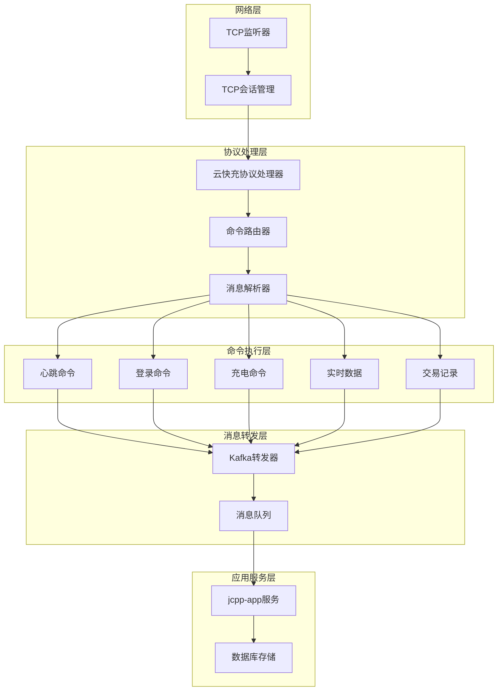

**图表来源**

- [YunKuaiChongProtocolMessageProcessor.java](file://jcpp-protocol-yunkuaichong/src/main/java/sanbing/jcpp/protocol/yunkuaichong/YunKuaiChongProtocolMessageProcessor.java#L27-L61)
- [ProtocolCommandRouter.java](file://jcpp-protocol-api/src/main/java/sanbing/jcpp/protocol/routing/ProtocolCommandRouter.java#L25-L40)

## 消息处理流程

### TCP监听器接收数据

系统从TcpListener接收到原始数据包开始，首先进行基本的完整性检查：

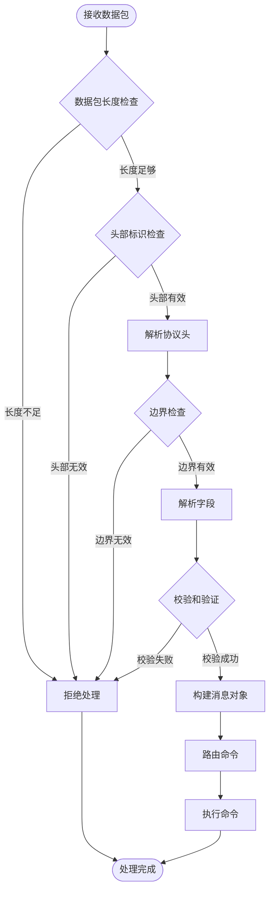

**图表来源**

- [YunKuaiChongProtocolMessageProcessor.java](file://jcpp-protocol-yunkuaichong/src/main/java/sanbing/jcpp/protocol/yunkuaichong/YunKuaiChongProtocolMessageProcessor.java#L63-L154)

### 消息解析与验证

协议处理器执行严格的验证流程：

1. **长度验证**：确保数据包包含最小长度（8字节）
2. **头部验证**：检查起始标识符（0x68）
3. **边界检查**：验证数据长度字段的合理性
4. **CRC校验**：双重校验和验证（小端和大端）

**章节来源**

- [YunKuaiChongProtocolMessageProcessor.java](file://jcpp-protocol-yunkuaichong/src/main/java/sanbing/jcpp/protocol/yunkuaichong/YunKuaiChongProtocolMessageProcessor.java#L63-L154)

### 命令路由与分发

解析完成后，消息通过命令路由器进行分发：

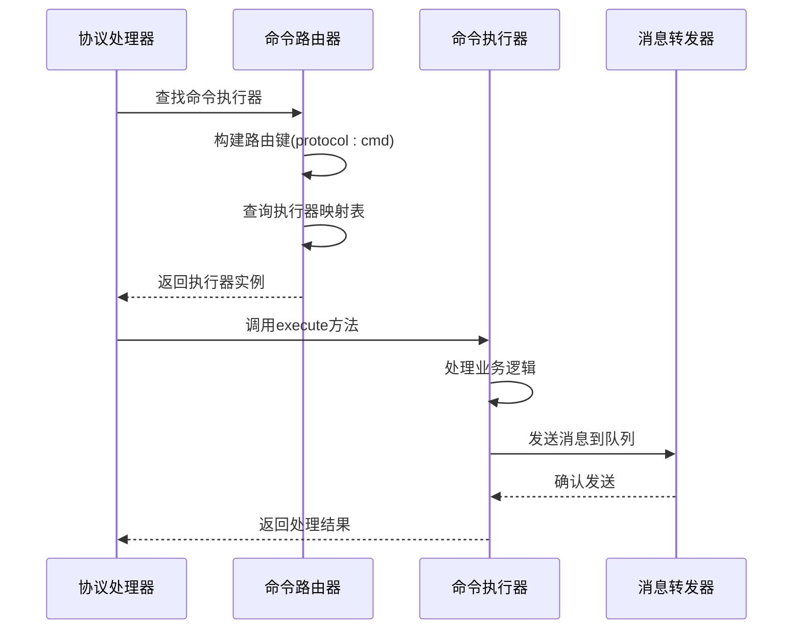

**图表来源**

- [YunKuaiChongProtocolMessageProcessor.java](file://jcpp-protocol-yunkuaichong/src/main/java/sanbing/jcpp/protocol/yunkuaichong/YunKuaiChongProtocolMessageProcessor.java#L170-L184)
- [ProtocolCommandRouter.java](file://jcpp-protocol-api/src/main/java/sanbing/jcpp/protocol/routing/ProtocolCommandRouter.java#L85-L95)

**章节来源**

- [YunKuaiChongProtocolMessageProcessor.java](file://jcpp-protocol-yunkuaichong/src/main/java/sanbing/jcpp/protocol/yunkuaichong/YunKuaiChongProtocolMessageProcessor.java#L170-L184)

## 协议命令注解机制

### @ProtocolCmd注解设计

系统采用基于注解的命令映射机制，通过`@ProtocolCmd`注解实现声明式命令注册：

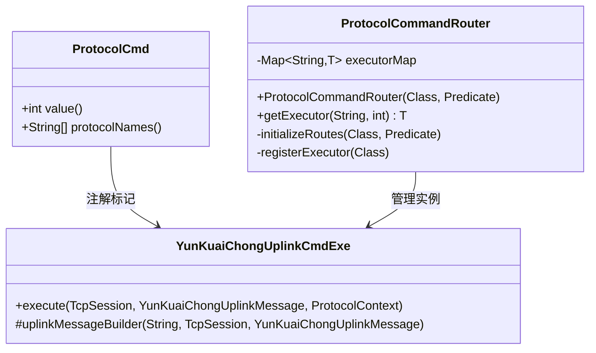

**图表来源**

- [ProtocolCmd.java](file://jcpp-protocol-api/src/main/java/sanbing/jcpp/protocol/annotation/ProtocolCmd.java#L20-L32)
- [ProtocolCommandRouter.java](file://jcpp-protocol-api/src/main/java/sanbing/jcpp/protocol/routing/ProtocolCommandRouter.java#L25-L40)

### 反射机制工作原理

命令路由器通过以下步骤实现反射机制：

1. **类扫描**：扫描指定包路径下带有`@ProtocolCmd`注解的类
2. **注解解析**：提取命令字和协议名称数组
3. **实例化**：动态创建命令执行器实例
4. **路由注册**：构建`protocol:cmd`键值对存储到映射表

**章节来源**

- [ProtocolCommandRouter.java](file://jcpp-protocol-api/src/main/java/sanbing/jcpp/protocol/routing/ProtocolCommandRouter.java#L42-L85)

### 多版本协议支持

系统通过协议名称数组支持多个协议版本的统一处理：

| 命令类型 | 协议版本           | 命令字  | 功能描述    |
|------|----------------|------|---------|
| 心跳命令 | V150/V160/V170 | 0x03 | 充电桩状态报告 |
| 登录命令 | V150/V160/V170 | 0x01 | 充电桩认证注册 |
| 充电启动 | V150/V160/V170 | 0x31 | 主动充电请求  |
| 实时数据 | V150/V160/V170 | 0x13 | 充电过程监控  |
| 交易记录 | V150/V160      | 0x3B | 充电完成记录  |

**章节来源**

- [YunKuaiChongProtocolConstants.java](file://jcpp-protocol-yunkuaichong/src/main/java/sanbing/jcpp/protocol/yunkuaichong/YunKuaiChongProtocolConstants.java#L25-L40)

## 关键上行命令详解

### 心跳包处理

心跳命令（0x03）负责维持连接状态和报告充电桩状态：

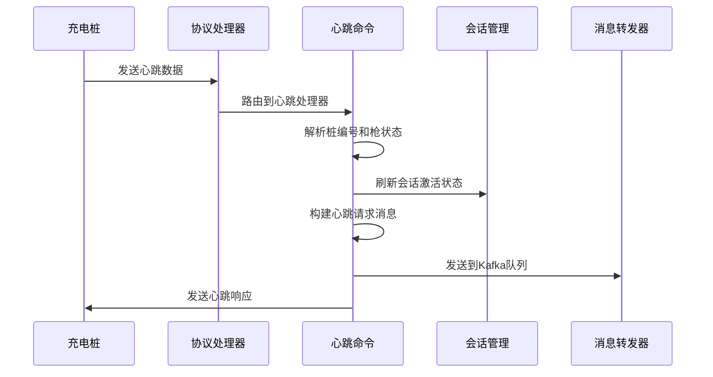

**图表来源**

- [YunKuaiChongV150HeartbeatULCmd.java](file://jcpp-protocol-yunkuaichong/src/main/java/sanbing/jcpp/protocol/yunkuaichong/v150/cmd/YunKuaiChongV150HeartbeatULCmd.java#L30-L84)

**业务逻辑特点**：

- **状态更新**：刷新会话激活时间
- **响应机制**：自动回复心跳确认
- **信息提取**：解析桩编号、枪号、状态等关键信息
- **转发处理**：将心跳信息发送到后端服务

**章节来源**

- [YunKuaiChongV150HeartbeatULCmd.java](file://jcpp-protocol-yunkuaichong/src/main/java/sanbing/jcpp/protocol/yunkuaichong/v150/cmd/YunKuaiChongV150HeartbeatULCmd.java#L30-L84)

### 登录请求处理

登录命令（0x01）负责充电桩的身份认证和会话建立：

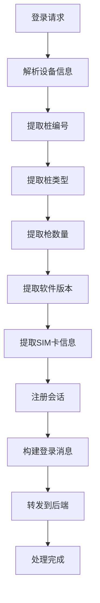

**图表来源**

- [YunKuaiChongV150LoginULCmd.java](file://jcpp-protocol-yunkuaichong/src/main/java/sanbing/jcpp/protocol/yunkuaichong/v150/cmd/YunKuaiChongV150LoginULCmd.java#L30-L84)

**认证流程**：

1. **身份验证**：通过桩编号验证设备合法性
2. **会话注册**：建立和维护设备会话状态
3. **信息收集**：收集设备硬件和软件信息
4. **后端通知**：通知应用服务新设备上线

**章节来源**

- [YunKuaiChongV150LoginULCmd.java](file://jcpp-protocol-yunkuaichong/src/main/java/sanbing/jcpp/protocol/yunkuaichong/v150/cmd/YunKuaiChongV150LoginULCmd.java#L30-L84)

### 启动充电处理

充电启动命令（0x31）处理充电桩主动发起的充电请求：

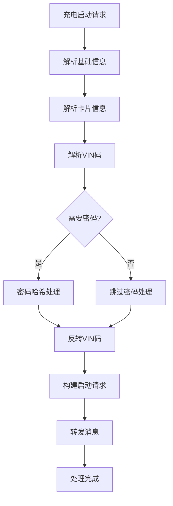

**图表来源**

- [YunKuaiChongV150StartChargeULCmd.java](file://jcpp-protocol-yunkuaichong/src/main/java/sanbing/jcpp/protocol/yunkuaichong/v150/cmd/YunKuaiChongV150StartChargeULCmd.java#L35-L124)

**处理要点**：

- **卡片验证**：处理物理卡片号和密码验证
- **VIN码处理**：特殊格式的VIN码反转处理
- **启动方式**：支持多种启动方式（APP、卡片、离线卡等）
- **安全机制**：密码MD5哈希处理

**章节来源**

- [YunKuaiChongV150StartChargeULCmd.java](file://jcpp-protocol-yunkuaichong/src/main/java/sanbing/jcpp/protocol/yunkuaichong/v150/cmd/YunKuaiChongV150StartChargeULCmd.java#L35-L124)

### 实时数据处理

实时数据命令（0x13）负责传输充电过程中的监控数据：

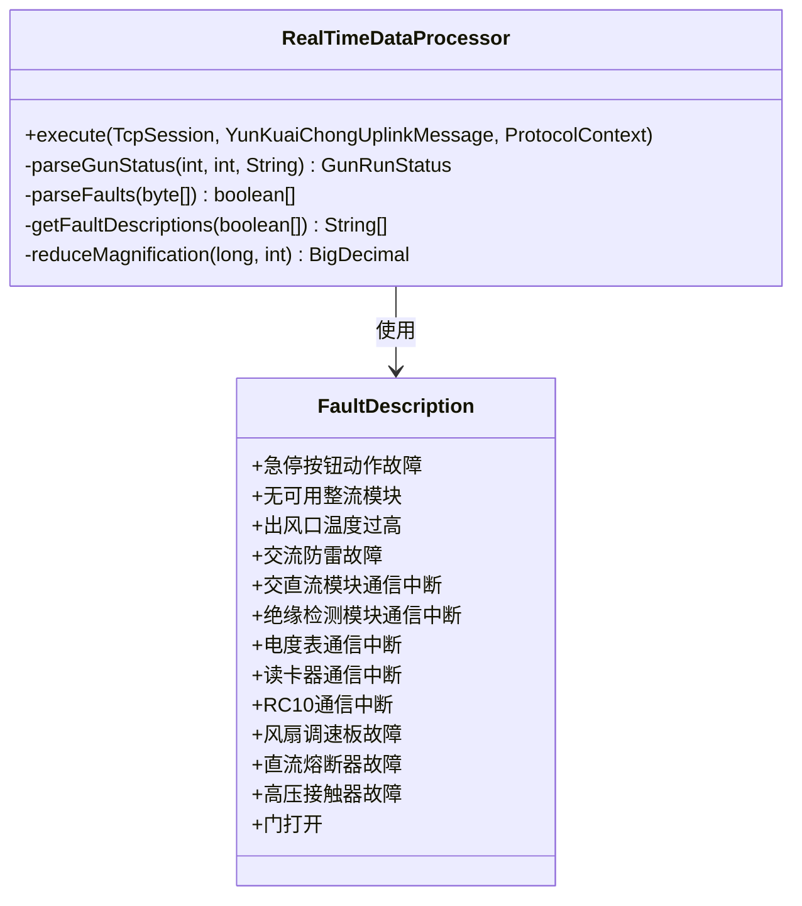

**图表来源**

- [YunKuaiChongV150RealTimeDataULCmd.java](file://jcpp-protocol-yunkuaichong/src/main/java/sanbing/jcpp/protocol/yunkuaichong/v150/cmd/YunKuaiChongV150RealTimeDataULCmd.java#L35-L239)

**数据处理能力**：

- **状态解析**：解析充电枪的各种运行状态
- **故障检测**：14种硬件故障的bit位解析
- **数值转换**：精密的数值放大倍率处理
- **多消息转发**：同时发送状态和进度消息

**章节来源**

- [YunKuaiChongV150RealTimeDataULCmd.java](file://jcpp-protocol-yunkuaichong/src/main/java/sanbing/jcpp/protocol/yunkuaichong/v150/cmd/YunKuaiChongV150RealTimeDataULCmd.java#L35-L239)

### 交易记录处理

交易记录命令（0x3B）处理充电完成后的结算信息：

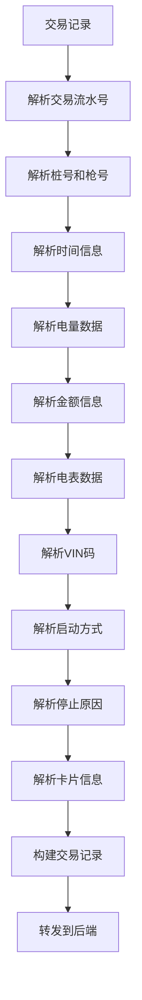

**图表来源**

- [YunKuaiChongV150TransactionRecordULCmd.java](file://jcpp-protocol-yunkuaichong/src/main/java/sanbing/jcpp/protocol/yunkuaichong/v150/cmd/YunKuaiChongV150TransactionRecordULCmd.java#L35-L305)

**结算信息完整性**：

- **分时电价**：支持尖峰平谷四种电价模式
- **电量统计**：精确到4位小数的电量计量
- **费用明细**：详细的电费和服务费计算
- **异常处理**：128种充电异常原因的完整映射

**章节来源**

- [YunKuaiChongV150TransactionRecordULCmd.java](file://jcpp-protocol-yunkuaichong/src/main/java/sanbing/jcpp/protocol/yunkuaichong/v150/cmd/YunKuaiChongV150TransactionRecordULCmd.java#L35-L305)

## 消息转发机制

### Kafka转发器架构

系统采用Kafka作为消息中间件，实现异步消息传递：

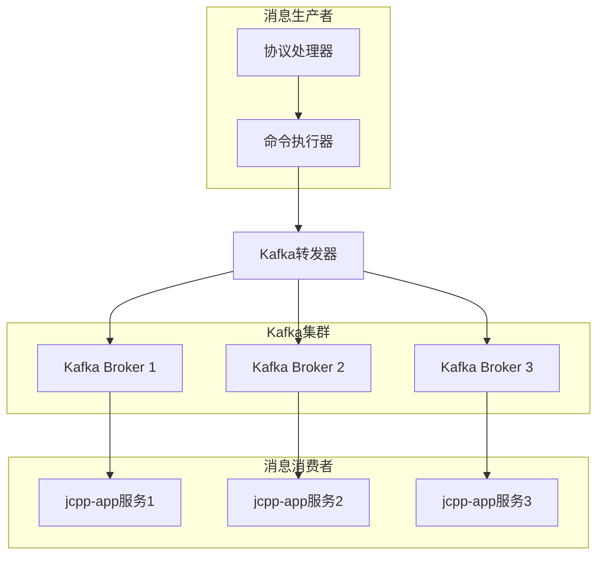

**图表来源**

- [KafkaForwarder.java](file://jcpp-protocol-api/src/main/java/sanbing/jcpp/protocol/forwarder/KafkaForwarder.java#L40-L80)

### 消息序列化与传输

转发器支持多种消息格式和传输模式：

| 传输模式      | 格式类型     | 性能特点 | 使用场景  |
|-----------|----------|------|-------|
| Monolith  | Protobuf | 高性能  | 单体部署  |
| Partition | JSON     | 易调试  | 分布式部署 |
| Custom    | 自定义      | 灵活扩展 | 特殊需求  |

**章节来源**

- [KafkaForwarder.java](file://jcpp-protocol-api/src/main/java/sanbing/jcpp/protocol/forwarder/KafkaForwarder.java#L120-L180)

### 消息路由策略

系统实现了智能的消息路由机制：

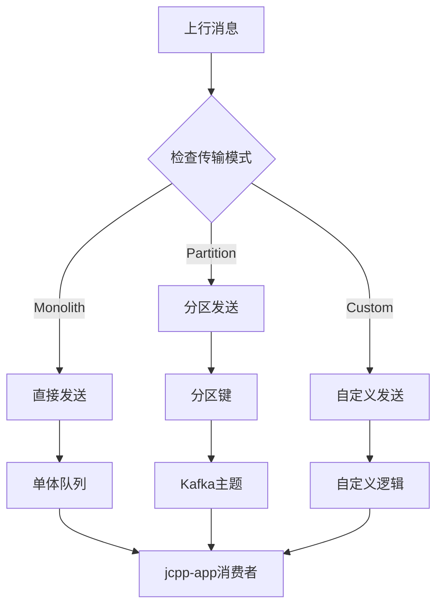

**图表来源**

- [KafkaForwarder.java](file://jcpp-protocol-api/src/main/java/sanbing/jcpp/protocol/forwarder/KafkaForwarder.java#L120-L180)

## 数据持久化与状态管理

### 属性系统架构

系统采用属性（Attribute）系统进行数据持久化：

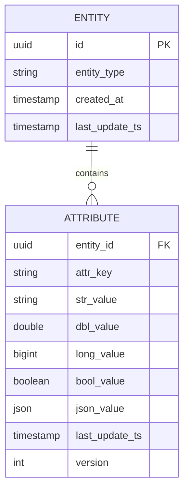

**图表来源**

- [DefaultAttributeRepository.java](file://jcpp-app/src/main/java/sanbing/jcpp/app/dal/repository/attribute/DefaultAttributeRepository.java#L112-L142)

### 状态更新流程

系统实现了高效的状态更新机制：

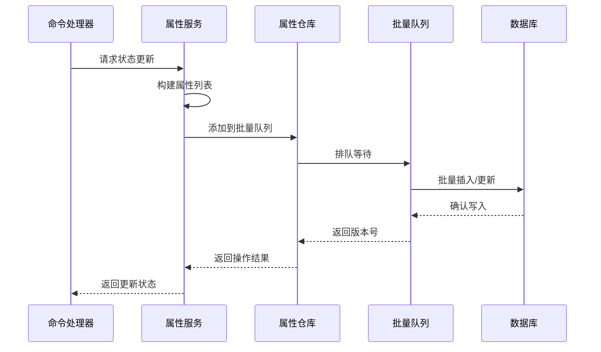

**图表来源**

- [DefaultAttributeRepository.java](file://jcpp-app/src/main/java/sanbing/jcpp/app/dal/repository/attribute/DefaultAttributeRepository.java#L71-L110)

### 批量处理优化

系统采用批量处理策略提升性能：

| 优化策略 | 实现方式             | 性能提升      |
|------|------------------|-----------|
| 批量队列 | SqlBlockingQueue | 减少数据库连接开销 |
| 异步处理 | Future模式         | 提升并发处理能力  |
| 版本控制 | 冲突检测             | 确保数据一致性   |
| 缓存机制 | 多级缓存             | 减少重复查询    |

**章节来源**

- [DefaultAttributeRepository.java](file://jcpp-app/src/main/java/sanbing/jcpp/app/dal/repository/attribute/DefaultAttributeRepository.java#L71-L110)

## 性能优化策略

### 异步处理架构

系统采用完全异步的处理架构：

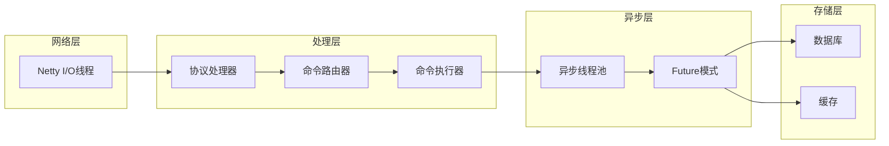

### 内存优化策略

系统实现了多层次的内存优化：

| 优化层级 | 策略            | 效果      |
|------|---------------|---------|
| 对象池  | ByteBuf复用     | 减少GC压力  |
| 缓存   | Caffeine本地缓存  | 提升访问速度  |
| 序列化  | Protobuf二进制格式 | 减少序列化开销 |
| 批量   | 批量操作          | 减少网络往返  |

### 并发控制机制

系统采用多种并发控制策略：

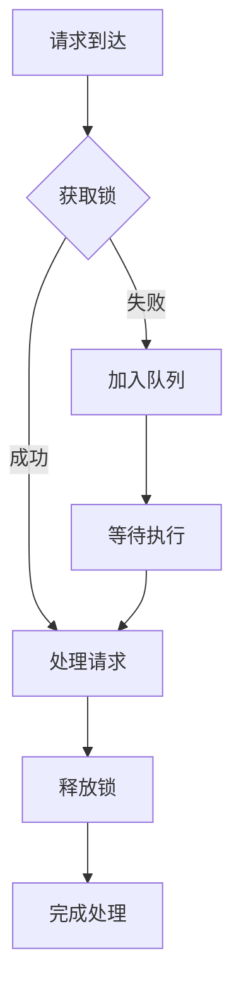

## 总结

云快充协议上行消息处理系统是一个高度优化的分布式消息处理框架，具有以下核心优势：

### 技术亮点

1. **模块化设计**：通过注解驱动的命令路由实现高度可扩展的架构
2. **高性能处理**：基于Netty的异步I/O和批量处理策略
3. **强一致性**：通过事务性和批量操作保证数据一致性
4. **可观测性**：完善的日志记录和监控指标体系

### 业务价值

1. **实时响应**：毫秒级的消息处理延迟
2. **高可靠性**：多重校验和容错机制
3. **可扩展性**：支持多种协议版本和未来扩展
4. **运维友好**：清晰的日志和监控界面

### 应用场景

该系统适用于大规模充电桩管理平台，能够处理数万甚至数十万充电桩的并发消息处理需求，为电动车充电服务提供稳定可靠的技术支撑。