# 云快充协议下行消息处理链路

<cite>
**本文档引用的文件**
- [DownlinkController.java](file://jcpp-protocol-api/src/main/java/sanbing/jcpp/protocol/adapter/DownlinkController.java)
- [DownlinkGrpcService.java](file://jcpp-protocol-api/src/main/java/sanbing/jcpp/protocol/adapter/DownlinkGrpcService.java)
- [YunKuaiChongDownlinkCmdExe.java](file://jcpp-protocol-yunkuaichong/src/main/java/sanbing/jcpp/protocol/yunkuaichong/YunKuaiChongDownlinkCmdExe.java)
- [YunKuaiChongDownlinkCmdConverter.java](file://jcpp-protocol-yunkuaichong/src/main/java/sanbing/jcpp/protocol/yunkuaichong/mapping/YunKuaiChongDownlinkCmdConverter.java)
- [YunKuaiChongV150RemoteStartDLCmd.java](file://jcpp-protocol-yunkuaichong/src/main/java/sanbing/jcpp/protocol/yunkuaichong/v150/cmd/YunKuaiChongV150RemoteStartDLCmd.java)
- [YunKuaiChongProtocolMessageProcessor.java](file://jcpp-protocol-yunkuaichong/src/main/java/sanbing/jcpp/protocol/yunkuaichong/YunKuaiChongProtocolMessageProcessor.java)
- [AbstractYunKuaiChongCmdExe.java](file://jcpp-protocol-yunkuaichong/src/main/java/sanbing/jcpp/protocol/yunkuaichong/AbstractYunKuaiChongCmdExe.java)
- [ProtocolSession.java](file://jcpp-protocol-api/src/main/java/sanbing/jcpp/protocol/domain/ProtocolSession.java)
- [TcpChannelHandler.java](file://jcpp-protocol-api/src/main/java/sanbing/jcpp/protocol/listener/tcp/TcpChannelHandler.java)
- [DownlinkCmdEnum.java](file://jcpp-protocol-api/src/main/java/sanbing/jcpp/protocol/domain/DownlinkCmdEnum.java)
</cite>

## 目录

1. [概述](#概述)
2. [系统架构](#系统架构)
3. [外部接口层](#外部接口层)
4. [协议处理层](#协议处理层)
5. [命令转换层](#命令转换层)
6. [消息构建层](#消息构建层)
7. [传输层](#传输层)
8. [错误处理与超时机制](#错误处理与超时机制)
9. [完整时序图](#完整时序图)
10. [总结](#总结)

## 概述

云快充协议下行消息处理链路是一个完整的从外部系统发起控制请求到最终发送到充电桩设备的处理流程。该系统支持两种主要的外部接口：REST
API 和 gRPC 服务，通过统一的协议处理框架实现对云快充协议的下行指令处理。

## 系统架构

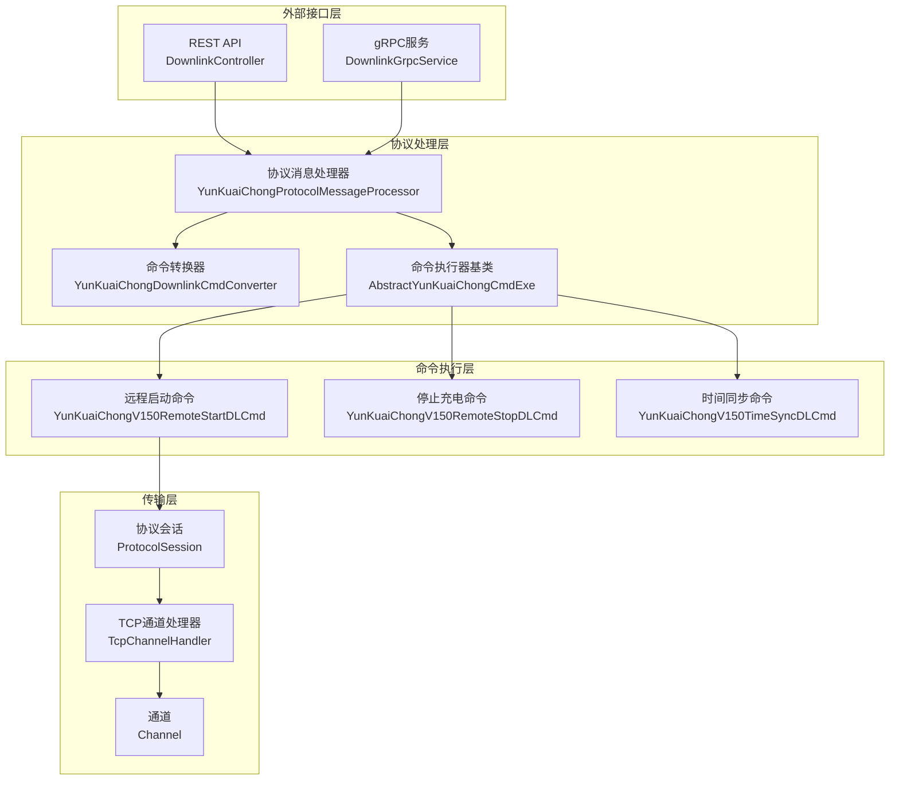

**图表来源**

- [DownlinkController.java](file://jcpp-protocol-api/src/main/java/sanbing/jcpp/protocol/adapter/DownlinkController.java#L1-L76)
- [DownlinkGrpcService.java](file://jcpp-protocol-api/src/main/java/sanbing/jcpp/protocol/adapter/DownlinkGrpcService.java#L1-L185)
- [YunKuaiChongProtocolMessageProcessor.java](file://jcpp-protocol-yunkuaichong/src/main/java/sanbing/jcpp/protocol/yunkuaichong/YunKuaiChongProtocolMessageProcessor.java#L1-L204)

## 外部接口层

### REST API 接口

REST API 提供了一个标准的 HTTP 接口，通过 `/api/onDownlink` 端点接收下行控制请求。

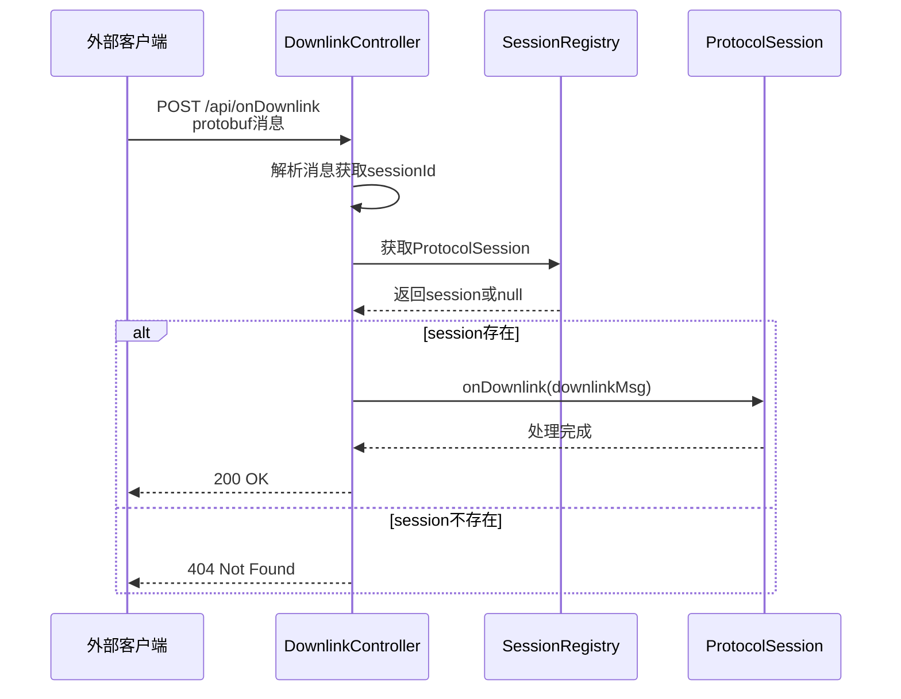

**图表来源**

- [DownlinkController.java](file://jcpp-protocol-api/src/main/java/sanbing/jcpp/protocol/adapter/DownlinkController.java#L37-L75)

### gRPC 服务接口

gRPC 服务提供了高性能的双向流式通信接口，支持实时的下行控制请求处理。

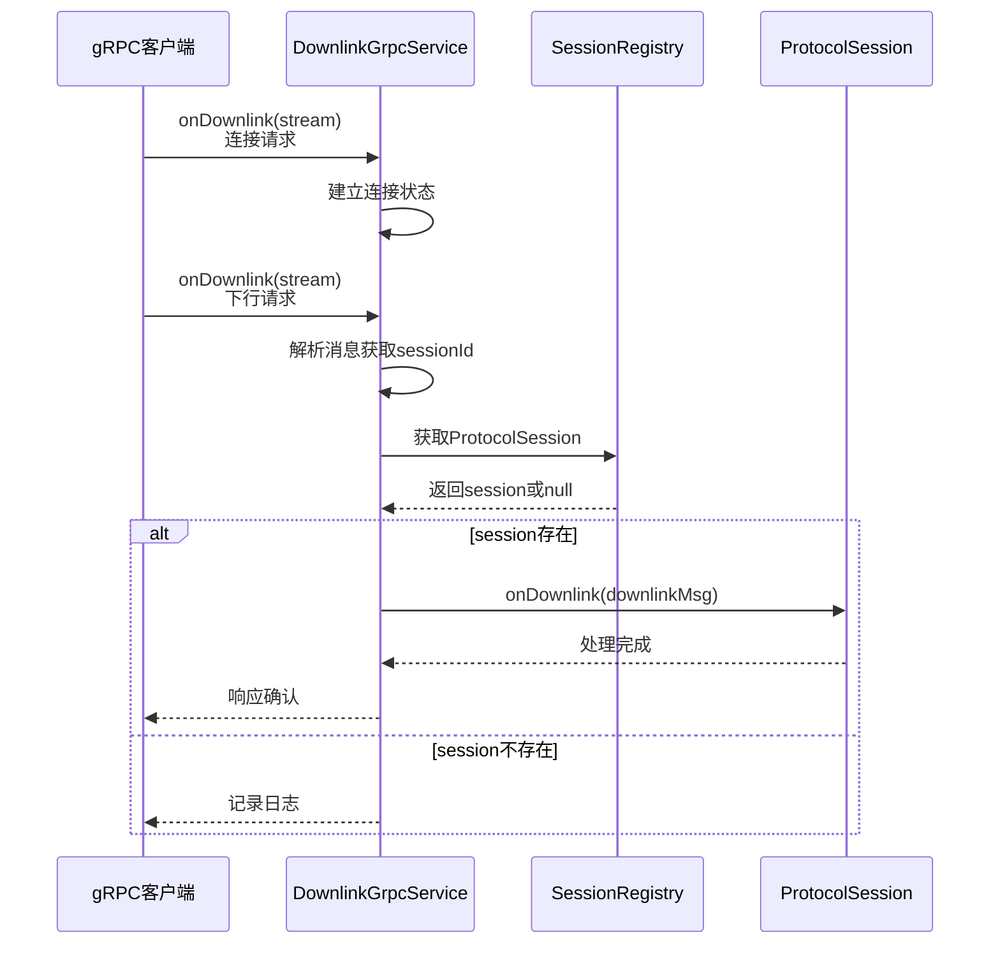

**图表来源**

- [DownlinkGrpcService.java](file://jcpp-protocol-api/src/main/java/sanbing/jcpp/protocol/adapter/DownlinkGrpcService.java#L123-L184)

**章节来源**

- [DownlinkController.java](file://jcpp-protocol-api/src/main/java/sanbing/jcpp/protocol/adapter/DownlinkController.java#L1-L76)
- [DownlinkGrpcService.java](file://jcpp-protocol-api/src/main/java/sanbing/jcpp/protocol/adapter/DownlinkGrpcService.java#L1-L185)

## 协议处理层

### 协议消息处理器

协议消息处理器负责接收来自外部接口的下行请求，并将其转换为内部的消息格式进行处理。

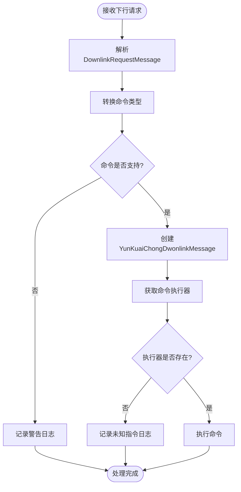

**图表来源**

- [YunKuaiChongProtocolMessageProcessor.java](file://jcpp-protocol-yunkuaichong/src/main/java/sanbing/jcpp/protocol/yunkuaichong/YunKuaiChongProtocolMessageProcessor.java#L140-L202)

### 命令枚举定义

系统定义了完整的下行命令枚举，涵盖了所有支持的云快充协议指令。

| 命令类型                       | 描述      | 协议支持  |
|----------------------------|---------|-------|
| LOGIN_ACK                  | 登录应答    | 全版本   |
| HEARTBEAT_ACK              | 心跳应答    | 全版本   |
| SET_PRICING                | 设置定价模型  | V1.5+ |
| REMOTE_START_CHARGING      | 远程启动充电  | V1.5+ |
| REMOTE_STOP_CHARGING       | 远程停止充电  | V1.5+ |
| TRANSACTION_RECORD_ACK     | 交易记录确认  | V1.5+ |
| SYNC_TIME_REQUEST          | 同步时间请求  | V1.5+ |
| OFFLINE_CARD_QUERY_REQUEST | 离线卡查询请求 | V1.5+ |

**章节来源**

- [YunKuaiChongProtocolMessageProcessor.java](file://jcpp-protocol-yunkuaichong/src/main/java/sanbing/jcpp/protocol/yunkuaichong/YunKuaiChongProtocolMessageProcessor.java#L1-L204)
- [DownlinkCmdEnum.java](file://jcpp-protocol-api/src/main/java/sanbing/jcpp/protocol/domain/DownlinkCmdEnum.java#L1-L55)

## 命令转换层

### 命令转换器

命令转换器负责将通用的 `DownlinkCmdEnum` 转换为云快充协议特定的命令码。

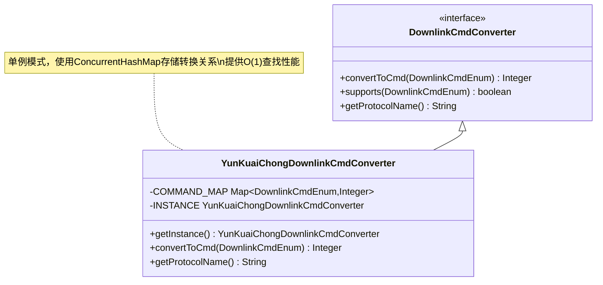

**图表来源**

- [YunKuaiChongDownlinkCmdConverter.java](file://jcpp-protocol-yunkuaichong/src/main/java/sanbing/jcpp/protocol/yunkuaichong/mapping/YunKuaiChongDownlinkCmdConverter.java#L1-L89)

### 转换映射表

以下是部分关键命令的转换映射：

| 通用命令                   | 云快充协议命令码 | 功能描述   |
|------------------------|----------|--------|
| REMOTE_START_CHARGING  | 0x34     | 远程启动充电 |
| REMOTE_STOP_CHARGING   | 0x36     | 远程停止充电 |
| SET_PRICING            | 0x58     | 设置定价模型 |
| SYNC_TIME_REQUEST      | 0x56     | 同步时间请求 |
| TRANSACTION_RECORD_ACK | 0x40     | 交易记录确认 |

**章节来源**

- [YunKuaiChongDownlinkCmdConverter.java](file://jcpp-protocol-yunkuaichong/src/main/java/sanbing/jcpp/protocol/yunkuaichong/mapping/YunKuaiChongDownlinkCmdConverter.java#L1-L89)

## 消息构建层

### 命令执行器基类

抽象命令执行器基类提供了消息编码和发送的核心功能。

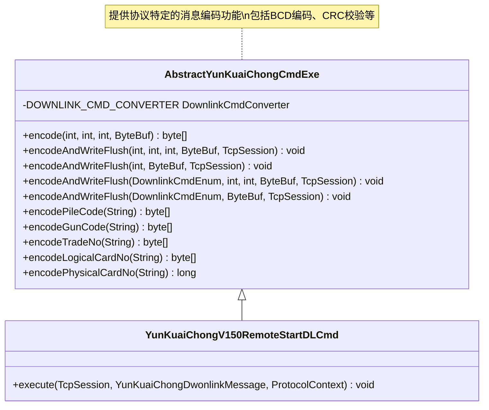

**图表来源**

- [AbstractYunKuaiChongCmdExe.java](file://jcpp-protocol-yunkuaichong/src/main/java/sanbing/jcpp/protocol/yunkuaichong/AbstractYunKuaiChongCmdExe.java#L1-L310)

### 远程启动命令实现

以远程启动充电命令为例，展示具体的命令处理流程。

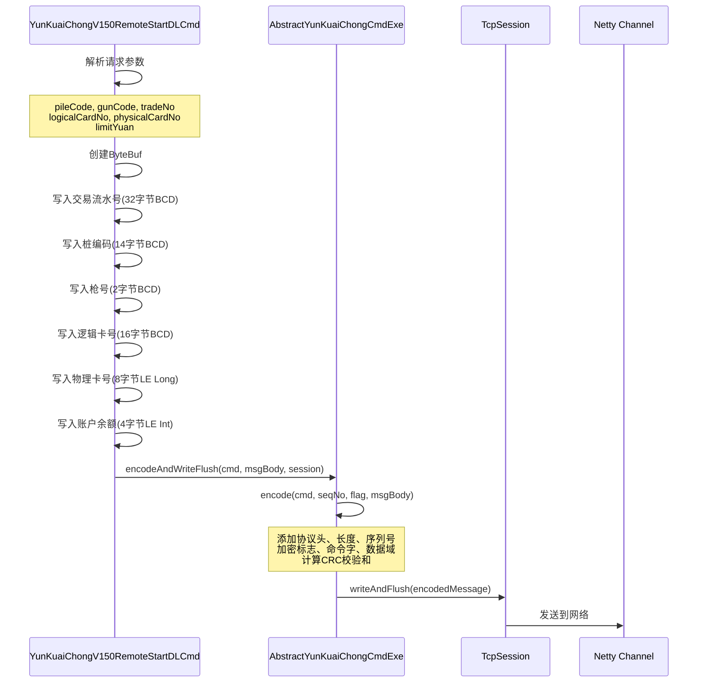

**图表来源**

- [YunKuaiChongV150RemoteStartDLCmd.java](file://jcpp-protocol-yunkuaichong/src/main/java/sanbing/jcpp/protocol/yunkuaichong/v150/cmd/YunKuaiChongV150RemoteStartDLCmd.java#L1-L72)
- [AbstractYunKuaiChongCmdExe.java](file://jcpp-protocol-yunkuaichong/src/main/java/sanbing/jcpp/protocol/yunkuaichong/AbstractYunKuaiChongCmdExe.java#L180-L220)

### 协议消息格式

云快充协议的下行消息格式如下：

| 字段   | 长度  | 描述              |
|------|-----|-----------------|
| 帧头   | 1字节 | 固定值 0x68        |
| 数据长度 | 1字节 | 包含后续所有字段的长度     |
| 序列号  | 2字节 | LE格式，自动递增       |
| 加密标志 | 1字节 | 0表示正常加密         |
| 命令字  | 1字节 | 下行命令类型          |
| 数据域  | 可变  | 具体命令的数据内容       |
| 校验和  | 2字节 | CRC校验，多项式0x180D |

**章节来源**

- [AbstractYunKuaiChongCmdExe.java](file://jcpp-protocol-yunkuaichong/src/main/java/sanbing/jcpp/protocol/yunkuaichong/AbstractYunKuaiChongCmdExe.java#L1-L310)
- [YunKuaiChongV150RemoteStartDLCmd.java](file://jcpp-protocol-yunkuaichong/src/main/java/sanbing/jcpp/protocol/yunkuaichong/v150/cmd/YunKuaiChongV150RemoteStartDLCmd.java#L1-L72)

## 传输层

### 协议会话管理

协议会话负责维护与充电桩设备的连接状态和消息路由。

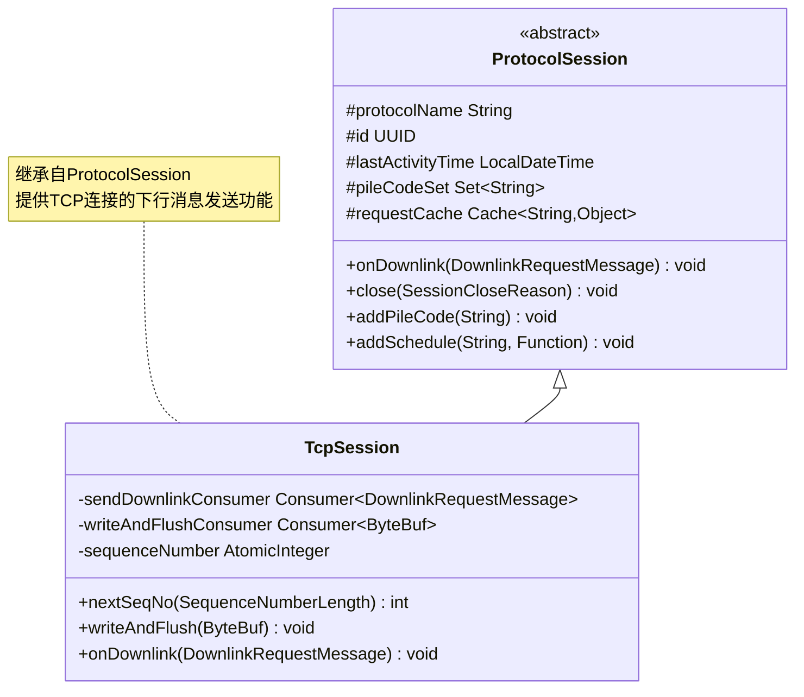

**图表来源**

- [ProtocolSession.java](file://jcpp-protocol-api/src/main/java/sanbing/jcpp/protocol/domain/ProtocolSession.java#L1-L124)
- [TcpChannelHandler.java](file://jcpp-protocol-api/src/main/java/sanbing/jcpp/protocol/listener/tcp/TcpChannelHandler.java#L30-L128)

### TCP通道处理器

TCP通道处理器负责实际的网络数据传输和消息发送。

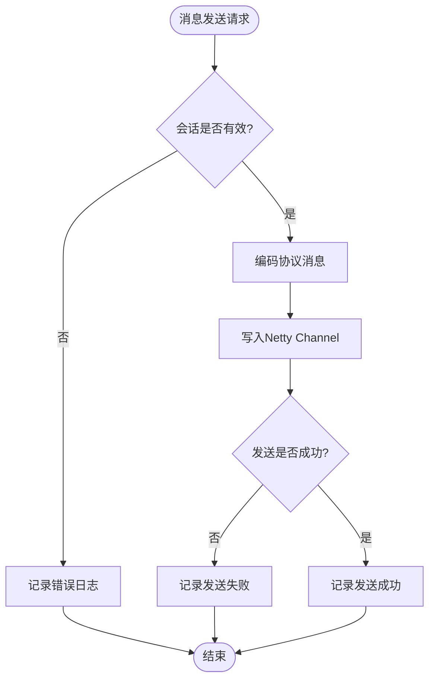

**图表来源**

- [TcpChannelHandler.java](file://jcpp-protocol-api/src/main/java/sanbing/jcpp/protocol/listener/tcp/TcpChannelHandler.java#L175-L218)

**章节来源**

- [ProtocolSession.java](file://jcpp-protocol-api/src/main/java/sanbing/jcpp/protocol/domain/ProtocolSession.java#L1-L124)
- [TcpChannelHandler.java](file://jcpp-protocol-api/src/main/java/sanbing/jcpp/protocol/listener/tcp/TcpChannelHandler.java#L1-L218)

## 错误处理与超时机制

### 超时处理

系统在多个层面实现了超时处理机制：

1. **HTTP超时**: REST API 默认超时时间为3秒
2. **gRPC超时**: 连接建立和消息处理都有超时保护
3. **消息发送超时**: TCP通道处理器记录发送时间并监控结果

### 错误恢复策略

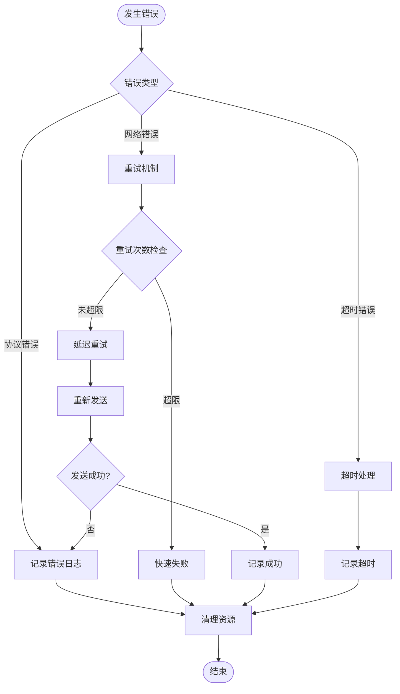

### 异常处理机制

系统提供了完善的异常处理机制，包括：

- **DownlinkException**: 下行消息处理异常
- **IllegalArgumentException**: 参数验证异常
- **RuntimeException**: 通用运行时异常处理

**章节来源**

- [DownlinkController.java](file://jcpp-protocol-api/src/main/java/sanbing/jcpp/protocol/adapter/DownlinkController.java#L37-L75)
- [DownlinkGrpcService.java](file://jcpp-protocol-api/src/main/java/sanbing/jcpp/protocol/adapter/DownlinkGrpcService.java#L123-L184)

## 完整时序图

以下展示了从外部系统发起远程启动充电请求到设备响应的完整时序：

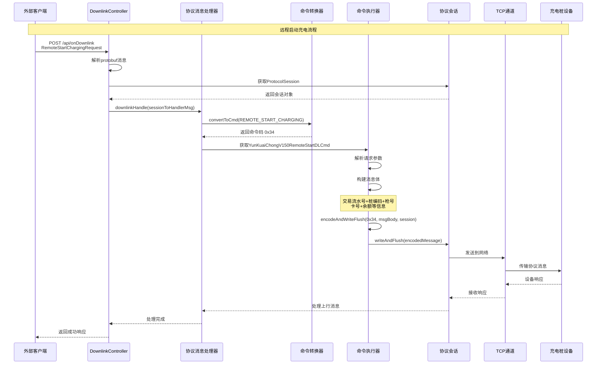

**图表来源**

- [DownlinkController.java](file://jcpp-protocol-api/src/main/java/sanbing/jcpp/protocol/adapter/DownlinkController.java#L37-L75)
- [YunKuaiChongProtocolMessageProcessor.java](file://jcpp-protocol-yunkuaichong/src/main/java/sanbing/jcpp/protocol/yunkuaichong/YunKuaiChongProtocolMessageProcessor.java#L140-L202)
- [YunKuaiChongV150RemoteStartDLCmd.java](file://jcpp-protocol-yunkuaichong/src/main/java/sanbing/jcpp/protocol/yunkuaichong/v150/cmd/YunKuaiChongV150RemoteStartDLCmd.java#L30-L71)

## 总结

云快充协议下行消息处理链路展现了现代工业物联网系统的典型架构特点：

1. **分层架构**: 清晰的分层设计使得系统具有良好的可维护性和扩展性
2. **多接口支持**: 同时支持REST API和gRPC两种接口，满足不同场景需求
3. **协议抽象**: 通过命令转换器实现协议无关的设计
4. **高效传输**: 基于Netty的异步非阻塞IO，确保高并发处理能力
5. **健壮性**: 完善的错误处理和超时机制保证系统稳定性

该系统为云快充平台提供了可靠、高效的下行指令处理能力，支撑着大规模充电桩的远程控制需求。通过模块化的架构设计和标准化的协议处理流程，系统能够快速适配新的协议版本和功能需求。