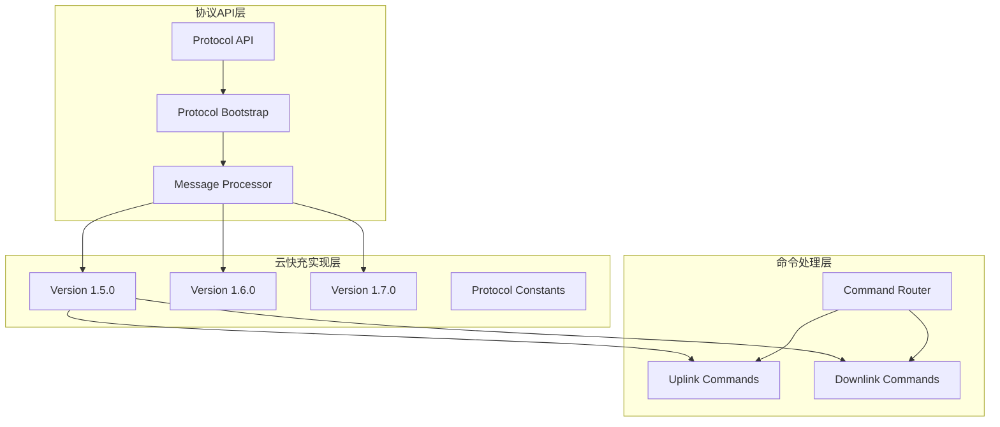
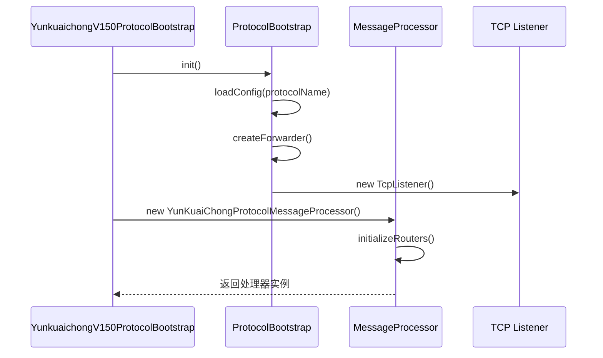
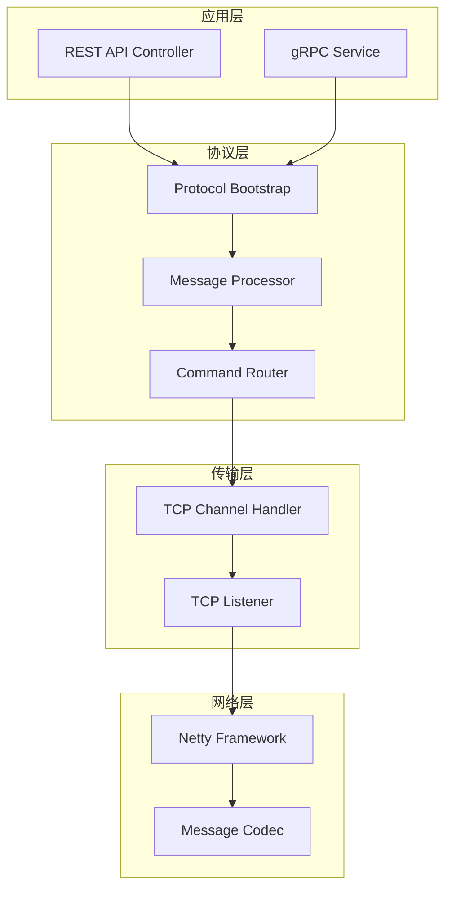
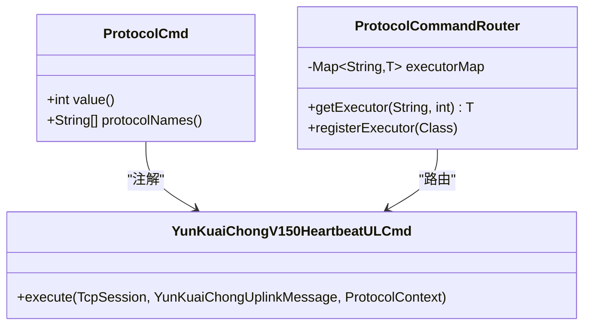
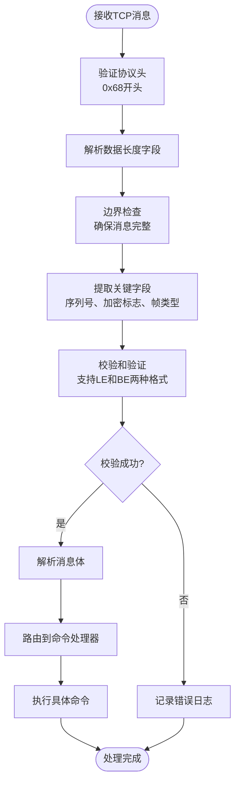
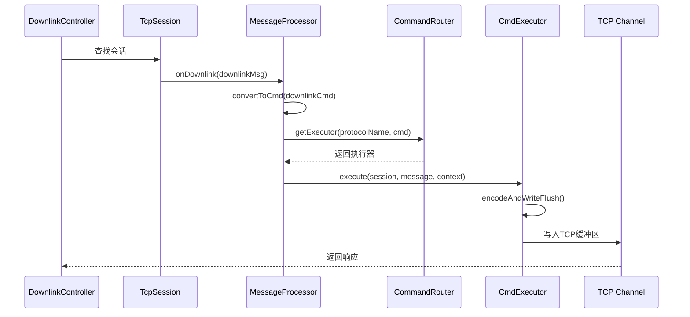
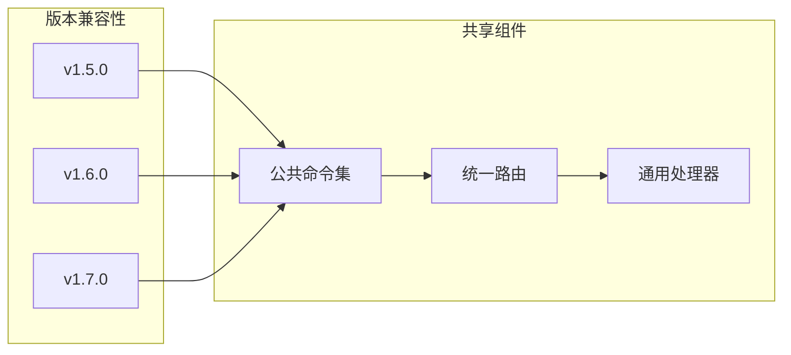
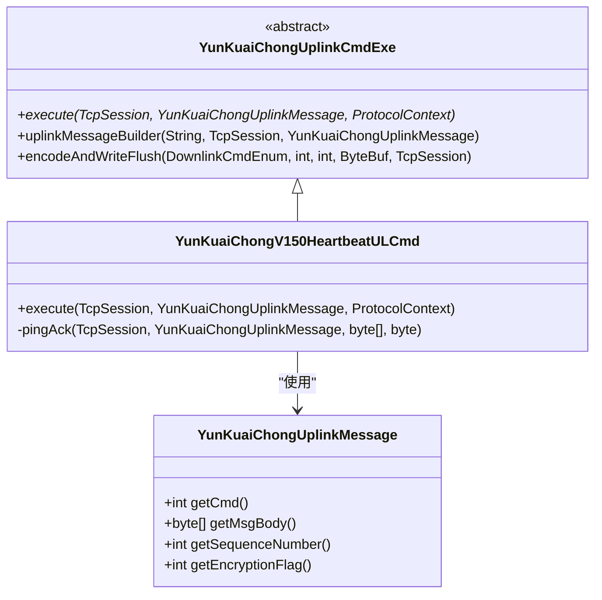
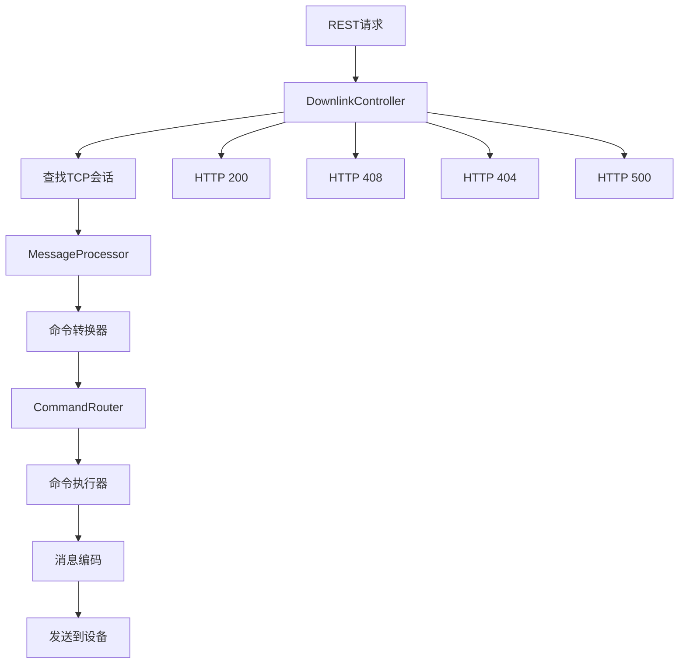
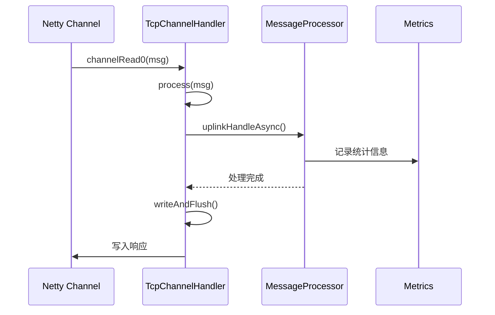

# 云快充协议实现

<cite>
**本文档中引用的文件**
- [YunkuaichongV150ProtocolBootstrap.java](file://jcpp-protocol-yunkuaichong/src/main/java/sanbing/jcpp/protocol/yunkuaichong/v150/YunkuaichongV150ProtocolBootstrap.java)
- [YunkuaichongV160ProtocolBootstrap.java](file://jcpp-protocol-yunkuaichong/src/main/java/sanbing/jcpp/protocol/yunkuaichong/v160/YunkuaichongV160ProtocolBootstrap.java)
- [YunkuaichongV170ProtocolBootstrap.java](file://jcpp-protocol-yunkuaichong/src/main/java/sanbing/jcpp/protocol/yunkuaichong/v170/YunkuaichongV170ProtocolBootstrap.java)
- [YunKuaiChongProtocolMessageProcessor.java](file://jcpp-protocol-yunkuaichong/src/main/java/sanbing/jcpp/protocol/yunkuaichong/YunKuaiChongProtocolMessageProcessor.java)
- [ProtocolBootstrap.java](file://jcpp-protocol-api/src/main/java/sanbing/jcpp/protocol/ProtocolBootstrap.java)
- [ProtocolCmd.java](file://jcpp-protocol-api/src/main/java/sanbing/jcpp/protocol/annotation/ProtocolCmd.java)
- [ProtocolCommandRouter.java](file://jcpp-protocol-api/src/main/java/sanbing/jcpp/protocol/routing/ProtocolCommandRouter.java)
- [DownlinkController.java](file://jcpp-protocol-api/src/main/java/sanbing/jcpp/protocol/adapter/DownlinkController.java)
- [YunKuaiChongDownlinkCmdExe.java](file://jcpp-protocol-yunkuaichong/src/main/java/sanbing/jcpp/protocol/yunkuaichong/YunKuaiChongDownlinkCmdExe.java)
- [YunKuaiChongV150HeartbeatULCmd.java](file://jcpp-protocol-yunkuaichong/src/main/java/sanbing/jcpp/protocol/yunkuaichong/v150/cmd/YunKuaiChongV150HeartbeatULCmd.java)
- [TcpChannelHandler.java](file://jcpp-protocol-api/src/main/java/sanbing/jcpp/protocol/listener/tcp/TcpChannelHandler.java)
- [YunKuaiChongProtocolConstants.java](file://jcpp-protocol-yunkuaichong/src/main/java/sanbing/jcpp/protocol/yunkuaichong/YunKuaiChongProtocolConstants.java)
- [DownlinkCmdEnum.java](file://jcpp-protocol-api/src/main/java/sanbing/jcpp/protocol/domain/DownlinkCmdEnum.java)
</cite>

## 目录

1. [简介](#简介)
2. [项目结构](#项目结构)
3. [核心组件](#核心组件)
4. [架构概览](#架构概览)
5. [详细组件分析](#详细组件分析)
6. [协议版本管理](#协议版本管理)
7. [命令处理机制](#命令处理机制)
8. [消息编解码流程](#消息编解码流程)
9. [性能考虑](#性能考虑)
10. [故障排除指南](#故障排除指南)
11. [结论](#结论)

## 简介

云快充协议是一个专为电动汽车充电站设计的通信协议实现，采用模块化架构支持多个协议版本（v150、v160、v170），提供了完整的上行和下行消息处理能力。该协议实现了基于Netty的高性能TCP通信，支持心跳检测、远程控制、参数配置等核心功能。

## 项目结构

云快充协议的项目结构遵循分层架构设计，主要包含以下模块：

**图表来源**

- [ProtocolBootstrap.java](file://jcpp-protocol-api/src/main/java/sanbing/jcpp/protocol/ProtocolBootstrap.java#L1-L127)
- [YunkuaichongV150ProtocolBootstrap.java](file://jcpp-protocol-yunkuaichong/src/main/java/sanbing/jcpp/protocol/yunkuaichong/v150/YunkuaichongV150ProtocolBootstrap.java#L1-L48)

**章节来源**

- [YunkuaichongV150ProtocolBootstrap.java](file://jcpp-protocol-yunkuaichong/src/main/java/sanbing/jcpp/protocol/yunkuaichong/v150/YunkuaichongV150ProtocolBootstrap.java#L1-L48)
- [YunkuaichongV160ProtocolBootstrap.java](file://jcpp-protocol-yunkuaichong/src/main/java/sanbing/jcpp/protocol/yunkuaichong/v160/YunkuaichongV160ProtocolBootstrap.java#L1-L48)
- [YunkuaichongV170ProtocolBootstrap.java](file://jcpp-protocol-yunkuaichong/src/main/java/sanbing/jcpp/protocol/yunkuaichong/v170/YunkuaichongV170ProtocolBootstrap.java#L1-L49)

## 核心组件

### YunkuaichongV150ProtocolBootstrap

`YunkuaichongV150ProtocolBootstrap` 是云快充协议的核心入口点，负责协议的初始化和配置。它继承自 `ProtocolBootstrap`
，实现了协议的基本生命周期管理。

#### 主要特性：

- **协议标识**：使用 `@ProtocolComponent` 注解标记协议名称
- **消息处理器**：创建并返回 `YunKuaiChongProtocolMessageProcessor` 实例
- **版本支持**：支持 v150、v160、v170 三个版本

#### 初始化流程：

**图表来源**

- [YunkuaichongV150ProtocolBootstrap.java](file://jcpp-protocol-yunkuaichong/src/main/java/sanbing/jcpp/protocol/yunkuaichong/v150/YunkuaichongV150ProtocolBootstrap.java#L30-L47)
- [ProtocolBootstrap.java](file://jcpp-protocol-api/src/main/java/sanbing/jcpp/protocol/ProtocolBootstrap.java#L40-L80)

### YunKuaiChongProtocolMessageProcessor

这是协议消息处理的核心组件，负责解析原始字节流并路由到具体的命令处理器。

#### 核心功能：

- **上行消息处理**：解析TCP接收到的原始字节流
- **下行消息处理**：处理来自REST API的下行请求
- **命令路由**：使用 `ProtocolCommandRouter` 进行命令分发
- **校验和验证**：支持多种校验和算法

**章节来源**

- [YunkuaichongV150ProtocolBootstrap.java](file://jcpp-protocol-yunkuaichong/src/main/java/sanbing/jcpp/protocol/yunkuaichong/v150/YunkuaichongV150ProtocolBootstrap.java#L30-L47)
- [YunKuaiChongProtocolMessageProcessor.java](file://jcpp-protocol-yunkuaichong/src/main/java/sanbing/jcpp/protocol/yunkuaichong/YunKuaiChongProtocolMessageProcessor.java#L1-L204)

## 架构概览

云快充协议采用分层架构，从底层的网络通信到高层的业务逻辑处理：

**图表来源**

- [DownlinkController.java](file://jcpp-protocol-api/src/main/java/sanbing/jcpp/protocol/adapter/DownlinkController.java#L1-L76)
- [TcpChannelHandler.java](file://jcpp-protocol-api/src/main/java/sanbing/jcpp/protocol/listener/tcp/TcpChannelHandler.java#L1-L234)

## 详细组件分析

### 协议命令注解系统

`@ProtocolCmd` 注解是云快充协议命令映射的核心机制：

**图表来源**

- [ProtocolCmd.java](file://jcpp-protocol-api/src/main/java/sanbing/jcpp/protocol/annotation/ProtocolCmd.java#L1-L33)
- [ProtocolCommandRouter.java](file://jcpp-protocol-api/src/main/java/sanbing/jcpp/protocol/routing/ProtocolCommandRouter.java#L1-L105)
- [YunKuaiChongV150HeartbeatULCmd.java](file://jcpp-protocol-yunkuaichong/src/main/java/sanbing/jcpp/protocol/yunkuaichong/v150/cmd/YunKuaiChongV150HeartbeatULCmd.java#L1-L85)

#### 注解机制工作原理：

1. **扫描阶段**：`ProtocolCommandRouter` 使用反射扫描带有 `@ProtocolCmd` 注解的类
2. **注册阶段**：将命令字与执行器类建立映射关系
3. **路由阶段**：根据协议名称和命令字查找对应的执行器

**章节来源**

- [ProtocolCmd.java](file://jcpp-protocol-api/src/main/java/sanbing/jcpp/protocol/annotation/ProtocolCmd.java#L1-L33)
- [ProtocolCommandRouter.java](file://jcpp-protocol-api/src/main/java/sanbing/jcpp/protocol/routing/ProtocolCommandRouter.java#L40-L80)

### 上行命令处理流程

上行命令处理是协议的核心功能之一，负责解析设备发送的消息：

**图表来源**

- [YunKuaiChongProtocolMessageProcessor.java](file://jcpp-protocol-yunkuaichong/src/main/java/sanbing/jcpp/protocol/yunkuaichong/YunKuaiChongProtocolMessageProcessor.java#L50-L150)

### 下行命令处理流程

下行命令处理负责响应REST API请求，向设备发送控制指令：

**图表来源**

- [DownlinkController.java](file://jcpp-protocol-api/src/main/java/sanbing/jcpp/protocol/adapter/DownlinkController.java#L40-L75)
- [YunKuaiChongProtocolMessageProcessor.java](file://jcpp-protocol-yunkuaichong/src/main/java/sanbing/jcpp/protocol/yunkuaichong/YunKuaiChongProtocolMessageProcessor.java#L150-L204)

**章节来源**

- [DownlinkController.java](file://jcpp-protocol-api/src/main/java/sanbing/jcpp/protocol/adapter/DownlinkController.java#L40-L75)
- [YunKuaiChongProtocolMessageProcessor.java](file://jcpp-protocol-yunkuaichong/src/main/java/sanbing/jcpp/protocol/yunkuaichong/YunKuaiChongProtocolMessageProcessor.java#L150-L204)

## 协议版本管理

云快充协议支持多个版本，每个版本都有自己的 `ProtocolBootstrap` 实现：

### 版本差异对比

| 功能特性 | v150     | v160   | v170   |
|------|----------|--------|--------|
| 基础协议 | ✓        | ✓      | ✓      |
| 并行启动 | ✗        | ✓      | ✓      |
| 新增命令 | 心跳、登录、对时 | 并行启动命令 | 交易记录命令 |
| 向后兼容 | ✓        | ✓      | ✓      |

### 版本兼容性策略

**图表来源**

- [YunkuaichongV150ProtocolBootstrap.java](file://jcpp-protocol-yunkuaichong/src/main/java/sanbing/jcpp/protocol/yunkuaichong/v150/YunkuaichongV150ProtocolBootstrap.java#L20-L25)
- [YunkuaichongV160ProtocolBootstrap.java](file://jcpp-protocol-yunkuaichong/src/main/java/sanbing/jcpp/protocol/yunkuaichong/v160/YunkuaichongV160ProtocolBootstrap.java#L20-L25)
- [YunkuaichongV170ProtocolBootstrap.java](file://jcpp-protocol-yunkuaichong/src/main/java/sanbing/jcpp/protocol/yunkuaichong/v170/YunkuaichongV170ProtocolBootstrap.java#L20-L25)

**章节来源**

- [YunkuaichongV150ProtocolBootstrap.java](file://jcpp-protocol-yunkuaichong/src/main/java/sanbing/jcpp/protocol/yunkuaichong/v150/YunkuaichongV150ProtocolBootstrap.java#L20-L25)
- [YunkuaichongV160ProtocolBootstrap.java](file://jcpp-protocol-yunkuaichong/src/main/java/sanbing/jcpp/protocol/yunkuaichong/v160/YunkuaichongV160ProtocolBootstrap.java#L20-L25)
- [YunkuaichongV170ProtocolBootstrap.java](file://jcpp-protocol-yunkuaichong/src/main/java/sanbing/jcpp/protocol/yunkuaichong/v170/YunkuaichongV170ProtocolBootstrap.java#L20-L25)

## 命令处理机制

### 上行命令处理

以心跳命令为例，展示完整的命令处理流程：

**图表来源**

- [YunKuaiChongV150HeartbeatULCmd.java](file://jcpp-protocol-yunkuaichong/src/main/java/sanbing/jcpp/protocol/yunkuaichong/v150/cmd/YunKuaiChongV150HeartbeatULCmd.java#L25-L85)

### 下行命令处理

下行命令处理涉及REST API调用到设备响应的完整流程：

**图表来源**

- [DownlinkController.java](file://jcpp-protocol-api/src/main/java/sanbing/jcpp/protocol/adapter/DownlinkController.java#L40-L75)
- [YunKuaiChongDownlinkCmdExe.java](file://jcpp-protocol-yunkuaichong/src/main/java/sanbing/jcpp/protocol/yunkuaichong/YunKuaiChongDownlinkCmdExe.java#L1-L19)

**章节来源**

- [YunKuaiChongV150HeartbeatULCmd.java](file://jcpp-protocol-yunkuaichong/src/main/java/sanbing/jcpp/protocol/yunkuaichong/v150/cmd/YunKuaiChongV150HeartbeatULCmd.java#L25-L85)
- [DownlinkController.java](file://jcpp-protocol-api/src/main/java/sanbing/jcpp/protocol/adapter/DownlinkController.java#L40-L75)

## 消息编解码流程

### TCP消息处理

`TcpChannelHandler` 负责Netty框架层面的消息处理：

**图表来源**

- [TcpChannelHandler.java](file://jcpp-protocol-api/src/main/java/sanbing/jcpp/protocol/listener/tcp/TcpChannelHandler.java#L60-L120)

### 消息格式规范

云快充协议的消息格式采用固定长度头部加可变长度体的设计：

| 字段   | 长度  | 描述        |
|------|-----|-----------|
| 标识符  | 1字节 | 固定值 0x68  |
| 数据长度 | 1字节 | 包含头部的总长度  |
| 序列号  | 2字节 | 请求-响应配对   |
| 加密标志 | 1字节 | 0=明文，1=加密 |
| 帧类型  | 1字节 | 命令字       |
| 消息体  | 可变  | 具体命令数据    |
| 校验和  | 2字节 | CRC校验     |

**章节来源**

- [TcpChannelHandler.java](file://jcpp-protocol-api/src/main/java/sanbing/jcpp/protocol/listener/tcp/TcpChannelHandler.java#L60-L120)
- [YunKuaiChongProtocolMessageProcessor.java](file://jcpp-protocol-yunkuaichong/src/main/java/sanbing/jcpp/protocol/yunkuaichong/YunKuaiChongProtocolMessageProcessor.java#L50-L150)

## 性能考虑

### 异步处理机制

协议采用异步处理模式，避免阻塞主线程：

- **消息队列**：使用Netty的事件循环处理消息
- **并发控制**：支持多线程并发处理
- **内存优化**：使用ByteBuf进行零拷贝操作

### 缓存策略

- **命令路由缓存**：`ProtocolCommandRouter` 使用ConcurrentHashMap缓存命令映射
- **会话管理**：TCP会话状态缓存
- **统计信息**：实时监控指标缓存

### 错误处理

- **快速失败**：无效消息立即丢弃
- **优雅降级**：部分功能不可用时保持核心功能
- **日志记录**：详细的错误日志便于问题排查

## 故障排除指南

### 常见问题及解决方案

#### 1. 协议版本不匹配

**症状**：设备无法识别命令
**解决方案**：检查协议版本配置，确保客户端和服务端版本一致

#### 2. 校验和错误

**症状**：日志显示校验失败
**解决方案**：检查消息编码和传输过程中的数据完整性

#### 3. 命令路由失败

**症状**：未知命令错误日志
**解决方案**：确认命令注解配置正确，检查命令处理器注册

#### 4. TCP连接问题

**症状**：连接频繁断开
**解决方案**：检查网络稳定性，调整心跳间隔配置

**章节来源**

- [YunKuaiChongProtocolMessageProcessor.java](file://jcpp-protocol-yunkuaichong/src/main/java/sanbing/jcpp/protocol/yunkuaichong/YunKuaiChongProtocolMessageProcessor.java#L100-L150)

## 结论

云快充协议实现展现了现代通信协议设计的最佳实践：

### 主要优势

1. **模块化设计**：清晰的分层架构便于维护和扩展
2. **版本兼容性**：支持多版本并保持向后兼容
3. **高性能**：基于Netty的异步处理机制
4. **可扩展性**：灵活的命令路由机制支持新功能添加
5. **可靠性**：完善的错误处理和监控机制

### 技术特色

- **注解驱动开发**：简化命令注册和映射
- **统一消息处理**：标准化的消息编解码流程
- **灵活的版本管理**：支持协议演进和向后兼容
- **完善的监控体系**：实时性能监控和错误追踪

该协议为电动汽车充电站提供了稳定、高效的通信解决方案，具备良好的可维护性和扩展性，能够满足不同场景下的通信需求。