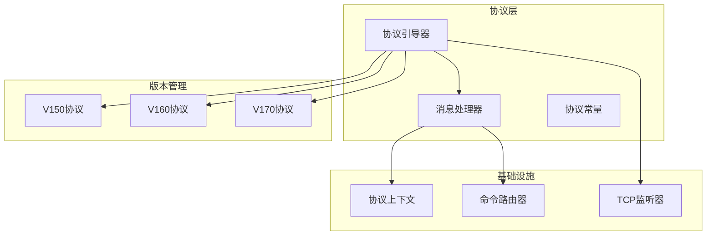
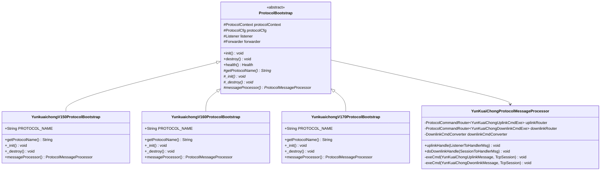
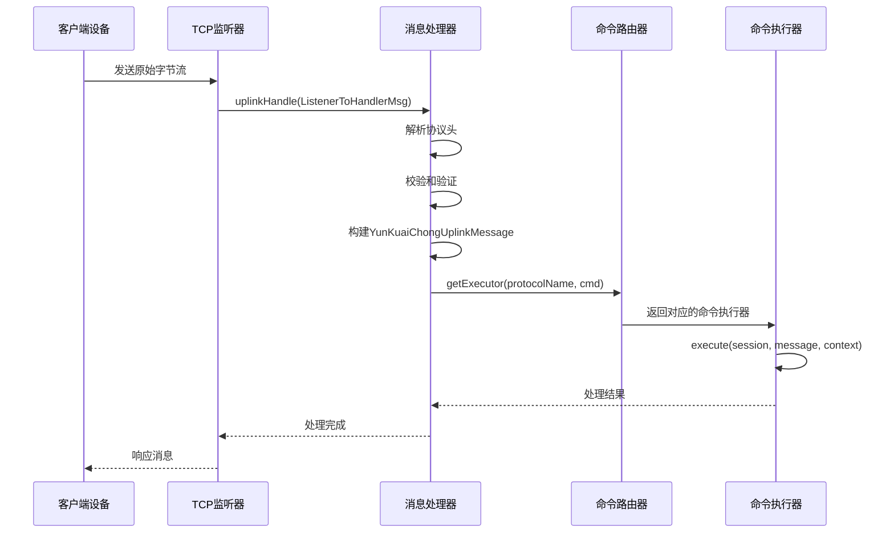
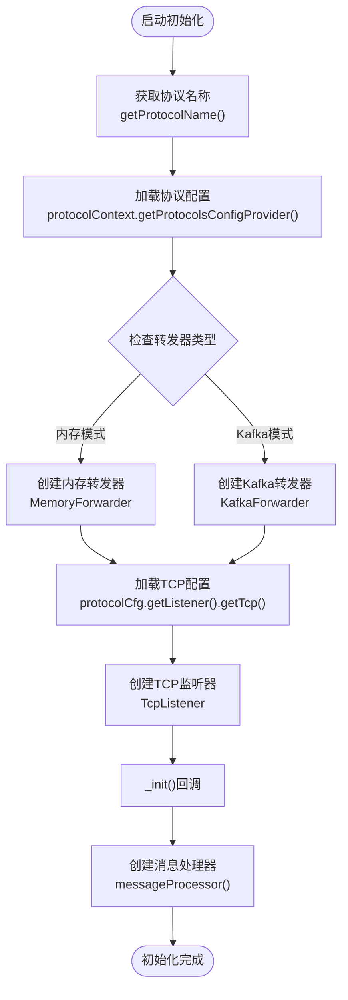
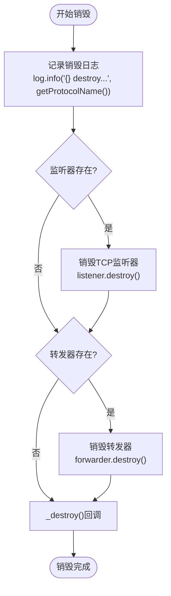
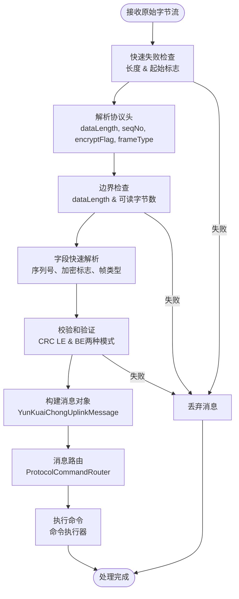
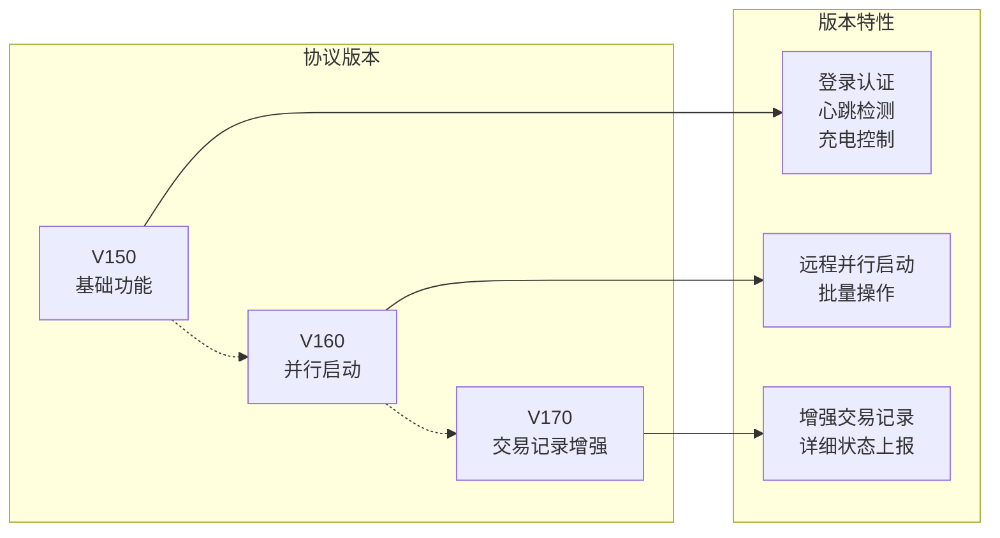
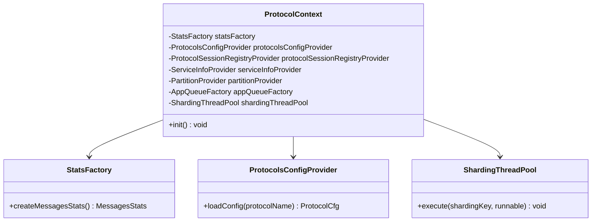
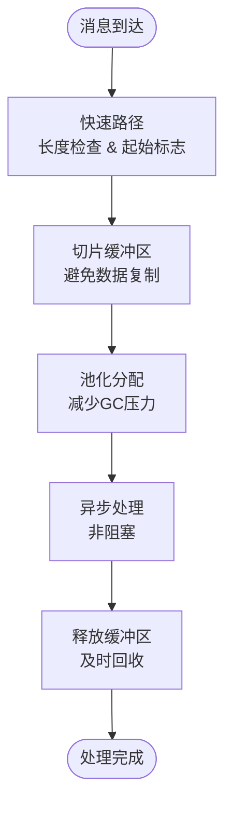

# 云快充协议核心架构与初始化

<cite>
**本文档中引用的文件**
- [YunKuaiChongProtocolMessageProcessor.java](file://jcpp-protocol-yunkuaichong/src/main/java/sanbing/jcpp/protocol/yunkuaichong/YunKuaiChongProtocolMessageProcessor.java)
- [YunkuaichongV150ProtocolBootstrap.java](file://jcpp-protocol-yunkuaichong/src/main/java/sanbing/jcpp/protocol/yunkuaichong/v150/YunkuaichongV150ProtocolBootstrap.java)
- [ProtocolBootstrap.java](file://jcpp-protocol-api/src/main/java/sanbing/jcpp/protocol/ProtocolBootstrap.java)
- [ProtocolMessageProcessor.java](file://jcpp-protocol-api/src/main/java/sanbing/jcpp/protocol/ProtocolMessageProcessor.java)
- [ProtocolContext.java](file://jcpp-protocol-api/src/main/java/sanbing/jcpp/protocol/ProtocolContext.java)
- [TcpListener.java](file://jcpp-protocol-api/src/main/java/sanbing/jcpp/protocol/listener/tcp/TcpListener.java)
- [ProtocolCommandRouter.java](file://jcpp-protocol-api/src/main/java/sanbing/jcpp/protocol/routing/ProtocolCommandRouter.java)
- [YunKuaiChongUplinkMessage.java](file://jcpp-protocol-yunkuaichong/src/main/java/sanbing/jcpp/protocol/yunkuaichong/YunKuaiChongUplinkMessage.java)
- [YunKuaiChongUplinkCmdExe.java](file://jcpp-protocol-yunkuaichong/src/main/java/sanbing/jcpp/protocol/yunkuaichong/YunKuaiChongUplinkCmdExe.java)
- [YunKuaiChongDownlinkCmdExe.java](file://jcpp-protocol-yunkuaichong/src/main/java/sanbing/jcpp/protocol/yunkuaichong/YunKuaiChongDownlinkCmdExe.java)
- [YunKuaiChongProtocolConstants.java](file://jcpp-protocol-yunkuaichong/src/main/java/sanbing/jcpp/protocol/yunkuaichong/YunKuaiChongProtocolConstants.java)
- [TcpCfg.java](file://jcpp-protocol-api/src/main/java/sanbing/jcpp/protocol/cfg/TcpCfg.java)
- [ProtocolCmd.java](file://jcpp-protocol-api/src/main/java/sanbing/jcpp/protocol/annotation/ProtocolCmd.java)
</cite>

## 目录

1. [引言](#引言)
2. [项目结构概览](#项目结构概览)
3. [核心架构设计](#核心架构设计)
4. [协议栈初始化流程](#协议栈初始化流程)
5. [消息处理机制](#消息处理机制)
6. [协议版本管理](#协议版本管理)
7. [基础设施组件注入](#基础设施组件注入)
8. [性能优化策略](#性能优化策略)
9. [故障排除指南](#故障排除指南)
10. [总结](#总结)

## 引言

云快充协议是JChargePointProtocol项目中的核心通信协议，负责电动汽车充电桩与中央管理系统之间的数据交换。本文档深入解析了云快充协议的核心架构设计，重点阐述了YunkuaichongV150ProtocolBootstrap如何继承ProtocolBootstrap并实现抽象方法，完成协议栈的初始化流程，包括TCP监听器的创建、端口配置、编解码器的注册以及会话管理器的设置。

## 项目结构概览

云快充协议采用模块化设计，主要包含以下核心模块：

**图表来源**

- [YunkuaichongV150ProtocolBootstrap.java](file://jcpp-protocol-yunkuaichong/src/main/java/sanbing/jcpp/protocol/yunkuaichong/v150/YunkuaichongV150ProtocolBootstrap.java#L1-L48)
- [YunKuaiChongProtocolMessageProcessor.java](file://jcpp-protocol-yunkuaichong/src/main/java/sanbing/jcpp/protocol/yunkuaichong/YunKuaiChongProtocolMessageProcessor.java#L1-L50)

**章节来源**

- [YunkuaichongV150ProtocolBootstrap.java](file://jcpp-protocol-yunkuaichong/src/main/java/sanbing/jcpp/protocol/yunkuaichong/v150/YunkuaichongV150ProtocolBootstrap.java#L1-L48)
- [YunKuaiChongProtocolConstants.java](file://jcpp-protocol-yunkuaichong/src/main/java/sanbing/jcpp/protocol/yunkuaichong/YunKuaiChongProtocolConstants.java#L1-L44)

## 核心架构设计

### 协议引导器层次结构

云快充协议采用了清晰的分层架构设计，通过继承和组合的方式实现了高度的可扩展性和可维护性：

**图表来源**

- [ProtocolBootstrap.java](file://jcpp-protocol-api/src/main/java/sanbing/jcpp/protocol/ProtocolBootstrap.java#L25-L127)
- [YunkuaichongV150ProtocolBootstrap.java](file://jcpp-protocol-yunkuaichong/src/main/java/sanbing/jcpp/protocol/yunkuaichong/v150/YunkuaichongV150ProtocolBootstrap.java#L20-L48)

### 消息处理架构

协议的消息处理采用了事件驱动的设计模式，通过命令路由器实现消息的动态路由和处理：

**图表来源**

- [YunKuaiChongProtocolMessageProcessor.java](file://jcpp-protocol-yunkuaichong/src/main/java/sanbing/jcpp/protocol/yunkuaichong/YunKuaiChongProtocolMessageProcessor.java#L63-L120)
- [ProtocolCommandRouter.java](file://jcpp-protocol-api/src/main/java/sanbing/jcpp/protocol/routing/ProtocolCommandRouter.java#L80-L104)

**章节来源**

- [YunKuaiChongProtocolMessageProcessor.java](file://jcpp-protocol-yunkuaichong/src/main/java/sanbing/jcpp/protocol/yunkuaichong/YunKuaiChongProtocolMessageProcessor.java#L27-L61)
- [ProtocolBootstrap.java](file://jcpp-protocol-api/src/main/java/sanbing/jcpp/protocol/ProtocolBootstrap.java#L40-L80)

## 协议栈初始化流程

### Bootstrap类的生命周期管理

YunkuaichongV150ProtocolBootstrap作为协议栈的入口点，继承自ProtocolBootstrap并实现了三个关键的抽象方法：

#### onInit方法实现

Bootstrap类的初始化过程遵循严格的生命周期管理原则：

**图表来源**

- [ProtocolBootstrap.java](file://jcpp-protocol-api/src/main/java/sanbing/jcpp/protocol/ProtocolBootstrap.java#L40-L80)
- [YunkuaichongV150ProtocolBootstrap.java](file://jcpp-protocol-yunkuaichong/src/main/java/sanbing/jcpp/protocol/yunkuaichong/v150/YunkuaichongV150ProtocolBootstrap.java#L25-L47)

#### onDestroy方法实现

协议栈的销毁过程同样遵循优雅关闭的原则：

**图表来源**

- [ProtocolBootstrap.java](file://jcpp-protocol-api/src/main/java/sanbing/jcpp/protocol/ProtocolBootstrap.java#L82-L95)

### TCP监听器的创建与配置

TCP监听器是协议栈的核心组件，负责建立和维护客户端连接：

#### 监听器配置参数

| 配置项                    | 类型      | 默认值       | 描述            |
|------------------------|---------|-----------|---------------|
| bindAddress            | String  | localhost | 绑定地址          |
| bindPort               | int     | 8888      | 监听端口          |
| bossGroupThreadCount   | int     | 1         | Boss线程池大小     |
| workerGroupThreadCount | int     | 4         | Worker线程池大小   |
| soBacklog              | int     | 100       | 连接队列长度        |
| soKeepAlive            | boolean | true      | TCP保活机制       |
| nodelay                | boolean | true      | TCP_NODELAY选项 |

**章节来源**

- [TcpListener.java](file://jcpp-protocol-api/src/main/java/sanbing/jcpp/protocol/listener/tcp/TcpListener.java#L40-L70)
- [TcpCfg.java](file://jcpp-protocol-api/src/main/java/sanbing/jcpp/protocol/cfg/TcpCfg.java#L15-L46)

## 消息处理机制

### 原始字节流解析流程

YunKuaiChongProtocolMessageProcessor的核心职责是将接收到的原始字节流解析为结构化的消息对象：

**图表来源**

- [YunKuaiChongProtocolMessageProcessor.java](file://jcpp-protocol-yunkuaichong/src/main/java/sanbing/jcpp/protocol/yunkuaichong/YunKuaiChongProtocolMessageProcessor.java#L63-L120)

### 消息头信息路由机制

协议通过消息头中的关键字段进行智能路由：

| 字段                | 用途        | 路由策略      |
|-------------------|-----------|-----------|
| 命令码(cmd)          | 指定具体操作类型  | 命令路由器精确匹配 |
| 序列号(seqNo)        | 事务跟踪和响应关联 | 保持会话状态    |
| 加密标志(encryptFlag) | 安全级别标识    | 决定后续处理流程  |
| 数据长度(dataLength)  | 消息完整性验证   | 边界检查和解析控制 |

**章节来源**

- [YunKuaiChongProtocolMessageProcessor.java](file://jcpp-protocol-yunkuaichong/src/main/java/sanbing/jcpp/protocol/yunkuaichong/YunKuaiChongProtocolMessageProcessor.java#L85-L120)

## 协议版本管理

### 版本兼容性策略

云快充协议支持多个版本的并存和演进：

**图表来源**

- [YunKuaiChongProtocolConstants.java](file://jcpp-protocol-yunkuaichong/src/main/java/sanbing/jcpp/protocol/yunkuaichong/YunKuaiChongProtocolConstants.java#L20-L35)

### 协议常量定义

每个协议版本都有明确的命名规范和常量定义：

| 版本     | 常量名               | 协议名称             |
|--------|-------------------|------------------|
| v1.5.0 | YUNKUAICHONG_V150 | yunkuaichongV150 |
| v1.6.0 | YUNKUAICHONG_V160 | yunkuaichongV160 |
| v1.7.0 | YUNKUAICHONG_V170 | yunkuaichongV170 |

**章节来源**

- [YunKuaiChongProtocolConstants.java](file://jcpp-protocol-yunkuaichong/src/main/java/sanbing/jcpp/protocol/yunkuaichong/YunKuaiChongProtocolConstants.java#L20-L40)

## 基础设施组件注入

### ProtocolContext的作用

ProtocolContext作为基础设施组件的容器，负责向协议栈注入必要的服务：

**图表来源**

- [ProtocolContext.java](file://jcpp-protocol-api/src/main/java/sanbing/jcpp/protocol/ProtocolContext.java#L25-L65)

### 组件依赖关系

ProtocolContext注入的各个组件在协议栈中发挥着关键作用：

| 组件                      | 用途   | 关键功能        |
|-------------------------|------|-------------|
| StatsFactory            | 性能监控 | 消息统计、健康检查   |
| ProtocolsConfigProvider | 配置管理 | 协议配置加载      |
| ShardingThreadPool      | 并发处理 | 请求分片和线程池管理  |
| AppQueueFactory         | 消息队列 | 异步消息传递      |
| ServiceInfoProvider     | 服务发现 | 微服务环境下的服务定位 |

**章节来源**

- [ProtocolContext.java](file://jcpp-protocol-api/src/main/java/sanbing/jcpp/protocol/ProtocolContext.java#L35-L65)

## 性能优化策略

### 消息处理优化

协议栈采用了多种性能优化技术：

1. **异步处理**: 使用线程池处理上行消息，避免阻塞网络线程
2. **零拷贝**: Netty框架的ByteBuf提供了高效的内存管理
3. **批量处理**: 支持批量消息处理以提高吞吐量
4. **缓存机制**: 命令路由器使用ConcurrentHashMap实现快速查找

### 内存管理优化

**图表来源**

- [YunKuaiChongProtocolMessageProcessor.java](file://jcpp-protocol-yunkuaichong/src/main/java/sanbing/jcpp/protocol/yunkuaichong/YunKuaiChongProtocolMessageProcessor.java#L63-L120)

## 故障排除指南

### 常见问题诊断

1. **连接失败**: 检查TCP监听器配置和防火墙设置
2. **消息解析错误**: 验证协议版本兼容性和消息格式
3. **性能问题**: 监控线程池使用率和内存分配情况
4. **路由失败**: 检查命令执行器的注册状态

### 日志分析要点

协议栈提供了详细的日志记录，便于问题诊断：

- **连接日志**: 记录客户端连接和断开事件
- **消息日志**: 记录消息解析和处理过程
- **错误日志**: 记录异常情况和失败原因
- **性能日志**: 记录处理时间和资源使用情况

**章节来源**

- [YunKuaiChongProtocolMessageProcessor.java](file://jcpp-protocol-yunkuaichong/src/main/java/sanbing/jcpp/protocol/yunkuaichong/YunKuaiChongProtocolMessageProcessor.java#L100-L120)

## 总结

云快充协议的核心架构设计体现了现代分布式系统的设计理念：

1. **模块化设计**: 清晰的分层架构和职责分离
2. **可扩展性**: 支持多版本协议并存和演进
3. **高性能**: 异步处理和零拷贝优化
4. **可靠性**: 完善的错误处理和恢复机制
5. **可观测性**: 全面的日志记录和监控指标

通过YunkuaichongV150ProtocolBootstrap的实现，我们看到了一个典型的协议引导器应该具备的功能：协议栈的初始化、资源管理和生命周期控制。而YunKuaiChongProtocolMessageProcessor则展示了如何高效地处理复杂的协议消息，通过智能路由和优化的解析算法实现高性能的消息处理。

这种设计不仅满足了当前的业务需求，也为未来的功能扩展和性能优化奠定了坚实的基础。