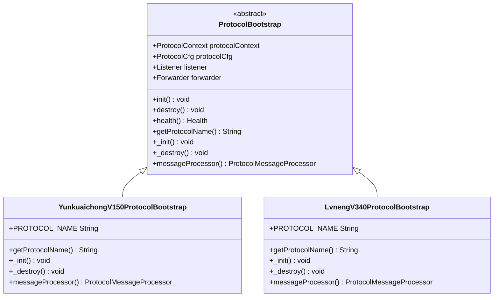
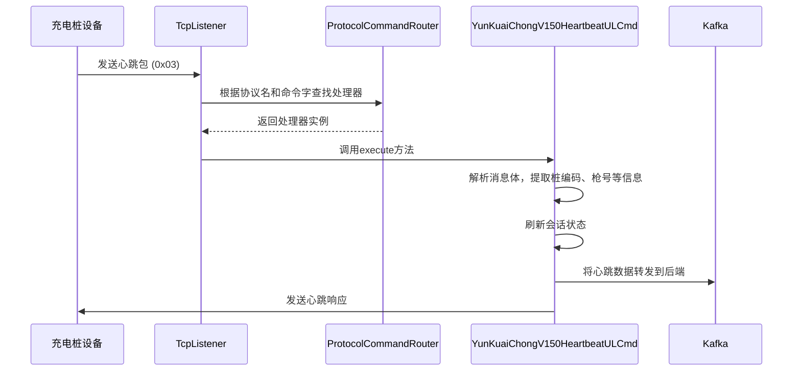
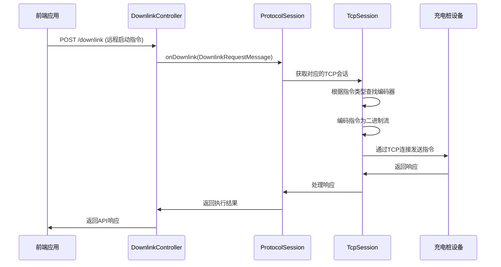
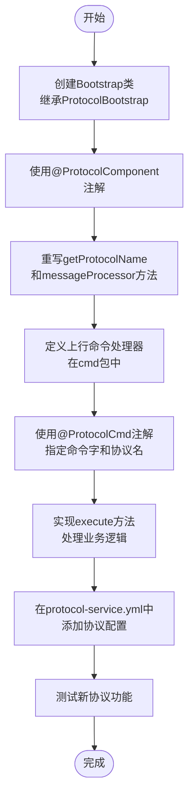

# 协议实现模块

<cite>
**本文档中引用的文件**   
- [ProtocolBootstrap.java](file://jcpp-protocol-api/src/main/java/sanbing/jcpp/protocol/ProtocolBootstrap.java)
- [YunkuaichongV150ProtocolBootstrap.java](file://jcpp-protocol-yunkuaichong/src/main/java/sanbing/jcpp/protocol/yunkuaichong/v150/YunkuaichongV150ProtocolBootstrap.java)
- [LvnengV340ProtocolBootstrap.java](file://jcpp-protocol-lvneng/src/main/java/sanbing/jcpp/protocol/lvneng/v340/LvnengV340ProtocolBootstrap.java)
- [ProtocolCmd.java](file://jcpp-protocol-api/src/main/java/sanbing/jcpp/protocol/annotation/ProtocolCmd.java)
- [ProtocolSession.java](file://jcpp-protocol-api/src/main/java/sanbing/jcpp/protocol/domain/ProtocolSession.java)
- [ProtocolMessageProcessor.java](file://jcpp-protocol-api/src/main/java/sanbing/jcpp/protocol/ProtocolMessageProcessor.java)
- [ProtocolCommandRouter.java](file://jcpp-protocol-api/src/main/java/sanbing/jcpp/protocol/routing/ProtocolCommandRouter.java)
- [protocol-service.yml](file://jcpp-protocol-bootstrap/src/main/resources/protocol-service.yml)
- [YunKuaiChongV150HeartbeatULCmd.java](file://jcpp-protocol-yunkuaichong/src/main/java/sanbing/jcpp/protocol/yunkuaichong/v150/cmd/YunKuaiChongV150HeartbeatULCmd.java)
- [DefaultProtocolsConfigProvider.java](file://jcpp-protocol-api/src/main/java/sanbing/jcpp/protocol/provider/impl/DefaultProtocolsConfigProvider.java)
- [ProtocolContext.java](file://jcpp-protocol-api/src/main/java/sanbing/jcpp/protocol/ProtocolContext.java)
- [DownlinkCmdEnum.java](file://jcpp-protocol-api/src/main/java/sanbing/jcpp/protocol/domain/DownlinkCmdEnum.java)
</cite>

## 目录

1. [引言](#引言)
2. [协议引导类实现](#协议引导类实现)
3. [上行命令处理器设计](#上行命令处理器设计)
4. [下行指令生成与发送](#下行指令生成与发送)
5. [新协议开发指南](#新协议开发指南)
6. [协议版本管理策略](#协议版本管理策略)
7. [配置文件详解](#配置文件详解)

## 引言

本文档旨在为协议实现模块提供详细的开发指南，重点介绍如何基于现有框架扩展新的协议处理功能。通过分析云快充（YunKuaiChong）和绿能（Lvneng）两个具体实现，本文将阐述协议引导类的继承与实现机制、上行命令处理器的设计模式、下行指令的生成与发送流程，并提供新协议开发的分步指南。此外，还将讨论协议版本管理的最佳实践。

## 协议引导类实现

本文档分析了云快充和绿能两种协议的引导类实现，它们都继承自`ProtocolBootstrap`抽象类。该基类提供了协议服务初始化、健康检查和资源销毁的通用框架。
`YunkuaichongV150ProtocolBootstrap`和`LvnengV340ProtocolBootstrap`通过重写抽象方法，实现了特定于各自协议的初始化配置。

**图示来源**

- [ProtocolBootstrap.java](file://jcpp-protocol-api/src/main/java/sanbing/jcpp/protocol/ProtocolBootstrap.java)
- [YunkuaichongV150ProtocolBootstrap.java](file://jcpp-protocol-yunkuaichong/src/main/java/sanbing/jcpp/protocol/yunkuaichong/v150/YunkuaichongV150ProtocolBootstrap.java)
- [LvnengV340ProtocolBootstrap.java](file://jcpp-protocol-lvneng/src/main/java/sanbing/jcpp/protocol/lvneng/v340/LvnengV340ProtocolBootstrap.java)

**本节来源**

- [ProtocolBootstrap.java](file://jcpp-protocol-api/src/main/java/sanbing/jcpp/protocol/ProtocolBootstrap.java#L1-L126)
- [YunkuaichongV150ProtocolBootstrap.java](file://jcpp-protocol-yunkuaichong/src/main/java/sanbing/jcpp/protocol/yunkuaichong/v150/YunkuaichongV150ProtocolBootstrap.java#L1-L47)
- [LvnengV340ProtocolBootstrap.java](file://jcpp-protocol-lvneng/src/main/java/sanbing/jcpp/protocol/lvneng/v340/LvnengV340ProtocolBootstrap.java#L1-L41)

### 云快充V150协议引导类

`YunkuaichongV150ProtocolBootstrap`是云快充1.5.0版本协议的引导类。它通过`@ProtocolComponent`
注解注册到Spring容器中，确保在服务启动时被正确加载。该类的核心是重写`messageProcessor()`方法，返回一个
`YunKuaiChongProtocolMessageProcessor`实例，该实例负责处理所有与云快充协议相关的消息编解码和路由。

### 绿能V340协议引导类

`LvnengV340ProtocolBootstrap`是绿能3.4.0版本协议的引导类，其结构和实现方式与云快充引导类高度相似。它同样通过
`@ProtocolComponent`注解进行注册，并在`messageProcessor()`方法中返回一个`LvnengProtocolMessageProcessor`实例，用于处理绿能协议的特定消息。

## 上行命令处理器设计

上行命令处理器的设计采用了基于注解的命令路由模式。核心是`@ProtocolCmd`注解，它将一个命令类与特定的命令字（value）和协议名称（protocolNames）关联起来。
`ProtocolCommandRouter`负责在应用启动时扫描所有带有`@ProtocolCmd`注解的类，并构建一个从协议名+命令字到处理器实例的映射表。

**图示来源**

- [ProtocolCmd.java](file://jcpp-protocol-api/src/main/java/sanbing/jcpp/protocol/annotation/ProtocolCmd.java)
- [ProtocolCommandRouter.java](file://jcpp-protocol-api/src/main/java/sanbing/jcpp/protocol/routing/ProtocolCommandRouter.java)
- [YunKuaiChongV150HeartbeatULCmd.java](file://jcpp-protocol-yunkuaichong/src/main/java/sanbing/jcpp/protocol/yunkuaichong/v150/cmd/YunKuaiChongV150HeartbeatULCmd.java)

**本节来源**

- [ProtocolCmd.java](file://jcpp-protocol-api/src/main/java/sanbing/jcpp/protocol/annotation/ProtocolCmd.java#L1-L32)
- [ProtocolCommandRouter.java](file://jcpp-protocol-api/src/main/java/sanbing/jcpp/protocol/routing/ProtocolCommandRouter.java#L1-L104)
- [YunKuaiChongV150HeartbeatULCmd.java](file://jcpp-protocol-yunkuaichong/src/main/java/sanbing/jcpp/protocol/yunkuaichong/v150/cmd/YunKuaiChongV150HeartbeatULCmd.java#L1-L84)

### @ProtocolCmd注解详解

`@ProtocolCmd`注解是命令路由机制的核心。其`value`属性定义了命令的唯一标识（如0x03代表心跳），`protocolNames`
属性则指定了该命令适用于哪些协议版本。例如，`YunKuaiChongV150HeartbeatULCmd`的`protocolNames`
包含了V150、V160和V170，表明该处理器可以处理这三个版本的心跳包。

### 心跳包处理器示例

`YunKuaiChongV150HeartbeatULCmd`是一个典型的上行命令处理器。当设备发送心跳包时，`ProtocolCommandRouter`
会根据协议名和命令字0x03找到该处理器。`execute`方法首先解析消息体，提取桩编码、枪号等信息，然后通过
`ProtocolSessionRegistryProvider`激活会话，最后将心跳数据封装成Protobuf消息并发送到Kafka主题，同时向设备发送一个心跳响应。

## 下行指令生成与发送

下行指令的生成与发送流程始于一个REST API调用。当后端应用需要向充电桩发送指令（如远程启动充电）时，它会调用协议服务的REST接口。该请求最终由
`DownlinkController`接收，并通过`ProtocolSession`下发到具体的TCP连接。

**图示来源**

- [DownlinkController.java](file://jcpp-protocol-api/src/main/java/sanbing/jcpp/protocol/adapter/DownlinkController.java)
- [ProtocolSession.java](file://jcpp-protocol-api/src/main/java/sanbing/jcpp/protocol/domain/ProtocolSession.java)
- [TcpSession.java](file://jcpp-protocol-api/src/main/java/sanbing/jcpp/protocol/listener/tcp/TcpSession.java)

**本节来源**

- [ProtocolSession.java](file://jcpp-protocol-api/src/main/java/sanbing/jcpp/protocol/domain/ProtocolSession.java#L1-L123)
- [ProtocolMessageProcessor.java](file://jcpp-protocol-api/src/main/java/sanbing/jcpp/protocol/ProtocolMessageProcessor.java#L1-L77)
- [DownlinkCmdEnum.java](file://jcpp-protocol-api/src/main/java/sanbing/jcpp/protocol/domain/DownlinkCmdEnum.java#L1-L54)

### 流程详解

1. **API调用**：前端或后端服务通过HTTP POST请求调用`/downlink`接口，请求体包含指令类型（如`REMOTE_START_CHARGING`）和相关参数。
2. **指令接收**：`DownlinkController`接收到请求，将其转换为`DownlinkRequestMessage`对象。
3. **会话查找**：控制器通过`ProtocolSessionRegistryProvider`根据桩编码找到对应的`ProtocolSession`。
4. **指令下发**：`ProtocolSession`的`onDownlink`方法被调用，它会将指令委托给底层的`TcpSession`。
5. **消息编码**：`TcpSession`根据指令类型（由`DownlinkCmdEnum`定义）查找对应的编码器，将Protobuf消息编码为协议规定的二进制格式。
6. **网络发送**：编码后的二进制流通过Netty的`Channel`发送到充电桩设备。
7. **响应处理**：设备返回响应后，`TcpSession`会根据响应的命令字触发相应的上行处理器进行处理。

## 新协议开发指南

开发一个新协议的实现可以遵循以下分步指南：

### 第一步：创建Bootstrap类

1. 在`jcpp-protocol-<your-protocol-name>`模块中创建一个新的包，例如`v100`。
2. 创建一个名为`YourProtocolV100Bootstrap`的类，继承`ProtocolBootstrap`。
3. 使用`@ProtocolComponent`注解标记该类，并传入协议的唯一名称。
4. 重写`getProtocolName()`方法，返回协议名称常量。
5. 重写`messageProcessor()`方法，返回一个自定义的`ProtocolMessageProcessor`实现。

### 第二步：定义消息处理器

1. 创建一个`cmd`包来存放所有命令处理器。
2. 为每个上行命令创建一个处理器类，例如`YourProtocolV100LoginULCmd`。
3. 让处理器类继承`AbstractProtocolUplinkCmdExe`或类似基类。
4. 使用`@ProtocolCmd`注解标记该类，指定命令字和适用的协议名称。
5. 重写`execute`方法，实现消息解析、业务逻辑处理和响应生成。

### 第三步：配置文件

1. 在`protocol-service.yml`文件的`service.protocols`节点下，为新协议添加一个配置项。
2. 配置`enabled`、`listener.tcp.bind-port`和`forwarder.type`等关键参数。
3. 确保`bind-port`不与其他协议冲突。

**图示来源**

- [YunkuaichongV150ProtocolBootstrap.java](file://jcpp-protocol-yunkuaichong/src/main/java/sanbing/jcpp/protocol/yunkuaichong/v150/YunkuaichongV150ProtocolBootstrap.java)
- [YunKuaiChongV150HeartbeatULCmd.java](file://jcpp-protocol-yunkuaichong/src/main/java/sanbing/jcpp/protocol/yunkuaichong/v150/cmd/YunKuaiChongV150HeartbeatULCmd.java)
- [protocol-service.yml](file://jcpp-protocol-bootstrap/src/main/resources/protocol-service.yml)

**本节来源**

- [YunkuaichongV150ProtocolBootstrap.java](file://jcpp-protocol-yunkuaichong/src/main/java/sanbing/jcpp/protocol/yunkuaichong/v150/YunkuaichongV150ProtocolBootstrap.java#L1-L47)
- [YunKuaiChongV150HeartbeatULCmd.java](file://jcpp-protocol-yunkuaichong/src/main/java/sanbing/jcpp/protocol/yunkuaichong/v150/cmd/YunKuaiChongV150HeartbeatULCmd.java#L1-L84)
- [protocol-service.yml](file://jcpp-protocol-bootstrap/src/main/resources/protocol-service.yml#L1-L273)

## 协议版本管理策略

本框架通过模块化和配置化的方式支持多协议版本管理。每个协议版本都有独立的Bootstrap类和命令处理器，这使得不同版本的协议可以并行运行而互不干扰。

### 策略一：独立版本模块

如云快充协议所示，`v150`、`v160`和`v170`分别有独立的`YunkuaichongV150ProtocolBootstrap`、
`YunkuaichongV160ProtocolBootstrap`和`YunkuaichongV170ProtocolBootstrap`。每个版本监听不同的TCP端口（38001, 38002,
38003），从而实现了物理隔离。

### 策略二：共享处理器

对于功能兼容的版本，可以共享部分命令处理器。例如，`YunKuaiChongV150HeartbeatULCmd`的`@ProtocolCmd`注解中`protocolNames`
包含了V150、V160和V170，这意味着同一个处理器可以处理这三个版本的心跳包，减少了代码重复。

### 策略三：配置驱动

协议的启用、端口、转发器类型等都通过`protocol-service.yml`文件中的配置项控制。通过环境变量（如
`PROTOCOLS_YUNKUAICHONGV150_ENABLED`）可以动态地启用或禁用某个协议版本，无需重新编译代码。

**本节来源**

- [YunkuaichongV150ProtocolBootstrap.java](file://jcpp-protocol-yunkuaichong/src/main/java/sanbing/jcpp/protocol/yunkuaichong/v150/YunkuaichongV150ProtocolBootstrap.java)
- [YunkuaichongV160ProtocolBootstrap.java](file://jcpp-protocol-yunkuaichong/src/main/java/sanbing/jcpp/protocol/yunkuaichong/v160/YunkuaichongV160ProtocolBootstrap.java)
- [YunkuaichongV170ProtocolBootstrap.java](file://jcpp-protocol-yunkuaichong/src/main/java/sanbing/jcpp/protocol/yunkuaichong/v170/YunkuaichongV170ProtocolBootstrap.java)
- [protocol-service.yml](file://jcpp-protocol-bootstrap/src/main/resources/protocol-service.yml)

## 配置文件详解

`protocol-service.yml`是协议服务的核心配置文件，它定义了所有协议的运行参数。

### 协议配置结构

每个协议的配置都位于`service.protocols`节点下，以协议名称（如`yunkuaichongV150`）作为键。其主要包含两个子节点：

- **listener.tcp**: 定义TCP监听器的配置，包括`bind-address`、`bind-port`、线程池大小和连接超时等。
- **forwarder**: 定义消息转发器的配置，包括`type`（kafka或memory）和具体的转发目标（如Kafka主题）。

### 环境变量注入

配置文件大量使用了环境变量（如`${PROTOCOLS_YUNKUAICHONGV150_LISTENER_TCP_BIND_PORT:38001}`
），这使得服务可以在不同环境中灵活部署。冒号后的值是默认值，当环境变量未设置时使用。

### 拆包器配置

`listener.tcp.handler.configuration`是一个关键配置，它定义了Netty的拆包器。例如，云快充协议使用
`JCPPLengthFieldBasedFrameDecoder`，并指定了帧头、长度字段偏移量等参数，确保能正确解析设备发送的二进制流。

**本节来源**

- [protocol-service.yml](file://jcpp-protocol-bootstrap/src/main/resources/protocol-service.yml#L1-L273)
- [DefaultProtocolsConfigProvider.java](file://jcpp-protocol-api/src/main/java/sanbing/jcpp/protocol/provider/impl/DefaultProtocolsConfigProvider.java#L1-L38)
- [ProtocolCfg.java](file://jcpp-protocol-api/src/main/java/sanbing/jcpp/protocol/cfg/ProtocolCfg.java#L1-L26)