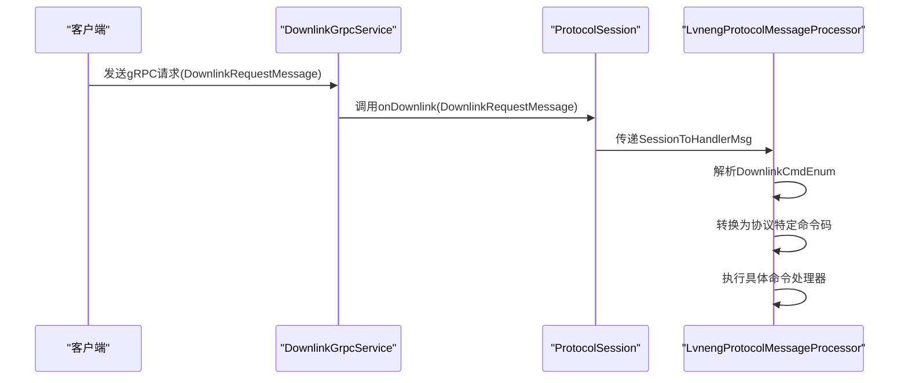
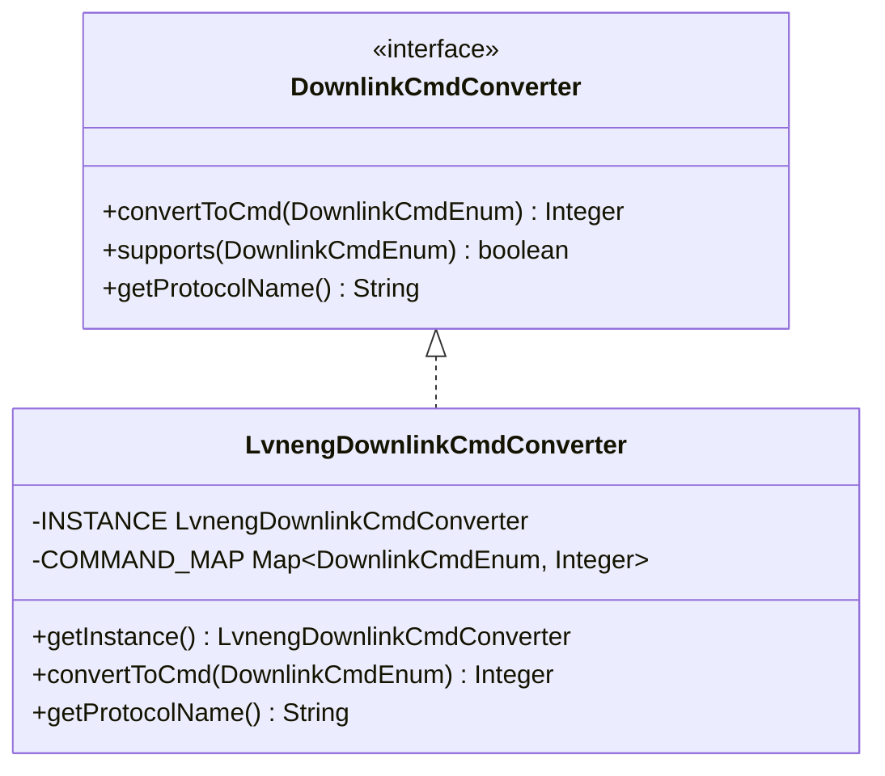
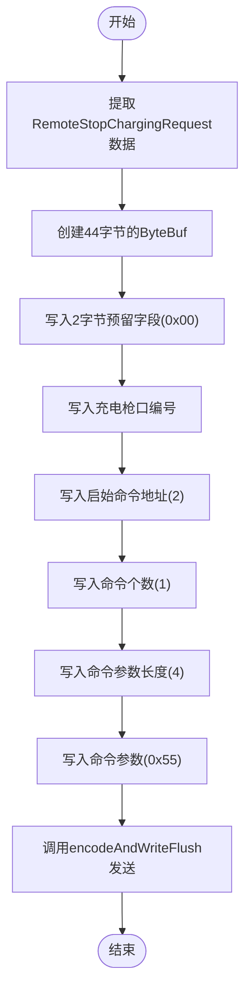
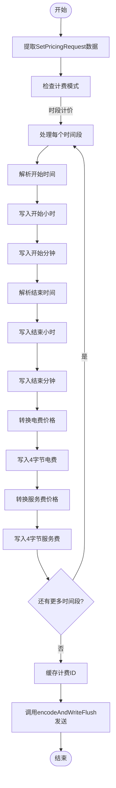
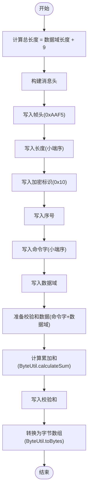
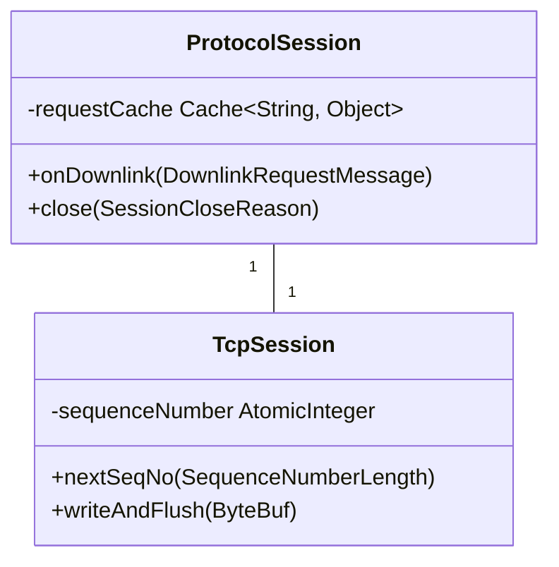
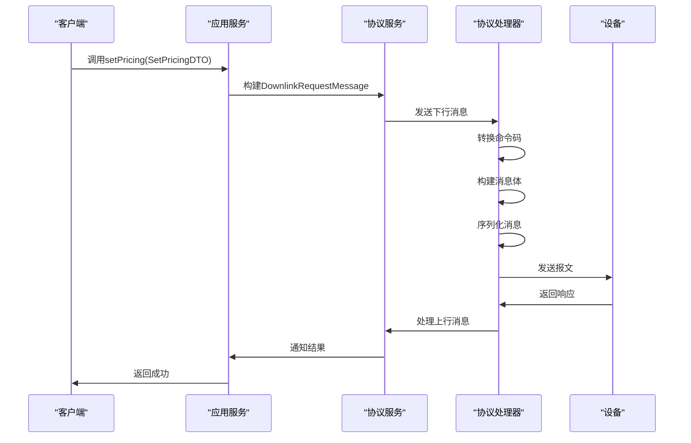

# 下行消息处理

<cite>
**本文档引用的文件**  
- [LvnengDownlinkCmdExe.java](file://jcpp-protocol-lvneng/src/main/java/sanbing/jcpp/protocol/lvneng/LvnengDownlinkCmdExe.java)
- [LvnengDownlinkCmdConverter.java](file://jcpp-protocol-lvneng/src/main/java/sanbing/jcpp/protocol/lvneng/mapping/LvnengDownlinkCmdConverter.java)
- [LvnengV340RemoteStopDLCmd.java](file://jcpp-protocol-lvneng/src/main/java/sanbing/jcpp/protocol/lvneng/v340/cmd/LvnengV340RemoteStopDLCmd.java)
- [LvnengV340SetPricingModelDLCmd.java](file://jcpp-protocol-lvneng/src/main/java/sanbing/jcpp/protocol/lvneng/v340/cmd/LvnengV340SetPricingModelDLCmd.java)
- [AbstractLvnengCmdExe.java](file://jcpp-protocol-lvneng/src/main/java/sanbing/jcpp/protocol/lvneng/AbstractLvnengCmdExe.java)
- [LvnengProtocolMessageProcessor.java](file://jcpp-protocol-lvneng/src/main/java/sanbing/jcpp/protocol/lvneng/LvnengProtocolMessageProcessor.java)
- [DefaultPileProtocolService.java](file://jcpp-app/src/main/java/sanbing/jcpp/app/service/impl/DefaultPileProtocolService.java)
- [TcpSession.java](file://jcpp-protocol-api/src/main/java/sanbing/jcpp/protocol/listener/tcp/TcpSession.java)
- [ProtocolSession.java](file://jcpp-protocol-api/src/main/java/sanbing/jcpp/protocol/domain/ProtocolSession.java)
</cite>

## 目录

1. [引言](#引言)
2. [gRPC调用接收与下行指令生成](#grpc调用接收与下行指令生成)
3. [协议命令转换机制](#协议命令转换机制)
4. [具体下行命令实现](#具体下行命令实现)
5. [消息序列化过程](#消息序列化过程)
6. [指令重试与超时处理](#指令重试与超时处理)
7. [完整时序图与报文格式示例](#完整时序图与报文格式示例)
8. [结论](#结论)

## 引言

本文档系统阐述了绿能协议v3.40的下行消息处理流程。重点分析了从gRPC请求到设备响应的完整处理链路，包括LvnengDownlinkCmdExe如何接收gRPC调用并生成相应的下行指令，LvnengDownlinkCmdConverter如何将通用的协议命令转换为绿能协议特有的命令码，以及具体下行命令的实现细节。同时描述了消息序列化过程、指令重试机制和超时处理策略，并提供了完整的时序图和报文格式示例。

**本文档引用的文件**

- [LvnengDownlinkCmdExe.java](file://jcpp-protocol-lvneng/src/main/java/sanbing/jcpp/protocol/lvneng/LvnengDownlinkCmdExe.java)
- [LvnengDownlinkCmdConverter.java](file://jcpp-protocol-lvneng/src/main/java/sanbing/jcpp/protocol/lvneng/mapping/LvnengDownlinkCmdConverter.java)
- [LvnengV340RemoteStopDLCmd.java](file://jcpp-protocol-lvneng/src/main/java/sanbing/jcpp/protocol/lvneng/v340/cmd/LvnengV340RemoteStopDLCmd.java)
- [LvnengV340SetPricingModelDLCmd.java](file://jcpp-protocol-lvneng/src/main/java/sanbing/jcpp/protocol/lvneng/v340/cmd/LvnengV340SetPricingModelDLCmd.java)
- [AbstractLvnengCmdExe.java](file://jcpp-protocol-lvneng/src/main/java/sanbing/jcpp/protocol/lvneng/AbstractLvnengCmdExe.java)
- [LvnengProtocolMessageProcessor.java](file://jcpp-protocol-lvneng/src/main/java/sanbing/jcpp/protocol/lvneng/LvnengProtocolMessageProcessor.java)
- [DefaultPileProtocolService.java](file://jcpp-app/src/main/java/sanbing/jcpp/app/service/impl/DefaultPileProtocolService.java)
- [TcpSession.java](file://jcpp-protocol-api/src/main/java/sanbing/jcpp/protocol/listener/tcp/TcpSession.java)
- [ProtocolSession.java](file://jcpp-protocol-api/src/main/java/sanbing/jcpp/protocol/domain/ProtocolSession.java)

## gRPC调用接收与下行指令生成

绿能协议v3.40的下行消息处理流程始于gRPC调用的接收。系统通过`DownlinkGrpcService`接收来自客户端的gRPC请求，这些请求被封装为
`DownlinkRequestMessage`对象。当gRPC服务接收到请求时，会通过`ProtocolSession`的`onDownlink`方法将消息传递给协议处理器。

`LvnengProtocolMessageProcessor`作为核心处理器，负责处理所有下行消息。它通过`doDownlinkHandle`方法接收
`SessionToHandlerMsg`对象，该对象包含了`DownlinkRequestMessage`和`TcpSession`。处理器首先从`DownlinkRequestMessage`中提取
`downlinkCmd`字段，并通过`DownlinkCmdEnum.valueOf()`将其转换为枚举类型。



**Diagram sources**

- [DownlinkGrpcService.java](file://jcpp-protocol-api/src/main/java/sanbing/jcpp/protocol/adapter/DownlinkGrpcService.java#L123-L151)
- [ProtocolSession.java](file://jcpp-protocol-api/src/main/java/sanbing/jcpp/protocol/domain/ProtocolSession.java#L0-L77)
- [LvnengProtocolMessageProcessor.java](file://jcpp-protocol-lvneng/src/main/java/sanbing/jcpp/protocol/lvneng/LvnengProtocolMessageProcessor.java#L0-L186)

**本文档引用的文件**

- [LvnengProtocolMessageProcessor.java](file://jcpp-protocol-lvneng/src/main/java/sanbing/jcpp/protocol/lvneng/LvnengProtocolMessageProcessor.java)
- [DownlinkGrpcService.java](file://jcpp-protocol-api/src/main/java/sanbing/jcpp/protocol/adapter/DownlinkGrpcService.java)
- [ProtocolSession.java](file://jcpp-protocol-api/src/main/java/sanbing/jcpp/protocol/domain/ProtocolSession.java)

## 协议命令转换机制

绿能协议v3.40使用`LvnengDownlinkCmdConverter`类来实现通用协议命令到绿能协议特定命令码的转换。该类实现了
`DownlinkCmdConverter`接口，采用单例模式确保全局唯一实例。

转换器内部使用`ConcurrentHashMap`存储命令映射关系，提供O(1)的查找性能。在静态初始化块中，预定义了绿能协议支持的所有命令映射：

```java
static {
    COMMAND_MAP.put(DownlinkCmdEnum.LOGIN_ACK, 105);
    COMMAND_MAP.put(DownlinkCmdEnum.SYNC_TIME_REQUEST, 3);
    COMMAND_MAP.put(DownlinkCmdEnum.TRANSACTION_RECORD_ACK, 201);
    COMMAND_MAP.put(DownlinkCmdEnum.HEARTBEAT_ACK, 101);
    COMMAND_MAP.put(DownlinkCmdEnum.REAL_TIME_DATA_ACK, 103);
    COMMAND_MAP.put(DownlinkCmdEnum.SET_PRICING, 1103);
    COMMAND_MAP.put(DownlinkCmdEnum.REMOTE_STOP_CHARGING, 5);
    COMMAND_MAP.put(DownlinkCmdEnum.SET_QRCODE, 3);
}
```

当需要转换命令时，`convertToCmd`方法会根据传入的`DownlinkCmdEnum`
返回对应的协议特定命令码。如果命令不被支持，则返回null。这种设计使得命令转换过程高效且易于维护，新增命令只需在静态块中添加映射关系即可。



**Diagram sources**

- [LvnengDownlinkCmdConverter.java](file://jcpp-protocol-lvneng/src/main/java/sanbing/jcpp/protocol/lvneng/mapping/LvnengDownlinkCmdConverter.java#L0-L75)
- [DownlinkCmdConverter.java](file://jcpp-protocol-api/src/main/java/sanbing/jcpp/protocol/mapping/DownlinkCmdConverter.java#L0-L44)

**本文档引用的文件**

- [LvnengDownlinkCmdConverter.java](file://jcpp-protocol-lvneng/src/main/java/sanbing/jcpp/protocol/lvneng/mapping/LvnengDownlinkCmdConverter.java)

## 具体下行命令实现

### 远程停止充电指令实现

`LvnengV340RemoteStopDLCmd`类负责处理远程停止充电指令。该类继承自`LvnengDownlinkCmdExe`，并使用`@ProtocolCmd`
注解标记其支持的命令码为5，协议版本为V340。

在`execute`方法中，首先从`LvnengDwonlinkMessage`中提取`RemoteStopChargingRequest`对象，获取充电桩编码和充电枪号。然后构建消息体
`ByteBuf`，按照协议规范填充数据：

1. 写入2字节预留字段（值为0x00）
2. 写入1字节充电枪口编号
3. 写入4字节启始命令地址（值为2）
4. 写入1字节命令个数（值为1）
5. 写入2字节命令参数长度（值为4）
6. 写入4字节命令参数（值为0x55）

最后调用`encodeAndWriteFlush`方法将指令发送到设备。



**Diagram sources**

- [LvnengV340RemoteStopDLCmd.java](file://jcpp-protocol-lvneng/src/main/java/sanbing/jcpp/protocol/lvneng/v340/cmd/LvnengV340RemoteStopDLCmd.java#L0-L67)

**本文档引用的文件**

- [LvnengV340RemoteStopDLCmd.java](file://jcpp-protocol-lvneng/src/main/java/sanbing/jcpp/protocol/lvneng/v340/cmd/LvnengV340RemoteStopDLCmd.java)

### 电价设置报文实现

`LvnengV340SetPricingModelDLCmd`类负责生成电价设置报文。该类同样继承自`LvnengDownlinkCmdExe`，并使用`@ProtocolCmd`
注解标记其支持的命令码为1103，协议版本为V340。

在`execute`方法中，首先从`SetPricingRequest`中提取计费模型信息。对于时段计价模式，遍历所有时间段，将每个时间段的开始时间、结束时间、电费和服务费编码到消息体中：

1. 将开始时间解析为`LocalTime`对象，分别写入小时和分钟
2. 将结束时间解析为`LocalTime`对象，分别写入小时和分钟
3. 将电费价格乘以10000后转换为整数，写入4字节
4. 将服务费价格乘以10000后转换为整数，写入4字节

价格转换通过`buildPrice`方法实现，使用`BigDecimal`进行精确计算，避免浮点数精度问题。在发送指令前，将计费ID存入会话的请求缓存中，用于后续的响应匹配。



**Diagram sources**

- [LvnengV340SetPricingModelDLCmd.java](file://jcpp-protocol-lvneng/src/main/java/sanbing/jcpp/protocol/lvneng/v340/cmd/LvnengV340SetPricingModelDLCmd.java#L0-L98)

**本文档引用的文件**

- [LvnengV340SetPricingModelDLCmd.java](file://jcpp-protocol-lvneng/src/main/java/sanbing/jcpp/protocol/lvneng/v340/cmd/LvnengV340SetPricingModelDLCmd.java)

## 消息序列化过程

绿能协议v3.40的消息序列化过程由`AbstractLvnengCmdExe`类的`encode`
方法实现。该方法按照协议规范构建完整的下行消息帧，格式为：帧头(2) + 长度(2) + 加密标识(1) + 序号(1) + 命令字(2) + 数据域(
n) + 校验和(1)。

序列化过程分为以下几个步骤：

1. 计算总长度：数据域长度 + 9字节固定头尾
2. 构建消息头和数据域：依次写入帧头、长度、加密标识、序号、命令字和数据域
3. 准备校验和计算数据：命令字 + 数据域
4. 计算并写入校验和：使用`ByteUtil.calculateSum`方法计算累加和
5. 转换为字节数组：使用`ByteUtil.toBytes`方法将`ByteBuf`转换为字节数组



**Diagram sources**

- [AbstractLvnengCmdExe.java](file://jcpp-protocol-lvneng/src/main/java/sanbing/jcpp/protocol/lvneng/AbstractLvnengCmdExe.java#L30-L60)

**本文档引用的文件**

- [AbstractLvnengCmdExe.java](file://jcpp-protocol-lvneng/src/main/java/sanbing/jcpp/protocol/lvneng/AbstractLvnengCmdExe.java)

## 指令重试与超时处理

绿能协议v3.40的指令重试与超时处理机制主要通过会话层的请求缓存和定时任务实现。`ProtocolSession`类维护了一个`requestCache`
，用于存储待确认的请求。该缓存使用Caffeine构建，具有以下特性：

- 初始容量：1000
- 最大容量：1000
- 过期策略：访问后1分钟过期

当发送下行指令时，相关的请求ID和业务数据会被存入缓存。如果在规定时间内未收到设备的响应，缓存项将自动过期，触发重试逻辑。
`TcpSession`类维护了一个原子整数`sequenceNumber`，用于生成消息序号，确保每条消息的唯一性。



**Diagram sources**

- [ProtocolSession.java](file://jcpp-protocol-api/src/main/java/sanbing/jcpp/protocol/domain/ProtocolSession.java#L46-L77)
- [TcpSession.java](file://jcpp-protocol-api/src/main/java/sanbing/jcpp/protocol/listener/tcp/TcpSession.java#L41-L98)

**本文档引用的文件**

- [ProtocolSession.java](file://jcpp-protocol-api/src/main/java/sanbing/jcpp/protocol/domain/ProtocolSession.java)
- [TcpSession.java](file://jcpp-protocol-api/src/main/java/sanbing/jcpp/protocol/listener/tcp/TcpSession.java)

## 完整时序图与报文格式示例

### 完整时序图



### 报文格式示例

以远程停止充电指令为例，完整的报文格式如下：

| 字段   | 长度(字节) | 值(十六进制)             | 说明                   |
|------|--------|---------------------|----------------------|
| 帧头   | 2      | AAF5                | 固定值                  |
| 长度   | 2      | 002C                | 总长度44字节              |
| 加密标识 | 1      | 10                  | 固定值                  |
| 序号   | 1      | 01                  | 消息序号                 |
| 命令字  | 2      | 0005                | REMOTE_STOP_CHARGING |
| 数据域  | 44     | 0000010200010455... | 消息体                  |
| 校验和  | 1      | XX                  | 累加和校验                |

**本文档引用的文件**

- [LvnengProtocolMessageProcessor.java](file://jcpp-protocol-lvneng/src/main/java/sanbing/jcpp/protocol/lvneng/LvnengProtocolMessageProcessor.java)
- [AbstractLvnengCmdExe.java](file://jcpp-protocol-lvneng/src/main/java/sanbing/jcpp/protocol/lvneng/AbstractLvnengCmdExe.java)
- [LvnengV340RemoteStopDLCmd.java](file://jcpp-protocol-lvneng/src/main/java/sanbing/jcpp/protocol/lvneng/v340/cmd/LvnengV340RemoteStopDLCmd.java)

## 结论

本文档详细阐述了绿能协议v3.40的下行消息处理流程。系统通过gRPC接口接收外部请求，经由`LvnengProtocolMessageProcessor`
进行命令解析和路由，使用`LvnengDownlinkCmdConverter`将通用命令转换为协议特定命令码，并通过具体的命令执行器（如
`LvnengV340RemoteStopDLCmd`和`LvnengV340SetPricingModelDLCmd`
）生成相应的下行指令。消息序列化过程严格遵循协议规范，包含帧头、长度、加密标识、序号、命令字、数据域和校验和等字段。指令重试与超时处理通过会话层的请求缓存机制实现，确保了通信的可靠性。整个流程设计合理，模块职责清晰，为充电桩远程控制提供了稳定可靠的基础。