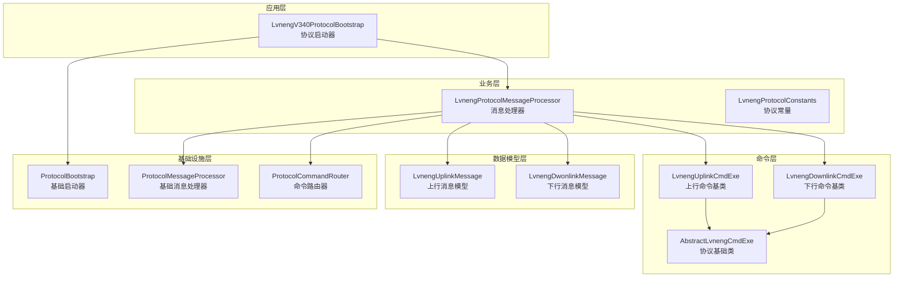
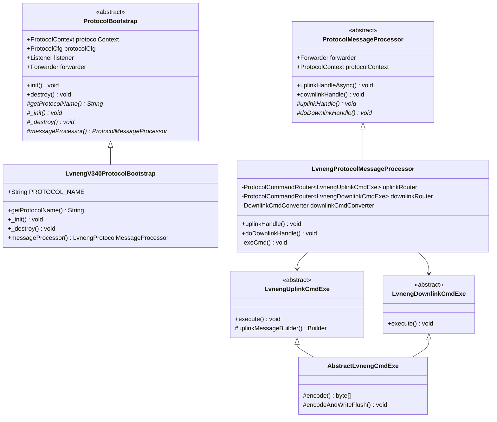
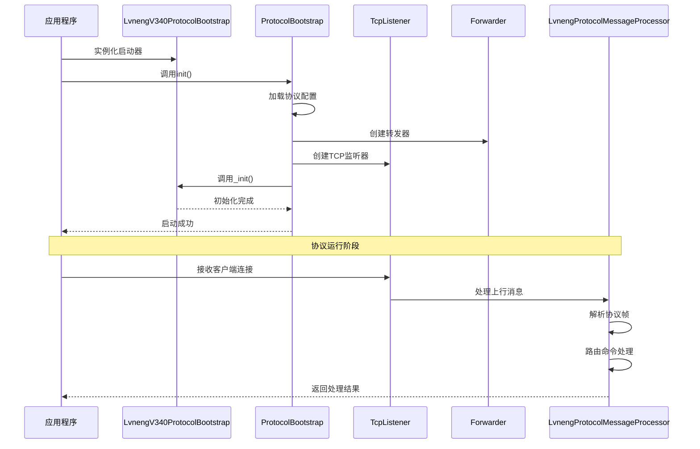
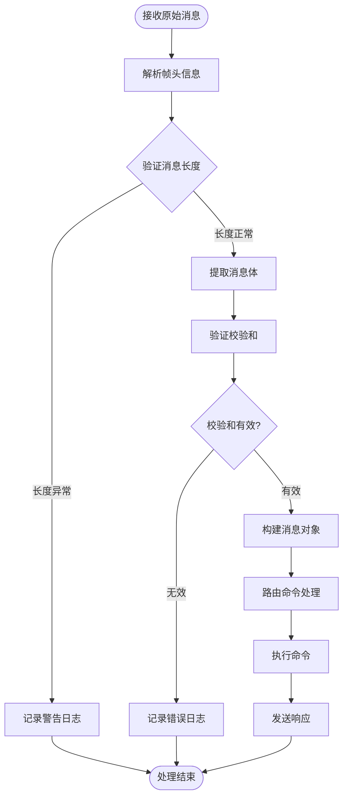
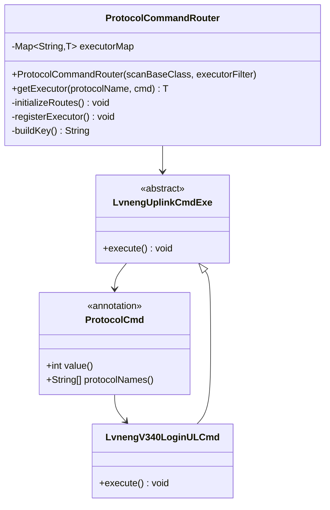
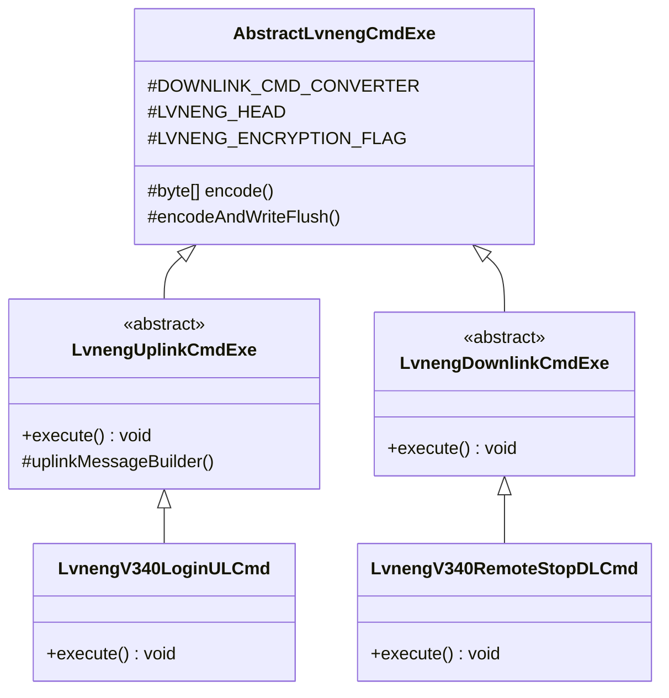
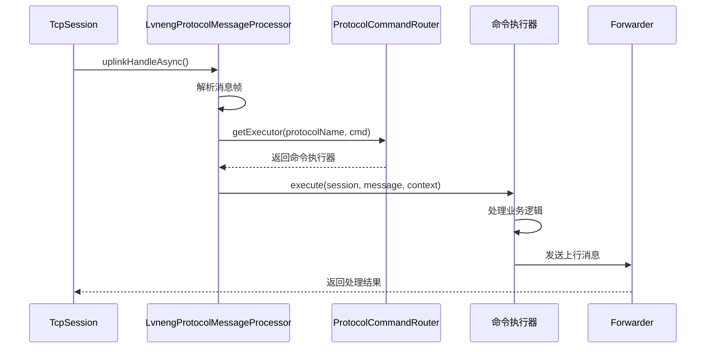
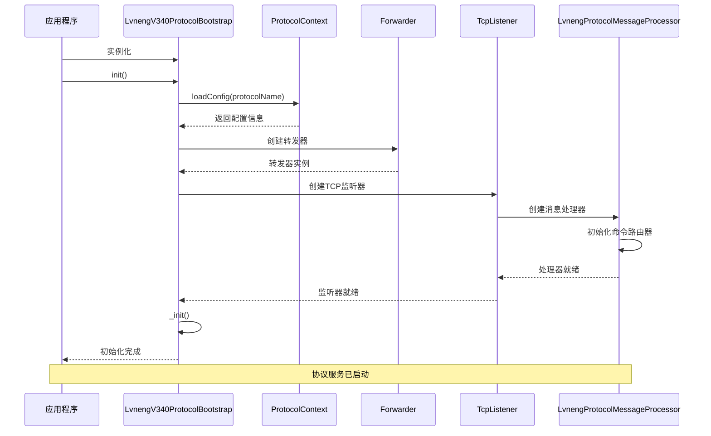
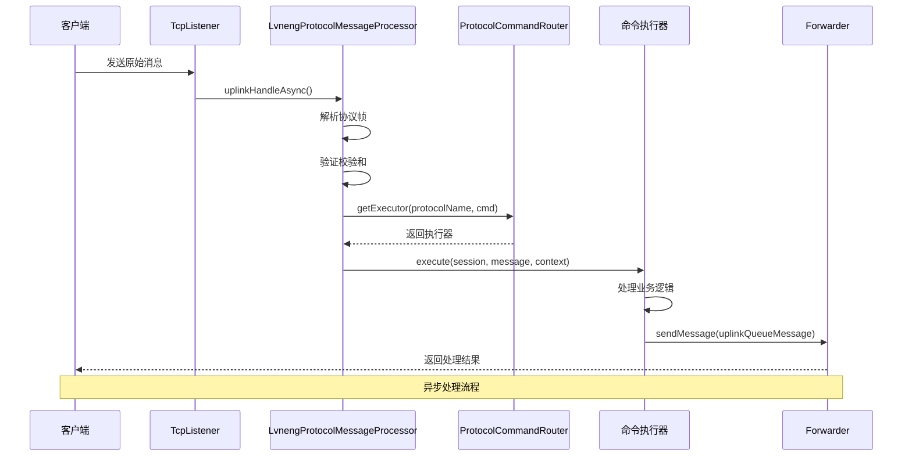

# 绿能协议v3.40核心架构设计

<cite>
**本文档引用的文件**
- [LvnengV340ProtocolBootstrap.java](file://jcpp-protocol-lvneng/src/main/java/sanbing/jcpp/protocol/lvneng/v340/LvnengV340ProtocolBootstrap.java)
- [LvnengProtocolMessageProcessor.java](file://jcpp-protocol-lvneng/src/main/java/sanbing/jcpp/protocol/lvneng/LvnengProtocolMessageProcessor.java)
- [LvnengProtocolConstants.java](file://jcpp-protocol-lvneng/src/main/java/sanbing/jcpp/protocol/lvneng/LvnengProtocolConstants.java)
- [ProtocolBootstrap.java](file://jcpp-protocol-api/src/main/java/sanbing/jcpp/protocol/ProtocolBootstrap.java)
- [ProtocolMessageProcessor.java](file://jcpp-protocol-api/src/main/java/sanbing/jcpp/protocol/ProtocolMessageProcessor.java)
- [LvnengUplinkMessage.java](file://jcpp-protocol-lvneng/src/main/java/sanbing/jcpp/protocol/lvneng/LvnengUplinkMessage.java)
- [LvnengDwonlinkMessage.java](file://jcpp-protocol-lvneng/src/main/java/sanbing/jcpp/protocol/lvneng/LvnengDwonlinkMessage.java)
- [LvnengUplinkCmdExe.java](file://jcpp-protocol-lvneng/src/main/java/sanbing/jcpp/protocol/lvneng/LvnengUplinkCmdExe.java)
- [LvnengDownlinkCmdExe.java](file://jcpp-protocol-lvneng/src/main/java/sanbing/jcpp/protocol/lvneng/LvnengDownlinkCmdExe.java)
- [AbstractLvnengCmdExe.java](file://jcpp-protocol-lvneng/src/main/java/sanbing/jcpp/protocol/lvneng/AbstractLvnengCmdExe.java)
- [LvnengV340LoginULCmd.java](file://jcpp-protocol-lvneng/src/main/java/sanbing/jcpp/protocol/lvneng/v340/cmd/LvnengV340LoginULCmd.java)
- [LvnengV340RemoteStopDLCmd.java](file://jcpp-protocol-lvneng/src/main/java/sanbing/jcpp/protocol/lvneng/v340/cmd/LvnengV340RemoteStopDLCmd.java)
- [TcpListener.java](file://jcpp-protocol-api/src/main/java/sanbing/jcpp/protocol/listener/tcp/TcpListener.java)
- [ProtocolCommandRouter.java](file://jcpp-protocol-api/src/main/java/sanbing/jcpp/protocol/routing/ProtocolCommandRouter.java)
</cite>

## 目录

1. [引言](#引言)
2. [项目结构概览](#项目结构概览)
3. [核心组件架构](#核心组件架构)
4. [协议启动器设计](#协议启动器设计)
5. [消息处理机制](#消息处理机制)
6. [协议帧结构设计](#协议帧结构设计)
7. [命令路由系统](#命令路由系统)
8. [组件交互时序](#组件交互时序)
9. [性能优化考虑](#性能优化考虑)
10. [总结](#总结)

## 引言

绿能协议v3.40是JCPP（充电点协议平台）中的一个重要组成部分，专门用于处理绿能品牌的充电设备通信协议。该协议采用模块化设计，通过继承和组合模式实现了高度可扩展的架构。本文档将深入分析其核心架构设计，包括协议启动器、消息处理器、帧结构设计以及组件间的协作机制。

## 项目结构概览

绿能协议v3.40的项目结构遵循分层架构原则，主要分为以下几个层次：



**图表来源**

- [LvnengV340ProtocolBootstrap.java](file://jcpp-protocol-lvneng/src/main/java/sanbing/jcpp/protocol/lvneng/v340/LvnengV340ProtocolBootstrap.java#L1-L42)
- [LvnengProtocolMessageProcessor.java](file://jcpp-protocol-lvneng/src/main/java/sanbing/jcpp/protocol/lvneng/LvnengProtocolMessageProcessor.java#L1-L187)
- [ProtocolBootstrap.java](file://jcpp-protocol-api/src/main/java/sanbing/jcpp/protocol/ProtocolBootstrap.java#L1-L127)

## 核心组件架构

### 组件关系图

绿能协议v3.40的核心架构采用了经典的分层设计模式，各组件之间通过接口进行解耦：



**图表来源**

- [ProtocolBootstrap.java](file://jcpp-protocol-api/src/main/java/sanbing/jcpp/protocol/ProtocolBootstrap.java#L25-L127)
- [LvnengV340ProtocolBootstrap.java](file://jcpp-protocol-lvneng/src/main/java/sanbing/jcpp/protocol/lvneng/v340/LvnengV340ProtocolBootstrap.java#L15-L42)
- [ProtocolMessageProcessor.java](file://jcpp-protocol-api/src/main/java/sanbing/jcpp/protocol/ProtocolMessageProcessor.java#L20-L78)

**章节来源**

- [ProtocolBootstrap.java](file://jcpp-protocol-api/src/main/java/sanbing/jcpp/protocol/ProtocolBootstrap.java#L1-L127)
- [LvnengV340ProtocolBootstrap.java](file://jcpp-protocol-lvneng/src/main/java/sanbing/jcpp/protocol/lvneng/v340/LvnengV340ProtocolBootstrap.java#L1-L42)
- [ProtocolMessageProcessor.java](file://jcpp-protocol-api/src/main/java/sanbing/jcpp/protocol/ProtocolMessageProcessor.java#L1-L78)

## 协议启动器设计

### LvnengV340ProtocolBootstrap核心实现

LvnengV340ProtocolBootstrap作为绿能协议v3.40的主要入口点，继承自ProtocolBootstrap抽象类，并实现了协议特有的初始化和销毁逻辑。

#### 继承关系与方法实现

协议启动器通过以下方式实现核心功能：

1. **协议名称管理**：通过`getProtocolName()`方法返回协议标识
2. **初始化逻辑**：重写了`_init()`方法，目前为空实现
3. **资源清理**：重写了`_destroy()`方法，目前为空实现
4. **消息处理器创建**：通过`messageProcessor()`方法创建具体的处理器实例

#### 启动流程时序图



**图表来源**

- [LvnengV340ProtocolBootstrap.java](file://jcpp-protocol-lvneng/src/main/java/sanbing/jcpp/protocol/lvneng/v340/LvnengV340ProtocolBootstrap.java#L25-L42)
- [ProtocolBootstrap.java](file://jcpp-protocol-api/src/main/java/sanbing/jcpp/protocol/ProtocolBootstrap.java#L45-L85)

**章节来源**

- [LvnengV340ProtocolBootstrap.java](file://jcpp-protocol-lvneng/src/main/java/sanbing/jcpp/protocol/lvneng/v340/LvnengV340ProtocolBootstrap.java#L1-L42)
- [ProtocolBootstrap.java](file://jcpp-protocol-api/src/main/java/sanbing/jcpp/protocol/ProtocolBootstrap.java#L45-L85)

## 消息处理机制

### LvnengProtocolMessageProcessor核心功能

LvnengProtocolMessageProcessor是绿能协议的消息处理中心，负责处理上行和下行消息流。它继承自ProtocolMessageProcessor，并实现了协议特定的消息解析和路由逻辑。

#### 消息处理架构



**图表来源**

- [LvnengProtocolMessageProcessor.java](file://jcpp-protocol-lvneng/src/main/java/sanbing/jcpp/protocol/lvneng/LvnengProtocolMessageProcessor.java#L55-L120)

#### 上行消息处理流程

上行消息处理包含以下关键步骤：

1. **帧头解析**：读取起始符、长度、加密标识、序列号和命令码
2. **长度验证**：确保消息长度符合最小要求
3. **消息体提取**：读取实际的数据内容
4. **校验和验证**：使用CRC算法验证数据完整性
5. **消息对象构建**：封装为LvnengUplinkMessage对象
6. **命令路由**：根据命令类型路由到相应的处理器

#### 下行消息处理流程

下行消息处理采用统一的处理模式：

1. **命令转换**：将通用命令转换为协议特定命令
2. **消息构建**：创建LvnengDwonlinkMessage对象
3. **命令执行**：调用相应的命令处理器
4. **响应发送**：将处理结果发送给客户端

**章节来源**

- [LvnengProtocolMessageProcessor.java](file://jcpp-protocol-lvneng/src/main/java/sanbing/jcpp/protocol/lvneng/LvnengProtocolMessageProcessor.java#L55-L187)

## 协议帧结构设计

### 帧结构定义

绿能协议v3.40采用固定格式的帧结构，确保消息的可靠传输和解析：

| 字段   | 长度(字节) | 描述                |
|------|--------|-------------------|
| 起始符  | 2      | 固定值0xAAF5，标识帧开始   |
| 长度   | 2      | 包含整个帧的总长度（小端序）    |
| 加密标识 | 1      | 0x10表示加密，0x00表示明文 |
| 序列号  | 1      | 用于消息顺序控制          |
| 命令码  | 2      | 指示消息类型（小端序）       |
| 数据域  | 变长     | 实际消息内容            |
| 校验和  | 1      | CRC8校验值           |

#### 帧结构示例

```
+------------------+------------------+------------------+------------------+
|      起始符      |      长度        |  加密标识  |   序列号   |    命令码        |
|   (2字节)        |   (2字节)        |  (1字节)   |  (1字节)   |   (2字节)        |
+------------------+------------------+------------------+------------------+
|                                                                 |
|                           数据域                                |
|                                                                 |
+---------------------------------------------------------------+
|    校验和    |
|   (1字节)    |
+--------------+
```

### 校验和算法

协议采用CRC8算法进行数据完整性验证：

1. **校验和计算**：对命令码和数据域进行CRC8计算
2. **校验和验证**：接收端重新计算并比较
3. **错误处理**：校验失败时记录日志并丢弃消息

**章节来源**

- [LvnengProtocolMessageProcessor.java](file://jcpp-protocol-lvneng/src/main/java/sanbing/jcpp/protocol/lvneng/LvnengProtocolMessageProcessor.java#L30-L35)
- [AbstractLvnengCmdExe.java](file://jcpp-protocol-lvneng/src/main/java/sanbing/jcpp/protocol/lvneng/AbstractLvnengCmdExe.java#L50-L70)

## 命令路由系统

### ProtocolCommandRouter设计

ProtocolCommandRouter提供了基于协议名和命令字的智能路由功能，支持多版本协议的统一管理：



**图表来源**

- [ProtocolCommandRouter.java](file://jcpp-protocol-api/src/main/java/sanbing/jcpp/protocol/routing/ProtocolCommandRouter.java#L25-L105)
- [LvnengUplinkCmdExe.java](file://jcpp-protocol-lvneng/src/main/java/sanbing/jcpp/protocol/lvneng/LvnengUplinkCmdExe.java#L19-L39)

### 命令执行器层次结构



**图表来源**

- [AbstractLvnengCmdExe.java](file://jcpp-protocol-lvneng/src/main/java/sanbing/jcpp/protocol/lvneng/AbstractLvnengCmdExe.java#L18-L120)
- [LvnengUplinkCmdExe.java](file://jcpp-protocol-lvneng/src/main/java/sanbing/jcpp/protocol/lvneng/LvnengUplinkCmdExe.java#L19-L39)
- [LvnengDownlinkCmdExe.java](file://jcpp-protocol-lvneng/src/main/java/sanbing/jcpp/protocol/lvneng/LvnengDownlinkCmdExe.java#L14-L18)

### 命令处理时序图



**图表来源**

- [LvnengProtocolMessageProcessor.java](file://jcpp-protocol-lvneng/src/main/java/sanbing/jcpp/protocol/lvneng/LvnengProtocolMessageProcessor.java#L150-L187)

**章节来源**

- [ProtocolCommandRouter.java](file://jcpp-protocol-api/src/main/java/sanbing/jcpp/protocol/routing/ProtocolCommandRouter.java#L25-L105)
- [LvnengProtocolMessageProcessor.java](file://jcpp-protocol-lvneng/src/main/java/sanbing/jcpp/protocol/lvneng/LvnengProtocolMessageProcessor.java#L150-L187)

## 组件交互时序

### 协议初始化时序



**图表来源**

- [LvnengV340ProtocolBootstrap.java](file://jcpp-protocol-lvneng/src/main/java/sanbing/jcpp/protocol/lvneng/v340/LvnengV340ProtocolBootstrap.java#L25-L42)
- [ProtocolBootstrap.java](file://jcpp-protocol-api/src/main/java/sanbing/jcpp/protocol/ProtocolBootstrap.java#L45-L85)

### 消息处理时序



**图表来源**

- [LvnengProtocolMessageProcessor.java](file://jcpp-protocol-lvneng/src/main/java/sanbing/jcpp/protocol/lvneng/LvnengProtocolMessageProcessor.java#L55-L120)
- [TcpListener.java](file://jcpp-protocol-api/src/main/java/sanbing/jcpp/protocol/listener/tcp/TcpListener.java#L40-L70)

**章节来源**

- [LvnengV340ProtocolBootstrap.java](file://jcpp-protocol-lvneng/src/main/java/sanbing/jcpp/protocol/lvneng/v340/LvnengV340ProtocolBootstrap.java#L25-L42)
- [LvnengProtocolMessageProcessor.java](file://jcpp-protocol-lvneng/src/main/java/sanbing/jcpp/protocol/lvneng/LvnengProtocolMessageProcessor.java#L55-L120)

## 性能优化考虑

### 异步处理机制

协议采用异步处理模式，通过线程池管理消息处理：

1. **线程池隔离**：使用分片线程池避免资源竞争
2. **异步消息处理**：上行消息处理采用异步模式
3. **内存管理**：及时释放ByteBuf资源

### 内存优化策略

1. **对象复用**：重用消息对象减少GC压力
2. **缓冲区管理**：合理设置TCP缓冲区大小
3. **序列号管理**：维护序列号状态避免重复

### 并发控制

1. **无锁设计**：使用ConcurrentHashMap实现线程安全
2. **原子操作**：利用CAS操作提高并发性能
3. **批量处理**：支持批量消息处理

## 总结

绿能协议v3.40的核心架构展现了优秀的软件设计原则：

### 设计亮点

1. **模块化设计**：清晰的分层架构，职责分离明确
2. **可扩展性**：基于注解的命令路由系统，易于添加新命令
3. **可靠性**：完善的错误处理和校验机制
4. **性能优化**：异步处理和资源管理策略

### 架构优势

1. **高内聚低耦合**：各组件职责单一，依赖关系清晰
2. **可测试性**：良好的接口设计便于单元测试
3. **可维护性**：清晰的代码结构和文档
4. **可监控性**：完整的健康检查和统计指标

该架构为绿能协议v3.40提供了稳定、高效、可扩展的通信基础，能够满足现代充电站系统的复杂需求。