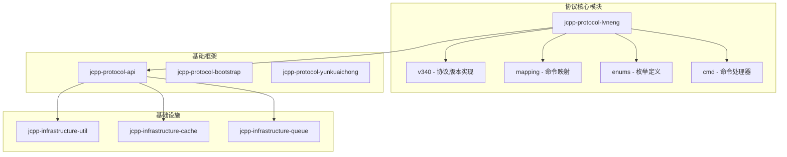
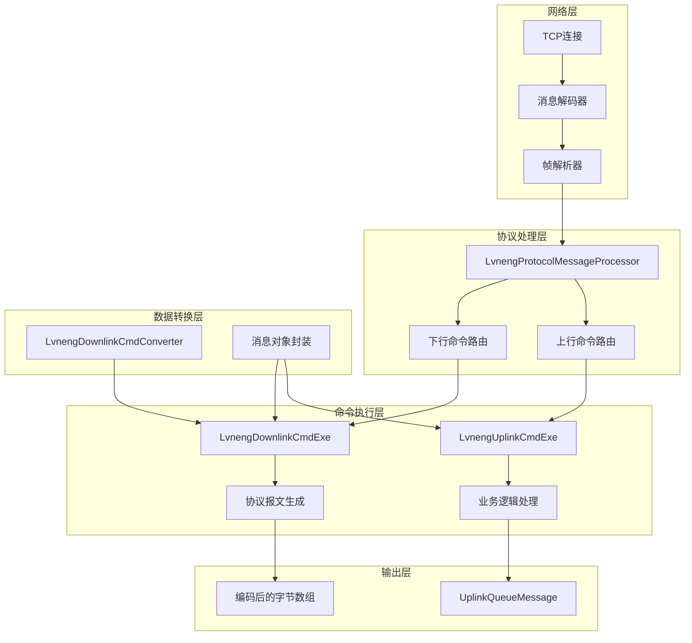
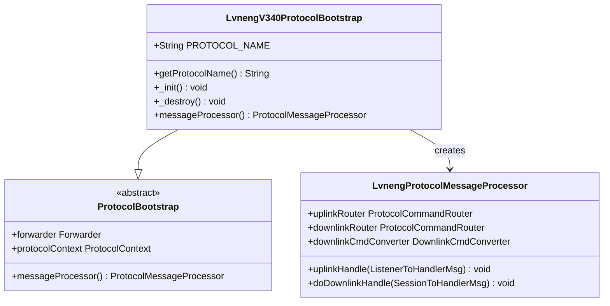
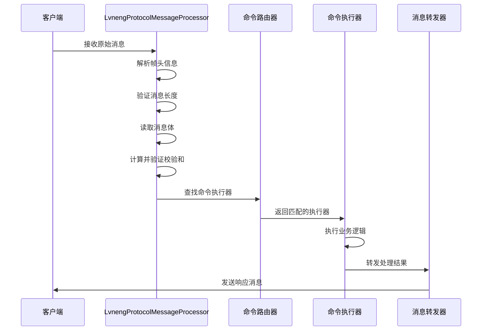
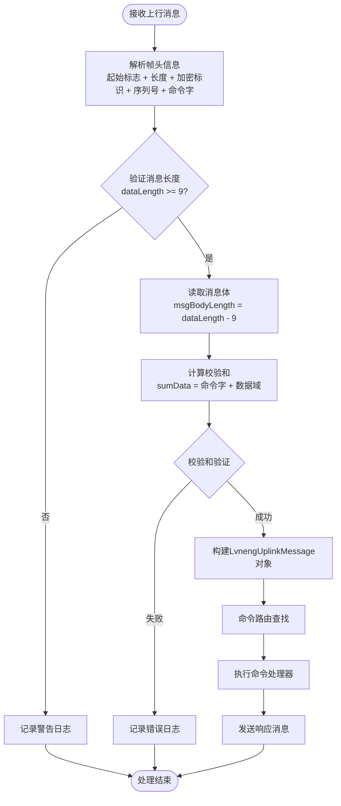
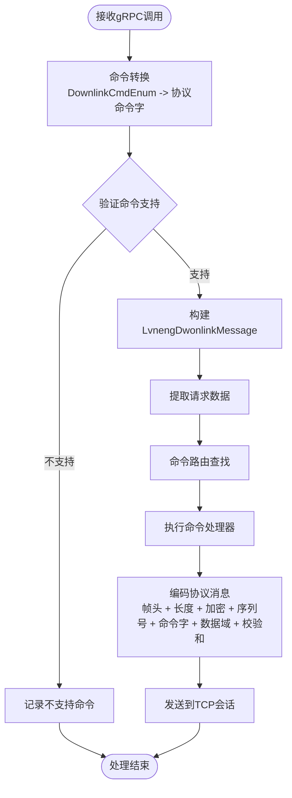
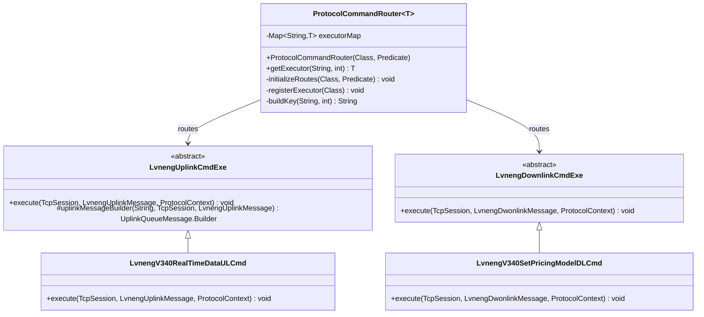
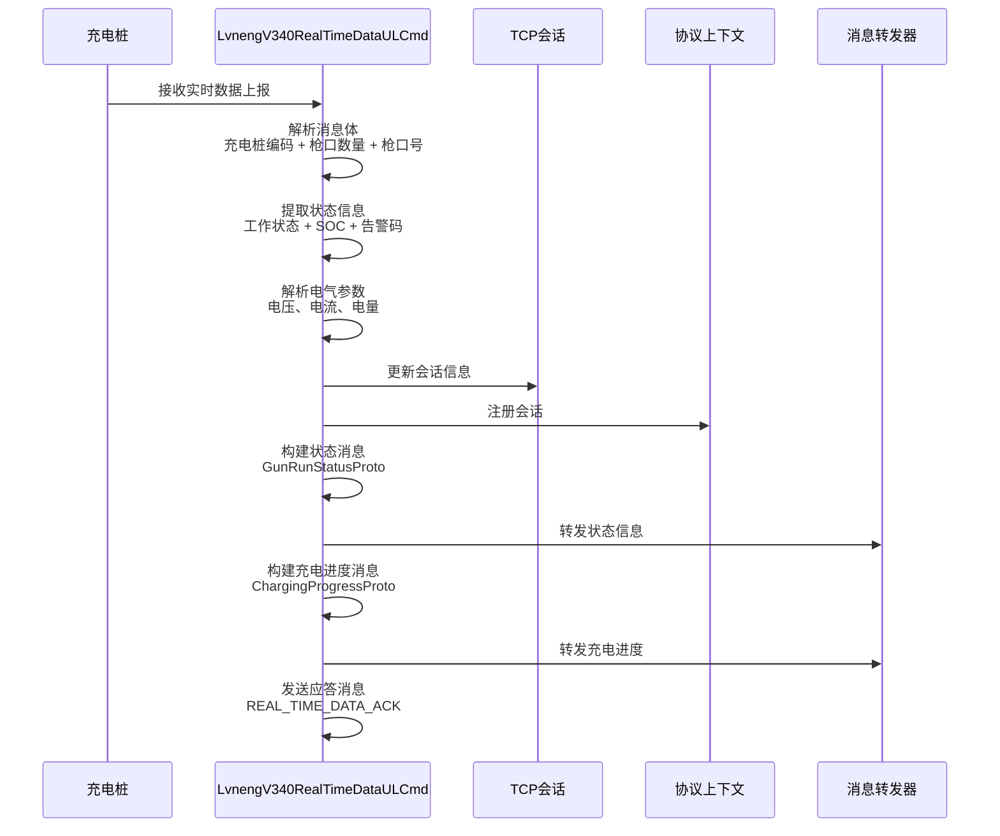
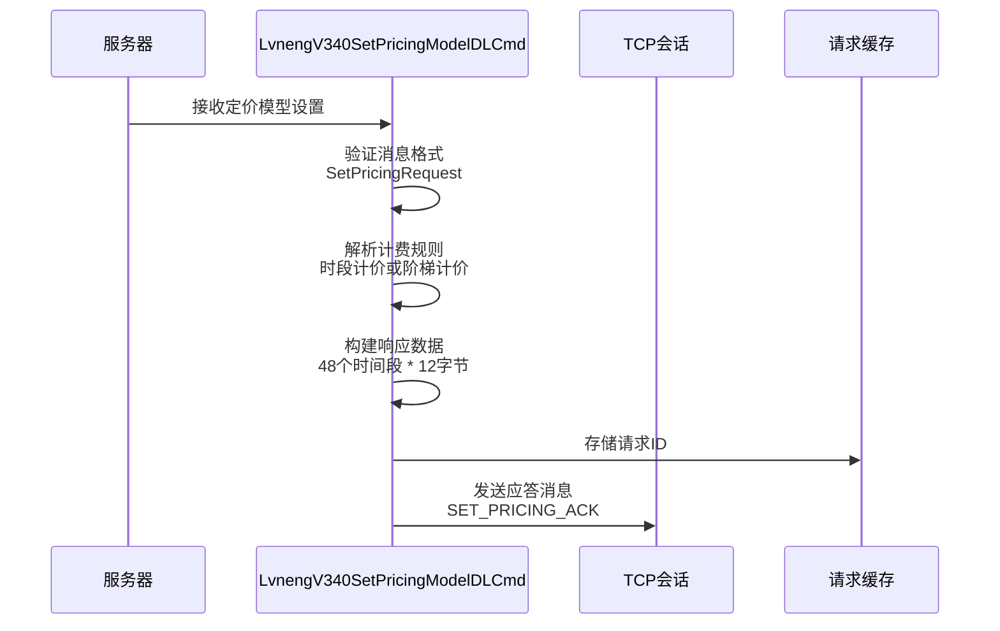
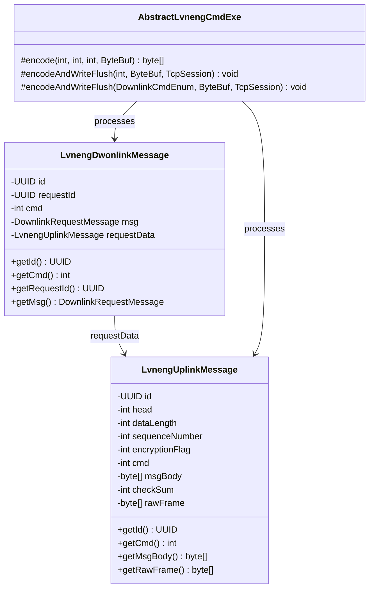

# 绿能协议实现

<cite>
**本文档中引用的文件**
- [LvnengV340ProtocolBootstrap.java](file://jcpp-protocol-lvneng/src/main/java/sanbing/jcpp/protocol/lvneng/v340/LvnengV340ProtocolBootstrap.java)
- [LvnengProtocolMessageProcessor.java](file://jcpp-protocol-lvneng/src/main/java/sanbing/jcpp/protocol/lvneng/LvnengProtocolMessageProcessor.java)
- [LvnengUplinkCmdExe.java](file://jcpp-protocol-lvneng/src/main/java/sanbing/jcpp/protocol/lvneng/LvnengUplinkCmdExe.java)
- [LvnengDownlinkCmdExe.java](file://jcpp-protocol-lvneng/src/main/java/sanbing/jcpp/protocol/lvneng/LvnengDownlinkCmdExe.java)
- [LvnengDownlinkCmdConverter.java](file://jcpp-protocol-lvneng/src/main/java/sanbing/jcpp/protocol/lvneng/mapping/LvnengDownlinkCmdConverter.java)
- [LvnengV340RealTimeDataULCmd.java](file://jcpp-protocol-lvneng/src/main/java/sanbing/jcpp/protocol/lvneng/v340/cmd/LvnengV340RealTimeDataULCmd.java)
- [LvnengUplinkMessage.java](file://jcpp-protocol-lvneng/src/main/java/sanbing/jcpp/protocol/lvneng/LvnengUplinkMessage.java)
- [LvnengDwonlinkMessage.java](file://jcpp-protocol-lvneng/src/main/java/sanbing/jcpp/protocol/lvneng/LvnengDwonlinkMessage.java)
- [LvnengProtocolConstants.java](file://jcpp-protocol-lvneng/src/main/java/sanbing/jcpp/protocol/lvneng/LvnengProtocolConstants.java)
- [ProtocolCommandRouter.java](file://jcpp-protocol-api/src/main/java/sanbing/jcpp/protocol/routing/ProtocolCommandRouter.java)
- [AbstractLvnengCmdExe.java](file://jcpp-protocol-lvneng/src/main/java/sanbing/jcpp/protocol/lvneng/AbstractLvnengCmdExe.java)
- [LvnengV340SetPricingModelDLCmd.java](file://jcpp-protocol-lvneng/src/main/java/sanbing/jcpp/protocol/lvneng/v340/cmd/LvnengV340SetPricingModelDLCmd.java)
- [LvnengV340RemoteStopDLCmd.java](file://jcpp-protocol-lvneng/src/main/java/sanbing/jcpp/protocol/lvneng/v340/cmd/LvnengV340RemoteStopDLCmd.java)
</cite>

## 目录

1. [简介](#简介)
2. [项目结构](#项目结构)
3. [核心组件](#核心组件)
4. [架构概览](#架构概览)
5. [详细组件分析](#详细组件分析)
6. [协议消息处理流程](#协议消息处理流程)
7. [命令路由机制](#命令路由机制)
8. [数据包格式与处理](#数据包格式与处理)
9. [实际应用示例](#实际应用示例)
10. [性能考虑](#性能考虑)
11. [故障排除指南](#故障排除指南)
12. [总结](#总结)

## 简介

绿能协议（v3.40）是一个专为电动汽车充电站设计的通信协议，实现了充电桩与服务器之间的可靠数据交换。该协议采用TCP传输层，具有严格的消息帧结构、校验和验证机制和完善的命令处理体系。

本文档深入分析了绿能协议v3.40的实现细节，重点关注LvnengV340ProtocolBootstrap的配置机制、消息帧结构的设计、以及LvnengProtocolMessageProcessor的处理逻辑。同时详细阐述了上行命令处理器和下行指令生成机制，展示了从gRPC调用到协议报文构建的完整流程。

## 项目结构

绿能协议模块采用分层架构设计，主要包含以下核心包结构：

**图表来源**

- [LvnengV340ProtocolBootstrap.java](file://jcpp-protocol-lvneng/src/main/java/sanbing/jcpp/protocol/lvneng/v340/LvnengV340ProtocolBootstrap.java#L1-L42)
- [LvnengProtocolMessageProcessor.java](file://jcpp-protocol-lvneng/src/main/java/sanbing/jcpp/protocol/lvneng/LvnengProtocolMessageProcessor.java#L1-L187)

**章节来源**

- [LvnengV340ProtocolBootstrap.java](file://jcpp-protocol-lvneng/src/main/java/sanbing/jcpp/protocol/lvneng/v340/LvnengV340ProtocolBootstrap.java#L1-L42)
- [LvnengProtocolConstants.java](file://jcpp-protocol-lvneng/src/main/java/sanbing/jcpp/protocol/lvneng/LvnengProtocolConstants.java#L1-L38)

## 核心组件

绿能协议的核心组件包括协议引导器、消息处理器、命令执行器和命令转换器等关键模块。这些组件协同工作，实现了完整的协议栈功能。

### 协议引导器（LvnengV340ProtocolBootstrap）

协议引导器负责初始化和配置整个协议栈，它继承自基础的ProtocolBootstrap类，提供了协议特定的初始化逻辑。

### 消息处理器（LvnengProtocolMessageProcessor）

消息处理器是协议的核心，负责解析和处理所有上行和下行消息。它实现了严格的帧结构解析、校验和验证和命令路由功能。

### 命令执行器基类

系统提供了两个抽象基类：LvnengUplinkCmdExe用于处理上行命令，LvnengDownlinkCmdExe用于处理下行命令。它们都继承自AbstractLvnengCmdExe，提供了统一的编码和发送机制。

**章节来源**

- [LvnengV340ProtocolBootstrap.java](file://jcpp-protocol-lvneng/src/main/java/sanbing/jcpp/protocol/lvneng/v340/LvnengV340ProtocolBootstrap.java#L15-L42)
- [LvnengProtocolMessageProcessor.java](file://jcpp-protocol-lvneng/src/main/java/sanbing/jcpp/protocol/lvneng/LvnengProtocolMessageProcessor.java#L25-L50)

## 架构概览

绿能协议采用事件驱动的异步处理架构，通过Netty框架实现高效的网络通信。整个架构分为消息接收层、协议处理层、命令执行层和业务逻辑层。

**图表来源**

- [LvnengProtocolMessageProcessor.java](file://jcpp-protocol-lvneng/src/main/java/sanbing/jcpp/protocol/lvneng/LvnengProtocolMessageProcessor.java#L40-L80)
- [ProtocolCommandRouter.java](file://jcpp-protocol-api/src/main/java/sanbing/jcpp/protocol/routing/ProtocolCommandRouter.java#L20-L60)

## 详细组件分析

### LvnengV340ProtocolBootstrap配置机制

LvnengV340ProtocolBootstrap作为协议的入口点，负责建立TCP监听器和初始化协议上下文。它通过注解@ProtocolComponent标记协议名称，并重写父类方法提供具体的初始化逻辑。

**图表来源**

- [LvnengV340ProtocolBootstrap.java](file://jcpp-protocol-lvneng/src/main/java/sanbing/jcpp/protocol/lvneng/v340/LvnengV340ProtocolBootstrap.java#L15-L42)

### 消息帧结构设计

绿能协议采用严格的帧结构设计，确保消息的可靠传输和完整性验证。帧结构包括起始标志、长度字段、加密标识、序列号、命令字和校验和等关键字段。

| 字段名称 | 长度（字节） | 描述                |
|------|--------|-------------------|
| 起始标志 | 2      | 固定值0xAAF5，标识帧开始   |
| 数据长度 | 2      | 包含头部和校验和在内的总长度    |
| 加密标识 | 1      | 0x10表示加密，0x00表示明文 |
| 序列号  | 1      | 用于消息顺序控制          |
| 命令字  | 2      | 标识具体命令类型          |
| 数据域  | 可变     | 实际消息内容            |
| 校验和  | 1      | 对命令字和数据域的校验       |

### LvnengProtocolMessageProcessor消息处理

消息处理器实现了复杂的消息解析逻辑，包括帧头解析、长度验证、校验和计算和命令路由等功能。

**图表来源**

- [LvnengProtocolMessageProcessor.java](file://jcpp-protocol-lvneng/src/main/java/sanbing/jcpp/protocol/lvneng/LvnengProtocolMessageProcessor.java#L50-L120)

**章节来源**

- [LvnengProtocolMessageProcessor.java](file://jcpp-protocol-lvneng/src/main/java/sanbing/jcpp/protocol/lvneng/LvnengProtocolMessageProcessor.java#L25-L187)

## 协议消息处理流程

### 上行消息处理流程

上行消息处理涉及复杂的帧解析和命令执行过程。处理器首先验证消息格式，然后提取各个字段，最后通过命令路由机制找到对应的执行器。

**图表来源**

- [LvnengProtocolMessageProcessor.java](file://jcpp-protocol-lvneng/src/main/java/sanbing/jcpp/protocol/lvneng/LvnengProtocolMessageProcessor.java#L50-L120)

### 下行消息处理流程

下行消息处理从gRPC调用开始，经过命令转换、消息构建和协议编码等步骤，最终生成符合绿能协议规范的报文。

**图表来源**

- [LvnengProtocolMessageProcessor.java](file://jcpp-protocol-lvneng/src/main/java/sanbing/jcpp/protocol/lvneng/LvnengProtocolMessageProcessor.java#L120-L187)

**章节来源**

- [LvnengProtocolMessageProcessor.java](file://jcpp-protocol-lvneng/src/main/java/sanbing/jcpp/protocol/lvneng/LvnengProtocolMessageProcessor.java#L50-L187)

## 命令路由机制

### ProtocolCommandRouter实现

ProtocolCommandRouter提供了基于协议名和命令字的智能路由功能，支持自动扫描和注册命令执行器，实现了松耦合的命令处理架构。

**图表来源**

- [ProtocolCommandRouter.java](file://jcpp-protocol-api/src/main/java/sanbing/jcpp/protocol/routing/ProtocolCommandRouter.java#L20-L105)
- [LvnengUplinkCmdExe.java](file://jcpp-protocol-lvneng/src/main/java/sanbing/jcpp/protocol/lvneng/LvnengUplinkCmdExe.java#L15-L40)

### 命令注册机制

系统通过@ProtocolCmd注解自动发现和注册命令执行器，每个执行器可以支持多个协议版本。这种设计使得协议升级更加灵活。

**章节来源**

- [ProtocolCommandRouter.java](file://jcpp-protocol-api/src/main/java/sanbing/jcpp/protocol/routing/ProtocolCommandRouter.java#L20-L105)
- [LvnengUplinkCmdExe.java](file://jcpp-protocol-lvneng/src/main/java/sanbing/jcpp/protocol/lvneng/LvnengUplinkCmdExe.java#L15-L40)

## 数据包格式与处理

### 上行命令处理示例：实时数据上报

LvnengV340RealTimeDataULCmd展示了典型的上行命令处理流程，包括数据解析、状态更新和消息转发。

**图表来源**

- [LvnengV340RealTimeDataULCmd.java](file://jcpp-protocol-lvneng/src/main/java/sanbing/jcpp/protocol/lvneng/v340/cmd/LvnengV340RealTimeDataULCmd.java#L35-L316)

### 下行命令处理示例：设置定价模型

LvnengV340SetPricingModelDLCmd演示了下行命令的处理流程，包括参数解析、数据转换和响应生成。

**图表来源**

- [LvnengV340SetPricingModelDLCmd.java](file://jcpp-protocol-lvneng/src/main/java/sanbing/jcpp/protocol/lvneng/v340/cmd/LvnengV340SetPricingModelDLCmd.java#L35-L98)

**章节来源**

- [LvnengV340RealTimeDataULCmd.java](file://jcpp-protocol-lvneng/src/main/java/sanbing/jcpp/protocol/lvneng/v340/cmd/LvnengV340RealTimeDataULCmd.java#L35-L316)
- [LvnengV340SetPricingModelDLCmd.java](file://jcpp-protocol-lvneng/src/main/java/sanbing/jcpp/protocol/lvneng/v340/cmd/LvnengV340SetPricingModelDLCmd.java#L35-L98)

## 实际应用示例

### 协议命令转换机制

LvnengDownlinkCmdConverter作为命令转换器，建立了通用命令与协议特定命令字之间的映射关系。这种设计确保了协议的可扩展性和向后兼容性。

| 通用命令                   | 绿能协议命令字 | 描述     |
|------------------------|---------|--------|
| LOGIN_ACK              | 105     | 登录应答   |
| SYNC_TIME_REQUEST      | 3       | 时间同步请求 |
| TRANSACTION_RECORD_ACK | 201     | 交易记录应答 |
| HEARTBEAT_ACK          | 101     | 心跳应答   |
| REAL_TIME_DATA_ACK     | 103     | 实时数据应答 |
| SET_PRICING            | 1103    | 设置定价模型 |
| REMOTE_STOP_CHARGING   | 5       | 远程停止充电 |
| SET_QRCODE             | 3       | 设置二维码  |

### 消息对象结构

系统定义了专门的消息对象来封装协议数据，提供了类型安全的数据访问接口。

**图表来源**

- [LvnengUplinkMessage.java](file://jcpp-protocol-lvneng/src/main/java/sanbing/jcpp/protocol/lvneng/LvnengUplinkMessage.java#L15-L54)
- [LvnengDwonlinkMessage.java](file://jcpp-protocol-lvneng/src/main/java/sanbing/jcpp/protocol/lvneng/LvnengDwonlinkMessage.java#L15-L42)
- [AbstractLvnengCmdExe.java](file://jcpp-protocol-lvneng/src/main/java/sanbing/jcpp/protocol/lvneng/AbstractLvnengCmdExe.java#L15-L120)

**章节来源**

- [LvnengDownlinkCmdConverter.java](file://jcpp-protocol-lvneng/src/main/java/sanbing/jcpp/protocol/lvneng/mapping/LvnengDownlinkCmdConverter.java#L25-L75)
- [LvnengUplinkMessage.java](file://jcpp-protocol-lvneng/src/main/java/sanbing/jcpp/protocol/lvneng/LvnengUplinkMessage.java#L15-L54)
- [LvnengDwonlinkMessage.java](file://jcpp-protocol-lvneng/src/main/java/sanbing/jcpp/protocol/lvneng/LvnengDwonlinkMessage.java#L15-L42)

## 性能考虑

绿能协议在设计时充分考虑了性能优化，采用了多种技术手段来提高系统的响应速度和吞吐量。

### 异步处理机制

系统采用Netty框架实现异步I/O操作，避免了线程阻塞，提高了并发处理能力。消息处理完全基于事件驱动，能够高效处理大量并发连接。

### 内存管理优化

- 使用ByteBuf进行零拷贝操作，减少内存分配和垃圾回收压力
- 采用对象池技术复用消息对象，降低GC频率
- 合理设计消息结构，减少不必要的数据复制

### 缓存策略

- 命令路由表采用ConcurrentHashMap实现，提供O(1)的查找性能
- 请求ID缓存机制避免重复处理相同请求
- 会话状态信息本地化存储，减少数据库访问

## 故障排除指南

### 常见问题诊断

#### 消息解析失败

- 检查帧头是否为0xAAF5
- 验证消息长度是否正确
- 确认校验和计算是否准确

#### 命令路由失败

- 确认命令执行器是否正确注册
- 检查@ProtocolCmd注解配置
- 验证协议名称匹配

#### 连接异常

- 检查TCP连接状态
- 验证网络防火墙设置
- 确认端口监听状态

### 日志分析

系统提供了详细的日志记录，帮助快速定位问题：

- WARN级别：消息格式异常、校验和失败
- ERROR级别：命令执行异常、系统内部错误
- DEBUG级别：消息处理流程跟踪

**章节来源**

- [LvnengProtocolMessageProcessor.java](file://jcpp-protocol-lvneng/src/main/java/sanbing/jcpp/protocol/lvneng/LvnengProtocolMessageProcessor.java#L70-L100)

## 总结

绿能协议v3.40实现了一个功能完整、性能优异的电动汽车充电站通信协议。通过模块化的架构设计、严格的帧结构规范和智能的命令路由机制，系统实现了高可靠性的消息传输和处理。

### 主要特性

1. **严格的协议规范**：采用标准的帧结构和校验机制，确保消息传输的可靠性
2. **灵活的命令处理**：支持多种命令类型，具备良好的扩展性
3. **高性能架构**：基于Netty的异步处理，支持高并发场景
4. **完善的错误处理**：提供详细的日志记录和异常处理机制
5. **类型安全设计**：使用强类型的消息对象，减少运行时错误

### 技术优势

- **模块化设计**：各组件职责明确，便于维护和扩展
- **自动化注册**：通过注解机制自动发现和注册命令执行器
- **性能优化**：采用多种优化技术，确保系统高效运行
- **向后兼容**：支持协议版本升级，保证系统稳定性

该协议实现为电动汽车充电站提供了稳定可靠的通信基础，支撑了大规模充电网络的运营需求。通过持续的优化和改进，系统能够适应不断发展的行业需求和技术进步。