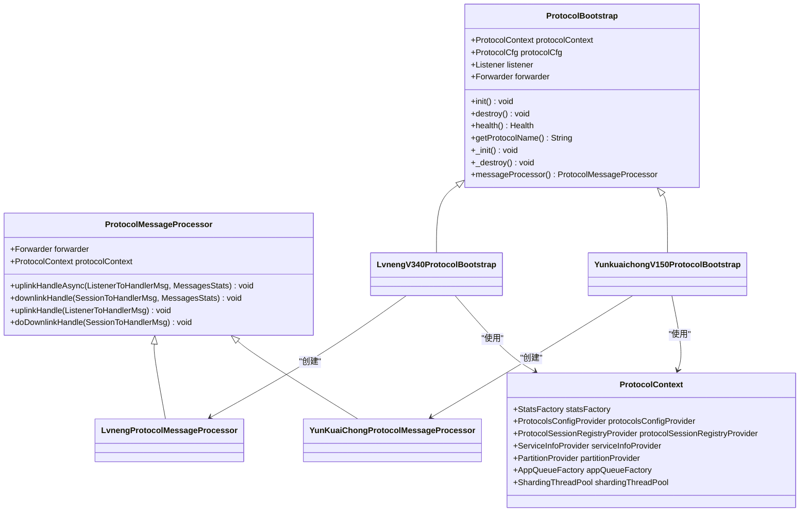
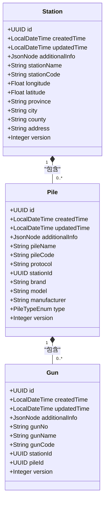
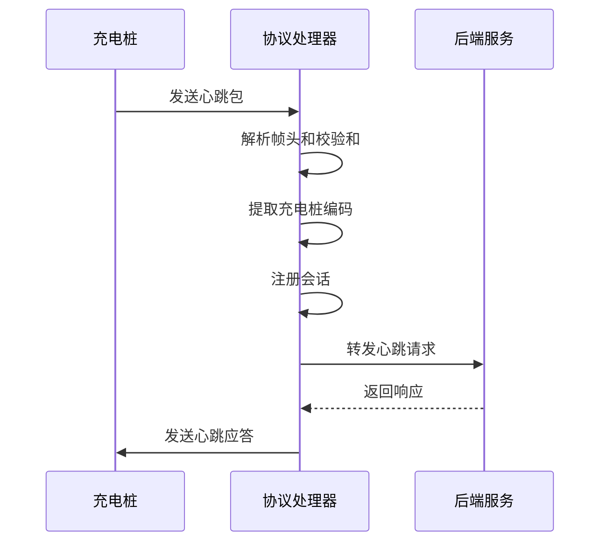

# 核心模块详解

<cite>
**本文档引用的文件**   
- [ProtocolBootstrap.java](file://jcpp-protocol-api/src/main/java/sanbing/jcpp/protocol/ProtocolBootstrap.java)
- [ProtocolMessageProcessor.java](file://jcpp-protocol-api/src/main/java/sanbing/jcpp/protocol/ProtocolMessageProcessor.java)
- [ProtocolContext.java](file://jcpp-protocol-api/src/main/java/sanbing/jcpp/protocol/ProtocolContext.java)
- [LvnengV340ProtocolBootstrap.java](file://jcpp-protocol-lvneng/src/main/java/sanbing/jcpp/protocol/lvneng/v340/LvnengV340ProtocolBootstrap.java)
- [YunkuaichongV150ProtocolBootstrap.java](file://jcpp-protocol-yunkuaichong/src/main/java/sanbing/jcpp/protocol/yunkuaichong/v150/YunkuaichongV150ProtocolBootstrap.java)
- [LvnengV340HeartbeatULCmd.java](file://jcpp-protocol-lvneng/src/main/java/sanbing/jcpp/protocol/lvneng/v340/cmd/LvnengV340HeartbeatULCmd.java)
- [YunKuaiChongV150LoginULCmd.java](file://jcpp-protocol-yunkuaichong/src/main/java/sanbing/jcpp/protocol/yunkuaichong/v150/cmd/YunKuaiChongV150LoginULCmd.java)
- [Station.java](file://jcpp-app/src/main/java/sanbing/jcpp/app/dal/entity/Station.java)
- [Pile.java](file://jcpp-app/src/main/java/sanbing/jcpp/app/dal/entity/Pile.java)
- [Gun.java](file://jcpp-app/src/main/java/sanbing/jcpp/app/dal/entity/Gun.java)
- [DefaultStationService.java](file://jcpp-app/src/main/java/sanbing/jcpp/app/service/impl/DefaultStationService.java)
- [DefaultPileService.java](file://jcpp-app/src/main/java/sanbing/jcpp/app/service/impl/DefaultPileService.java)
- [LvnengProtocolMessageProcessor.java](file://jcpp-protocol-lvneng/src/main/java/sanbing/jcpp/protocol/lvneng/LvnengProtocolMessageProcessor.java)
- [YunKuaiChongProtocolMessageProcessor.java](file://jcpp-protocol-yunkuaichong/src/main/java/sanbing/jcpp/protocol/yunkuaichong/YunKuaiChongProtocolMessageProcessor.java)
</cite>

## 目录

1. [协议处理框架](#协议处理框架)
2. [设备管理模块](#设备管理模块)
3. [协议实现模块](#协议实现模块)

## 协议处理框架

JChargePointProtocol的协议处理框架由三个核心组件构成：`ProtocolBootstrap`抽象类、`ProtocolMessageProcessor`消息处理器和
`ProtocolContext`上下文管理器。这个框架为不同厂商的充电桩通信协议提供了统一的生命周期管理和消息处理机制。

`ProtocolBootstrap`是所有协议实现的基类，它定义了协议的启动和销毁生命周期。通过`@PostConstruct`和`@PreDestroy`
注解，该类在Spring容器初始化和销毁时自动执行`init()`和`destroy()`方法。`init()`方法负责初始化协议配置、监听器和转发器，而
`destroy()`方法则负责清理资源。子类需要实现`getProtocolName()`方法来标识协议名称，并通过`messageProcessor()`方法提供具体的
`ProtocolMessageProcessor`实现。

`ProtocolMessageProcessor`是消息处理的核心，它定义了上行和下行消息的处理流程。该类通过`uplinkHandleAsync()`
方法异步处理来自充电桩的上行消息，使用`shardingThreadPool`进行线程分片处理，确保高并发下的性能。对于下行消息，
`downlinkHandle()`方法提供了统一的异常处理和日志记录机制。具体的协议实现类需要重写`uplinkHandle()`和`doDownlinkHandle()`
方法来处理特定协议的消息。

`ProtocolContext`
作为依赖注入的容器，集中管理了系统中的各种基础设施组件，包括统计工厂、配置提供者、会话注册表、服务信息提供者、分区提供者、队列工厂和分片线程池。这些组件通过构造函数注入，使得协议实现可以方便地访问系统资源，而无需直接依赖具体的实现类。

**图示来源**

- [ProtocolBootstrap.java](file://jcpp-protocol-api/src/main/java/sanbing/jcpp/protocol/ProtocolBootstrap.java)
- [ProtocolMessageProcessor.java](file://jcpp-protocol-api/src/main/java/sanbing/jcpp/protocol/ProtocolMessageProcessor.java)
- [ProtocolContext.java](file://jcpp-protocol-api/src/main/java/sanbing/jcpp/protocol/ProtocolContext.java)

**本节来源**

- [ProtocolBootstrap.java](file://jcpp-protocol-api/src/main/java/sanbing/jcpp/protocol/ProtocolBootstrap.java#L1-L126)
- [ProtocolMessageProcessor.java](file://jcpp-protocol-api/src/main/java/sanbing/jcpp/protocol/ProtocolMessageProcessor.java#L1-L77)
- [ProtocolContext.java](file://jcpp-protocol-api/src/main/java/sanbing/jcpp/protocol/ProtocolContext.java#L1-L65)

## 设备管理模块

设备管理模块采用层次化的数据模型来管理充电基础设施，包含`Station`（充电站）、`Pile`（充电桩）和`Gun`
（充电枪）三个核心实体。这三个实体之间形成了清晰的层级关系：一个充电站包含多个充电桩，而每个充电桩又包含多个充电枪。

`Station`实体代表一个物理的充电站，包含站点的基本信息如名称、编码、地理位置等。`Pile`
实体代表一个具体的充电桩，除了名称和编码外，还包含了协议类型、品牌、型号等信息，并通过`stationId`字段与`Station`建立关联。
`Gun`实体代表充电桩上的一个充电枪，通过`pileId`字段与`Pile`建立关联。

系统提供了完整的CRUD（创建、读取、更新、删除）操作API来管理这些实体。例如，`DefaultStationService`提供了`createStation()`、
`getStationById()`、`updateStation()`和`deleteStation()`等方法。在删除操作中，系统实现了级联检查机制，确保在删除充电站前必须先删除其下的所有充电桩，从而维护数据的一致性。

**图示来源**

- [Station.java](file://jcpp-app/src/main/java/sanbing/jcpp/app/dal/entity/Station.java)
- [Pile.java](file://jcpp-app/src/main/java/sanbing/jcpp/app/dal/entity/Pile.java)
- [Gun.java](file://jcpp-app/src/main/java/sanbing/jcpp/app/dal/entity/Gun.java)

**本节来源**

- [Station.java](file://jcpp-app/src/main/java/sanbing/jcpp/app/dal/entity/Station.java#L1-L65)
- [Pile.java](file://jcpp-app/src/main/java/sanbing/jcpp/app/dal/entity/Pile.java#L1-L64)
- [Gun.java](file://jcpp-app/src/main/java/sanbing/jcpp/app/dal/entity/Gun.java#L1-L56)
- [DefaultStationService.java](file://jcpp-app/src/main/java/sanbing/jcpp/app/service/impl/DefaultStationService.java#L1-L247)
- [DefaultPileService.java](file://jcpp-app/src/main/java/sanbing/jcpp/app/service/impl/DefaultPileService.java#L1-L329)

## 协议实现模块

协议实现模块展示了如何通过继承`ProtocolBootstrap`和实现具体的命令处理器来支持特定厂商的通信协议。以云快充（YunKuaiChong）和绿能（Lvneng）为例，系统通过创建特定版本的
`ProtocolBootstrap`实现类来支持不同版本的协议。

对于绿能协议，`LvnengV340ProtocolBootstrap`类继承自`ProtocolBootstrap`，并实现了`messageProcessor()`方法来返回
`LvnengProtocolMessageProcessor`实例。该消息处理器负责解析绿能协议的帧结构，包括帧头、长度、加密标识、序号、命令字和校验和。当接收到心跳包时，
`LvnengV340HeartbeatULCmd`命令处理器会被调用，它会解析充电桩编码和心跳序号，注册会话，并将心跳请求转发到后端服务。

对于云快充协议，`YunkuaichongV150ProtocolBootstrap`类同样继承自`ProtocolBootstrap`，并返回
`YunKuaiChongProtocolMessageProcessor`实例。该消息处理器处理云快充协议的登录认证流程，通过`YunKuaiChongV150LoginULCmd`
命令处理器解析充电桩编码、类型、枪数量等信息，并将登录请求转发到后端。

**图示来源**

- [LvnengV340ProtocolBootstrap.java](file://jcpp-protocol-lvneng/src/main/java/sanbing/jcpp/protocol/lvneng/v340/LvnengV340ProtocolBootstrap.java)
- [LvnengV340HeartbeatULCmd.java](file://jcpp-protocol-lvneng/src/main/java/sanbing/jcpp/protocol/lvneng/v340/cmd/LvnengV340HeartbeatULCmd.java)
- [YunkuaichongV150ProtocolBootstrap.java](file://jcpp-protocol-yunkuaichong/src/main/java/sanbing/jcpp/protocol/yunkuaichong/v150/YunkuaichongV150ProtocolBootstrap.java)
- [YunKuaiChongV150LoginULCmd.java](file://jcpp-protocol-yunkuaichong/src/main/java/sanbing/jcpp/protocol/yunkuaichong/v150/cmd/YunKuaiChongV150LoginULCmd.java)

**本节来源**

- [LvnengV340ProtocolBootstrap.java](file://jcpp-protocol-lvneng/src/main/java/sanbing/jcpp/protocol/lvneng/v340/LvnengV340ProtocolBootstrap.java#L1-L41)
- [LvnengV340HeartbeatULCmd.java](file://jcpp-protocol-lvneng/src/main/java/sanbing/jcpp/protocol/lvneng/v340/cmd/LvnengV340HeartbeatULCmd.java#L1-L92)
- [YunkuaichongV150ProtocolBootstrap.java](file://jcpp-protocol-yunkuaichong/src/main/java/sanbing/jcpp/protocol/yunkuaichong/v150/YunkuaichongV150ProtocolBootstrap.java#L1-L47)
- [YunKuaiChongV150LoginULCmd.java](file://jcpp-protocol-yunkuaichong/src/main/java/sanbing/jcpp/protocol/yunkuaichong/v150/cmd/YunKuaiChongV150LoginULCmd.java#L1-L84)
- [LvnengProtocolMessageProcessor.java](file://jcpp-protocol-lvneng/src/main/java/sanbing/jcpp/protocol/lvneng/LvnengProtocolMessageProcessor.java#L1-L186)
- [YunKuaiChongProtocolMessageProcessor.java](file://jcpp-protocol-yunkuaichong/src/main/java/sanbing/jcpp/protocol/yunkuaichong/YunKuaiChongProtocolMessageProcessor.java#L1-L203)