# 充电枪管理

<cite>
**本文档引用文件**   
- [Gun.java](file://jcpp-app/src/main/java/sanbing/jcpp/app/dal/entity/Gun.java)
- [GunController.java](file://jcpp-app/src/main/java/sanbing/jcpp/app/adapter/controller/GunController.java)
- [GunMapper.java](file://jcpp-app/src/main/java/sanbing/jcpp/app/dal/mapper/GunMapper.java)
- [DefaultGunService.java](file://jcpp-app/src/main/java/sanbing/jcpp/app/service/impl/DefaultGunService.java)
- [GunRepository.java](file://jcpp-app/src/main/java/sanbing/jcpp/app/dal/repository/GunRepository.java)
- [GunRepositoryImpl.java](file://jcpp-app/src/main/java/sanbing/jcpp/app/dal/repository/impl/GunRepositoryImpl.java)
- [GunCreateRequest.java](file://jcpp-app/src/main/java/sanbing/jcpp/app/adapter/request/GunCreateRequest.java)
- [GunUpdateRequest.java](file://jcpp-app/src/main/java/sanbing/jcpp/app/adapter/request/GunUpdateRequest.java)
- [GunWithStatusResponse.java](file://jcpp-app/src/main/java/sanbing/jcpp/app/adapter/response/GunWithStatusResponse.java)
- [PageResponse.java](file://jcpp-app/src/main/java/sanbing/jcpp/app/adapter/response/PageResponse.java)
- [AttrKeyEnum.java](file://jcpp-app/src/main/java/sanbing/jcpp/app/data/kv/AttrKeyEnum.java)
- [GunRedisCache.java](file://jcpp-app/src/main/java/sanbing/jcpp/app/service/cache/gun/GunRedisCache.java)
- [GunRunStatusEnum.java](file://jcpp-app/src/main/java/sanbing/jcpp/app/dal/config/ibatis/enums/GunRunStatusEnum.java)
</cite>

## 目录

1. [简介](#简介)
2. [数据模型](#数据模型)
3. [RESTful API](#restful-api)
4. [服务层实现](#服务层实现)
5. [缓存机制](#缓存机制)
6. [状态管理](#状态管理)
7. [使用示例](#使用示例)
8. [级联关系与状态同步](#级联关系与状态同步)

## 简介

本文档详细描述了充电枪管理功能的实现，包括数据模型、API接口、服务层逻辑、缓存机制和状态管理。系统通过Gun实体管理充电枪，支持创建、查询、更新和删除操作，并通过属性系统实时跟踪充电枪的运行状态。

## 数据模型

### Gun实体

`Gun`实体是充电枪的核心数据模型，定义了充电枪的基本属性和关系。

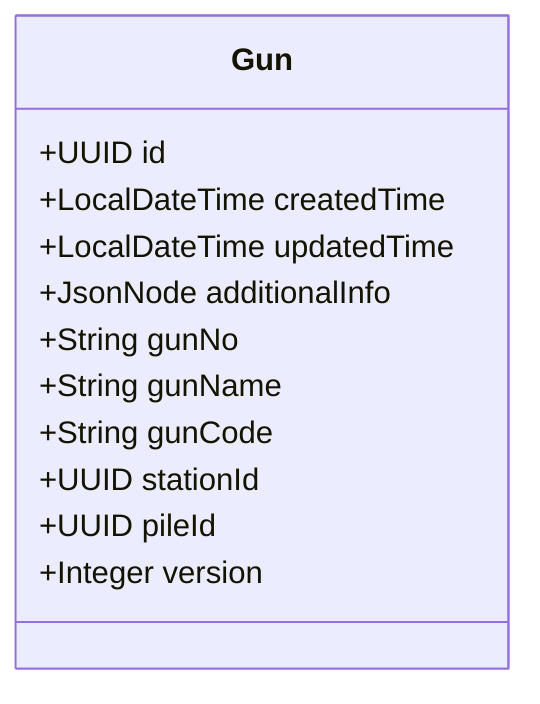

**图示来源**

- [Gun.java](file://jcpp-app/src/main/java/sanbing/jcpp/app/dal/entity/Gun.java#L1-L57)

**核心属性说明**

- **id**: 充电枪唯一标识符，UUID类型
- **gunNo**: 充电枪编号，如"01"、"02"
- **gunName**: 充电枪名称
- **gunCode**: 充电枪编码，全局唯一标识
- **stationId**: 所属充电站ID，与Station实体关联
- **pileId**: 所属充电桩ID，与Pile实体关联

**实体关系**

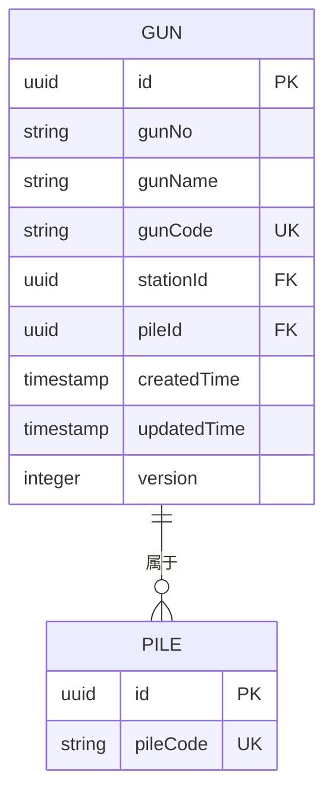

**图示来源**

- [Gun.java](file://jcpp-app/src/main/java/sanbing/jcpp/app/dal/entity/Gun.java#L1-L57)

**实体关系说明**

- **1对多关系**: 一个充电桩(Pile)可以有多个充电枪(Gun)，形成1对多关系
- **外键约束**: `pileId`字段作为外键关联到Pile实体
- **唯一性约束**: `gunCode`字段具有唯一性约束，确保全局唯一

**Section sources**

- [Gun.java](file://jcpp-app/src/main/java/sanbing/jcpp/app/dal/entity/Gun.java#L1-L57)

## RESTful API

### API概览

`GunController`提供了完整的RESTful API接口，支持对充电枪的CRUD操作。

```mermaid
graph TD
A[客户端] --> B[POST /api/guns]
A --> C[GET /api/guns/{id}]
A --> D[PUT /api/guns/{id}]
A --> E[DELETE /api/guns/{id}]
A --> F[GET /api/guns]
A --> G[GET /api/guns/status/{gunCode}]
A --> H[GET /api/guns/code/{gunCode}]
B --> I[创建充电枪]
C --> J[查询单个充电枪]
D --> K[更新充电枪]
E --> L[删除充电枪]
F --> M[分页查询充电枪]
G --> N[查询充电枪状态]
H --> O[查询充电枪详情]
```

**图示来源**

- [GunController.java](file://jcpp-app/src/main/java/sanbing/jcpp/app/adapter/controller/GunController.java#L1-L116)

### API详情

#### 创建充电枪 (POST /api/guns)

创建新的充电枪实体。

**请求参数**

- **HTTP方法**: POST
- **URL**: /api/guns
- **Content-Type**: application/json

**请求体 (GunCreateRequest)**

```json
{
  "gunName": "快充枪1",
  "gunNo": "01",
  "gunCode": "GUN001",
  "stationId": "uuid-string",
  "pileId": "uuid-string"
}
```

**响应格式**

```json
{
  "code": 200,
  "message": "创建成功",
  "data": {
    "id": "uuid-string",
    "createdTime": "2023-01-01T00:00:00",
    "gunName": "快充枪1",
    "gunNo": "01",
    "gunCode": "GUN001",
    "stationId": "uuid-string",
    "pileId": "uuid-string",
    "version": 0
  }
}
```

**验证规则**

- `gunName`: 必填，不允许XSS攻击
- `gunNo`: 必填
- `gunCode`: 必填，不允许重复
- `stationId`: 必填，有效UUID
- `pileId`: 必填，有效UUID

**Section sources**

- [GunController.java](file://jcpp-app/src/main/java/sanbing/jcpp/app/adapter/controller/GunController.java#L25-L32)
- [GunCreateRequest.java](file://jcpp-app/src/main/java/sanbing/jcpp/app/adapter/request/GunCreateRequest.java#L1-L37)

#### 查询充电枪 (GET /api/guns)

分页查询充电枪列表，包含状态信息。

**请求参数**

- **HTTP方法**: GET
- **URL**: /api/guns
- **查询参数**:
    - `page`: 页码（默认1）
    - `size`: 每页大小（默认10）
    - `gunName`: 充电枪名称（可选）
    - `pileId`: 充电桩ID（可选）

**响应格式 (PageResponse<GunWithStatusResponse>)**

```json
{
  "records": [
    {
      "id": "uuid-string",
      "gunName": "快充枪1",
      "gunNo": "01",
      "gunCode": "GUN001",
      "stationId": "uuid-string",
      "pileId": "uuid-string",
      "stationName": "充电站A",
      "pileName": "充电桩1",
      "pileCode": "PILE001",
      "runStatus": "CHARGING"
    }
  ],
  "total": 1,
  "totalPages": 1,
  "page": 1,
  "size": 10
}
```

**分页参数**

- **records**: 当前页的数据列表
- **total**: 总记录数
- **totalPages**: 总页数
- **page**: 当前页码
- **size**: 每页大小

**Section sources**

- [GunController.java](file://jcpp-app/src/main/java/sanbing/jcpp/app/adapter/controller/GunController.java#L62-L68)
- [PageResponse.java](file://jcpp-app/src/main/java/sanbing/jcpp/app/adapter/response/PageResponse.java#L1-L44)
- [GunWithStatusResponse.java](file://jcpp-app/src/main/java/sanbing/jcpp/app/adapter/response/GunWithStatusResponse.java#L1-L96)

#### 更新充电枪 (PUT /api/guns/{id})

更新指定ID的充电枪信息。

**请求参数**

- **HTTP方法**: PUT
- **URL**: /api/guns/{id}
- **路径参数**: id (充电枪UUID)
- **请求体**: GunUpdateRequest

**请求体 (GunUpdateRequest)**

```json
{
  "gunName": "快充枪1-更新",
  "gunNo": "01",
  "gunCode": "GUN001",
  "stationId": "uuid-string",
  "pileId": "uuid-string"
}
```

**响应格式**

```json
{
  "code": 200,
  "message": "更新成功",
  "data": {
    "id": "uuid-string",
    "updatedTime": "2023-01-01T00:00:00",
    "gunName": "快充枪1-更新",
    "gunNo": "01",
    "gunCode": "GUN001",
    "stationId": "uuid-string",
    "pileId": "uuid-string"
  }
}
```

**更新规则**

- 允许修改所有字段
- 更新时自动设置`updatedTime`字段
- 版本号保持不变

**Section sources**

- [GunController.java](file://jcpp-app/src/main/java/sanbing/jcpp/app/adapter/controller/GunController.java#L34-L43)
- [GunUpdateRequest.java](file://jcpp-app/src/main/java/sanbing/jcpp/app/adapter/request/GunUpdateRequest.java#L1-L36)

#### 删除充电枪 (DELETE /api/guns/{id})

删除指定ID的充电枪。

**请求参数**

- **HTTP方法**: DELETE
- **URL**: /api/guns/{id}
- **路径参数**: id (充电枪UUID)

**响应格式**

```json
{
  "code": 200,
  "message": "删除成功",
  "data": null
}
```

**删除逻辑**

- 先检查充电枪是否存在
- 执行物理删除操作
- 返回成功或失败状态

**Section sources**

- [GunController.java](file://jcpp-app/src/main/java/sanbing/jcpp/app/adapter/controller/GunController.java#L45-L51)

#### 查询充电枪状态 (GET /api/guns/status/{gunCode})

根据充电枪编码查询其运行状态。

**请求参数**

- **HTTP方法**: GET
- **URL**: /api/guns/status/{gunCode}
- **路径参数**: gunCode (充电枪编码)

**响应格式**

```json
{
  "code": 200,
  "message": "查询成功",
  "data": "CHARGING"
}
```

**状态查询流程**

1. 根据`gunCode`查找充电枪实体
2. 通过`AttributeService`获取`gunRunStatus`属性
3. 返回状态值

**Section sources**

- [GunController.java](file://jcpp-app/src/main/java/sanbing/jcpp/app/adapter/controller/GunController.java#L69-L96)

#### 查询充电枪详情 (GET /api/guns/code/{gunCode})

根据充电枪编码查询其详细信息，包含状态。

**请求参数**

- **HTTP方法**: GET
- **URL**: /api/guns/code/{gunCode}
- **路径参数**: gunCode (充电枪编码)

**响应格式**

```json
{
  "code": 200,
  "message": "查询成功",
  "data": {
    "id": "uuid-string",
    "gunName": "快充枪1",
    "gunNo": "01",
    "gunCode": "GUN001",
    "stationId": "uuid-string",
    "pileId": "uuid-string",
    "stationName": "充电站A",
    "pileName": "充电桩1",
    "pileCode": "PILE001",
    "runStatus": "CHARGING"
  }
}
```

**详情查询特点**

- 返回完整的`GunWithStatusResponse`对象
- 包含关联的充电站和充电桩信息
- 包含当前运行状态

**Section sources**

- [GunController.java](file://jcpp-app/src/main/java/sanbing/jcpp/app/adapter/controller/GunController.java#L98-L115)

## 服务层实现

### DefaultGunService架构

`DefaultGunService`是充电枪业务逻辑的核心实现，协调数据访问和缓存操作。

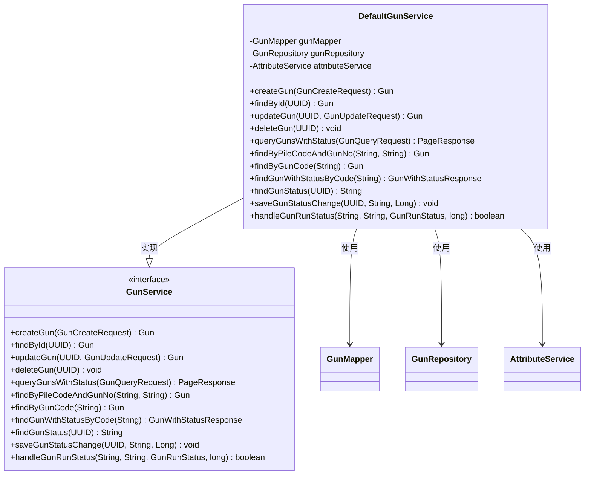

**图示来源**

- [DefaultGunService.java](file://jcpp-app/src/main/java/sanbing/jcpp/app/service/impl/DefaultGunService.java#L1-L246)

### 核心方法分析

#### 创建充电枪 (createGun)

实现充电枪的创建逻辑。

**处理流程**

1. 检查`gunCode`是否已存在
2. 构建新的`Gun`实体
3. 设置默认值（ID、创建时间、版本等）
4. 插入数据库

**验证逻辑**

- 使用`LambdaQueryWrapper`检查`gunCode`唯一性
- 抛出异常阻止重复创建

**Section sources**

- [DefaultGunService.java](file://jcpp-app/src/main/java/sanbing/jcpp/app/service/impl/DefaultGunService.java#L48-L75)

#### 查询充电枪状态 (findGunStatus)

从属性系统中查询充电枪的运行状态。

**实现细节**

- 使用`AttributeService.find()`异步获取属性
- 属性键为`AttrKeyEnum.GUN_RUN_STATUS.getCode()`
- 返回字符串格式的状态值

**异步处理**

- 使用`ListenableFuture`进行异步调用
- 通过`get()`方法阻塞等待结果
- 包含异常处理逻辑

**Section sources**

- [DefaultGunService.java](file://jcpp-app/src/main/java/sanbing/jcpp/app/service/impl/DefaultGunService.java#L178-L193)

#### 保存充电枪状态 (saveGunStatusChange)

将充电枪状态保存到属性系统。

**实现细节**

- 创建`BaseAttributeKvEntry`对象
- 使用`StringDataEntry`存储状态值
- 调用`attributeService.save()`持久化

**时间戳处理**

- 使用传入的`ts`参数或当前时间
- 支持精确到毫秒的时间戳

**Section sources**

- [DefaultGunService.java](file://jcpp-app/src/main/java/sanbing/jcpp/app/service/impl/DefaultGunService.java#L195-L208)

#### 处理充电枪运行状态 (handleGunRunStatus)

处理从协议层上报的充电枪状态。

**处理流程**

1. 将Proto状态转换为数据库枚举
2. 根据`pileCode`和`gunNo`查找充电枪
3. 检查状态是否发生变化
4. 保存新状态到属性系统
5. 判断是否需要更新充电桩状态

**状态转换**

- 实现Proto状态到数据库枚举的映射
- 支持多种状态类型（空闲、充电中、故障等）
- 未知状态返回null

**状态同步**

- 检查当前状态避免重复更新
- 记录状态变化日志
- 触发相关业务逻辑

**Section sources**

- [DefaultGunService.java](file://jcpp-app/src/main/java/sanbing/jcpp/app/service/impl/DefaultGunService.java#L210-L244)

## 缓存机制

### 缓存架构

系统采用多级缓存策略提升查询性能。

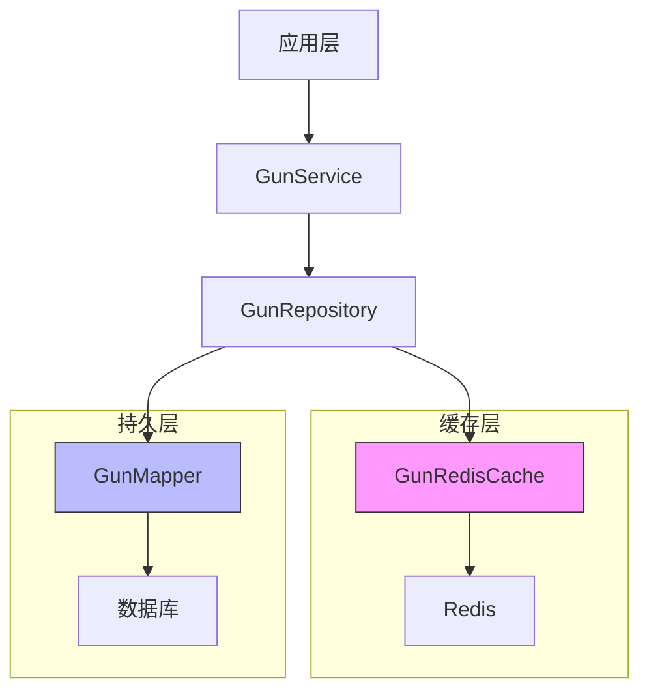

**图示来源**

- [GunRepositoryImpl.java](file://jcpp-app/src/main/java/sanbing/jcpp/app/dal/repository/impl/GunRepositoryImpl.java#L1-L97)
- [GunRedisCache.java](file://jcpp-app/src/main/java/sanbing/jcpp/app/service/cache/gun/GunRedisCache.java#L1-L36)

### GunRedisCache实现

`GunRedisCache`是基于Redis的充电枪缓存实现。

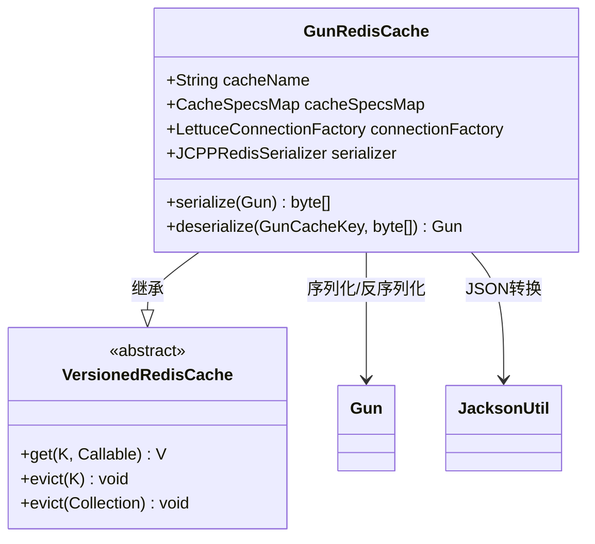

**图示来源**

- [GunRedisCache.java](file://jcpp-app/src/main/java/sanbing/jcpp/app/service/cache/gun/GunRedisCache.java#L1-L36)

**核心特性**

- 使用`JCPPRedisSerializer`进行序列化
- 基于`JacksonUtil`实现JSON转换
- 支持版本化缓存
- 配置化缓存策略

**序列化实现**

- `serialize()`: 使用Jackson将Gun对象转换为字节数组
- `deserialize()`: 从字节数组反序列化为Gun对象

**Section sources**

- [GunRedisCache.java](file://jcpp-app/src/main/java/sanbing/jcpp/app/service/cache/gun/GunRedisCache.java#L1-L36)

### 缓存键设计 (GunCacheKey)

缓存键设计支持多种查询场景。

```java
// 伪代码表示GunCacheKey的设计
public class GunCacheKey {
    private UUID gunId;           // 基于ID的缓存
    private String pileCode;      // 基于桩编码的缓存
    private String gunNo;         // 基于枪编号的缓存
    private String gunCode;       // 基于枪编码的缓存
    
    // 支持多种构造函数
    public GunCacheKey(UUID gunId)
    public GunCacheKey(String pileCode, String gunNo)
    public GunCacheKey(String gunCode)
}
```

**缓存键类型**

- **基于ID**: `new GunCacheKey(gunId)`
- **基于桩编码+枪编号**: `new GunCacheKey(pileCode, gunNo)`
- **基于枪编码**: `new GunCacheKey(gunCode)`

**Section sources**

- [GunRepositoryImpl.java](file://jcpp-app/src/main/java/sanbing/jcpp/app/dal/repository/impl/GunRepositoryImpl.java#L1-L97)

### 缓存事件处理

通过事件机制维护缓存一致性。

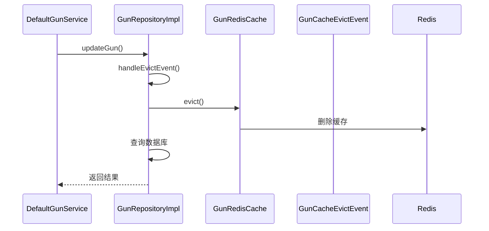

**图示来源**

- [GunRepositoryImpl.java](file://jcpp-app/src/main/java/sanbing/jcpp/app/dal/repository/impl/GunRepositoryImpl.java#L1-L97)

**事件处理流程**

1. 服务层执行更新或删除操作
2. 触发`GunCacheEvictEvent`事件
3. `GunRepositoryImpl`监听并处理事件
4. 从Redis缓存中删除相关键
5. 后续查询将从数据库获取最新数据

**缓存失效策略**

- 写操作后立即失效缓存
- 支持批量失效多个缓存键
- 保证缓存与数据库的一致性

**Section sources**

- [GunRepositoryImpl.java](file://jcpp-app/src/main/java/sanbing/jcpp/app/dal/repository/impl/GunRepositoryImpl.java#L25-L45)

## 状态管理

### 运行状态枚举 (GunRunStatusEnum)

定义了充电枪的所有可能运行状态。

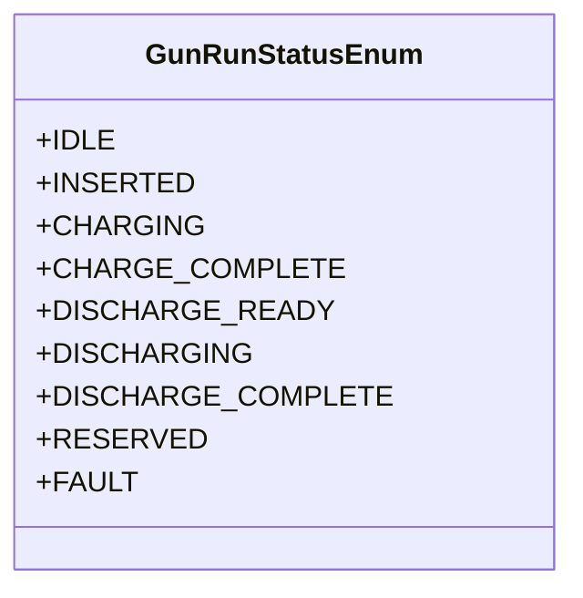

**图示来源**

- [GunRunStatusEnum.java](file://jcpp-app/src/main/java/sanbing/jcpp/app/dal/config/ibatis/enums/GunRunStatusEnum.java)

**状态说明**

- **IDLE**: 空闲状态，未连接车辆
- **INSERTED**: 已插枪，未开始充电
- **CHARGING**: 正在充电
- **CHARGE_COMPLETE**: 充电完成
- **DISCHARGE_READY**: 放电准备
- **DISCHARGING**: 正在放电
- **DISCHARGE_COMPLETE**: 放电完成
- **RESERVED**: 已预约
- **FAULT**: 故障状态

**状态转换**

- 通过`switch`语句实现Proto状态到枚举的转换
- 未知状态返回null，不进行更新

**Section sources**

- [GunRunStatusEnum.java](file://jcpp-app/src/main/java/sanbing/jcpp/app/dal/config/ibatis/enums/GunRunStatusEnum.java)

### 状态获取流程

从协议会话中获取和更新充电枪状态。

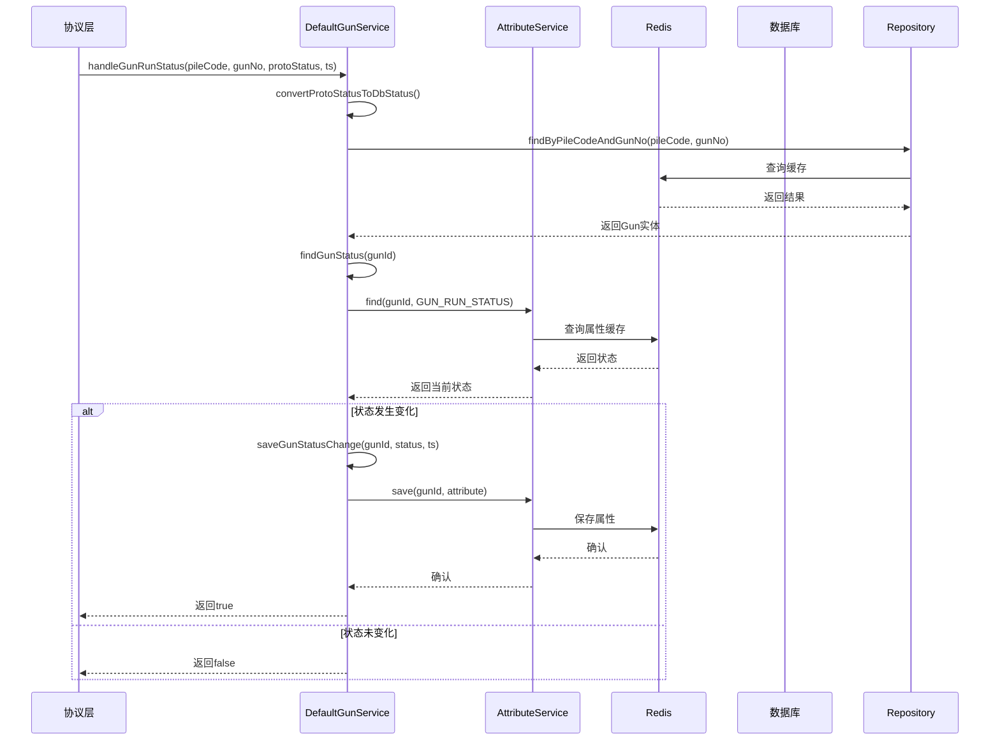

**图示来源**

- [DefaultGunService.java](file://jcpp-app/src/main/java/sanbing/jcpp/app/service/impl/DefaultGunService.java#L210-L244)

**状态同步机制**

1. 协议层上报充电枪状态
2. 服务层转换状态格式
3. 查找对应的充电枪实体
4. 获取当前状态进行比较
5. 只有状态变化时才更新
6. 保存新状态到属性系统

**性能优化**

- 使用缓存减少数据库查询
- 状态比较避免不必要的更新
- 异步属性服务提高响应速度

**Section sources**

- [DefaultGunService.java](file://jcpp-app/src/main/java/sanbing/jcpp/app/service/impl/DefaultGunService.java#L210-L244)

## 使用示例

### 为充电桩配置两把充电枪

展示如何为一个充电桩配置两把充电枪的完整流程。

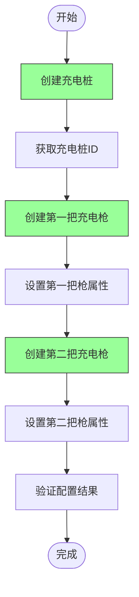

**图示来源**

- [DefaultGunService.java](file://jcpp-app/src/main/java/sanbing/jcpp/app/service/impl/DefaultGunService.java#L48-L75)

**实现步骤**

#### 步骤1: 创建充电桩

首先创建一个充电桩实体。

```java
// 伪代码：创建充电桩
Pile pile = pileService.createPile(createRequest);
UUID pileId = pile.getId();
```

#### 步骤2: 创建第一把充电枪

为充电桩创建第一把充电枪。

```java
// 伪代码：创建第一把充电枪
GunCreateRequest gun1Request = GunCreateRequest.builder()
    .gunName("快充枪1")
    .gunNo("01")
    .gunCode("GUN001")
    .stationId(stationId)
    .pileId(pileId)
    .build();

Gun gun1 = gunService.createGun(gun1Request);
```

#### 步骤3: 创建第二把充电枪

为同一充电桩创建第二把充电枪。

```java
// 伪代码：创建第二把充电枪
GunCreateRequest gun2Request = GunCreateRequest.builder()
    .gunName("快充枪2")
    .gunNo("02")
    .gunCode("GUN002")
    .stationId(stationId)
    .pileId(pileId)
    .build();

Gun gun2 = gunService.createGun(gun2Request);
```

#### 步骤4: 验证配置结果

查询充电桩下的所有充电枪。

```java
// 伪代码：验证配置
List<Gun> guns = gunService.findByPileId(pileId);
assert guns.size() == 2;

GunWithStatusResponse gun1Status = gunService.findGunWithStatusByCode("GUN001");
GunWithStatusResponse gun2Status = gunService.findGunWithStatusByCode("GUN002");
```

**关键要点**

- 两把充电枪共享同一个`pileId`
- `gunNo`在同一充电桩下必须唯一
- `gunCode`在整个系统中必须唯一
- 可以独立管理每把充电枪的状态

**Section sources**

- [DefaultGunService.java](file://jcpp-app/src/main/java/sanbing/jcpp/app/service/impl/DefaultGunService.java#L48-L75)
- [GunMapper.java](file://jcpp-app/src/main/java/sanbing/jcpp/app/dal/mapper/GunMapper.java#L1-L132)

## 级联关系与状态同步

### 级联关系管理

充电枪与充电桩之间的级联关系管理。

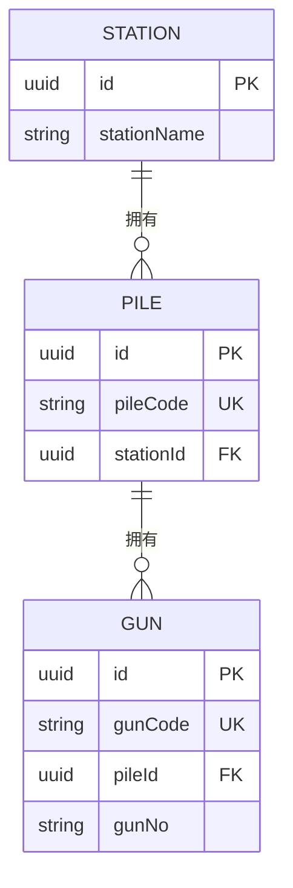

**图示来源**

- [Gun.java](file://jcpp-app/src/main/java/sanbing/jcpp/app/dal/entity/Gun.java#L1-L57)

**级联操作**

- **创建**: 充电枪必须关联到存在的充电桩
- **查询**: 支持通过充电桩查询所有充电枪
- **更新**: 可以修改充电枪所属的充电桩
- **删除**: 删除充电桩时级联删除所有充电枪

**外键约束**

- `pileId`字段确保充电枪必须属于某个充电桩
- 数据库层面保证引用完整性

**Section sources**

- [Gun.java](file://jcpp-app/src/main/java/sanbing/jcpp/app/dal/entity/Gun.java#L1-L57)

### 状态同步机制

充电枪状态变化时与充电桩的状态同步。

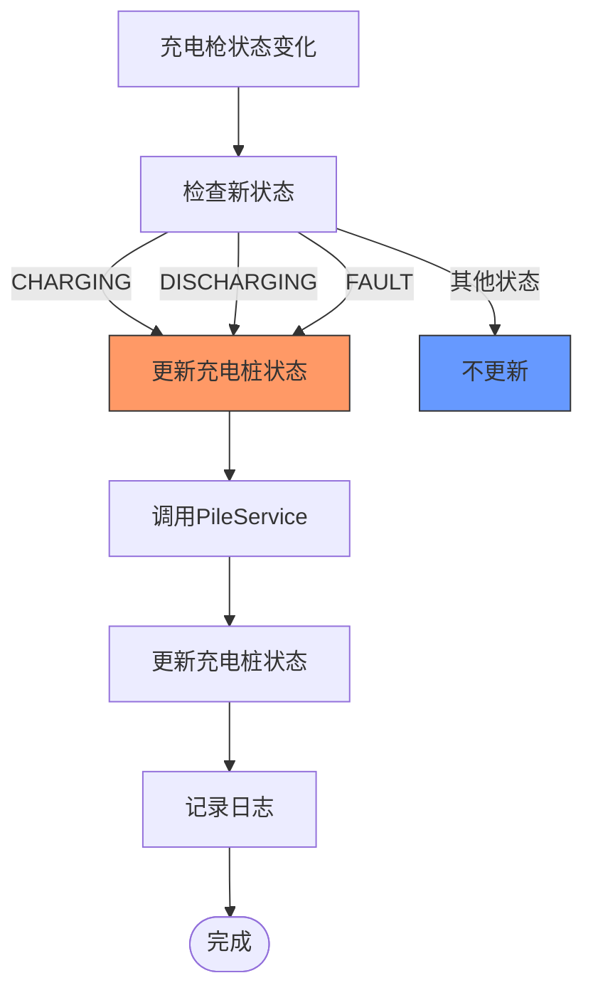

**图示来源**

- [DefaultGunService.java](file://jcpp-app/src/main/java/sanbing/jcpp/app/service/impl/DefaultGunService.java#L233-L244)

**同步规则**

```java
private boolean shouldUpdatePileStatus(GunRunStatusEnum gunStatus) {
    return switch (gunStatus) {
        case CHARGING, DISCHARGING -> true; // 充电或放电时更新
        case FAULT -> true; // 故障时更新
        default -> false; // 其他状态不更新
    };
}
```

**触发条件**

- **充电开始**: 充电枪状态变为`CHARGING`
- **放电开始**: 充电枪状态变为`DISCHARGING`
- **故障发生**: 充电枪状态变为`FAULT`

**同步流程**

1. 充电枪状态发生变化
2. 调用`shouldUpdatePileStatus()`判断是否需要同步
3. 如果需要，通知`PileService`更新充电桩状态
4. 更新充电桩的在线状态和运行状态

**性能考虑**

- 只在必要时触发同步，减少不必要的操作
- 使用异步机制避免阻塞主流程
- 缓存充电桩状态减少数据库查询

**Section sources**

- [DefaultGunService.java](file://jcpp-app/src/main/java/sanbing/jcpp/app/service/impl/DefaultGunService.java#L233-L244)