# 充电桩管理

<cite>
**本文档引用的文件**   
- [Pile.java](file://jcpp-app/src/main/java/sanbing/jcpp/app/dal/entity/Pile.java)
- [PileController.java](file://jcpp-app/src/main/java/sanbing/jcpp/app/adapter/controller/PileController.java)
- [PileCreateRequest.java](file://jcpp-app/src/main/java/sanbing/jcpp/app/adapter/request/PileCreateRequest.java)
- [PileUpdateRequest.java](file://jcpp-app/src/main/java/sanbing/jcpp/app/adapter/request/PileUpdateRequest.java)
- [PileWithStatusResponse.java](file://jcpp-app/src/main/java/sanbing/jcpp/app/adapter/response/PileWithStatusResponse.java)
- [DefaultPileService.java](file://jcpp-app/src/main/java/sanbing/jcpp/app/service/impl/DefaultPileService.java)
- [PileRepository.java](file://jcpp-app/src/main/java/sanbing/jcpp/app/dal/repository/PileRepository.java)
- [PileRepositoryImpl.java](file://jcpp-app/src/main/java/sanbing/jcpp/app/dal/repository/impl/PileRepositoryImpl.java)
- [PileStatusEnum.java](file://jcpp-app/src/main/java/sanbing/jcpp/app/dal/config/ibatis/enums/PileStatusEnum.java)
- [PileTypeEnum.java](file://jcpp-app/src/main/java/sanbing/jcpp/app/dal/config/ibatis/enums/PileTypeEnum.java)
- [StartChargeDTO.java](file://jcpp-app/src/main/java/sanbing/jcpp/app/adapter/dto/StartChargeDTO.java)
- [RestartPileDTO.java](file://jcpp-app/src/main/java/sanbing/jcpp/app/adapter/dto/RestartPileDTO.java)
- [DefaultPileProtocolService.java](file://jcpp-app/src/main/java/sanbing/jcpp/app/service/impl/DefaultPileProtocolService.java)
- [RpcController.java](file://jcpp-app/src/main/java/sanbing/jcpp/app/adapter/controller/RpcController.java)
</cite>

## 目录

1. [简介](#简介)
2. [数据模型](#数据模型)
3. [RESTful API](#restful-api)
4. [业务逻辑处理](#业务逻辑处理)
5. [远程控制操作](#远程控制操作)
6. [使用示例](#使用示例)
7. [状态机与实时同步](#状态机与实时同步)

## 简介

本文档详细阐述了充电桩管理功能的实现，包括充电桩实体的数据模型、RESTful
API接口、业务逻辑处理以及远程控制操作。系统采用分层架构，通过Pile实体表示充电桩，PileController提供RESTful
API，DefaultPileService处理业务逻辑，PileRepository负责数据持久化，DownlinkCallService实现远程控制指令的发送。

## 数据模型

充电桩管理功能的核心是Pile实体，它表示一个物理充电桩，包含其基本信息、状态和与充电站的关系。

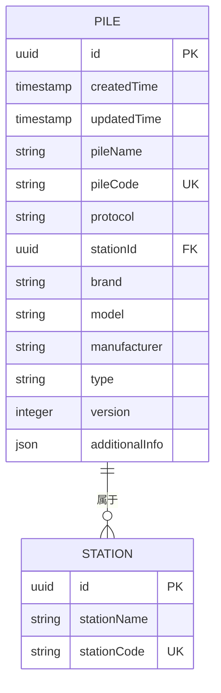

**图源**

- [Pile.java](file://jcpp-app/src/main/java/sanbing/jcpp/app/dal/entity/Pile.java#L1-L63)
- [PileTypeEnum.java](file://jcpp-app/src/main/java/sanbing/jcpp/app/dal/config/ibatis/enums/PileTypeEnum.java#L1-L22)

### Pile实体核心属性

Pile实体定义了充电桩的核心属性，这些属性在数据库中持久化存储。

| 属性名            | 类型            | 描述       | 约束           |
|----------------|---------------|----------|--------------|
| id             | UUID          | 充电桩唯一标识符 | 主键           |
| pileName       | String        | 充电桩名称    | 非空，防XSS攻击    |
| pileCode       | String        | 充电桩编号    | 唯一，非空，防XSS攻击 |
| protocol       | String        | 通信协议类型   | 非空，防XSS攻击    |
| stationId      | UUID          | 所属充电站ID  | 外键，非空        |
| brand          | String        | 品牌       | 防XSS攻击       |
| model          | String        | 型号       | 防XSS攻击       |
| manufacturer   | String        | 制造商      | 防XSS攻击       |
| type           | PileTypeEnum  | 充电桩类型    | 枚举值          |
| createdTime    | LocalDateTime | 创建时间     | 自动填充         |
| updatedTime    | LocalDateTime | 更新时间     | 自动填充         |
| additionalInfo | JsonNode      | 附加信息     | JSON格式       |
| version        | Integer       | 版本号      | 用于乐观锁        |

**节源**

- [Pile.java](file://jcpp-app/src/main/java/sanbing/jcpp/app/dal/entity/Pile.java#L1-L63)

### PileStatusEnum状态枚举

充电桩状态枚举定义了充电桩的在线/离线状态，独立于充电枪的工作状态。

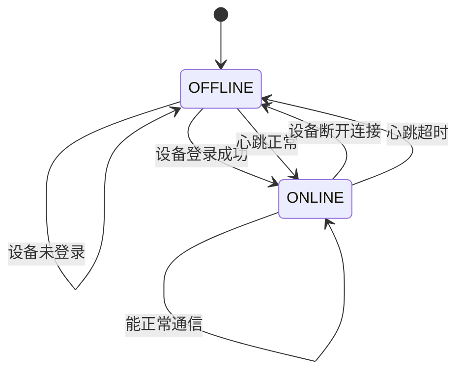

充电桩状态设计原则：

- 状态独立于充电枪状态，不受枪的工作状态影响
- 只关注设备的网络连接状态和基础可用性
- 状态转换由设备登录、心跳和连接状态决定

**节源**

- [PileStatusEnum.java](file://jcpp-app/src/main/java/sanbing/jcpp/app/dal/config/ibatis/enums/PileStatusEnum.java#L1-L50)

### PileTypeEnum类型枚举

充电桩类型枚举定义了充电桩的类型，目前支持交流和直流两种类型。

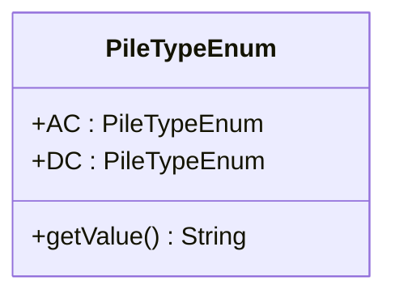

| 枚举值 | 描述    |
|-----|-------|
| AC  | 交流充电桩 |
| DC  | 直流充电桩 |

**节源**

- [PileTypeEnum.java](file://jcpp-app/src/main/java/sanbing/jcpp/app/dal/config/ibatis/enums/PileTypeEnum.java#L1-L22)

### 与Station的多对一关系

每个充电桩属于一个充电站，形成多对一的关系。这种关系通过Pile实体中的stationId字段实现，该字段是外键，指向Station实体的id。

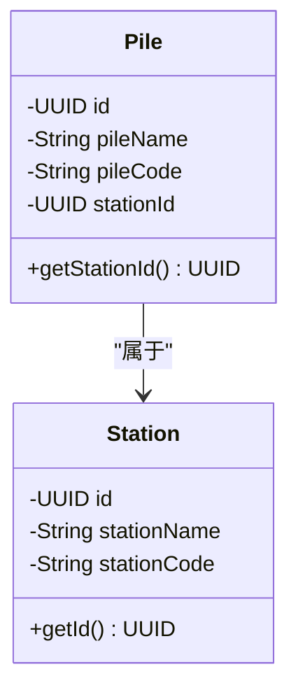

**图源**

- [Pile.java](file://jcpp-app/src/main/java/sanbing/jcpp/app/dal/entity/Pile.java#L1-L63)

## RESTful API

PileController类暴露了充电桩管理的RESTful API，提供了对充电桩的增删改查和远程控制操作。

```mermaid
graph TB
subgraph "PileController"
A[POST /piles]
B[GET /piles]
C[PUT /piles/{id}]
D[DELETE /piles/{id}]
E[GET /piles/{id}]
F[POST /piles/{id}/start-charge]
G[POST /piles/{id}/restart]
end
Client --> A
Client --> B
Client --> C
Client --> D
Client --> E
Client --> F
Client --> G
```

**图源**

- [PileController.java](file://jcpp-app/src/main/java/sanbing/jcpp/app/adapter/controller/PileController.java#L1-L111)

### 创建充电桩 (POST /piles)

创建新的充电桩，需要提供充电桩的基本信息。

#### 请求

- **方法**: POST
- **路径**: /api/piles
- **认证**: 需要有效的JWT令牌
- **授权**: 需要管理员权限

#### 请求DTO (PileCreateRequest)

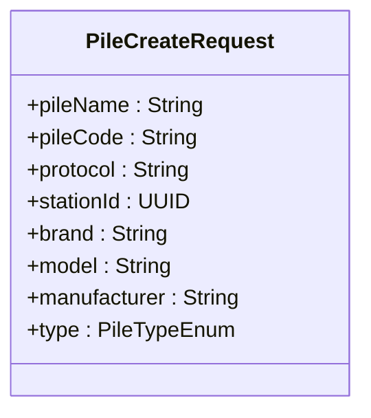

| 字段           | 类型           | 必填 | 描述          |
|--------------|--------------|----|-------------|
| pileName     | String       | 是  | 充电桩名称       |
| pileCode     | String       | 是  | 充电桩编号       |
| protocol     | String       | 是  | 通信协议        |
| stationId    | UUID         | 是  | 所属充电站ID     |
| brand        | String       | 否  | 品牌          |
| model        | String       | 否  | 型号          |
| manufacturer | String       | 否  | 制造商         |
| type         | PileTypeEnum | 否  | 充电桩类型，默认为DC |

#### 响应

- **成功**: HTTP 200，返回创建的Pile实体
- **失败**: HTTP 400，参数验证失败；HTTP 409，充电桩编号已存在

**节源**

- [PileController.java](file://jcpp-app/src/main/java/sanbing/jcpp/app/adapter/controller/PileController.java#L25-L34)
- [PileCreateRequest.java](file://jcpp-app/src/main/java/sanbing/jcpp/app/adapter/request/PileCreateRequest.java#L1-L45)

### 分页查询充电桩 (GET /piles)

分页查询充电桩列表，支持多种查询条件。

#### 请求

- **方法**: GET
- **路径**: /api/piles
- **认证**: 需要有效的JWT令牌
- **授权**: 需要查看权限

#### 请求参数 (PileQueryRequest)

| 参数           | 类型             | 描述          |
|--------------|----------------|-------------|
| page         | Integer        | 页码，从1开始     |
| size         | Integer        | 每页大小        |
| pileName     | String         | 充电桩名称（模糊查询） |
| pileCode     | String         | 充电桩编号       |
| protocol     | String         | 通信协议        |
| stationId    | UUID           | 所属充电站ID     |
| brand        | String         | 品牌          |
| model        | String         | 型号          |
| manufacturer | String         | 制造商         |
| type         | PileTypeEnum   | 充电桩类型       |
| status       | PileStatusEnum | 充电桩状态       |

#### 响应DTO (PileWithStatusResponse)

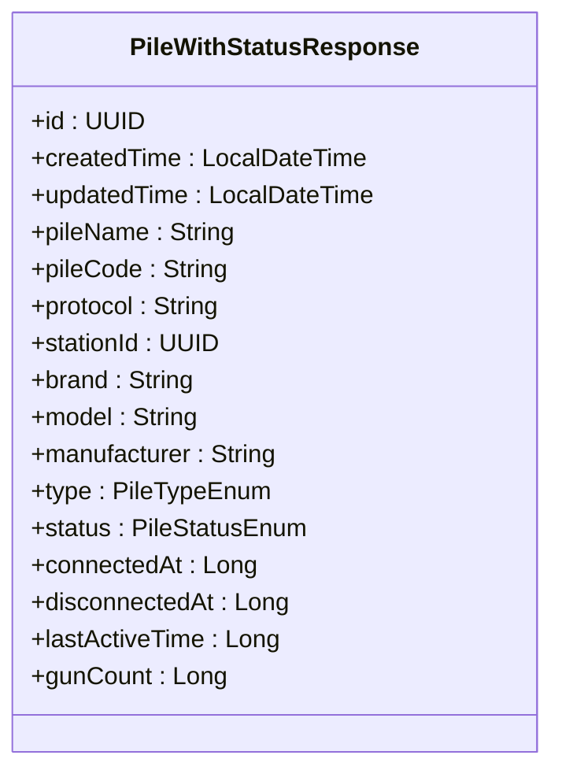

响应包含分页信息和充电桩列表，每个充电桩都包含其状态信息。

#### 响应

- **成功**: HTTP 200，返回PageResponse<PileWithStatusResponse>
- **失败**: HTTP 400，参数验证失败

**节源**

- [PileController.java](file://jcpp-app/src/main/java/sanbing/jcpp/app/adapter/controller/PileController.java#L68-L77)
- [PileQueryRequest.java](file://jcpp-app/src/main/java/sanbing/jcpp/app/adapter/request/PileQueryRequest.java#L1-L36)
- [PileWithStatusResponse.java](file://jcpp-app/src/main/java/sanbing/jcpp/app/adapter/response/PileWithStatusResponse.java#L1-L116)

### 更新充电桩 (PUT /piles/{id})

更新现有充电桩的信息。

#### 请求

- **方法**: PUT
- **路径**: /api/piles/{id}
- **认证**: 需要有效的JWT令牌
- **授权**: 需要编辑权限

#### 请求DTO (PileUpdateRequest)

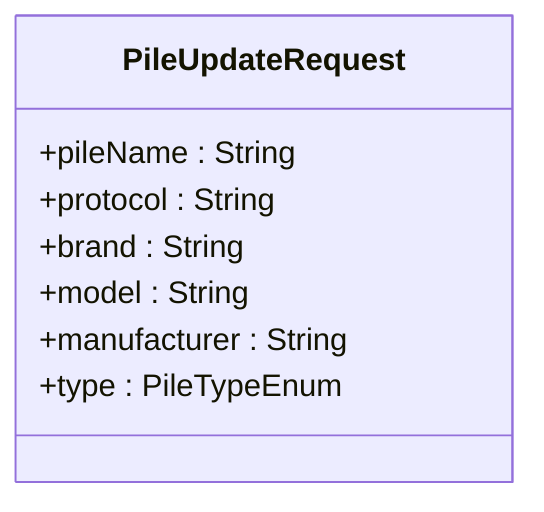

| 字段           | 类型           | 必填 | 描述    |
|--------------|--------------|----|-------|
| pileName     | String       | 是  | 充电桩名称 |
| protocol     | String       | 是  | 通信协议  |
| brand        | String       | 否  | 品牌    |
| model        | String       | 否  | 型号    |
| manufacturer | String       | 否  | 制造商   |
| type         | PileTypeEnum | 否  | 充电桩类型 |

#### 响应

- **成功**: HTTP 200，返回更新后的Pile实体
- **失败**: HTTP 404，充电桩不存在；HTTP 400，参数验证失败

**节源**

- [PileController.java](file://jcpp-app/src/main/java/sanbing/jcpp/app/adapter/controller/PileController.java#L40-L50)
- [PileUpdateRequest.java](file://jcpp-app/src/main/java/sanbing/jcpp/app/adapter/request/PileUpdateRequest.java#L1-L35)

### 删除充电桩 (DELETE /piles/{id})

删除指定ID的充电桩。

#### 请求

- **方法**: DELETE
- **路径**: /api/piles/{id}
- **认证**: 需要有效的JWT令牌
- **授权**: 需要删除权限

#### 响应

- **成功**: HTTP 200，返回成功消息
- **失败**: HTTP 404，充电桩不存在；HTTP 409，充电桩下有充电枪

**节源**

- [PileController.java](file://jcpp-app/src/main/java/sanbing/jcpp/app/adapter/controller/PileController.java#L52-L60)

## 业务逻辑处理

DefaultPileService类负责处理充电桩管理的核心业务逻辑，包括数据持久化、缓存交互和状态管理。

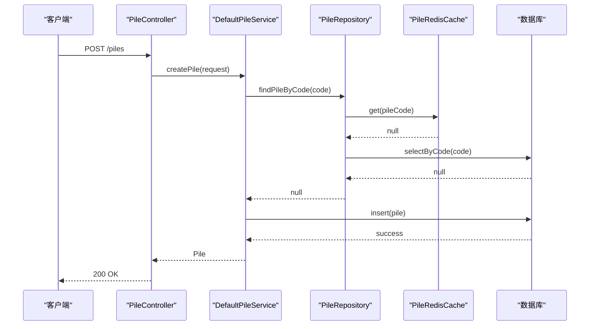

**图源**

- [DefaultPileService.java](file://jcpp-app/src/main/java/sanbing/jcpp/app/service/impl/DefaultPileService.java#L1-L329)
- [PileRepositoryImpl.java](file://jcpp-app/src/main/java/sanbing/jcpp/app/dal/repository/impl/PileRepositoryImpl.java#L1-L49)

### DefaultPileService核心功能

DefaultPileService实现了PileService接口，处理充电桩的业务逻辑。

| 方法                     | 描述             |
|------------------------|----------------|
| createPile             | 创建充电桩，检查编号唯一性  |
| findById               | 根据ID查找充电桩      |
| findByPileCode         | 根据编号查找充电桩      |
| updatePile             | 更新充电桩信息        |
| deletePile             | 删除充电桩，检查是否有充电枪 |
| queryPilesWithStatus   | 分页查询充电桩及状态     |
| updatePileStatus       | 更新充电桩状态        |
| handlePileLogin        | 处理充电桩登录        |
| handlePileHeartbeat    | 处理充电桩心跳        |
| handlePileSessionClose | 处理充电桩会话关闭      |

**节源**

- [DefaultPileService.java](file://jcpp-app/src/main/java/sanbing/jcpp/app/service/impl/DefaultPileService.java#L1-L329)

### 数据持久化 (PileRepository)

PileRepository接口定义了充电桩的数据访问方法，PileRepositoryImpl实现了该接口并提供了缓存支持。

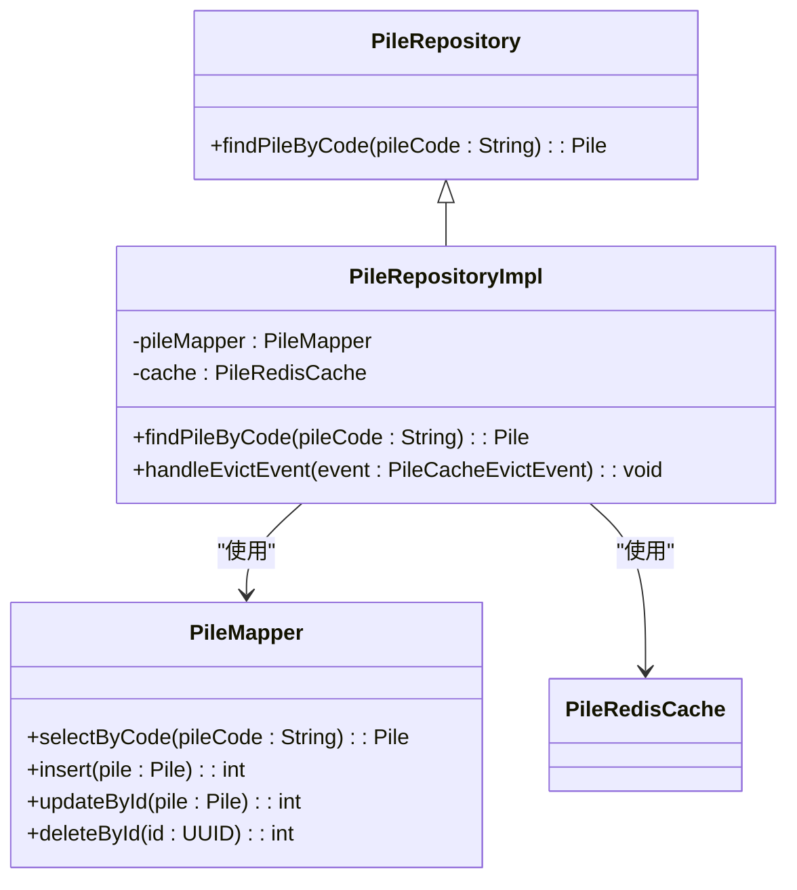

PileRepositoryImpl通过继承CachedVersionedEntityRepository获得了缓存功能，实现了基于Redis的缓存机制。当充电桩数据发生变化时，通过@TransactionalEventListener监听事件并清除缓存。

**图源**

- [PileRepository.java](file://jcpp-app/src/main/java/sanbing/jcpp/app/dal/repository/PileRepository.java#L1-L16)
- [PileRepositoryImpl.java](file://jcpp-app/src/main/java/sanbing/jcpp/app/dal/repository/impl/PileRepositoryImpl.java#L1-L49)

### 缓存交互 (PileRedisCache)

系统使用Redis作为缓存存储，PileRedisCache负责充电桩数据的缓存操作。PileRepositoryImpl通过cache字段与PileRedisCache交互，实现了读取时的缓存命中和写入时的缓存失效。

缓存键使用PileCacheKey，支持通过ID和编号两种方式缓存充电桩数据。当充电桩被更新或删除时，PileRepositoryImpl会发布PileCacheEvictEvent事件，触发缓存清除。

**节源**

- [PileRepositoryImpl.java](file://jcpp-app/src/main/java/sanbing/jcpp/app/dal/repository/impl/PileRepositoryImpl.java#L1-L49)

## 远程控制操作

系统支持对充电桩进行远程控制操作，如启动充电、重启等。这些操作通过RPC机制实现，由RpcController接收请求，调用PileProtocolService执行。

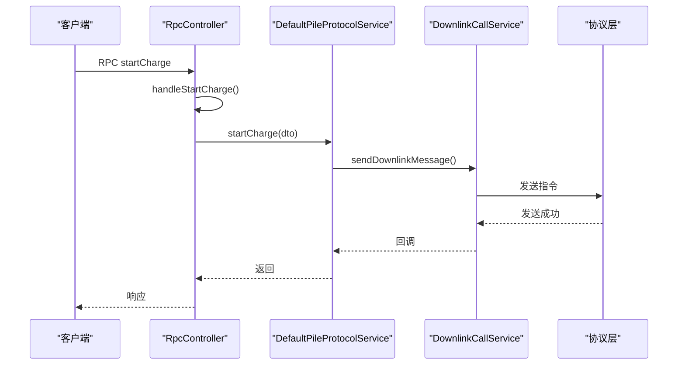

**图源**

- [RpcController.java](file://jcpp-app/src/main/java/sanbing/jcpp/app/adapter/controller/RpcController.java#L107-L145)
- [DefaultPileProtocolService.java](file://jcpp-app/src/main/java/sanbing/jcpp/app/service/impl/DefaultPileProtocolService.java#L412-L440)

### 启动充电 (POST /piles/{id}/start-charge)

远程启动充电桩的充电操作。

#### 实现流程

1. RpcController接收启动充电的RPC请求
2. 解析StartChargeDTO参数
3. 调用PileProtocolService.startCharge方法
4. 构造下行消息RemoteStartChargingRequest
5. 通过DownlinkCallService发送到协议层
6. 协议层将指令发送到充电桩

#### 请求DTO (StartChargeDTO)

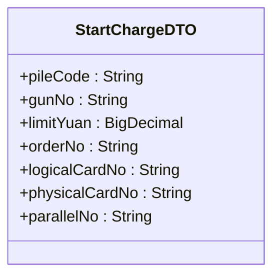

| 字段             | 类型         | 必填 | 描述      |
|----------------|------------|----|---------|
| pileCode       | String     | 是  | 充电桩编号   |
| gunNo          | String     | 是  | 充电枪编号   |
| limitYuan      | BigDecimal | 是  | 限制金额（元） |
| orderNo        | String     | 是  | 订单号     |
| logicalCardNo  | String     | 否  | 逻辑卡号    |
| physicalCardNo | String     | 否  | 物理卡号    |
| parallelNo     | String     | 否  | 并充序号    |

**节源**

- [StartChargeDTO.java](file://jcpp-app/src/main/java/sanbing/jcpp/app/adapter/dto/StartChargeDTO.java#L1-L61)
- [DefaultPileProtocolService.java](file://jcpp-app/src/main/java/sanbing/jcpp/app/service/impl/DefaultPileProtocolService.java#L412-L440)

### 重启充电桩 (POST /piles/{id}/restart)

远程重启充电桩。

#### 实现流程

1. RpcController接收重启充电桩的RPC请求
2. 解析RestartPileDTO参数
3. 调用PileProtocolService.restartPile方法
4. 构造下行消息RestartPileRequest
5. 通过DownlinkCallService发送到协议层
6. 协议层将指令发送到充电桩

#### 请求DTO (RestartPileDTO)

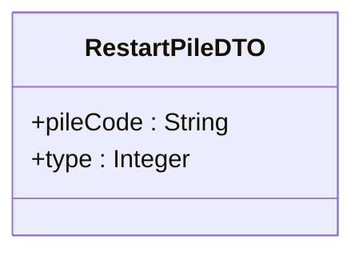

| 字段       | 类型      | 必填 | 描述    |
|----------|---------|----|-------|
| pileCode | String  | 是  | 充电桩编号 |
| type     | Integer | 是  | 重启类型  |

**节源**

- [RestartPileDTO.java](file://jcpp-app/src/main/java/sanbing/jcpp/app/adapter/dto/RestartPileDTO.java#L1-L32)
- [DefaultPileProtocolService.java](file://jcpp-app/src/main/java/sanbing/jcpp/app/service/impl/DefaultPileProtocolService.java#L506-L531)

## 使用示例

以下示例演示如何为一个充电站添加充电桩并远程启动充电。

### 为充电站添加充电桩

```http
POST /api/piles HTTP/1.1
Content-Type: application/json
Authorization: Bearer <token>

{
  "pileName": "直流快充桩1号",
  "pileCode": "DCP001",
  "protocol": "LVNENG_V340",
  "stationId": "a1b2c3d4-e5f6-7890-1234-567890abcdef",
  "brand": "特来电",
  "model": "DC-80KW",
  "manufacturer": "特来电新能源有限公司",
  "type": "DC"
}
```

响应：

```json
{
  "code": 200,
  "message": "创建成功",
  "data": {
    "id": "f1e2d3c4-b5a6-9876-5432-10fedcba9876",
    "createdTime": "2024-01-01T10:00:00",
    "pileName": "直流快充桩1号",
    "pileCode": "DCP001",
    "protocol": "LVNENG_V340",
    "stationId": "a1b2c3d4-e5f6-7890-1234-567890abcdef",
    "brand": "特来电",
    "model": "DC-80KW",
    "manufacturer": "特来电新能源有限公司",
    "type": "DC"
  }
}
```

### 远程启动充电

```http
POST /rpc HTTP/1.1
Content-Type: application/json
Authorization: Bearer <token>

{
  "method": "startCharge",
  "parameter": {
    "pileCode": "DCP001",
    "gunNo": "1",
    "limitYuan": 50.00,
    "orderNo": "ORD202401011001",
    "logicalCardNo": "CARD123456789012"
  }
}
```

**节源**

- [PileController.java](file://jcpp-app/src/main/java/sanbing/jcpp/app/adapter/controller/PileController.java#L25-L34)
- [RpcController.java](file://jcpp-app/src/main/java/sanbing/jcpp/app/adapter/controller/RpcController.java#L107-L145)

## 状态机与实时同步

充电桩状态机管理充电桩的在线/离线状态，通过实时同步机制确保状态的准确性。

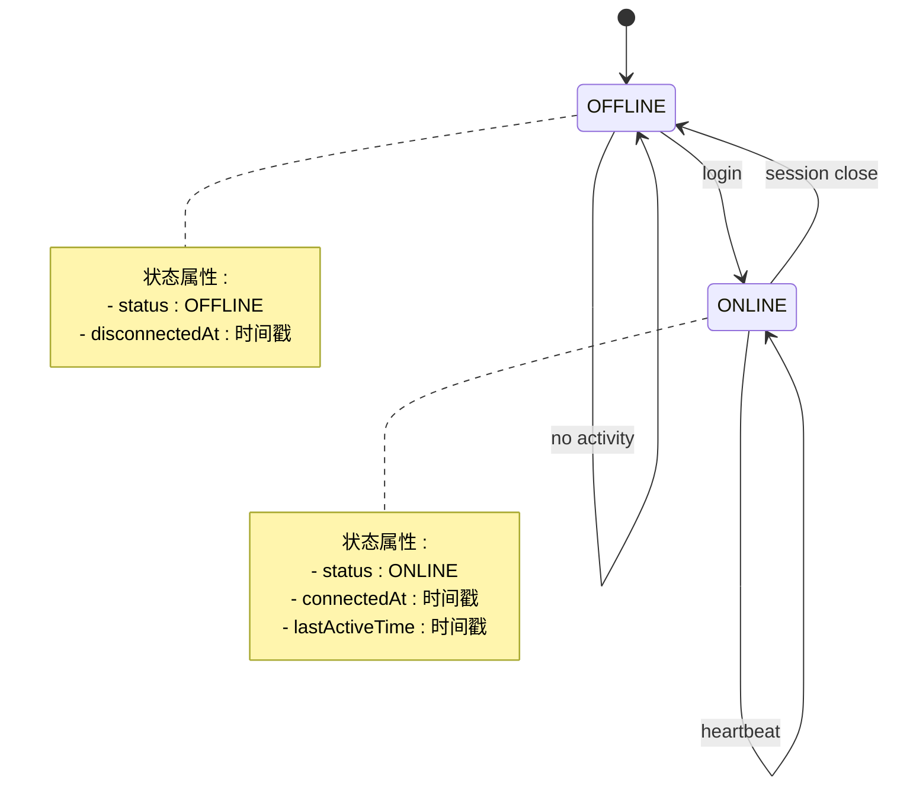

### 状态机实现

充电桩状态机基于三个核心事件实现：登录、心跳和会话关闭。

| 事件   | 当前状态   | 新状态     | 更新的属性                               |
|------|--------|---------|-------------------------------------|
| 登录   | 任意     | ONLINE  | status, connectedAt, lastActiveTime |
| 心跳   | ONLINE | ONLINE  | status, lastActiveTime              |
| 会话关闭 | ONLINE | OFFLINE | status, disconnectedAt              |

**节源**

- [DefaultPileService.java](file://jcpp-app/src/main/java/sanbing/jcpp/app/service/impl/DefaultPileService.java#L240-L300)

### 实时状态同步

系统通过AttributeService将充电桩状态存储在Redis中，实现状态的实时同步。

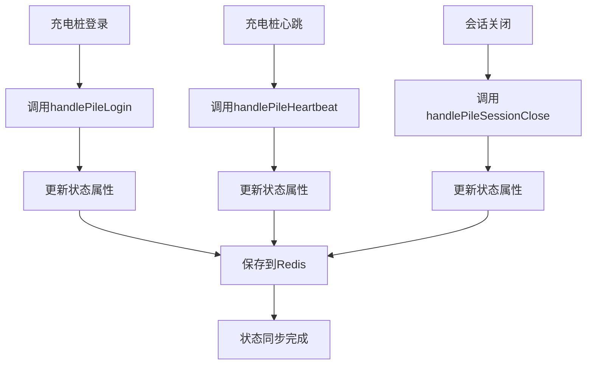

状态属性存储在Redis的哈希结构中，键名为`pile:attributes:{pileId}`，字段名为状态属性名，如`STATUS`、`CONNECTED_AT`
等。这种设计支持高效的状态查询和更新。

**节源**

- [DefaultPileService.java](file://jcpp-app/src/main/java/sanbing/jcpp/app/service/impl/DefaultPileService.java#L240-L300)