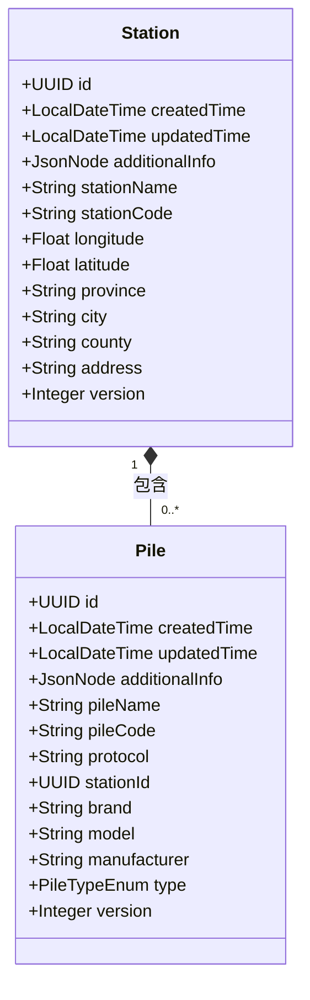
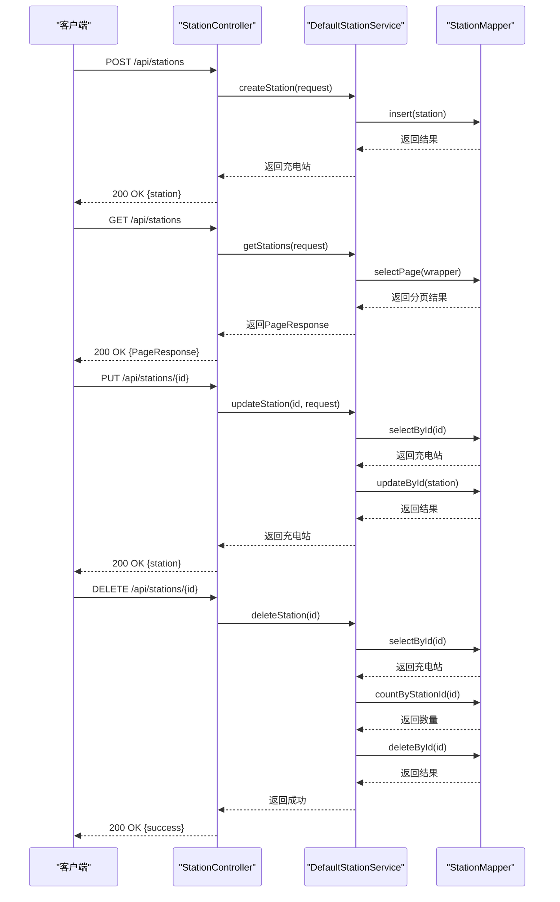
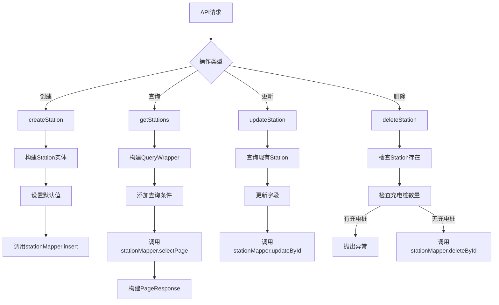
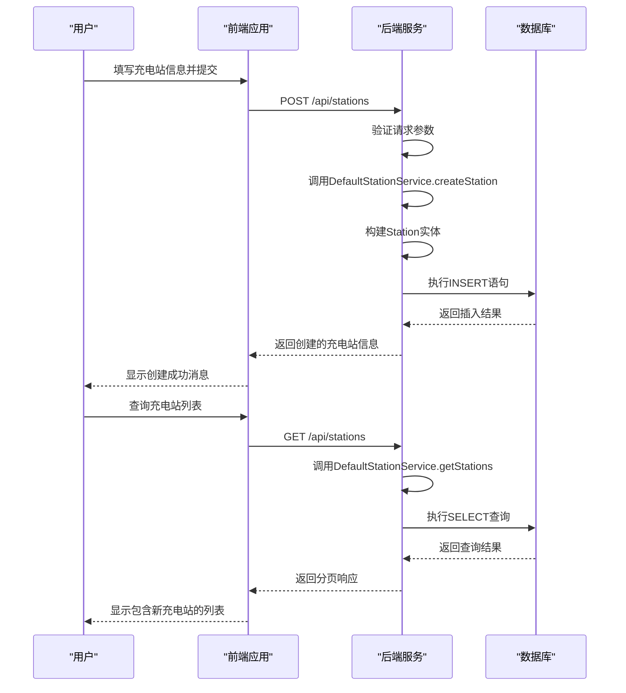
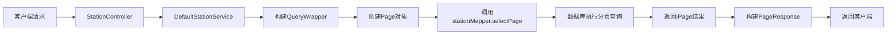
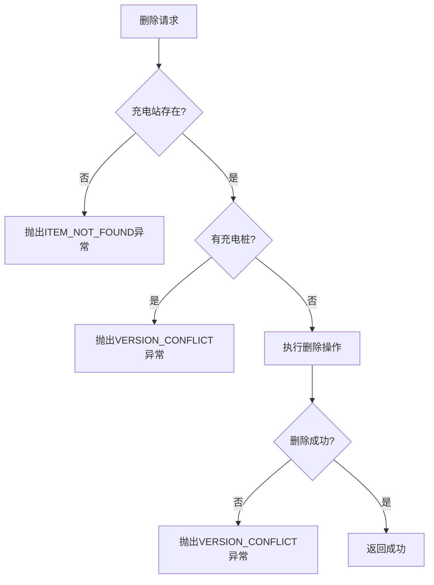

# 充电站管理

<cite>
**本文档引用的文件**   
- [Station.java](file://jcpp-app/src/main/java/sanbing/jcpp/app/dal/entity/Station.java)
- [StationController.java](file://jcpp-app/src/main/java/sanbing/jcpp/app/adapter/controller/StationController.java)
- [StationMapper.java](file://jcpp-app/src/main/java/sanbing/jcpp/app/dal/mapper/StationMapper.java)
- [DefaultStationService.java](file://jcpp-app/src/main/java/sanbing/jcpp/app/service/impl/DefaultStationService.java)
- [Pile.java](file://jcpp-app/src/main/java/sanbing/jcpp/app/dal/entity/Pile.java)
- [PileMapper.java](file://jcpp-app/src/main/java/sanbing/jcpp/app/dal/mapper/PileMapper.java)
- [StationCreateRequest.java](file://jcpp-app/src/main/java/sanbing/jcpp/app/adapter/request/StationCreateRequest.java)
- [StationUpdateRequest.java](file://jcpp-app/src/main/java/sanbing/jcpp/app/adapter/request/StationUpdateRequest.java)
- [StationQueryRequest.java](file://jcpp-app/src/main/java/sanbing/jcpp/app/adapter/request/StationQueryRequest.java)
- [PageResponse.java](file://jcpp-app/src/main/java/sanbing/jcpp/app/adapter/response/PageResponse.java)
- [schema-init.sql](file://jcpp-app/src/main/resources/sql/schema-init.sql)
</cite>

## 目录

1. [引言](#引言)
2. [数据模型](#数据模型)
3. [RESTful API接口](#restful-api接口)
4. [服务层实现](#服务层实现)
5. [使用示例](#使用示例)
6. [分页查询机制](#分页查询机制)
7. [级联删除逻辑](#级联删除逻辑)

## 引言

充电站管理功能是本系统的核心模块之一，负责充电站的全生命周期管理。该功能提供了完整的CRUD操作，支持通过RESTful
API对充电站进行创建、查询、更新和删除。系统采用分层架构设计，包含控制器层、服务层和数据访问层，确保了代码的可维护性和扩展性。充电站实体与充电桩实体之间存在一对多的关系，系统在删除充电站时会进行级联检查，确保数据完整性。

## 数据模型

### Station实体

`Station`实体是充电站管理的核心数据模型，定义了充电站的基本属性和元数据。该实体映射到数据库中的`t_station`表，使用MyBatis
Plus框架进行ORM映射。



**Diagram sources**

- [Station.java](file://jcpp-app/src/main/java/sanbing/jcpp/app/dal/entity/Station.java#L1-L65)
- [Pile.java](file://jcpp-app/src/main/java/sanbing/jcpp/app/dal/entity/Pile.java#L1-L64)

#### 核心属性说明

- **id**: 充电站唯一标识符，使用UUID类型，作为主键
- **createdTime**: 创建时间，记录充电站创建的精确时间戳
- **updatedTime**: 更新时间，每次更新时自动更新
- **stationName**: 充电站名称，必填字段，用于标识充电站
- **stationCode**: 充电站编码，必填字段，具有唯一性约束
- **longitude/latitude**: 地理位置坐标，用于地图展示和定位
- **province/city/county/address**: 地址信息，分别表示省、市、区县和详细地址
- **additionalInfo**: 附加信息，使用JSON格式存储扩展属性
- **version**: 版本号，用于乐观锁控制，防止并发更新冲突

**Section sources**

- [Station.java](file://jcpp-app/src/main/java/sanbing/jcpp/app/dal/entity/Station.java#L1-L65)
- [schema-init.sql](file://jcpp-app/src/main/resources/sql/schema-init.sql#L34-L58)

## RESTful API接口

### API端点概览

`StationController`提供了完整的RESTful API端点，用于管理充电站资源。所有API均遵循REST设计原则，使用标准的HTTP方法和状态码。



**Diagram sources**

- [StationController.java](file://jcpp-app/src/main/java/sanbing/jcpp/app/adapter/controller/StationController.java#L1-L107)
- [DefaultStationService.java](file://jcpp-app/src/main/java/sanbing/jcpp/app/service/impl/DefaultStationService.java#L1-L247)

### 详细API说明

#### 创建充电站 (POST /api/stations)

创建新的充电站资源。

- **请求参数**: `StationCreateRequest`对象
- **请求体示例**:

```json
{
  "stationName": "三丙家专属充电站",
  "stationCode": "S20241001001",
  "longitude": 120.107933,
  "latitude": 30.267013,
  "province": "浙江省",
  "city": "杭州市",
  "county": "西湖区",
  "address": "西溪路552-1号"
}
```

- **响应格式**: `ApiResponse<Station>`
- **权限要求**: `AuthorityEnum.STATION_MANAGE`

#### 分页查询充电站 (GET /api/stations)

分页查询充电站列表，支持多种查询条件。

- **请求参数**:
    - `page`: 页码（默认0）
    - `size`: 每页大小（默认10）
    - `stationName`: 充电站名称（模糊查询）
    - `stationCode`: 充电站编码（模糊查询）
    - `province`: 省份（精确查询）
    - `city`: 城市（精确查询）
    - `sortField`: 排序字段
    - `sortOrder`: 排序顺序（asc/desc）
- **响应格式**: `ApiResponse<PageResponse<Station>>`
- **权限要求**: `AuthorityEnum.STATION_MANAGE`

#### 更新充电站 (PUT /api/stations/{id})

更新指定ID的充电站信息。

- **路径参数**: `id` - 充电站UUID
- **请求参数**: `StationUpdateRequest`对象
- **请求体示例**:

```json
{
  "stationName": "三丙家专属充电站(更新)",
  "longitude": 120.108000,
  "latitude": 30.267100,
  "province": "浙江省",
  "city": "杭州市",
  "county": "西湖区",
  "address": "西溪路552-1号(更新)"
}
```

- **响应格式**: `ApiResponse<Station>`
- **权限要求**: `AuthorityEnum.STATION_MANAGE`

#### 删除充电站 (DELETE /api/stations/{id})

删除指定ID的充电站。

- **路径参数**: `id` - 充电站UUID
- **响应格式**: `ApiResponse<Void>`
- **权限要求**: `AuthorityEnum.STATION_MANAGE`
- **业务逻辑**: 删除前会检查该充电站下是否存在充电桩，如果存在则不允许删除

#### 获取充电站选项 (GET /api/stations/options)

获取充电站选项列表，用于下拉选择组件。

- **响应格式**: `ApiResponse<List<StationOption>>`
- **权限要求**: `AuthorityEnum.STATION_MANAGE`

#### 搜索充电站选项 (GET /api/stations/search)

搜索充电站选项，支持关键字搜索和分页。

- **请求参数**:
    - `keyword`: 搜索关键字
    - `page`: 页码
    - `size`: 每页大小
- **响应格式**: `ApiResponse<List<StationOption>>`
- **权限要求**: `AuthorityEnum.STATION_MANAGE`

**Section sources**

- [StationController.java](file://jcpp-app/src/main/java/sanbing/jcpp/app/adapter/controller/StationController.java#L1-L107)
- [StationCreateRequest.java](file://jcpp-app/src/main/java/sanbing/jcpp/app/adapter/request/StationCreateRequest.java#L1-L44)
- [StationUpdateRequest.java](file://jcpp-app/src/main/java/sanbing/jcpp/app/adapter/request/StationUpdateRequest.java#L1-L40)
- [StationQueryRequest.java](file://jcpp-app/src/main/java/sanbing/jcpp/app/adapter/request/StationQueryRequest.java#L1-L29)

## 服务层实现

### DefaultStationService

`DefaultStationService`是充电站管理的核心服务实现类，协调`StationMapper`和`PileMapper`进行数据库操作，并处理业务逻辑。



**Diagram sources**

- [DefaultStationService.java](file://jcpp-app/src/main/java/sanbing/jcpp/app/service/impl/DefaultStationService.java#L1-L247)

#### 核心方法说明

- **getStations**: 实现分页查询功能，根据`StationQueryRequest`中的条件构建查询条件，支持按名称、编码、省份、城市等字段进行查询，并支持排序功能
- **getStationById**: 根据ID查询单个充电站信息
- **createStation**: 创建新的充电站，自动生成UUID和创建时间，初始化版本号为1
- **updateStation**: 更新充电站信息，更新时会自动设置`updatedTime`字段
- **deleteStation**: 删除充电站前会进行完整性检查，确保该充电站下没有关联的充电桩
- **getStationOptions**: 获取充电站选项列表，用于前端下拉选择
- **searchStationOptions**: 支持关键字搜索的充电站选项查询

**Section sources**

- [DefaultStationService.java](file://jcpp-app/src/main/java/sanbing/jcpp/app/service/impl/DefaultStationService.java#L1-L247)
- [StationMapper.java](file://jcpp-app/src/main/java/sanbing/jcpp/app/dal/mapper/StationMapper.java#L1-L15)

## 使用示例

### 创建充电站完整流程

以下是一个通过API创建新充电站并验证其存在的完整示例：



**Diagram sources**

- [StationController.java](file://jcpp-app/src/main/java/sanbing/jcpp/app/adapter/controller/StationController.java#L1-L107)
- [DefaultStationService.java](file://jcpp-app/src/main/java/sanbing/jcpp/app/service/impl/DefaultStationService.java#L1-L247)

#### 示例代码

```java
// 创建充电站请求
StationCreateRequest request = new StationCreateRequest();
request.setStationName("新充电站");
request.setStationCode("NEW001");
request.setLongitude(120.123456f);
request.setLatitude(30.654321f);
request.setProvince("浙江省");
request.setCity("杭州市");
request.setCounty("西湖区");
request.setAddress("文三路168号");

// 调用API创建充电站
ResponseEntity<ApiResponse<Station>> response = restTemplate.postForEntity(
    "/api/stations", 
    request, 
    new ParameterizedTypeReference<ApiResponse<Station>>() {}
);

// 验证创建结果
assertThat(response.getStatusCode()).isEqualTo(HttpStatus.OK);
Station createdStation = response.getBody().getData();
assertThat(createdStation.getStationName()).isEqualTo("新充电站");

// 查询验证
ResponseEntity<ApiResponse<PageResponse<Station>>> queryResponse = restTemplate.getForEntity(
    "/api/stations?stationName=新充电站", 
    new ParameterizedTypeReference<ApiResponse<PageResponse<Station>>>() {}
);

assertThat(queryResponse.getBody().getData().getTotal()).isGreaterThan(0);
```

**Section sources**

- [StationController.java](file://jcpp-app/src/main/java/sanbing/jcpp/app/adapter/controller/StationController.java#L1-L107)
- [DefaultStationService.java](file://jcpp-app/src/main/java/sanbing/jcpp/app/service/impl/DefaultStationService.java#L1-L247)
- [InstallInitializingBean.java](file://jcpp-app/src/main/java/sanbing/jcpp/app/initializing/InstallInitializingBean.java#L218-L233)

## 分页查询机制

### 分页实现原理

系统采用MyBatis Plus的分页插件实现分页查询功能，通过`Page`对象和`IPage`接口提供分页支持。



**Diagram sources**

- [DefaultStationService.java](file://jcpp-app/src/main/java/sanbing/jcpp/app/service/impl/DefaultStationService.java#L65-L99)
- [PageResponse.java](file://jcpp-app/src/main/java/sanbing/jcpp/app/adapter/response/PageResponse.java#L1-L43)

#### PageResponse结构

`PageResponse`类封装了分页查询的响应数据，包含以下字段：

- **records**: 当前页的数据记录列表
- **total**: 总记录数
- **page**: 当前页码
- **size**: 每页大小
- **totalPages**: 总页数

分页计算公式：`totalPages = ceil(total / size)`

**Section sources**

- [PageResponse.java](file://jcpp-app/src/main/java/sanbing/jcpp/app/adapter/response/PageResponse.java#L1-L43)
- [DefaultStationService.java](file://jcpp-app/src/main/java/sanbing/jcpp/app/service/impl/DefaultStationService.java#L65-L99)

## 级联删除逻辑

### 删除业务流程

系统在删除充电站时实现了严格的级联检查机制，确保数据完整性。



**Diagram sources**

- [DefaultStationService.java](file://jcpp-app/src/main/java/sanbing/jcpp/app/service/impl/DefaultStationService.java#L150-L185)

#### 详细逻辑说明

1. **存在性检查**: 首先通过`stationMapper.selectById(id)`检查充电站是否存在，如果不存在则抛出`ITEM_NOT_FOUND`异常
2. **关联检查**: 调用`pileMapper.countByStationId(id)`统计该充电站下的充电桩数量，如果数量大于0，则抛出`VERSION_CONFLICT`
   异常，提示用户先删除所有充电桩
3. **执行删除**: 通过`stationMapper.deleteById(id)`执行删除操作
4. **结果验证**: 检查受影响的行数，如果为0则说明删除失败，可能是被其他操作删除，抛出`VERSION_CONFLICT`异常

这种设计确保了数据的一致性和完整性，防止意外删除包含充电桩的充电站。

**Section sources**

- [DefaultStationService.java](file://jcpp-app/src/main/java/sanbing/jcpp/app/service/impl/DefaultStationService.java#L150-L185)
- [PileMapper.java](file://jcpp-app/src/main/java/sanbing/jcpp/app/dal/mapper/PileMapper.java#L60-L65)