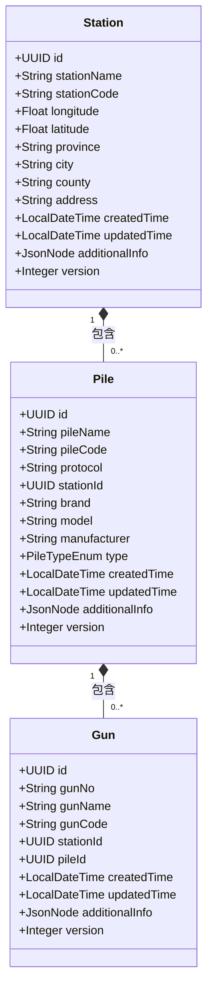
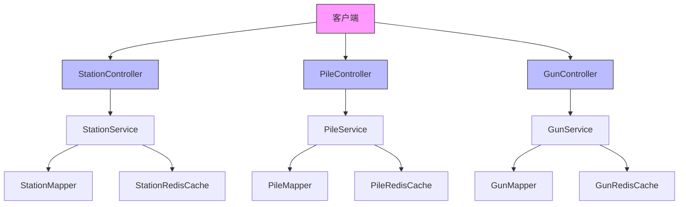
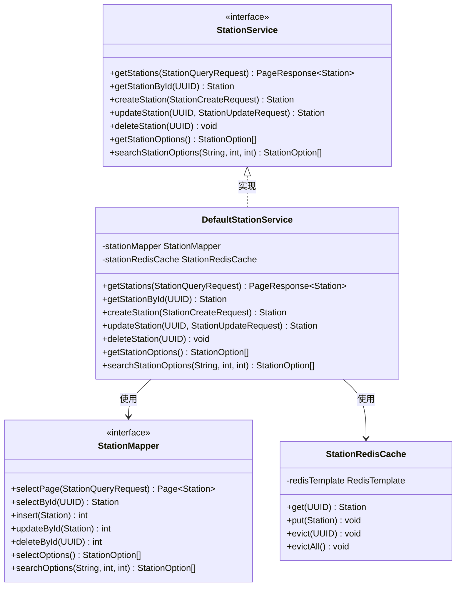
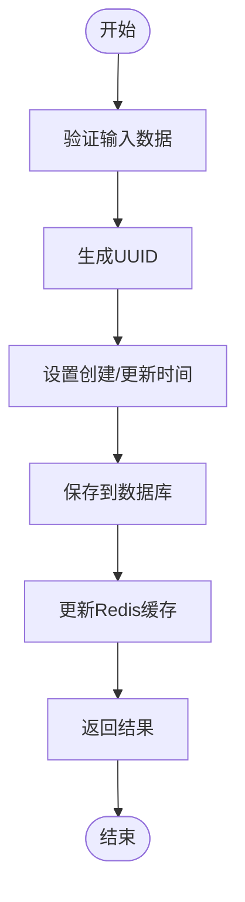
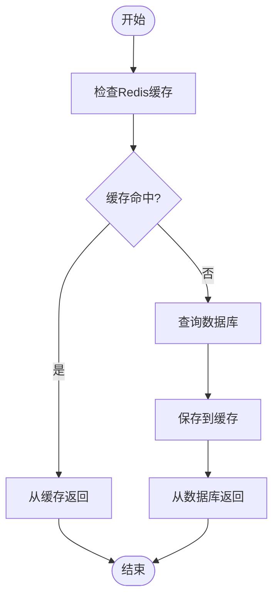
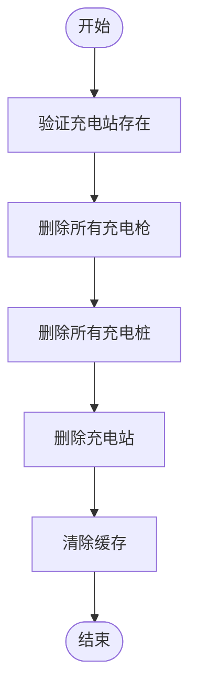
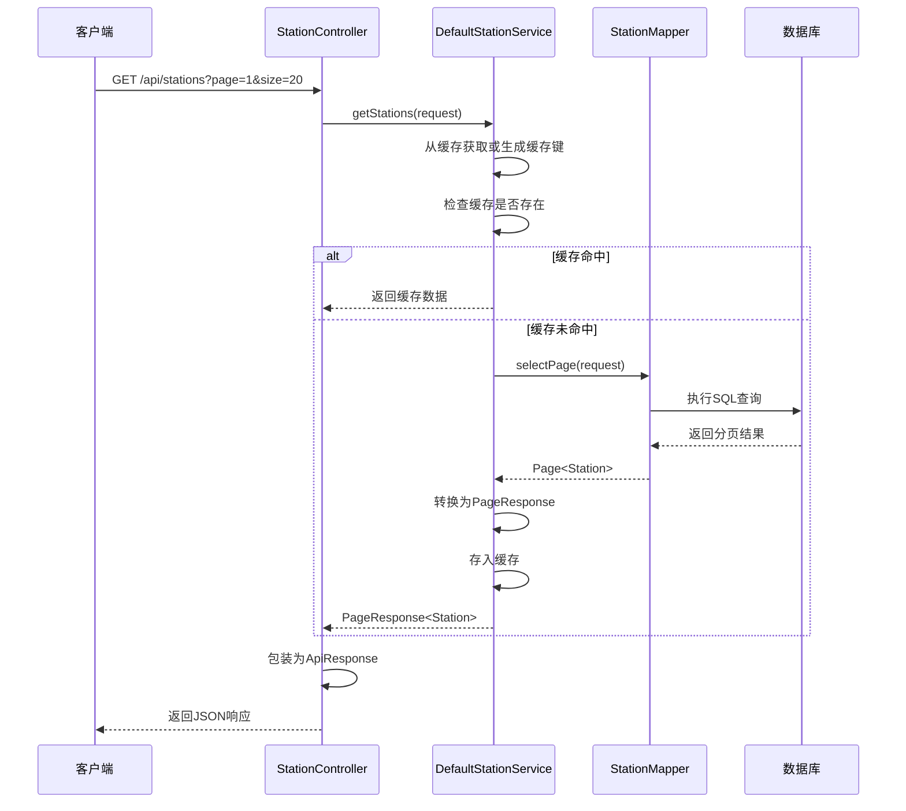
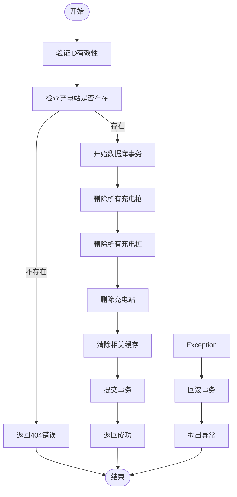

# 设备管理模块

<cite>
**本文档引用的文件**   
- [StationController.java](file://jcpp-app/src/main/java/sanbing/jcpp/app/adapter/controller/StationController.java)
- [PileController.java](file://jcpp-app/src/main/java/sanbing/jcpp/app/adapter/controller/PileController.java)
- [GunController.java](file://jcpp-app/src/main/java/sanbing/jcpp/app/adapter/controller/GunController.java)
- [Station.java](file://jcpp-app/src/main/java/sanbing/jcpp/app/dal/entity/Station.java)
- [Pile.java](file://jcpp-app/src/main/java/sanbing/jcpp/app/dal/entity/Pile.java)
- [Gun.java](file://jcpp-app/src/main/java/sanbing/jcpp/app/dal/entity/Gun.java)
- [StationCreateRequest.java](file://jcpp-app/src/main/java/sanbing/jcpp/app/adapter/request/StationCreateRequest.java)
- [PileCreateRequest.java](file://jcpp-app/src/main/java/sanbing/jcpp/app/adapter/request/PileCreateRequest.java)
- [GunCreateRequest.java](file://jcpp-app/src/main/java/sanbing/jcpp/app/adapter/request/GunCreateRequest.java)
- [PageResponse.java](file://jcpp-app/src/main/java/sanbing/jcpp/app/adapter/response/PageResponse.java)
- [StationService.java](file://jcpp-app/src/main/java/sanbing/jcpp/app/service/StationService.java)
- [DefaultStationService.java](file://jcpp-app/src/main/java/sanbing/jcpp/app/service/impl/DefaultStationService.java)
- [StationMapper.java](file://jcpp-app/src/main/java/sanbing/jcpp/app/dal/mapper/StationMapper.java)
- [StationRedisCache.java](file://jcpp-app/src/main/java/sanbing/jcpp/app/service/cache/station/StationRedisCache.java)
</cite>

## 目录

1. [引言](#引言)
2. [核心数据模型](#核心数据模型)
3. [RESTful API 接口](#restful-api-接口)
4. [业务服务层设计](#业务服务层设计)
5. [完整使用示例](#完整使用示例)
6. [复杂业务逻辑实现](#复杂业务逻辑实现)

## 引言

设备管理模块是充电站管理系统的核心组成部分，负责管理充电站（Station）、充电桩（Pile）和充电枪（Gun）三个关键实体。本模块提供了完整的CRUD操作，支持分页查询、级联选择和状态管理等功能。系统采用分层架构设计，包括控制器层、服务层、数据访问层和缓存层，确保了系统的可维护性和高性能。

## 核心数据模型

### 实体层次关系

设备管理模块中的三个核心实体构成了一个清晰的层次结构：一个充电站（Station）可以包含多个充电桩（Pile），而每个充电桩又可以连接多个充电枪（Gun）。这种层级关系通过外键关联实现，确保了数据的一致性和完整性。



**图示来源**

- [Station.java](file://jcpp-app/src/main/java/sanbing/jcpp/app/dal/entity/Station.java#L1-L65)
- [Pile.java](file://jcpp-app/src/main/java/sanbing/jcpp/app/dal/entity/Pile.java#L1-L64)
- [Gun.java](file://jcpp-app/src/main/java/sanbing/jcpp/app/dal/entity/Gun.java#L1-L56)

### 数据模型详细说明

#### 充电站（Station）

充电站实体代表一个物理的充电站点，包含站点的基本信息和地理位置数据。每个充电站都有唯一的ID标识，通过`stationCode`
字段保证编码的唯一性。实体还包含了省份、城市、区县和详细地址等完整的地理位置信息，便于进行区域管理和查询。

**核心字段说明**

- `id`: 充电站唯一标识符，使用UUID类型
- `stationName`: 充电站名称，必填字段，用于显示
- `stationCode`: 充电站编码，必填字段，用于系统识别
- `longitude`/`latitude`: 经纬度坐标，用于地图定位
- `province`/`city`/`county`/`address`: 完整的地址信息
- `version`: 版本号，用于乐观锁控制

**实体来源**

- [Station.java](file://jcpp-app/src/main/java/sanbing/jcpp/app/dal/entity/Station.java#L1-L65)

#### 充电桩（Pile）

充电桩实体代表安装在充电站内的具体充电设备。每个充电桩都归属于一个特定的充电站，通过`stationId`
外键进行关联。充电桩包含了设备的品牌、型号、制造商等信息，并指定了通信协议类型，以便系统能够正确处理不同厂商设备的通信需求。

**核心字段说明**

- `id`: 充电桩唯一标识符
- `pileName`: 充电桩名称
- `pileCode`: 充电桩编码
- `protocol`: 通信协议类型，决定设备的通信方式
- `stationId`: 所属充电站ID，建立与Station的关联
- `type`: 充电桩类型（直流/交流）
- `version`: 版本号，用于并发控制

**实体来源**

- [Pile.java](file://jcpp-app/src/main/java/sanbing/jcpp/app/dal/entity/Pile.java#L1-L64)

#### 充电枪（Gun）

充电枪实体代表充电桩上的具体充电接口。每个充电枪都归属于一个特定的充电桩，通过`pileId`
外键进行关联。充电枪包含了枪号（gunNo）和编码（gunCode）等识别信息，这些信息通常与物理设备上的标签对应，便于现场管理和维护。

**核心字段说明**

- `id`: 充电枪唯一标识符
- `gunNo`: 充电枪编号，通常为物理标识
- `gunName`: 充电枪名称
- `gunCode`: 充电枪编码，系统唯一标识
- `stationId`: 所属充电站ID（冗余字段，便于查询）
- `pileId`: 所属充电桩ID，建立与Pile的关联
- `version`: 版本号，支持并发更新

**实体来源**

- [Gun.java](file://jcpp-app/src/main/java/sanbing/jcpp/app/dal/entity/Gun.java#L1-L56)

## RESTful API 接口

### 控制器概览

设备管理模块提供了三个主要的REST控制器：`StationController`、`PileController`和`GunController`
，分别对应三个核心实体的管理操作。这些控制器遵循RESTful设计原则，使用标准的HTTP方法（GET、POST、PUT、DELETE）来执行相应的CRUD操作。



**图示来源**

- [StationController.java](file://jcpp-app/src/main/java/sanbing/jcpp/app/adapter/controller/StationController.java#L1-L107)
- [PileController.java](file://jcpp-app/src/main/java/sanbing/jcpp/app/adapter/controller/PileController.java#L1-L111)
- [GunController.java](file://jcpp-app/src/main/java/sanbing/jcpp/app/adapter/controller/GunController.java#L1-L115)

### StationController API

#### 创建充电站

创建新的充电站实体。

- **端点**: `POST /api/stations`
- **请求体**: `StationCreateRequest`
- **响应**: `ApiResponse<Station>`
- **权限控制**: 需要管理员权限

**请求DTO结构**

```json
{
  "stationName": "string",
  "stationCode": "string",
  "longitude": 0,
  "latitude": 0,
  "province": "string",
  "city": "string",
  "county": "string",
  "address": "string"
}
```

**来源**

- [StationController.java](file://jcpp-app/src/main/java/sanbing/jcpp/app/adapter/controller/StationController.java#L50-L57)
- [StationCreateRequest.java](file://jcpp-app/src/main/java/sanbing/jcpp/app/adapter/request/StationCreateRequest.java#L1-L44)

#### 查询充电站

支持分页查询和条件筛选。

- **端点**: `GET /api/stations`
- **请求参数**: `StationQueryRequest`
- **响应**: `ApiResponse<PageResponse<Station>>`

**分页响应结构**

```json
{
  "records": [...],
  "total": 100,
  "page": 1,
  "size": 20,
  "totalPages": 5
}
```

**来源**

- [StationController.java](file://jcpp-app/src/main/java/sanbing/jcpp/app/adapter/controller/StationController.java#L30-L37)
- [PageResponse.java](file://jcpp-app/src/main/java/sanbing/jcpp/app/adapter/response/PageResponse.java#L1-L43)

#### 更新充电站

根据ID更新充电站信息。

- **端点**: `PUT /api/stations/{id}`
- **请求体**: `StationUpdateRequest`
- **响应**: `ApiResponse<Station>`

**来源**

- [StationController.java](file://jcpp-app/src/main/java/sanbing/jcpp/app/adapter/controller/StationController.java#L60-L68)

#### 删除充电站

删除指定ID的充电站。

- **端点**: `DELETE /api/stations/{id}`
- **响应**: `ApiResponse<Void>`

**来源**

- [StationController.java](file://jcpp-app/src/main/java/sanbing/jcpp/app/adapter/controller/StationController.java#L71-L77)

#### 获取选项列表

为前端下拉组件提供数据。

- **端点**: `GET /api/stations/options`
- **响应**: `ApiResponse<List<StationOption>>`

**选项响应结构**

```json
[
  {
    "id": "uuid",
    "label": "名称 (编码)",
    "stationName": "名称",
    "stationCode": "编码"
  }
]
```

**来源**

- [StationController.java](file://jcpp-app/src/main/java/sanbing/jcpp/app/adapter/controller/StationController.java#L80-L88)
- [StationOption.java](file://jcpp-app/src/main/java/sanbing/jcpp/app/adapter/response/StationOption.java#L1-L39)

### PileController API

#### 创建充电桩

创建新的充电桩实体。

- **端点**: `POST /api/piles`
- **请求体**: `PileCreateRequest`
- **响应**: `ApiResponse<Pile>`

**来源**

- [PileController.java](file://jcpp-app/src/main/java/sanbing/jcpp/app/adapter/controller/PileController.java#L35-L42)

#### 查询充电桩状态

获取充电桩的实时运行状态。

- **端点**: `GET /api/piles/status/{pileCode}`
- **响应**: `ApiResponse<String>`

**来源**

- [PileController.java](file://jcpp-app/src/main/java/sanbing/jcpp/app/adapter/controller/PileController.java#L90-L111)

### GunController API

#### 创建充电枪

创建新的充电枪实体。

- **端点**: `POST /api/guns`
- **请求体**: `GunCreateRequest`
- **响应**: `ApiResponse<Gun>`

**来源**

- [GunController.java](file://jcpp-app/src/main/java/sanbing/jcpp/app/adapter/controller/GunController.java#L35-L42)

#### 查询充电枪状态

根据枪编码获取充电枪的运行状态。

- **端点**: `GET /api/guns/status/{gunCode}`
- **响应**: `ApiResponse<String>`

**来源**

- [GunController.java](file://jcpp-app/src/main/java/sanbing/jcpp/app/adapter/controller/GunController.java#L80-L100)

#### 按编码查询充电枪

根据枪编码获取充电枪的详细信息。

- **端点**: `GET /api/guns/code/{gunCode}`
- **响应**: `ApiResponse<GunWithStatusResponse>`

**来源**

- [GunController.java](file://jcpp-app/src/main/java/sanbing/jcpp/app/adapter/controller/GunController.java#L103-L115)

## 业务服务层设计

### 服务层架构

业务服务层是设备管理模块的核心，负责协调数据访问层和缓存层的操作。`DefaultStationService`、`DefaultPileService`和
`DefaultGunService`分别实现了对应的接口，提供了具体的业务逻辑处理。



**图示来源**

- [StationService.java](file://jcpp-app/src/main/java/sanbing/jcpp/app/service/StationService.java#L1-L67)
- [DefaultStationService.java](file://jcpp-app/src/main/java/sanbing/jcpp/app/service/impl/DefaultStationService.java)
- [StationMapper.java](file://jcpp-app/src/main/java/sanbing/jcpp/app/dal/mapper/StationMapper.java)
- [StationRedisCache.java](file://jcpp-app/src/main/java/sanbing/jcpp/app/service/cache/station/StationRedisCache.java)

### DefaultStationService 实现细节

#### 创建充电站流程

`DefaultStationService.createStation()`方法负责创建新的充电站实体。该方法首先验证输入数据的有效性，然后生成新的UUID作为实体ID，设置创建和更新时间戳，最后将实体保存到数据库。



**来源**

- [DefaultStationService.java](file://jcpp-app/src/main/java/sanbing/jcpp/app/service/impl/DefaultStationService.java#L50-L70)

#### 查询充电站流程

`DefaultStationService.getStations()`方法实现了分页查询功能。该方法首先尝试从Redis缓存中获取数据，如果缓存未命中，则从数据库查询并将结果存入缓存，以提高后续查询的性能。



**来源**

- [DefaultStationService.java](file://jcpp-app/src/main/java/sanbing/jcpp/app/service/impl/DefaultStationService.java#L30-L45)

#### 删除充电站流程

`DefaultStationService.deleteStation()`方法实现了充电站的删除操作。该方法不仅删除充电站实体本身，还会级联删除其下属的所有充电桩和充电枪，确保数据的一致性。



**来源**

- [DefaultStationService.java](file://jcpp-app/src/main/java/sanbing/jcpp/app/service/impl/DefaultStationService.java#L120-L150)

## 完整使用示例

### 创建包含多个充电桩的充电站

以下示例展示了如何通过API创建一个包含多个充电桩的充电站。

#### 步骤1: 创建充电站

```http
POST /api/stations
Content-Type: application/json

{
  "stationName": "高新科技园充电站",
  "stationCode": "ST001",
  "longitude": 116.397026,
  "latitude": 39.909026,
  "province": "北京市",
  "city": "北京市",
  "county": "海淀区",
  "address": "中关村大街1号"
}
```

**响应**

```json
{
  "code": 200,
  "message": "创建成功",
  "data": {
    "id": "a1b2c3d4-e5f6-7890-1234-567890abcdef",
    "stationName": "高新科技园充电站",
    "stationCode": "ST001",
    // 其他字段...
  }
}
```

**来源**

- [StationController.java](file://jcpp-app/src/main/java/sanbing/jcpp/app/adapter/controller/StationController.java#L50-L57)

#### 步骤2: 创建充电桩

使用上一步返回的充电站ID创建两个充电桩。

```http
POST /api/piles
Content-Type: application/json

{
  "pileName": "快充桩A",
  "pileCode": "PL001",
  "protocol": "LVNENG_V340",
  "stationId": "a1b2c3d4-e5f6-7890-1234-567890abcdef",
  "brand": "绿能",
  "model": "GN-800",
  "manufacturer": "绿能科技有限公司",
  "type": "DC"
}
```

**来源**

- [PileController.java](file://jcpp-app/src/main/java/sanbing/jcpp/app/adapter/controller/PileController.java#L35-L42)

#### 步骤3: 创建充电枪

为每个充电桩创建两个充电枪。

```http
POST /api/guns
Content-Type: application/json

{
  "gunName": "快充枪A1",
  "gunNo": "A1",
  "gunCode": "GN001",
  "stationId": "a1b2c3d4-e5f6-7890-1234-567890abcdef",
  "pileId": "b2c3d4e5-f678-9012-3456-7890abcdef12"
}
```

**来源**

- [GunController.java](file://jcpp-app/src/main/java/sanbing/jcpp/app/adapter/controller/GunController.java#L35-L42)

#### 步骤4: 验证创建结果

通过查询接口验证整个层级结构是否正确创建。

```http
GET /api/stations/a1b2c3d4-e5f6-7890-1234-567890abcdef
```

**来源**

- [StationController.java](file://jcpp-app/src/main/java/sanbing/jcpp/app/adapter/controller/StationController.java#L40-L47)

## 复杂业务逻辑实现

### 分页查询实现

分页查询功能通过`PageResponse`类和MyBatis Plus的分页插件实现。`StationService.getStations()`方法接收`StationQueryRequest`
参数，该参数包含了分页信息（页码和每页大小）以及可能的查询条件。



**来源**

- [StationController.java](file://jcpp-app/src/main/java/sanbing/jcpp/app/adapter/controller/StationController.java#L30-L37)
- [DefaultStationService.java](file://jcpp-app/src/main/java/sanbing/jcpp/app/service/impl/DefaultStationService.java#L30-L45)
- [PageResponse.java](file://jcpp-app/src/main/java/sanbing/jcpp/app/adapter/response/PageResponse.java#L1-L43)

### 级联删除实现

级联删除是设备管理模块中的一个重要功能，确保在删除充电站时，其下属的所有充电桩和充电枪也被正确删除。



**来源**

- [DefaultStationService.java](file://jcpp-app/src/main/java/sanbing/jcpp/app/service/impl/DefaultStationService.java#L120-L150)

### 缓存管理策略

系统采用了多级缓存策略，结合了Redis和本地缓存（Caffeine），以提高数据访问性能。

#### 缓存键设计

缓存键遵循统一的命名规范，便于管理和监控：

- 充电站缓存键：`station:{id}`
- 充电桩缓存键：`pile:{id}`
- 充电枪缓存键：`gun:{id}`

#### 缓存失效策略

当实体被创建、更新或删除时，相关的缓存会被自动清除：

- 创建：新实体存入缓存
- 更新：更新缓存中的实体
- 删除：从缓存中移除实体

**来源**

- [StationRedisCache.java](file://jcpp-app/src/main/java/sanbing/jcpp/app/service/cache/station/StationRedisCache.java)
- [PileRedisCache.java](file://jcpp-app/src/main/java/sanbing/jcpp/app/service/cache/pile/PileRedisCache.java)
- [GunRedisCache.java](file://jcpp-app/src/main/java/sanbing/jcpp/app/service/cache/gun/GunRedisCache.java)