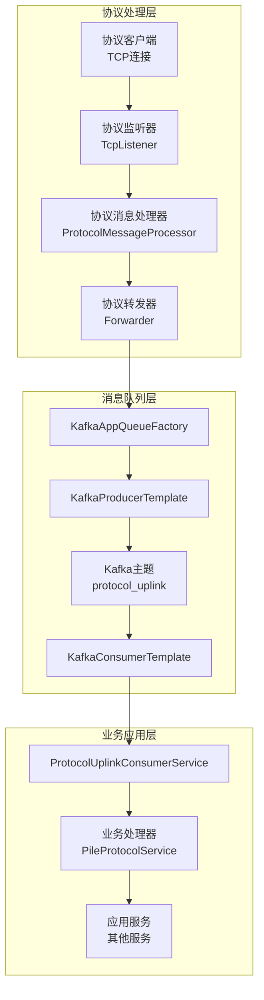
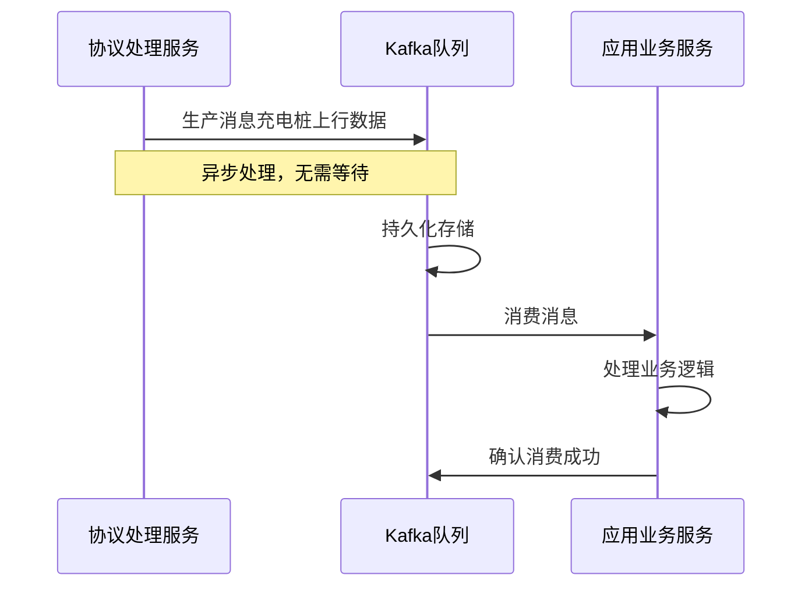
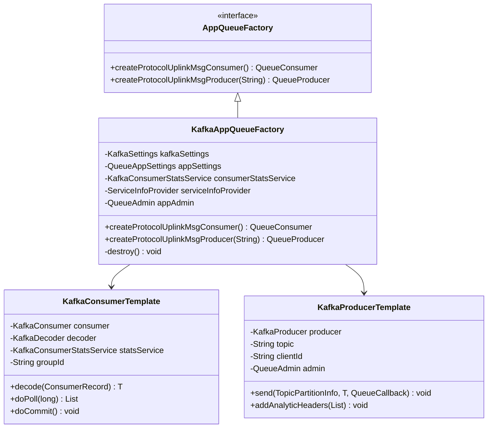
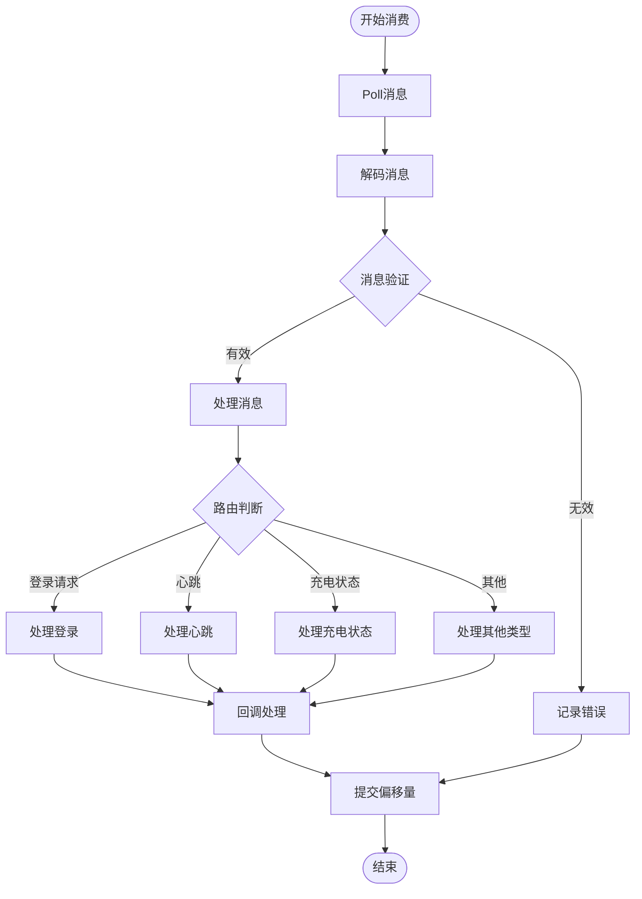
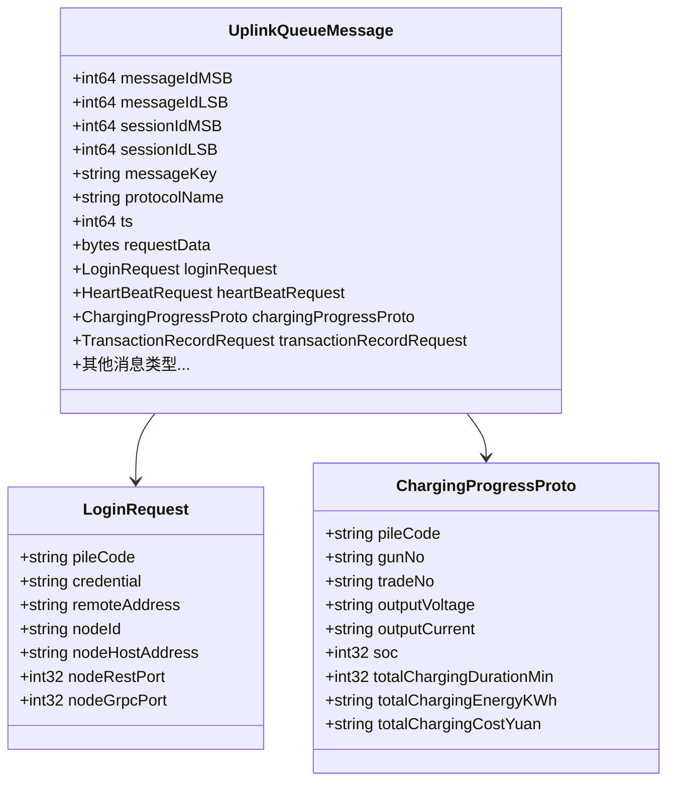
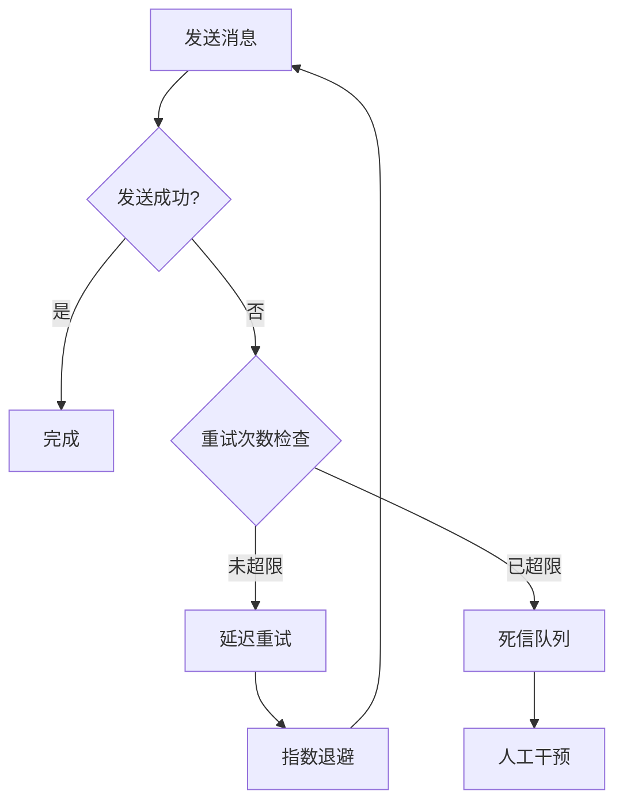
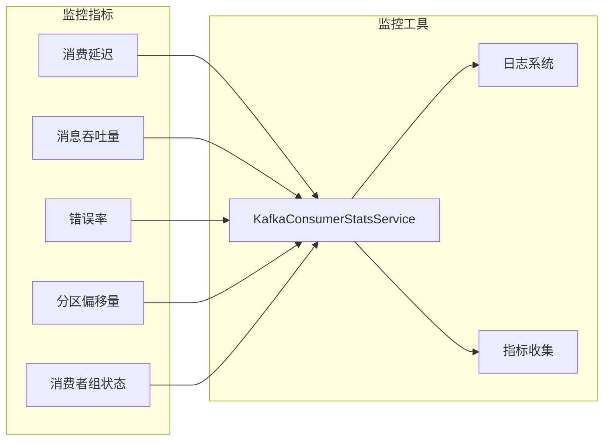
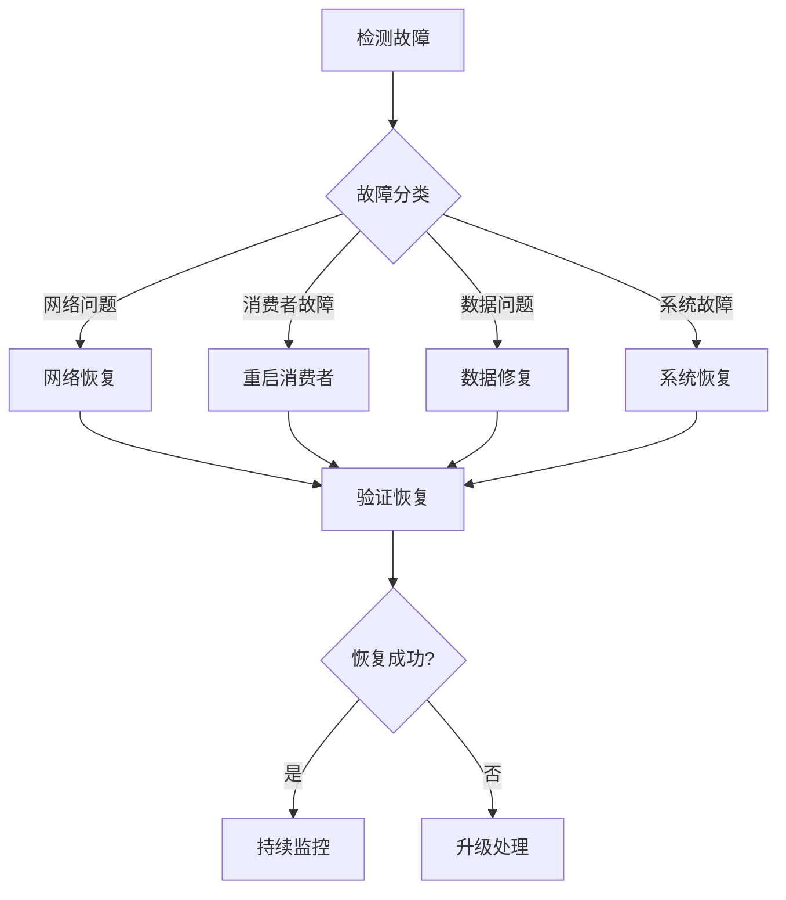

# 消息队列集成

<cite>
**本文档引用的文件**
- [KafkaAppQueueFactory.java](file://jcpp-infrastructure-queue/src/main/java/sanbing/jcpp/infrastructure/queue/provider/KafkaAppQueueFactory.java)
- [AppQueueFactory.java](file://jcpp-infrastructure-queue/src/main/java/sanbing/jcpp/infrastructure/queue/provider/AppQueueFactory.java)
- [KafkaConsumerTemplate.java](file://jcpp-infrastructure-queue/src/main/java/sanbing/jcpp/infrastructure/queue/kafka/KafkaConsumerTemplate.java)
- [KafkaProducerTemplate.java](file://jcpp-infrastructure-queue/src/main/java/sanbing/jcpp/infrastructure/queue/kafka/KafkaProducerTemplate.java)
- [ProtocolUplinkConsumerService.java](file://jcpp-app/src/main/java/sanbing/jcpp/app/service/queue/consumer/ProtocolUplinkConsumerService.java)
- [KafkaSettings.java](file://jcpp-infrastructure-queue/src/main/java/sanbing/jcpp/infrastructure/queue/kafka/KafkaSettings.java)
- [KafkaTopicConfigs.java](file://jcpp-infrastructure-queue/src/main/java/sanbing/jcpp/infrastructure/queue/kafka/KafkaTopicConfigs.java)
- [ProtoQueueMsg.java](file://jcpp-infrastructure-queue/src/main/java/sanbing/jcpp/infrastructure/queue/ProtoQueueMsg.java)
- [DefaultQueueMsgHeaders.java](file://jcpp-infrastructure-queue/src/main/java/sanbing/jcpp/infrastructure/queue/DefaultQueueMsgHeaders.java)
- [QueueAppSettings.java](file://jcpp-infrastructure-queue/src/main/java/sanbing/jcpp/infrastructure/queue/settings/QueueAppSettings.java)
- [KafkaConsumerStatsService.java](file://jcpp-infrastructure-queue/src/main/java/sanbing/jcpp/infrastructure/queue/kafka/KafkaConsumerStatsService.java)
- [ProtocolUplinkMsg.java](file://jcpp-protocol-api/src/main/java/sanbing/jcpp/protocol/domain/ProtocolUplinkMsg.java)
- [uplink.proto](file://jcpp-infrastructure-proto/src/main/proto/uplink.proto)
- [app-service.yml](file://jcpp-app-bootstrap/src/main/resources/app-service.yml)
- [protocol-service.yml](file://jcpp-protocol-bootstrap/src/main/resources/protocol-service.yml)
</cite>

## 目录

1. [引言](#引言)
2. [系统架构概述](#系统架构概述)
3. [Kafka作为核心消息中间件的选择](#kafka作为核心消息中间件的选择)
4. [KafkaAppQueueFactory设计与实现](#kafkaappqueuefactory设计与实现)
5. [ProtocolUplinkConsumerService详解](#protocoluplinkconsumerservice详解)
6. [消息序列化与格式](#消息序列化与格式)
7. [消息可靠性保证机制](#消息可靠性保证机制)
8. [Kafka主题配置与管理](#kafka主题配置与管理)
9. [监控与性能指标](#监控与性能指标)
10. [故障处理与最佳实践](#故障处理与最佳实践)
11. [总结](#总结)

## 引言

JChargePointProtocol系统采用Kafka作为核心消息中间件，构建了一个高可用、高性能的消息队列集成架构。该系统通过消息队列实现了协议处理服务和业务应用服务之间的解耦，确保了系统的可扩展性和可靠性。

本文档详细阐述了系统如何选择Kafka作为消息中间件，以及Kafka在整体架构中的关键作用，包括消息的生产、消费、序列化、可靠性保证等各个方面。

## 系统架构概述

系统采用分层架构设计，通过消息队列实现不同服务组件之间的解耦：



**图表来源**

- [KafkaAppQueueFactory.java](file://jcpp-infrastructure-queue/src/main/java/sanbing/jcpp/infrastructure/queue/provider/KafkaAppQueueFactory.java#L20-L85)
- [ProtocolUplinkConsumerService.java](file://jcpp-app/src/main/java/sanbing/jcpp/app/service/queue/consumer/ProtocolUplinkConsumerService.java#L40-L100)

## Kafka作为核心消息中间件的选择

### 选择Kafka的核心原因

1. **高吞吐量和低延迟**：Kafka能够处理每秒数百万条消息，满足充电桩高频数据传输需求
2. **持久化存储**：消息持久化保证数据不丢失，支持离线处理和重放
3. **分布式架构**：天然支持水平扩展，适应大规模部署需求
4. **分区和副本机制**：提供高可用性和数据冗余
5. **流式处理能力**：支持实时数据处理和分析

### 解耦协议处理和服务业务

Kafka在系统中扮演着关键的解耦角色：



**图表来源**

- [KafkaProducerTemplate.java](file://jcpp-infrastructure-queue/src/main/java/sanbing/jcpp/infrastructure/queue/kafka/KafkaProducerTemplate.java#L70-L100)
- [KafkaConsumerTemplate.java](file://jcpp-infrastructure-queue/src/main/java/sanbing/jcpp/infrastructure/queue/kafka/KafkaConsumerTemplate.java#L50-L80)

**章节来源**

- [KafkaAppQueueFactory.java](file://jcpp-infrastructure-queue/src/main/java/sanbing/jcpp/infrastructure/queue/provider/KafkaAppQueueFactory.java#L20-L30)
- [app-service.yml](file://jcpp-app-bootstrap/src/main/resources/app-service.yml#L107-L156)

## KafkaAppQueueFactory设计与实现

### 工厂模式的应用

KafkaAppQueueFactory实现了AppQueueFactory接口，提供了Kafka相关队列组件的创建功能：



**图表来源**

- [AppQueueFactory.java](file://jcpp-infrastructure-queue/src/main/java/sanbing/jcpp/infrastructure/queue/provider/AppQueueFactory.java#L12-L20)
- [KafkaAppQueueFactory.java](file://jcpp-infrastructure-queue/src/main/java/sanbing/jcpp/infrastructure/queue/provider/KafkaAppQueueFactory.java#L20-L85)

### 生产者和消费者的创建

#### ProtocolUplinkMsgConsumer的创建

KafkaAppQueueFactory根据配置创建ProtocolUplinkMsgConsumer，支持多种解码方式：

- **Protobuf解码**：默认方式，高效且类型安全
- **JSON解码**：兼容性更好，便于调试

#### ProtocolUplinkMsgProducer的创建

生产者负责将消息发送到指定的Kafka主题，支持动态主题切换和批量发送优化。

**章节来源**

- [KafkaAppQueueFactory.java](file://jcpp-infrastructure-queue/src/main/java/sanbing/jcpp/infrastructure/queue/provider/KafkaAppQueueFactory.java#L35-L85)
- [QueueAppSettings.java](file://jcpp-infrastructure-queue/src/main/java/sanbing/jcpp/infrastructure/queue/settings/QueueAppSettings.java#L15-L32)

## ProtocolUplinkConsumerService详解

### 消费者服务的核心职责

ProtocolUplinkConsumerService是系统中处理充电桩上行消息的主要组件，负责：

1. **消息订阅**：订阅Kafka主题，接收来自协议处理服务的消息
2. **消息分发**：根据消息类型将消息路由到相应的业务处理器
3. **并发处理**：支持多线程并发处理提高吞吐量
4. **错误处理**：提供完善的异常处理和重试机制

### 消息处理流程



**图表来源**

- [ProtocolUplinkConsumerService.java](file://jcpp-app/src/main/java/sanbing/jcpp/app/service/queue/consumer/ProtocolUplinkConsumerService.java#L150-L250)

### 消息路由机制

ProtocolUplinkConsumerService根据消息内容的不同类型调用相应的业务处理器：

| 消息类型                        | 处理方法                          | 功能描述      |
|-----------------------------|-------------------------------|-----------|
| LoginRequest                | pileLogin                     | 处理充电桩登录请求 |
| HeartBeatRequest            | heartBeat                     | 处理心跳检测    |
| ChargingProgressProto       | postChargingProgress          | 处理充电进度信息  |
| TransactionRecordRequest    | onTransactionRecordRequest    | 处理交易记录    |
| BmsChargingErrorProto       | onBmsChargingErrorProto       | 处理BMS充电错误 |
| RemoteStartChargingResponse | onRemoteStartChargingResponse | 处理远程启动响应  |

### 并发处理与性能优化

系统采用多线程并发处理机制：

- **消费者线程池**：支持按分区创建独立的消费者线程
- **消息批处理**：支持批量处理提高吞吐量
- **超时控制**：防止长时间阻塞影响系统性能

**章节来源**

- [ProtocolUplinkConsumerService.java](file://jcpp-app/src/main/java/sanbing/jcpp/app/service/queue/consumer/ProtocolUplinkConsumerService.java#L80-L150)
- [ProtocolUplinkConsumerService.java](file://jcpp-app/src/main/java/sanbing/jcpp/app/service/queue/consumer/ProtocolUplinkConsumerService.java#L250-L350)

## 消息序列化与格式

### Protobuf序列化

系统主要采用Google Protobuf进行消息序列化，具有以下优势：

1. **高效压缩**：二进制格式，传输效率高
2. **类型安全**：强类型定义，减少运行时错误
3. **向前兼容**：支持协议版本演进
4. **跨语言支持**：Java、Python、Go等多种语言支持

### UplinkQueueMessage结构

消息格式定义在Protocol Buffer中，包含以下核心字段：



**图表来源**

- [uplink.proto](file://jcpp-infrastructure-proto/src/main/proto/uplink.proto#L10-L40)
- [ProtoQueueMsg.java](file://jcpp-infrastructure-queue/src/main/java/sanbing/jcpp/infrastructure/queue/ProtoQueueMsg.java#L10-L43)

### 消息头（Headers）的使用

系统通过消息头传递元数据信息：

- **追踪信息**：用于分布式追踪和日志关联
- **统计信息**：性能监控和分析
- **路由信息**：消息路由和过滤

**章节来源**

- [ProtoQueueMsg.java](file://jcpp-infrastructure-queue/src/main/java/sanbing/jcpp/infrastructure/queue/ProtoQueueMsg.java#L10-L43)
- [DefaultQueueMsgHeaders.java](file://jcpp-infrastructure-queue/src/main/java/sanbing/jcpp/infrastructure/queue/DefaultQueueMsgHeaders.java#L10-L31)

## 消息可靠性保证机制

### ACK机制

Kafka提供了多层次的确认机制：

1. **生产者确认**：
    - `acks=all`：所有副本都确认
    - `acks=1`：Leader确认
    - `acks=0`：不等待确认

2. **消费者确认**：
    - 手动提交：处理完成后手动确认
    - 自动提交：配置自动提交偏移量

### 重试策略

系统实现了多层次的重试机制：



### 死信队列（DLQ）处理

对于无法正常处理的消息，系统提供死信队列机制：

- **自动转移**：达到最大重试次数后自动转移到DLQ
- **人工干预**：提供专门的工具和界面处理DLQ消息
- **监控告警**：DLQ消息数量超过阈值时触发告警

**章节来源**

- [KafkaSettings.java](file://jcpp-infrastructure-queue/src/main/java/sanbing/jcpp/infrastructure/queue/kafka/KafkaSettings.java#L50-L60)
- [KafkaProducerTemplate.java](file://jcpp-infrastructure-queue/src/main/java/sanbing/jcpp/infrastructure/queue/kafka/KafkaProducerTemplate.java#L90-L120)

## Kafka主题配置与管理

### 主题配置

系统使用统一的主题命名规范和配置策略：

| 配置项    | 默认值             | 说明       |
|--------|-----------------|----------|
| 主题名称   | protocol_uplink | 标准主题名称   |
| 分区数    | 10              | 支持水平扩展   |
| 副本因子   | 1               | 生产环境建议≥3 |
| 保留时间   | 86400000ms      | 24小时     |
| 分段大小   | 52428800B       | 50MB     |
| 最大保留大小 | 1048576000B     | 1GB      |

### KafkaAdmin管理

系统通过KafkaAdmin类提供主题管理功能：

- **自动创建主题**：首次使用时自动创建主题
- **配置验证**：检查主题配置的有效性
- **分区管理**：支持动态调整分区数量

### 配置示例

```yaml
queue:
  kafka:
    topic-properties:
      app: "retention.ms:86400000;segment.bytes:52428800;retention.bytes:1048576000;partitions:10;min.insync.replicas:1"
```

**章节来源**

- [KafkaTopicConfigs.java](file://jcpp-infrastructure-queue/src/main/java/sanbing/jcpp/infrastructure/queue/kafka/KafkaTopicConfigs.java#L20-L34)
- [app-service.yml](file://jcpp-app-bootstrap/src/main/resources/app-service.yml#L140-L145)

## 监控与性能指标

### 消费延迟监控

系统提供了完善的监控指标体系：



**图表来源**

- [KafkaConsumerStatsService.java](file://jcpp-infrastructure-queue/src/main/java/sanbing/jcpp/infrastructure/queue/kafka/KafkaConsumerStatsService.java#L40-L80)

### 关键性能指标

1. **消费延迟**：消息从生产到消费的时间差
2. **处理速率**：每秒处理的消息数量
3. **错误率**：处理失败的消息比例
4. **分区平衡**：各分区的负载分布情况

### 监控配置

```yaml
queue:
  kafka:
    consumer-stats:
      enabled: true
      print-interval-ms: 60000
      kafka-response-timeout-ms: 1000
  app:
    stats:
      enabled: true
      print-interval-ms: 60000
      timer-top-n: 5
```

**章节来源**

- [KafkaConsumerStatsService.java](file://jcpp-infrastructure-queue/src/main/java/sanbing/jcpp/infrastructure/queue/kafka/KafkaConsumerStatsService.java#L30-L50)
- [app-service.yml](file://jcpp-app-bootstrap/src/main/resources/app-service.yml#L145-L150)

## 故障处理与最佳实践

### 常见故障场景

1. **网络分区**：Kafka集群网络中断
2. **消费者组失效**：消费者进程异常退出
3. **消息积压**：消费速度跟不上生产速度
4. **数据损坏**：消息格式错误或损坏

### 故障恢复策略



### 最佳实践建议

1. **配置优化**：
    - 合理设置分区数量
    - 配置合适的副本因子
    - 优化网络和磁盘IO

2. **监控告警**：
    - 设置关键指标阈值
    - 建立自动化告警机制
    - 准备应急预案

3. **运维管理**：
    - 定期备份重要数据
    - 制定灾难恢复计划
    - 进行定期演练

### 性能调优指南

| 参数                   | 推荐值       | 说明        |
|----------------------|-----------|-----------|
| max.poll.records     | 8192      | 单次拉取最大记录数 |
| fetch.max.bytes      | 134217728 | 单次拉取最大字节数 |
| session.timeout.ms   | 10000     | 消费者会话超时时间 |
| max.poll.interval.ms | 300000    | 最大拉取间隔    |
| linger.ms            | 1         | 发送延迟时间    |

**章节来源**

- [KafkaSettings.java](file://jcpp-infrastructure-queue/src/main/java/sanbing/jcpp/infrastructure/queue/kafka/KafkaSettings.java#L80-L120)
- [ProtocolUplinkConsumerService.java](file://jcpp-app/src/main/java/sanbing/jcpp/app/service/queue/consumer/ProtocolUplinkConsumerService.java#L50-L80)

## 总结

JChargePointProtocol系统通过精心设计的消息队列集成方案，实现了协议处理服务和业务应用服务之间的高效解耦。Kafka作为核心消息中间件，不仅提供了高吞吐量、低延迟的消息传递能力，还通过其丰富的功能特性确保了系统的可靠性和可扩展性。

系统的关键优势包括：

1. **架构解耦**：通过消息队列实现服务间的松耦合
2. **高可靠性**：多重确认机制和容错处理
3. **高性能**：优化的序列化格式和并发处理
4. **可观测性**：完善的监控和诊断能力
5. **可扩展性**：支持水平扩展和动态配置

这种设计模式为大型分布式系统提供了可靠的基础设施支撑，特别适合充电桩等IoT设备密集的场景。通过持续的监控和优化，系统能够稳定运行在高并发环境下，为业务发展提供坚实的技术保障。