# JChargePointProtocol 监控与运维手册

<cite>
**本文档中引用的文件**
- [log4j2.xml](file://jcpp-app-bootstrap/src/main/resources/log4j2.xml)
- [log4j2.xml](file://jcpp-protocol-bootstrap/src/main/resources/log4j2.xml)
- [DefaultStatsFactory.java](file://jcpp-infrastructure-stats/src/main/java/sanbing/jcpp/infrastructure/stats/DefaultStatsFactory.java)
- [DefaultCounter.java](file://jcpp-infrastructure-stats/src/main/java/sanbing/jcpp/infrastructure/stats/DefaultCounter.java)
- [StatsTimer.java](file://jcpp-infrastructure-stats/src/main/java/sanbing/jcpp/infrastructure/stats/StatsTimer.java)
- [MessagesStats.java](file://jcpp-infrastructure-stats/src/main/java/sanbing/jcpp/infrastructure/stats/MessagesStats.java)
- [DefaultMessagesStats.java](file://jcpp-infrastructure-stats/src/main/java/sanbing/jcpp/infrastructure/stats/DefaultMessagesStats.java)
- [KafkaConsumerStatsService.java](file://jcpp-infrastructure-queue/src/main/java/sanbing/jcpp/infrastructure/queue/kafka/KafkaConsumerStatsService.java)
- [SystemUtil.java](file://jcpp-infrastructure-util/src/main/java/sanbing/jcpp/infrastructure/util/SystemUtil.java)
- [app-service.yml](file://jcpp-app-bootstrap/src/main/resources/app-service.yml)
- [protocol-service.yml](file://jcpp-protocol-bootstrap/src/main/resources/protocol-service.yml)
- [docker-compose.kafka.yml](file://docker/docker-compose.kafka.yml)
</cite>

## 目录

1. [概述](#概述)
2. [日志管理系统](#日志管理系统)
3. [性能监控体系](#性能监控体系)
4. [消息队列监控](#消息队列监控)
5. [系统资源监控](#系统资源监控)
6. [故障排查指南](#故障排查指南)
7. [运维最佳实践](#运维最佳实践)
8. [监控集成方案](#监控集成方案)

## 概述

JChargePointProtocol是一个高性能的充电站协议处理平台，采用微服务架构设计，支持多种充电设备协议的接入和处理。本手册详细介绍了系统的监控与运维机制，帮助运维人员有效监控系统状态、及时发现和解决问题。

## 日志管理系统

### Log4j2配置详解

系统采用Log4j2作为日志框架，提供了灵活的日志配置和强大的日志管理能力。

#### 配置结构分析

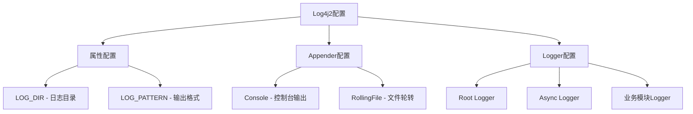

**图表来源**

- [log4j2.xml](file://jcpp-app-bootstrap/src/main/resources/log4j2.xml#L1-L72)
- [log4j2.xml](file://jcpp-protocol-bootstrap/src/main/resources/log4j2.xml#L1-L66)

#### 日志级别配置

系统支持多层级的日志级别配置：

| Logger名称              | 默认级别  | 环境变量                | 用途      |
|-----------------------|-------|---------------------|---------|
| Root Logger           | INFO  | -                   | 全局基础日志  |
| sanbing.jcpp          | INFO  | -                   | 核心框架日志  |
| sanbing.jcpp.app      | TRACE | APP_LOG_LEVEL       | 应用层详细日志 |
| sanbing.jcpp.protocol | TRACE | PROTOCOLS_LOG_LEVEL | 协议处理日志  |

#### 输出格式配置

日志输出格式包含以下关键信息：

- 时间戳：精确到毫秒
- TraceId：分布式追踪标识
- 线程名：便于问题定位
- 日志级别：ERROR、WARN、INFO、DEBUG
- 类名：类的简短名称
- 日志消息：实际日志内容
- 异常堆栈：完整异常信息

#### 日志轮转策略

系统采用复合轮转策略：

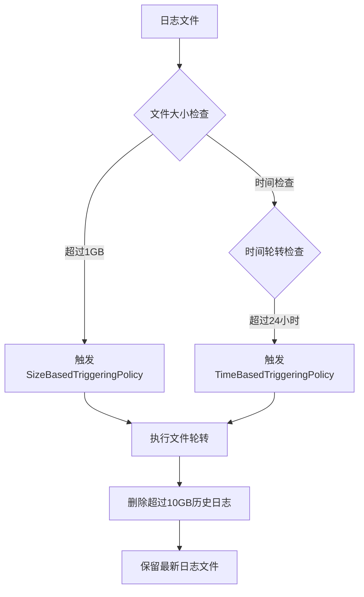

**图表来源**

- [log4j2.xml](file://jcpp-app-bootstrap/src/main/resources/log4j2.xml#L25-L45)

**章节来源**

- [log4j2.xml](file://jcpp-app-bootstrap/src/main/resources/log4j2.xml#L1-L72)
- [log4j2.xml](file://jcpp-protocol-bootstrap/src/main/resources/log4j2.xml#L1-L66)

## 性能监控体系

### StatsFactory核心架构

系统通过StatsFactory提供统一的性能指标收集机制，支持多种监控指标类型。

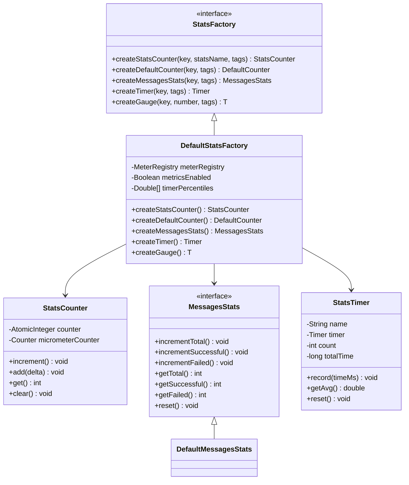

**图表来源**

- [DefaultStatsFactory.java](file://jcpp-infrastructure-stats/src/main/java/sanbing/jcpp/infrastructure/stats/DefaultStatsFactory.java#L1-L127)
- [DefaultCounter.java](file://jcpp-infrastructure-stats/src/main/java/sanbing/jcpp/infrastructure/stats/DefaultCounter.java#L1-L40)
- [MessagesStats.java](file://jcpp-infrastructure-stats/src/main/java/sanbing/jcpp/infrastructure/stats/MessagesStats.java#L1-L36)
- [StatsTimer.java](file://jcpp-infrastructure-stats/src/main/java/sanbing/jcpp/infrastructure/stats/StatsTimer.java#L1-L47)

### 关键性能指标

#### API请求监控

系统通过StatsTimer跟踪API请求的延迟性能：

| 指标名称   | 计算方式                         | 用途       |
|--------|------------------------------|----------|
| 平均响应时间 | totalTime / count            | 评估系统响应性能 |
| 请求总数   | 累计计数                         | 监控系统负载   |
| 成功率    | successfulCount / totalCount | 评估系统稳定性  |

#### QPS监控

通过DefaultCounter实现每秒查询率统计：

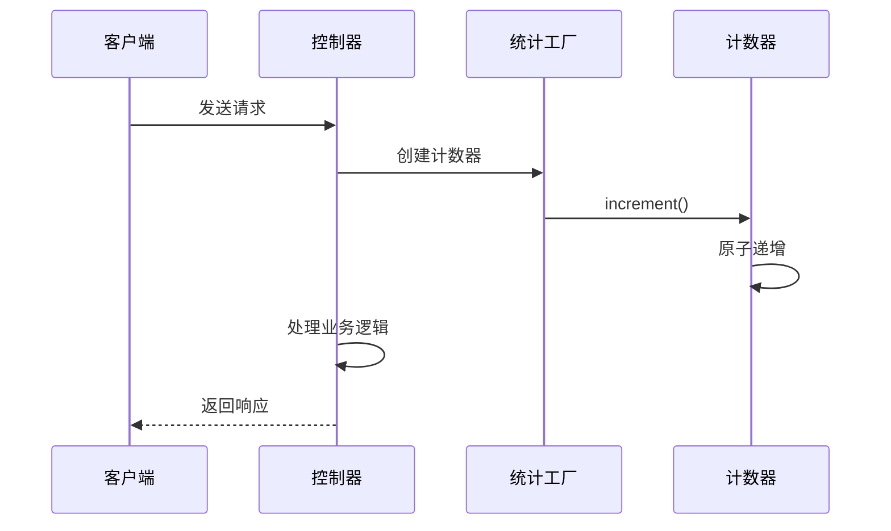

**图表来源**

- [DefaultCounter.java](file://jcpp-infrastructure-stats/src/main/java/sanbing/jcpp/infrastructure/stats/DefaultCounter.java#L20-L35)

#### 缓存命中率监控

系统通过缓存访问统计计算命中率：

| 指标    | 计算公式                              | 监控意义   |
|-------|-----------------------------------|--------|
| 命中率   | hitCount / (hitCount + missCount) | 缓存效率评估 |
| 命中次数  | hitCounter.get()                  | 缓存有效性  |
| 未命中次数 | missCounter.get()                 | 缓存优化方向 |

**章节来源**

- [DefaultStatsFactory.java](file://jcpp-infrastructure-stats/src/main/java/sanbing/jcpp/infrastructure/stats/DefaultStatsFactory.java#L1-L127)
- [DefaultCounter.java](file://jcpp-infrastructure-stats/src/main/java/sanbing/jcpp/infrastructure/stats/DefaultCounter.java#L1-L40)
- [StatsTimer.java](file://jcpp-infrastructure-stats/src/main/java/sanbing/jcpp/infrastructure/stats/StatsTimer.java#L1-L47)
- [MessagesStats.java](file://jcpp-infrastructure-stats/src/main/java/sanbing/jcpp/infrastructure/stats/MessagesStats.java#L1-L36)
- [DefaultMessagesStats.java](file://jcpp-infrastructure-stats/src/main/java/sanbing/jcpp/infrastructure/stats/DefaultMessagesStats.java#L1-L57)

## 消息队列监控

### Kafka消费者统计

系统提供详细的Kafka消费者组监控功能，实时跟踪消息处理状态。

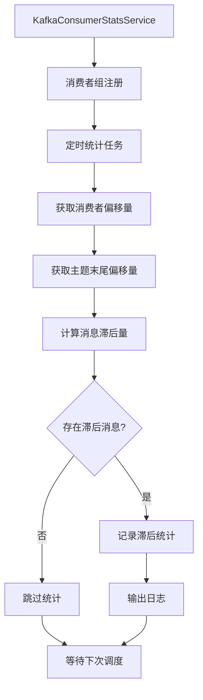

**图表来源**

- [KafkaConsumerStatsService.java](file://jcpp-infrastructure-queue/src/main/java/sanbing/jcpp/infrastructure/queue/kafka/KafkaConsumerStatsService.java#L40-L100)

#### 消息滞后监控指标

| 指标名称   | 含义          | 监控阈值建议    |
|--------|-------------|-----------|
| 消费者组ID | Kafka消费者组标识 | 实时监控      |
| 主题名称   | 消息主题        | 按业务划分     |
| 分区编号   | Kafka分区标识   | 单分区监控     |
| 已消费偏移量 | 当前消费位置      | 跟踪消费进度    |
| 末尾偏移量  | 主题最新消息位置    | 监控消息增长    |
| 消息滞后量  | 未消费消息数量     | 超过1000需关注 |

#### 消费者组健康检查

系统自动监控消费者组的健康状态：

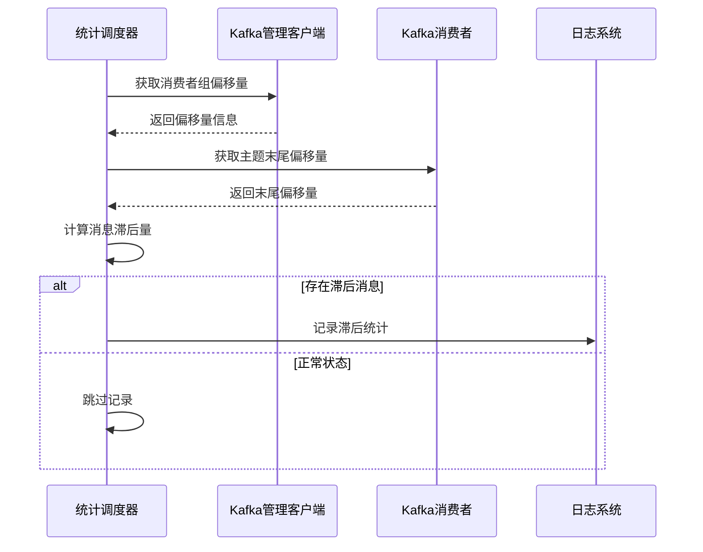

**图表来源**

- [KafkaConsumerStatsService.java](file://jcpp-infrastructure-queue/src/main/java/sanbing/jcpp/infrastructure/queue/kafka/KafkaConsumerStatsService.java#L60-L90)

**章节来源**

- [KafkaConsumerStatsService.java](file://jcpp-infrastructure-queue/src/main/java/sanbing/jcpp/infrastructure/queue/kafka/KafkaConsumerStatsService.java#L1-L161)

## 系统资源监控

### 系统指标采集

系统通过SystemUtil类提供底层系统资源监控能力。

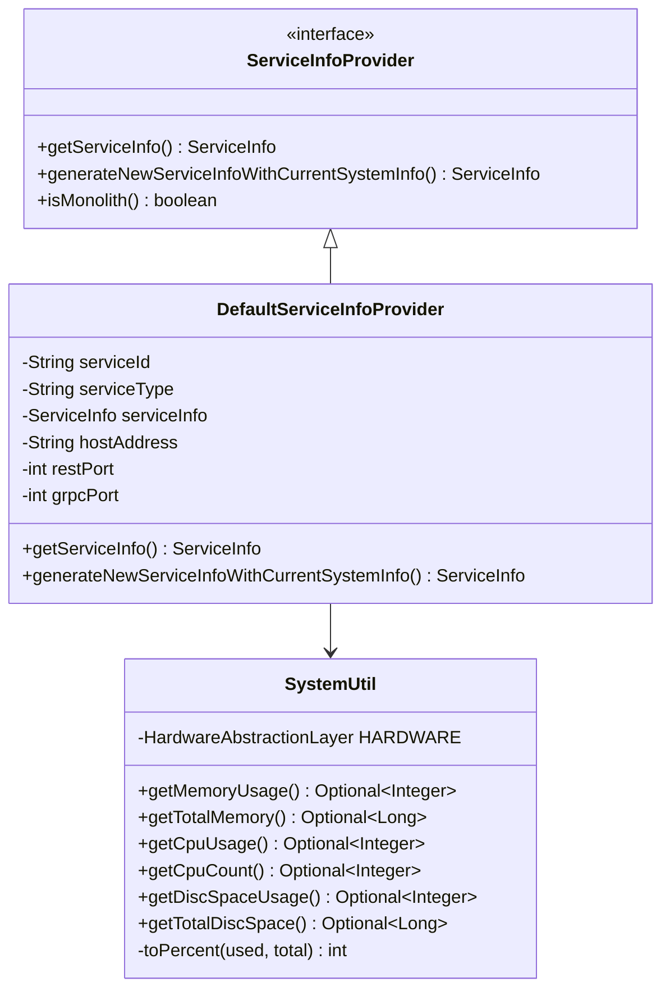

**图表来源**

- [SystemUtil.java](file://jcpp-infrastructure-util/src/main/java/sanbing/jcpp/infrastructure/util/SystemUtil.java#L1-L98)
- [DefaultServiceInfoProvider.java](file://jcpp-infrastructure-queue/src/main/java/sanbing/jcpp/infrastructure/queue/discovery/DefaultServiceInfoProvider.java#L84-L112)

### 资源监控指标

#### CPU监控

| 指标     | 获取方式                                               | 监控意义   |
|--------|----------------------------------------------------|--------|
| CPU使用率 | HARDWARE.getProcessor().getSystemCpuLoad()         | 系统负载评估 |
| CPU核心数 | HARDWARE.getProcessor().getLogicalProcessorCount() | 并发能力参考 |

#### 内存监控

| 指标    | 获取方式                              | 监控意义   |
|-------|-----------------------------------|--------|
| 内存使用率 | (total - available) / total * 100 | 内存压力评估 |
| 总内存容量 | HARDWARE.getMemory().getTotal()   | 内存资源配置 |

#### 磁盘监控

| 指标    | 获取方式                                 | 监控意义   |
|-------|--------------------------------------|--------|
| 磁盘使用率 | (total - usable) / total * 100       | 磁盘空间压力 |
| 总磁盘容量 | Files.getFileStore().getTotalSpace() | 存储资源规划 |

**章节来源**

- [SystemUtil.java](file://jcpp-infrastructure-util/src/main/java/sanbing/jcpp/infrastructure/util/SystemUtil.java#L1-L98)

## 故障排查指南

### 常见故障场景

#### 服务无法启动

**症状表现**：

- 应用启动失败
- 端口绑定错误
- 依赖服务不可用

**排查步骤**：

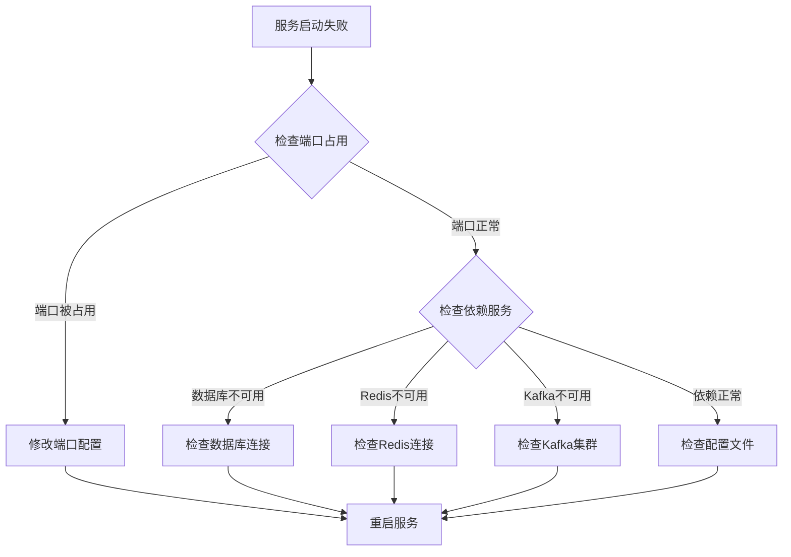

**诊断命令**：

```bash
# 检查端口占用
netstat -tlnp | grep :8080

# 检查进程状态
ps aux | grep jcpp

# 查看启动日志
tail -f logs/jcpp-app.log
```

#### 消息积压问题

**症状表现**：

- Kafka消费者滞后增加
- 消息处理延迟
- 系统响应变慢

**排查流程**：

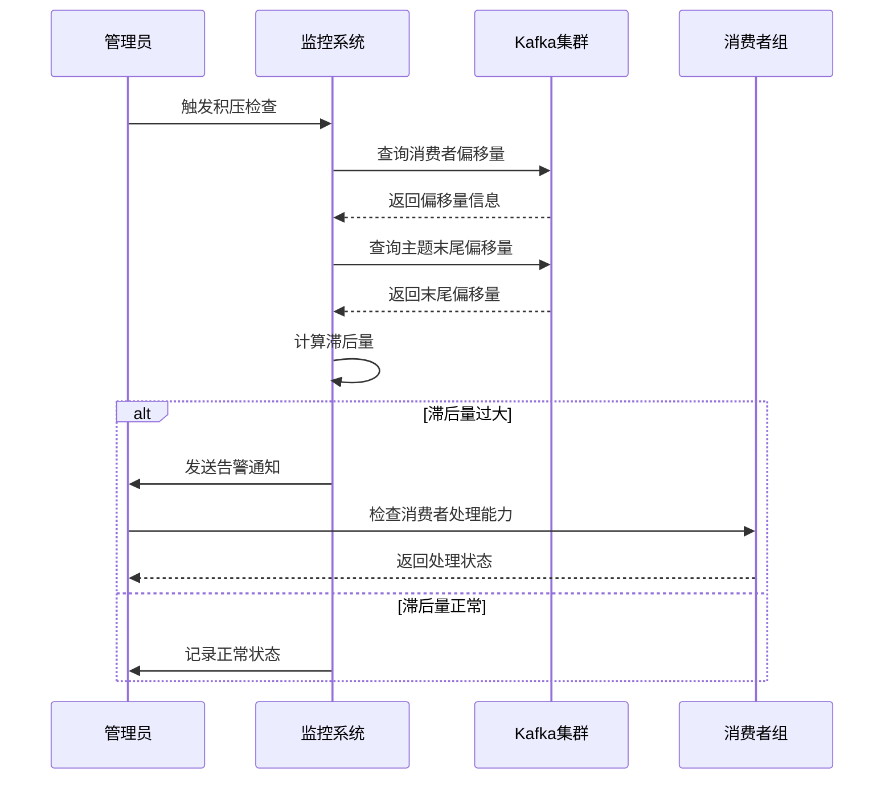

**解决措施**：

1. 增加消费者实例数量
2. 优化消息处理逻辑
3. 调整批处理大小
4. 检查消费者组重新平衡

#### 高延迟问题

**症状表现**：

- API响应时间增加
- 用户体验下降
- 系统吞吐量降低

**分析方法**：

| 排查维度 | 检查项目   | 解决方案    |
|------|--------|---------|
| 应用层  | GC日志分析 | 调整JVM参数 |
| 数据库层 | 慢SQL分析 | 添加索引优化  |
| 网络层  | 连接池配置  | 增加连接数   |
| 缓存层  | 缓存命中率  | 优化缓存策略  |

**章节来源**

- [app-service.yml](file://jcpp-app-bootstrap/src/main/resources/app-service.yml#L1-L432)
- [protocol-service.yml](file://jcpp-protocol-bootstrap/src/main/resources/protocol-service.yml#L1-L35)

## 运维最佳实践

### 日常维护任务

#### 数据库备份策略

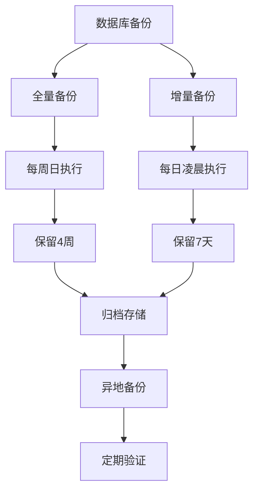

#### 系统健康检查清单

| 检查项目   | 检查频率 | 关注指标      | 告警阈值    |
|--------|------|-----------|---------|
| 服务可用性  | 实时   | 响应时间      | >1000ms |
| CPU使用率 | 5分钟  | 平均值       | >80%    |
| 内存使用率  | 5分钟  | 平均值       | >85%    |
| 磁盘使用率  | 1小时  | 占用比例      | >90%    |
| 错误率    | 实时   | 错误数量/总请求数 | >5%     |

#### 配置管理规范

1. **环境隔离**：开发、测试、生产环境配置严格分离
2. **版本控制**：所有配置文件纳入版本控制系统
3. **变更审批**：重大配置变更需经过审批流程
4. **回滚准备**：每次配置变更都应准备回滚方案

### 性能优化建议

#### JVM调优参数

```yaml
# 生产环境推荐配置
JAVA_OPTS: >
  -Xms2g -Xmx4g
  -XX:+UseG1GC
  -XX:MaxGCPauseMillis=200
  -XX:+HeapDumpOnOutOfMemoryError
  -XX:HeapDumpPath=/logs/
  -Djava.awt.headless=true
```

#### 数据库连接池优化

| 参数                | 推荐值    | 说明     |
|-------------------|--------|--------|
| maximumPoolSize   | 64     | 最大连接数  |
| minimumIdle       | 10     | 最小空闲连接 |
| connectionTimeout | 30000  | 连接超时时间 |
| idleTimeout       | 600000 | 空闲连接超时 |

**章节来源**

- [app-service.yml](file://jcpp-app-bootstrap/src/main/resources/app-service.yml#L1-L432)

## 监控集成方案

### Prometheus集成

系统内置Prometheus指标导出功能，支持与主流监控系统集成。

#### 指标暴露配置

```yaml
management:
  endpoints:
    web:
      exposure:
        include: 'prometheus,health'
  endpoint:
    health:
      show-details: always
```

#### 关键监控指标

| 指标名称                               | 类型        | 说明        |
|------------------------------------|-----------|-----------|
| jcpp_api_requests_total            | Counter   | API请求总数   |
| jcpp_api_requests_duration_seconds | Histogram | API请求耗时分布 |
| jcpp_cache_hit_rate                | Gauge     | 缓存命中率     |
| jcpp_queue_lag                     | Gauge     | 消息队列滞后量   |
| jcpp_system_cpu_usage              | Gauge     | CPU使用率    |
| jcpp_system_memory_usage           | Gauge     | 内存使用率     |

### Grafana仪表板

#### 系统概览面板

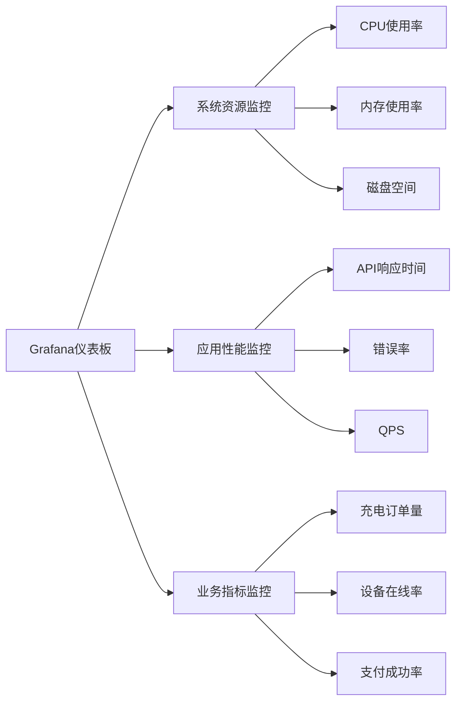

#### 告警规则配置

```yaml
groups:
  - name: jcpp-alerts
    rules:
      - alert: HighCpuUsage
        expr: jcpp_system_cpu_usage > 80
        for: 5m
        labels:
          severity: warning
        annotations:
          summary: "CPU使用率过高"
          
      - alert: HighMemoryUsage
        expr: jcpp_system_memory_usage > 85
        for: 3m
        labels:
          severity: critical
        annotations:
          summary: "内存使用率过高"
```

### Docker监控

#### 容器化部署监控

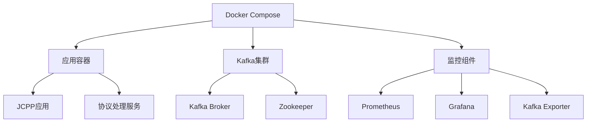

**图表来源**

- [docker-compose.kafka.yml](file://docker/docker-compose.kafka.yml#L1-L67)

**章节来源**

- [app-service.yml](file://jcpp-app-bootstrap/src/main/resources/app-service.yml#L80-L85)
- [protocol-service.yml](file://jcpp-protocol-bootstrap/src/main/resources/protocol-service.yml#L25-L30)
- [docker-compose.kafka.yml](file://docker/docker-compose.kafka.yml#L1-L67)