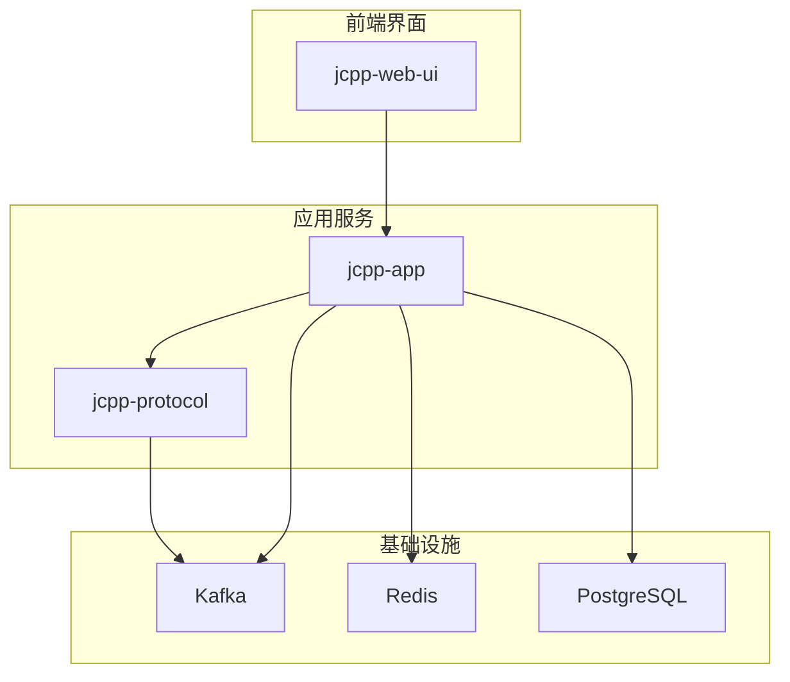
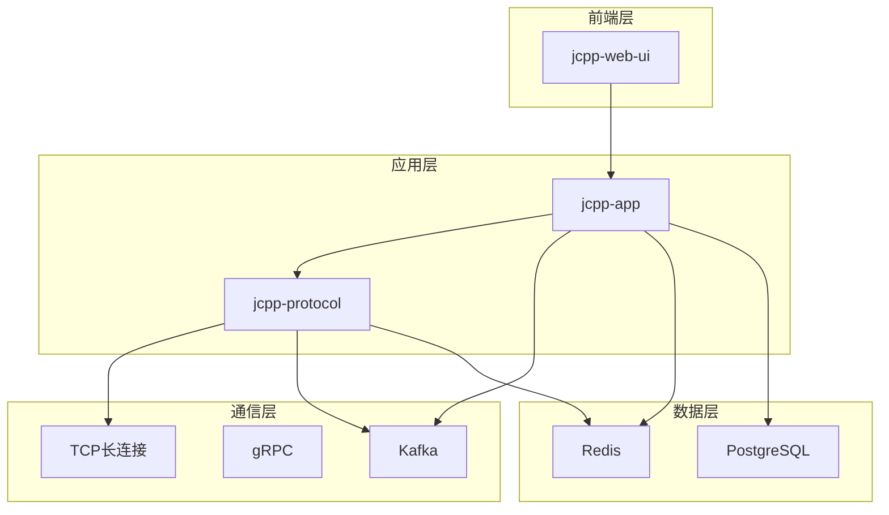
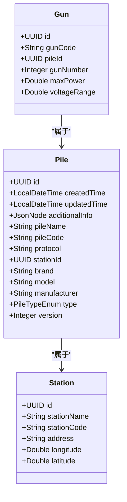
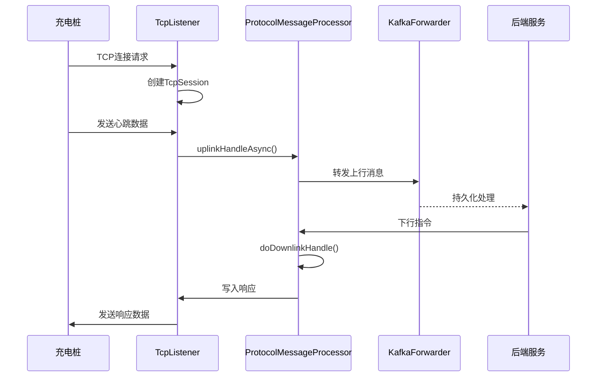
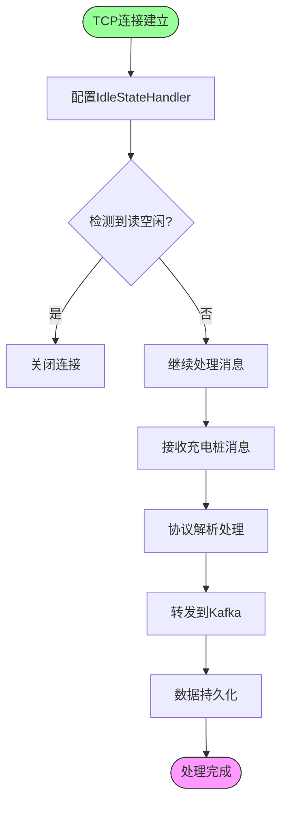
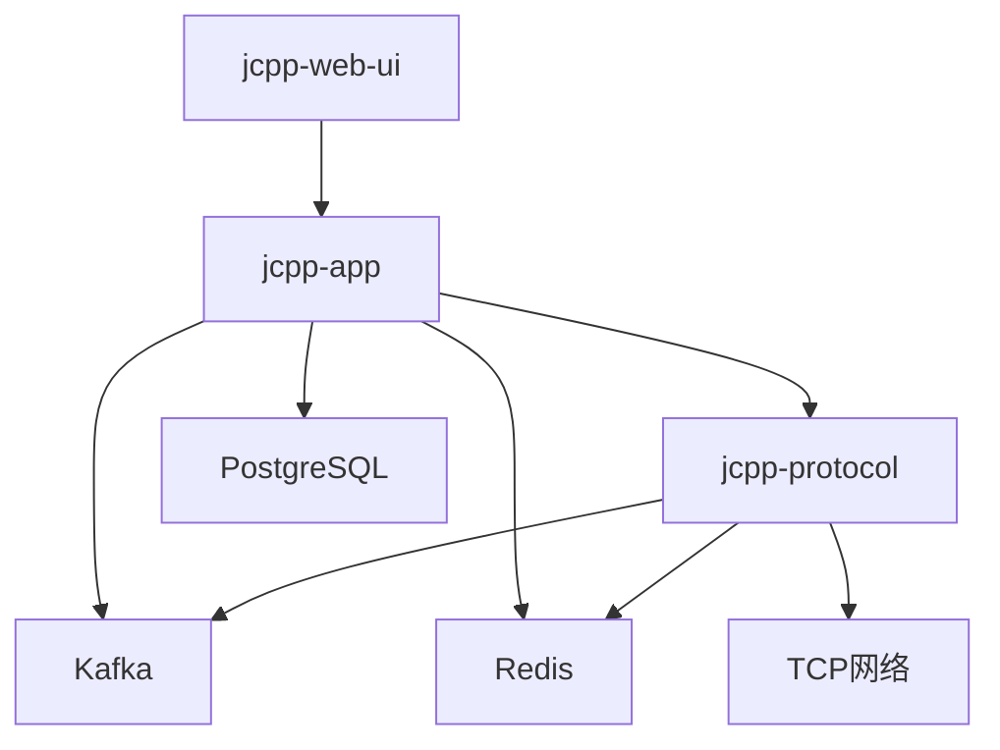

# 系统概述

<cite>
**本文档引用的文件**   
- [README.md](file://README.md)
- [pom.xml](file://pom.xml)
- [JCPPServerApplication.java](file://jcpp-app-bootstrap/src/main/java/sanbing/jcpp/JCPPServerApplication.java)
- [JCPPProtocolServiceApplication.java](file://jcpp-protocol-bootstrap/src/main/java/sanbing/jcpp/protocol/JCPPProtocolServiceApplication.java)
- [PileController.java](file://jcpp-app/src/main/java/sanbing/jcpp/app/adapter/controller/PileController.java)
- [StationController.java](file://jcpp-app/src/main/java/sanbing/jcpp/app/adapter/controller/StationController.java)
- [GunController.java](file://jcpp-app/src/main/java/sanbing/jcpp/app/adapter/controller/GunController.java)
- [ProtocolBootstrap.java](file://jcpp-protocol-api/src/main/java/sanbing/jcpp/protocol/ProtocolBootstrap.java)
- [ProtocolMessageProcessor.java](file://jcpp-protocol-api/src/main/java/sanbing/jcpp/protocol/ProtocolMessageProcessor.java)
- [Pile.java](file://jcpp-app/src/main/java/sanbing/jcpp/app/dal/entity/Pile.java)
- [PileService.java](file://jcpp-app/src/main/java/sanbing/jcpp/app/service/PileService.java)
- [AttrKeyEnum.java](file://jcpp-app/src/main/java/sanbing/jcpp/app/data/kv/AttrKeyEnum.java)
- [docker-compose.monolith.yml](file://docker/docker-compose.monolith.yml)
- [package.json](file://jcpp-web-ui/package.json)
</cite>

## 目录

1. [简介](#简介)
2. [项目结构](#项目结构)
3. [核心组件](#核心组件)
4. [架构概述](#架构概述)
5. [详细组件分析](#详细组件分析)
6. [依赖分析](#依赖分析)
7. [性能考虑](#性能考虑)
8. [故障排除指南](#故障排除指南)
9. [结论](#结论)

## 简介

JChargePointProtocol是一个高性能、分布式、支持海量并发量的充电桩Java服务端平台，旨在为电动汽车充电网络提供基础能力。该项目设计支持多达100种充电桩协议，目前已实现对云快充和绿能等主流品牌充电桩协议的支持。系统采用微服务架构，通过统一的管理平台实现多品牌充电桩协议的集中管理，为充电应用提供稳定可靠的基础服务。

该平台在电动汽车充电网络中扮演着关键角色，作为充电桩与上层应用之间的桥梁，负责处理设备通信、协议转换、数据采集和远程控制等核心功能。系统支持通过TCP长连接与充电桩进行实时通信，利用Kafka实现异步消息处理，并通过gRPC提供高性能的指令下发能力，确保了系统的高可用性和可扩展性。

## 项目结构

JChargePointProtocol项目采用模块化的微服务架构设计，各组件职责明确，协同工作。项目主要由三个核心服务组成：jcpp-app主服务、jcpp-protocol协议处理服务和jcpp-web-ui前端界面，通过Docker容器化部署实现服务的独立运行和弹性扩展。

**Diagram sources**

- [pom.xml](file://pom.xml)
- [docker-compose.monolith.yml](file://docker/docker-compose.monolith.yml)
- [package.json](file://jcpp-web-ui/package.json)

**Section sources**

- [pom.xml](file://pom.xml#L1-L699)
- [docker-compose.monolith.yml](file://docker/docker-compose.monolith.yml#L1-L29)
- [package.json](file://jcpp-web-ui/package.json#L1-L49)

## 核心组件

JChargePointProtocol系统的核心功能模块包括设备管理、协议处理、远程控制、数据采集与监控。这些模块协同工作，实现了对充电桩的全面管理和控制。设备管理模块负责充电桩、充电枪和充电站的全生命周期管理，包括创建、更新、删除和查询操作。协议处理模块是系统的核心，负责处理不同品牌充电桩的通信协议，实现协议的解析和封装。

远程控制模块提供了对充电桩的远程操作能力，如启动充电、停止充电、重启设备等。数据采集与监控模块负责收集充电桩的实时数据，包括状态信息、充电数据和故障报警，并提供实时监控功能。系统通过属性键枚举（AttrKeyEnum）定义了标准化的状态属性，如STATUS（状态）、CONNECTED_AT（连接时间）、LAST_ACTIVE_TIME（最后活跃时间）等，确保了数据的一致性和可管理性。

**Section sources**

- [PileController.java](file://jcpp-app/src/main/java/sanbing/jcpp/app/adapter/controller/PileController.java#L1-L112)
- [StationController.java](file://jcpp-app/src/main/java/sanbing/jcpp/app/adapter/controller/StationController.java#L1-L108)
- [GunController.java](file://jcpp-app/src/main/java/sanbing/jcpp/app/adapter/controller/GunController.java#L1-L116)
- [AttrKeyEnum.java](file://jcpp-app/src/main/java/sanbing/jcpp/app/data/kv/AttrKeyEnum.java#L1-L70)

## 架构概述

JChargePointProtocol采用微服务架构，整体布局清晰，各服务职责分明。系统主要由jcpp-app主服务、jcpp-protocol协议处理服务和jcpp-web-ui前端界面三大部分组成。jcpp-app主服务作为业务逻辑处理中心，负责设备管理、用户认证和API接口提供。jcpp-protocol协议处理服务专注于充电桩协议的解析和处理，支持多品牌协议的扩展。jcpp-web-ui前端界面提供直观的管理界面，方便管理员进行操作和监控。

**Diagram sources**

- [JCPPServerApplication.java](file://jcpp-app-bootstrap/src/main/java/sanbing/jcpp/JCPPServerApplication.java#L1-L55)
- [JCPPProtocolServiceApplication.java](file://jcpp-protocol-bootstrap/src/main/java/sanbing/jcpp/protocol/JCPPProtocolServiceApplication.java#L1-L59)
- [ProtocolBootstrap.java](file://jcpp-protocol-api/src/main/java/sanbing/jcpp/protocol/ProtocolBootstrap.java#L1-L127)

## 详细组件分析

### 设备管理组件分析

设备管理组件是JChargePointProtocol系统的基础，负责充电桩、充电枪和充电站的全生命周期管理。该组件通过RESTful
API提供标准化的接口，支持设备的创建、查询、更新和删除操作。充电桩实体（Pile）包含丰富的属性信息，如桩编号（pileCode）、协议类型（protocol）、品牌（brand）和型号（model），为设备管理提供了完整的数据支持。

**Diagram sources**

- [Pile.java](file://jcpp-app/src/main/java/sanbing/jcpp/app/dal/entity/Pile.java#L1-L65)
- [PileService.java](file://jcpp-app/src/main/java/sanbing/jcpp/app/service/PileService.java#L1-L124)

**Section sources**

- [PileController.java](file://jcpp-app/src/main/java/sanbing/jcpp/app/adapter/controller/PileController.java#L1-L112)
- [StationController.java](file://jcpp-app/src/main/java/sanbing/jcpp/app/adapter/controller/StationController.java#L1-L108)
- [GunController.java](file://jcpp-app/src/main/java/sanbing/jcpp/app/adapter/controller/GunController.java#L1-L116)

### 协议处理组件分析

协议处理组件是JChargePointProtocol系统的核心，负责处理不同品牌充电桩的通信协议。该组件采用抽象基类ProtocolBootstrap的设计模式，为各种充电桩协议提供统一的初始化和销毁接口。ProtocolMessageProcessor作为消息处理器的基类，定义了上行和下行消息处理的统一框架，确保了协议处理的一致性和可扩展性。

**Diagram sources**

- [ProtocolBootstrap.java](file://jcpp-protocol-api/src/main/java/sanbing/jcpp/protocol/ProtocolBootstrap.java#L1-L127)
- [ProtocolMessageProcessor.java](file://jcpp-protocol-api/src/main/java/sanbing/jcpp/protocol/ProtocolMessageProcessor.java#L1-L78)
- [TcpListener.java](file://jcpp-protocol-api/src/main/java/sanbing/jcpp/protocol/listener/tcp/TcpListener.java#L1-L50)

### 通信机制分析

JChargePointProtocol系统通过多种通信机制实现高效的数据交换和指令传输。系统使用TCP长连接与充电桩保持实时通信，通过Netty框架实现高性能的网络IO处理。IdleEventHandler组件负责检测空闲连接，当检测到读空闲状态时自动关闭连接，确保了连接资源的有效管理。Kafka作为消息中间件，实现了系统组件间的异步消息传递，提高了系统的吞吐量和可靠性。

**Diagram sources**

- [ChannelHandlerInitializer.java](file://jcpp-protocol-api/src/main/java/sanbing/jcpp/protocol/listener/ChannelHandlerInitializer.java#L1-L120)
- [IdleEventHandler.java](file://jcpp-protocol-api/src/main/java/sanbing/jcpp/protocol/listener/tcp/handler/IdleEventHandler.java#L1-L36)
- [TcpSession.java](file://jcpp-protocol-api/src/main/java/sanbing/jcpp/protocol/listener/tcp/TcpSession.java#L1-L100)

## 依赖分析

JChargePointProtocol系统的组件间依赖关系清晰，通过合理的架构设计实现了高内聚低耦合。系统依赖于多种外部组件和服务，包括Kafka用于消息队列、Redis用于缓存、PostgreSQL用于数据持久化。jcpp-app服务依赖于jcpp-protocol服务进行协议处理，同时两者都依赖于基础设施服务。通过Docker
Compose配置文件定义了服务间的网络连接和端口映射，确保了服务的可部署性和可维护性。

**Diagram sources**

- [pom.xml](file://pom.xml#L1-L699)
- [docker-compose.monolith.yml](file://docker/docker-compose.monolith.yml#L1-L29)

**Section sources**

- [pom.xml](file://pom.xml#L1-L699)
- [docker-compose.monolith.yml](file://docker/docker-compose.monolith.yml#L1-L29)

## 性能考虑

JChargePointProtocol系统在设计时充分考虑了性能因素，采用了多种优化策略确保系统的高并发处理能力。系统使用Netty框架处理TCP连接，利用其事件驱动的非阻塞IO模型，能够高效处理海量并发连接。通过Kafka实现异步消息处理，将耗时的操作（如数据持久化）与实时通信解耦，提高了系统的响应速度。gRPC的使用确保了服务间通信的高性能，特别是在指令下发场景下表现出色。

系统还采用了多级缓存策略，结合Caffeine本地缓存和Redis分布式缓存，有效减少了数据库访问压力。ShardingThreadPool的使用实现了任务的分片处理，避免了线程竞争，提高了处理效率。通过StatsFactory和MessagesStats组件，系统能够实时监控消息处理的性能指标，为性能优化提供了数据支持。

## 故障排除指南

当系统出现连接问题时，首先检查TCP监听器是否正常启动，端口是否被正确绑定。对于消息丢失问题，检查Kafka集群状态和主题配置，确保消息能够正常生产和消费。如果出现协议解析错误，检查充电桩发送的数据格式是否符合协议规范，以及协议处理器的解析逻辑是否正确。对于性能瓶颈，可以通过监控工具查看各组件的资源使用情况，重点关注CPU、内存和网络IO指标。

在处理充电桩心跳数据时，如果发现状态更新不及时，检查AttributeService的异步处理逻辑，确保状态属性能够及时更新。对于远程控制指令无法下发的问题，检查gRPC服务是否正常运行，以及充电桩的TCP连接状态是否正常。通过查看系统日志，特别是ProtocolMessageProcessor和TcpListener组件的日志，可以快速定位问题根源。

## 结论

JChargePointProtocol项目作为一个高性能的充电桩协议处理平台，通过合理的微服务架构设计和先进的技术选型，实现了对多品牌充电桩协议的统一管理。系统采用TCP长连接与充电桩通信，利用Kafka进行异步消息处理，并通过gRPC实现高性能指令下发，确保了系统的高可用性和可扩展性。项目结构清晰，核心组件职责明确，为电动汽车充电网络提供了稳定可靠的基础服务。

该平台不仅满足了当前充电桩管理的需求，还具备良好的扩展性，能够支持更多品牌和型号的充电桩协议。通过持续优化和功能完善，JChargePointProtocol有望成为电动汽车充电领域的标准解决方案，为充电基础设施的智能化管理做出重要贡献。