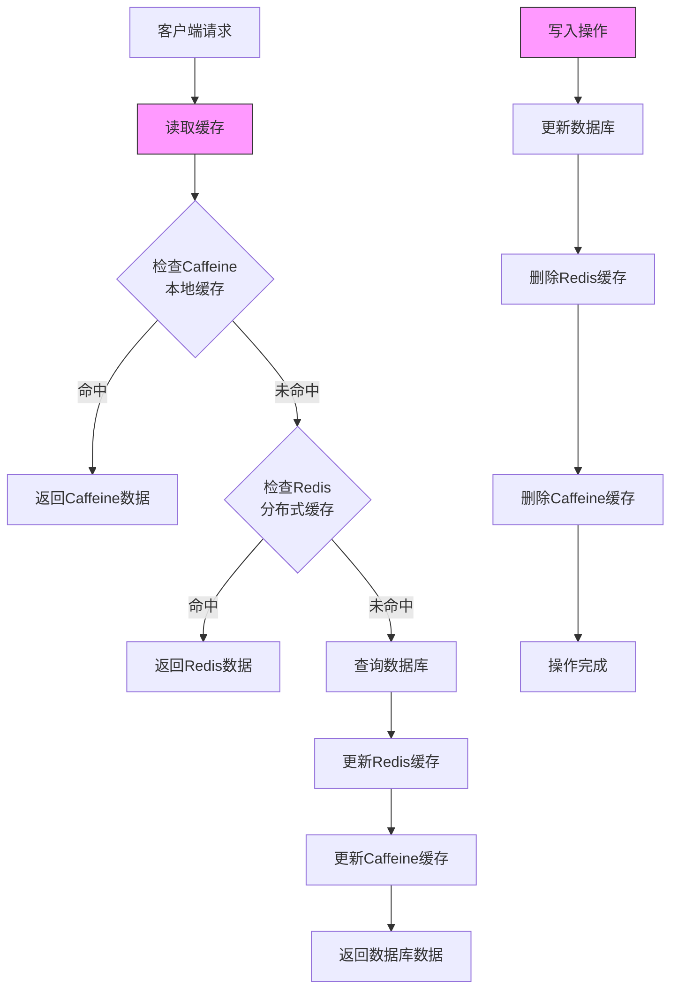
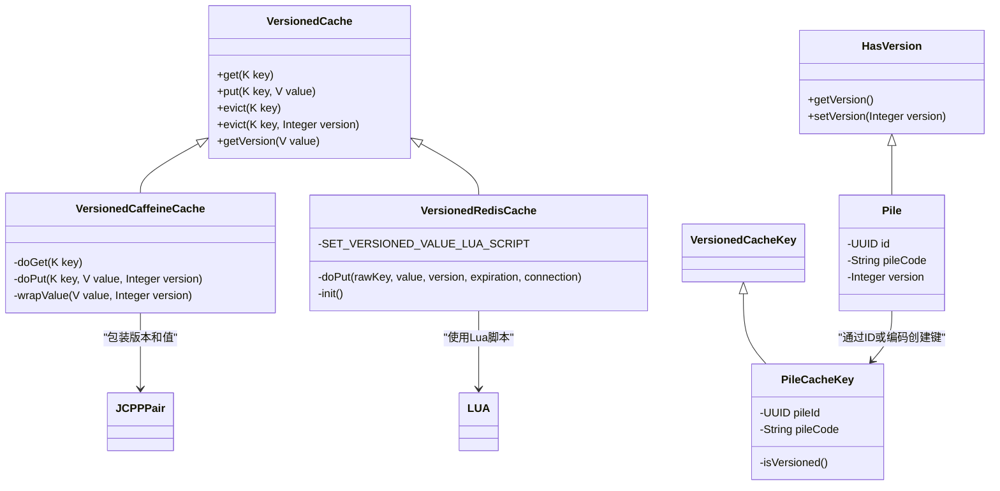
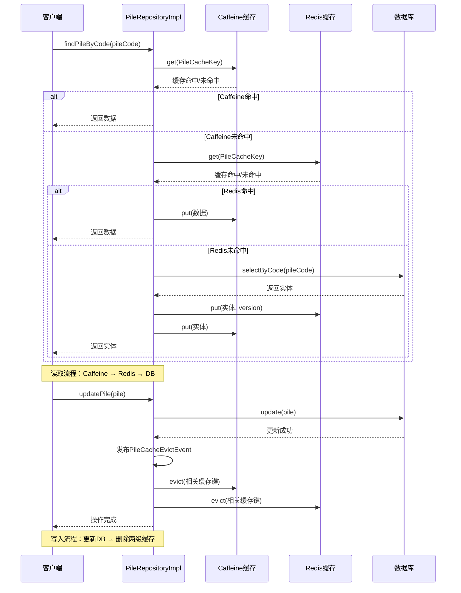
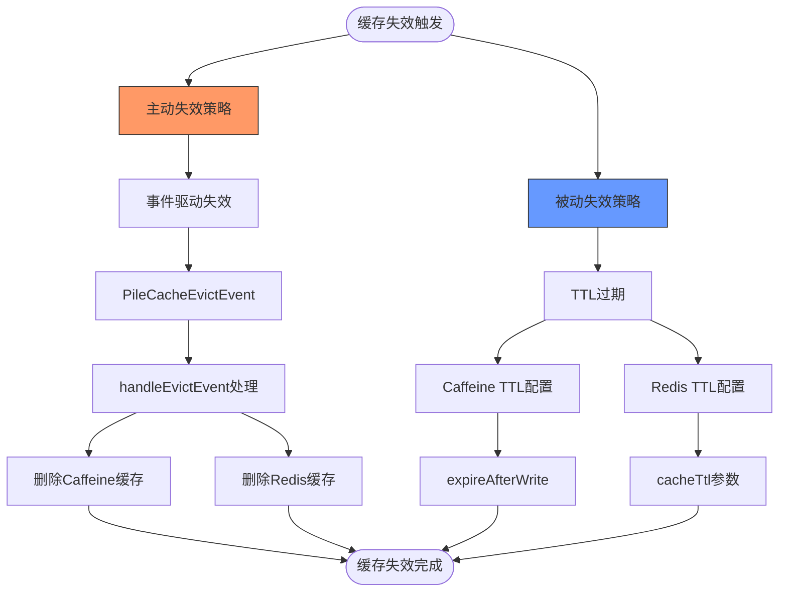
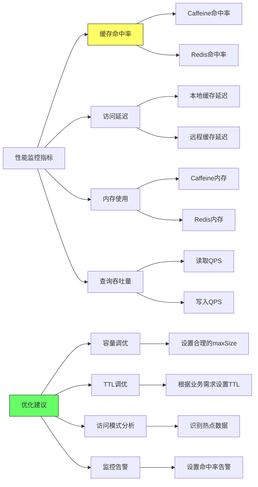

# 缓存架构

<cite>
**本文档引用的文件**
- [CachedVersionedEntityRepository.java](file://jcpp-app/src/main/java/sanbing/jcpp/app/dal/repository/impl/CachedVersionedEntityRepository.java)
- [VersionedCache.java](file://jcpp-infrastructure-cache/src/main/java/sanbing/jcpp/infrastructure/cache/VersionedCache.java)
- [VersionedCaffeineCache.java](file://jcpp-infrastructure-cache/src/main/java/sanbing/jcpp/infrastructure/cache/VersionedCaffeineCache.java)
- [VersionedRedisCache.java](file://jcpp-infrastructure-cache/src/main/java/sanbing/jcpp/infrastructure/cache/VersionedRedisCache.java)
- [JCPPCaffeineCacheConfiguration.java](file://jcpp-infrastructure-cache/src/main/java/sanbing/jcpp/infrastructure/cache/JCPPCaffeineCacheConfiguration.java)
- [JCPPRedisCacheConfiguration.java](file://jcpp-infrastructure-cache/src/main/java/sanbing/jcpp/infrastructure/cache/JCPPRedisCacheConfiguration.java)
- [PileCacheKey.java](file://jcpp-app/src/main/java/sanbing/jcpp/app/service/cache/pile/PileCacheKey.java)
- [PileCacheEvictEvent.java](file://jcpp-app/src/main/java/sanbing/jcpp/app/service/cache/pile/PileCacheEvictEvent.java)
- [PileRepositoryImpl.java](file://jcpp-app/src/main/java/sanbing/jcpp/app/dal/repository/impl/PileRepositoryImpl.java)
- [Pile.java](file://jcpp-app/src/main/java/sanbing/jcpp/app/dal/entity/Pile.java)
</cite>

## 目录

1. [引言](#引言)
2. [多级缓存架构设计](#多级缓存架构设计)
3. [缓存一致性机制](#缓存一致性机制)
4. [缓存读写流程](#缓存读写流程)
5. [缓存键设计](#缓存键设计)
6. [缓存失效策略](#缓存失效策略)
7. [性能监控与优化](#性能监控与优化)
8. [结论](#结论)

## 引言

JChargePointProtocol系统采用多级缓存架构来优化充电桩相关数据的访问性能。该架构结合了Caffeine本地缓存和Redis分布式缓存的优势，在保证高性能的同时确保数据一致性。本文档深入分析这一缓存架构的设计原理、实现机制和最佳实践。

## 多级缓存架构设计



**图示来源**

- [PileRepositoryImpl.java](file://jcpp-app/src/main/java/sanbing/jcpp/app/dal/repository/impl/PileRepositoryImpl.java#L35-L45)
- [VersionedCaffeineCache.java](file://jcpp-infrastructure-cache/src/main/java/sanbing/jcpp/infrastructure/cache/VersionedCaffeineCache.java#L30-L50)
- [VersionedRedisCache.java](file://jcpp-infrastructure-cache/src/main/java/sanbing/jcpp/infrastructure/cache/VersionedRedisCache.java#L80-L100)

**本节来源**

- [JCPPCaffeineCacheConfiguration.java](file://jcpp-infrastructure-cache/src/main/java/sanbing/jcpp/infrastructure/cache/JCPPCaffeineCacheConfiguration.java)
- [JCPPRedisCacheConfiguration.java](file://jcpp-infrastructure-cache/src/main/java/sanbing/jcpp/infrastructure/cache/JCPPRedisCacheConfiguration.java)

### Caffeine与Redis组合的优势

JChargePointProtocol采用Caffeine（本地缓存）和Redis（分布式缓存）的组合设计，主要基于以下考虑：

1. **性能分层**：Caffeine作为第一级缓存，提供微秒级的访问速度，减少对远程Redis的访问压力。
2. **高可用性**：即使Redis服务暂时不可用，本地缓存仍能提供一定程度的服务能力。
3. **网络开销优化**：避免频繁的网络往返，特别适合高并发场景下的充电桩状态查询。
4. **资源利用**：充分利用应用服务器的内存资源，同时通过Redis实现多实例间的数据共享。

Caffeine缓存通过`JCPPCaffeineCacheConfiguration`配置，支持基于权重的最大容量限制和写后过期策略。Redis缓存通过
`JCPPRedisCacheConfiguration`配置，提供了连接池管理、序列化配置和分布式环境下的缓存管理。

## 缓存一致性机制



**图示来源**

- [VersionedCache.java](file://jcpp-infrastructure-cache/src/main/java/sanbing/jcpp/infrastructure/cache/VersionedCache.java)
- [VersionedCaffeineCache.java](file://jcpp-infrastructure-cache/src/main/java/sanbing/jcpp/infrastructure/cache/VersionedCaffeineCache.java)
- [VersionedRedisCache.java](file://jcpp-infrastructure-cache/src/main/java/sanbing/jcpp/infrastructure/cache/VersionedRedisCache.java)
- [Pile.java](file://jcpp-app/src/main/java/sanbing/jcpp/app/dal/entity/Pile.java#L60)
- [PileCacheKey.java](file://jcpp-app/src/main/java/sanbing/jcpp/app/service/cache/pile/PileCacheKey.java)

**本节来源**

- [CachedVersionedEntityRepository.java](file://jcpp-app/src/main/java/sanbing/jcpp/app/dal/repository/impl/CachedVersionedEntityRepository.java)
- [VersionedCache.java](file://jcpp-infrastructure-cache/src/main/java/sanbing/jcpp/infrastructure/cache/VersionedCache.java)

### CachedVersionedEntityRepository实现机制

`CachedVersionedEntityRepository`是缓存一致性机制的核心实现，其工作原理如下：

1. **版本号机制**：实体类（如`Pile`）实现`HasVersion`接口，包含`version`字段，每次更新时版本号递增。
2. **条件更新**：在向缓存写入数据时，只有当新数据的版本号大于缓存中现有数据的版本号时，才会执行更新操作。
3. **原子性保证**：Redis层面使用Lua脚本确保"检查版本-更新值"操作的原子性，避免并发更新导致的数据不一致。

在`VersionedRedisCache`中，通过Lua脚本实现了版本控制逻辑：

- 获取当前缓存值的版本号（前8字节）
- 比较新版本号与当前版本号
- 仅当新版本号更大时才更新缓存

这种设计有效避免了脏读问题，确保了缓存与数据库之间的一致性。

## 缓存读写流程



**图示来源**

- [PileRepositoryImpl.java](file://jcpp-app/src/main/java/sanbing/jcpp/app/dal/repository/impl/PileRepositoryImpl.java#L35-L45)
- [VersionedCaffeineCache.java](file://jcpp-infrastructure-cache/src/main/java/sanbing/jcpp/infrastructure/cache/VersionedCaffeineCache.java#L30-L50)
- [VersionedRedisCache.java](file://jcpp-infrastructure-cache/src/main/java/sanbing/jcpp/infrastructure/cache/VersionedRedisCache.java#L80-L100)

**本节来源**

- [PileRepositoryImpl.java](file://jcpp-app/src/main/java/sanbing/jcpp/app/dal/repository/impl/PileRepositoryImpl.java)
- [AbstractCachedEntityRepository.java](file://jcpp-app/src/main/java/sanbing/jcpp/app/dal/repository/impl/AbstractCachedEntityRepository.java)

### 读取流程

缓存的读取遵循"先本地，后远程"的原则：

1. 首先尝试从Caffeine本地缓存中获取数据
2. 如果本地缓存未命中，则查询Redis分布式缓存
3. 如果Redis缓存也未命中，则访问数据库获取数据
4. 将数据库查询结果依次写入Redis和Caffeine缓存，供后续请求使用

这种分层查询策略最大限度地利用了本地缓存的高性能优势，同时保证了数据的最终一致性。

### 写入流程

写入操作采用"先数据库，后缓存"的策略：

1. 首先更新数据库中的数据
2. 发布缓存失效事件（如`PileCacheEvictEvent`）
3. 在事件处理中删除两级缓存中的相关数据

这种"写后失效"（Write-Through with Cache-Aside）模式确保了数据的一致性，避免了缓存与数据库之间的数据偏差。

## 缓存键设计

```mermaid
classDiagram
class PileCacheKey {
-UUID pileId
-String pileCode
+PileCacheKey(UUID pileId)
+PileCacheKey(String pileCode)
+toString()
+isVersioned()
}
class VersionedCacheKey {
+isVersioned()
}
PileCacheKey --> VersionedCacheKey : 实现
note right of PileCacheKey
缓存键设计原则：
1. 支持多种查询方式
2. 版本控制标识
3. 序列化兼容性
end
```

**图示来源**

- [PileCacheKey.java](file://jcpp-app/src/main/java/sanbing/jcpp/app/service/cache/pile/PileCacheKey.java)

**本节来源**

- [PileCacheKey.java](file://jcpp-app/src/main/java/sanbing/jcpp/app/service/cache/pile/PileCacheKey.java)

### PileCacheKey设计原则

`PileCacheKey`的设计体现了以下核心原则：

1. **多维度查询支持**：同时支持通过充电桩ID（`pileId`）和桩编码（`pileCode`）两种方式创建缓存键，满足不同场景的查询需求。
2. **版本控制标识**：通过`isVersioned()`方法区分是否需要版本控制，当通过`pileId`查询时不需要版本控制，而通过`pileCode`
   查询时需要版本控制。
3. **简洁的toString实现**：`toString()`方法优先返回`pileId`，不存在时返回`pileCode`，确保缓存键的可读性和一致性。
4. **序列化兼容**：使用`@Serial`注解和`serialVersionUID`确保序列化兼容性，避免版本升级导致的问题。

这种设计既满足了功能需求，又考虑了性能和可维护性。

## 缓存失效策略



**图示来源**

- [PileCacheEvictEvent.java](file://jcpp-app/src/main/java/sanbing/jcpp/app/service/cache/pile/PileCacheEvictEvent.java)
- [PileRepositoryImpl.java](file://jcpp-app/src/main/java/sanbing/jcpp/app/dal/repository/impl/PileRepositoryImpl.java#L40-L48)
- [JCPPCaffeineCacheConfiguration.java](file://jcpp-infrastructure-cache/src/main/java/sanbing/jcpp/infrastructure/cache/JCPPCaffeineCacheConfiguration.java#L60-L70)
- [VersionedRedisCache.java](file://jcpp-infrastructure-cache/src/main/java/sanbing/jcpp/infrastructure/cache/VersionedRedisCache.java#L50-L60)

**本节来源**

- [PileCacheEvictEvent.java](file://jcpp-app/src/main/java/sanbing/jcpp/app/service/cache/pile/PileCacheEvictEvent.java)
- [PileRepositoryImpl.java](file://jcpp-app/src/main/java/sanbing/jcpp/app/dal/repository/impl/PileRepositoryImpl.java#L40-L48)

### 主动失效

主动失效通过事件驱动机制实现：

- 当充电桩数据被修改或删除时，发布`PileCacheEvictEvent`事件
- `PileRepositoryImpl`中的`@TransactionalEventListener`监听并处理该事件
- 在事件处理方法`handleEvictEvent`中，删除与该充电桩相关的所有缓存键

这种设计确保了数据变更后缓存能够及时失效，避免了脏数据的传播。

### 被动失效

被动失效依赖于TTL（Time To Live）机制：

- Caffeine缓存通过`expireAfterWrite`配置写后过期时间
- Redis缓存通过`cacheTtl`参数配置过期时间
- 当缓存项超过设定的生存时间后自动失效

被动失效作为主动失效的补充，提供了额外的安全保障，防止因事件机制故障导致的缓存数据长期不一致。

## 性能监控与优化



**图示来源**

- [JCPPCaffeineCacheConfiguration.java](file://jcpp-infrastructure-cache/src/main/java/sanbing/jcpp/infrastructure/cache/JCPPCaffeineCacheConfiguration.java#L60-L70)
- [CacheSpecs.java](file://jcpp-infrastructure-cache/src/main/java/sanbing/jcpp/infrastructure/cache/CacheSpecs.java)

**本节来源**

- [JCPPCaffeineCacheConfiguration.java](file://jcpp-infrastructure-cache/src/main/java/sanbing/jcpp/infrastructure/cache/JCPPCaffeineCacheConfiguration.java)
- [CacheSpecsMap.java](file://jcpp-infrastructure-cache/src/main/java/sanbing/jcpp/infrastructure/cache/CacheSpecsMap.java)

### 性能监控指标

建议监控以下关键性能指标：

1. **缓存命中率**：衡量缓存有效性的核心指标，应分别监控Caffeine和Redis的命中率。
2. **访问延迟**：记录从各级缓存获取数据的响应时间，识别性能瓶颈。
3. **内存使用**：监控Caffeine和Redis的内存占用情况，防止内存溢出。
4. **查询吞吐量**：统计单位时间内的缓存读写操作数量。

### 优化建议

1. **容量调优**：根据实际内存资源和访问模式，合理设置Caffeine的`maxSize`和Redis的内存限制。
2. **TTL调优**：根据业务数据的变更频率，设置合适的TTL值，平衡数据新鲜度和缓存效率。
3. **访问模式分析**：通过监控识别热点数据，考虑对热点数据进行特殊处理或预加载。
4. **监控告警**：设置缓存命中率的告警阈值，当命中率异常下降时及时排查问题。

## 结论

JChargePointProtocol的多级缓存架构通过Caffeine和Redis的有机结合，在性能和数据一致性之间取得了良好平衡。
`CachedVersionedEntityRepository`
通过版本号机制有效解决了缓存一致性问题，避免了脏读现象。缓存键的精心设计支持了多种查询场景，而主动与被动相结合的失效策略确保了数据的及时更新。通过合理的性能监控和持续优化，该缓存架构能够有效支撑系统的高并发访问需求。