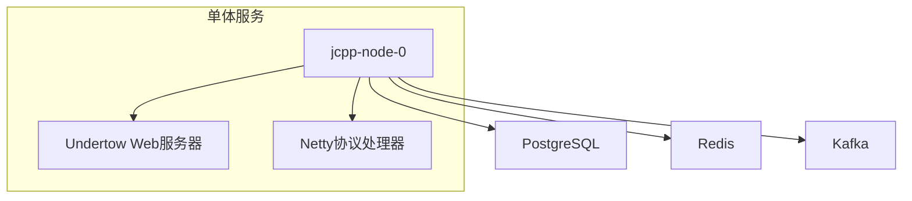
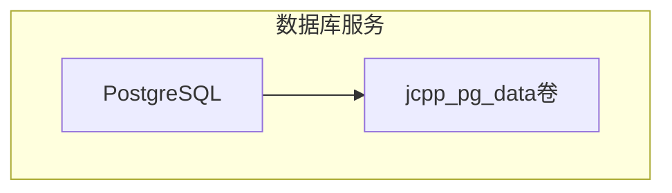
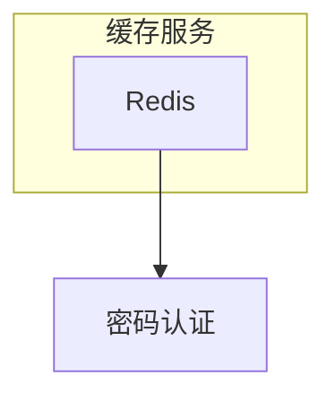
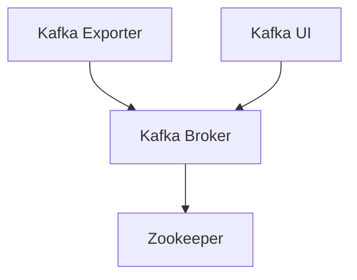
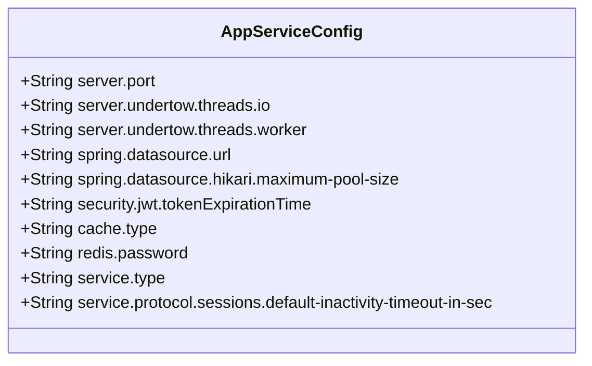
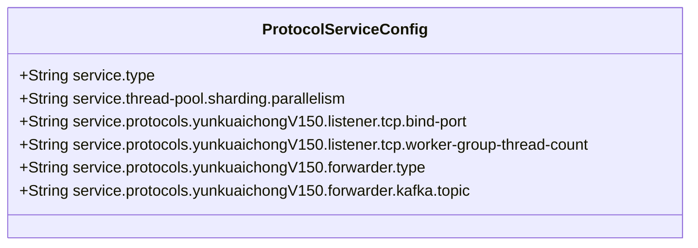
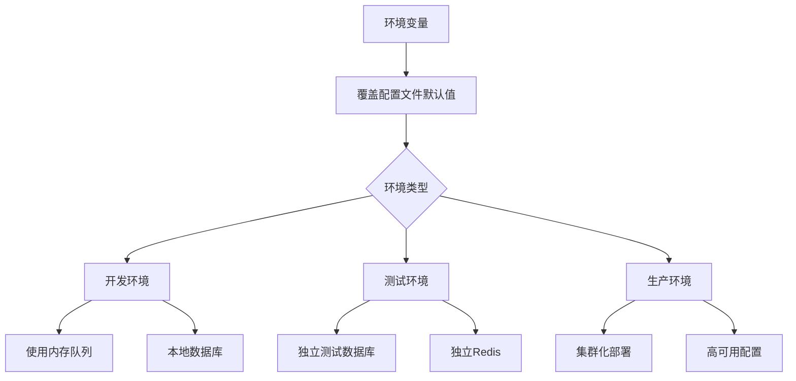
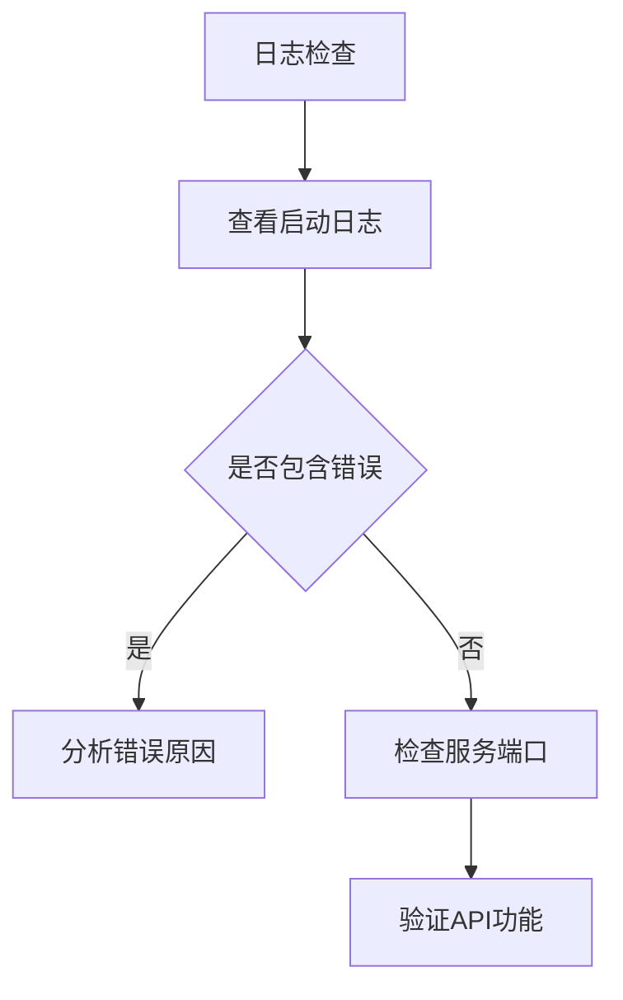

# 部署与配置

<cite>
**本文档引用的文件**
- [docker-compose.monolith.yml](file://docker/docker-compose.monolith.yml)
- [docker-compose.postgres.yml](file://docker/docker-compose.postgres.yml)
- [docker-compose.redis-standalone.yml](file://docker/docker-compose.redis-standalone.yml)
- [docker-compose.kafka.yml](file://docker/docker-compose.kafka.yml)
- [app-service.yml](file://jcpp-app-bootstrap/src/main/resources/app-service.yml)
- [protocol-service.yml](file://jcpp-protocol-bootstrap/src/main/resources/protocol-service.yml)
- [app.Dockerfile](file://docker/app.Dockerfile)
- [protocol.Dockerfile](file://docker/protocol.Dockerfile)
- [start.sh](file://docker/start.sh)
- [log4j2.xml](file://jcpp-app-bootstrap/src/main/resources/log4j2.xml)
- [log4j2.xml](file://jcpp-protocol-bootstrap/src/main/resources/log4j2.xml)
- [kafka.env](file://docker/kafka.env)
</cite>

## 目录

1. [Docker部署指南](#docker部署指南)
2. [核心配置文件详解](#核心配置文件详解)
3. [环境管理与配置](#环境管理与配置)
4. [部署后验证](#部署后验证)

## Docker部署指南

JChargePointProtocol项目提供了基于Docker的完整部署方案，通过多个`docker-compose.*.yml`
文件实现模块化部署。用户可以根据需要选择部署单体服务、数据库、缓存和消息队列等组件。

### 单体服务部署

使用`docker-compose.monolith.yml`文件部署包含应用和协议处理功能的单体服务。该服务通过`app.Dockerfile`
构建，暴露8080端口用于HTTP服务，38001-38011端口用于不同协议的TCP监听。

**图示来源**

- [docker-compose.monolith.yml](file://docker/docker-compose.monolith.yml)
- [app.Dockerfile](file://docker/app.Dockerfile)

**本节来源**

- [docker-compose.monolith.yml](file://docker/docker-compose.monolith.yml)

### 数据库部署

使用`docker-compose.postgres.yml`文件部署PostgreSQL数据库服务。该服务使用Bitnami提供的PostgreSQL镜像，配置了持久化卷
`jcpp_pg_data`以确保数据持久化。数据库名为`jcpp`，默认用户名和密码均为`postgres`，监听5432端口。

**图示来源**

- [docker-compose.postgres.yml](file://docker/docker-compose.postgres.yml)

**本节来源**

- [docker-compose.postgres.yml](file://docker/docker-compose.postgres.yml)

### 缓存部署

项目提供了三种Redis部署模式：单机模式(`docker-compose.redis-standalone.yml`)、哨兵模式和集群模式。推荐在生产环境中使用集群模式以确保高可用性。单机模式配置了密码
`sanbing`，监听6379端口。

**图示来源**

- [docker-compose.redis-standalone.yml](file://docker/docker-compose.redis-standalone.yml)

**本节来源**

- [docker-compose.redis-standalone.yml](file://docker/docker-compose.redis-standalone.yml)

### 消息队列部署

使用`docker-compose.kafka.yml`文件部署Kafka消息队列系统，包含Zookeeper、Kafka Broker、Kafka Exporter和Kafka
UI四个组件。Zookeeper用于服务发现和配置管理，Kafka Broker处理消息，Kafka Exporter提供监控指标，Kafka UI提供Web管理界面。

**图示来源**

- [docker-compose.kafka.yml](file://docker/docker-compose.kafka.yml)
- [kafka.env](file://docker/kafka.env)

**本节来源**

- [docker-compose.kafka.yml](file://docker/docker-compose.kafka.yml)

## 核心配置文件详解

### 应用服务配置 (app-service.yml)

`app-service.yml`是应用服务的核心配置文件，定义了服务运行所需的各种参数。

#### 服务与Web服务器配置

- **server.port**: HTTP服务监听端口，默认8080，可通过`HTTP_BIND_PORT`环境变量覆盖
- **server.undertow**: Undertow服务器配置，包括IO线程数(默认4)和工作线程数(默认128)
- **spring.datasource**: 数据库连接配置，包括URL、用户名、密码和Hikari连接池大小(默认64)

#### 安全与认证配置

- **security.jwt**: JWT令牌配置，包括过期时间、刷新令牌时间和签名密钥
- **security.settings.passwordPolicy**: 密码策略配置，定义密码最小长度(默认6)等安全要求

#### 缓存配置

- **cache.type**: 缓存类型，可选`caffeine`(本地缓存)或`redis`(分布式缓存)
- **redis**: Redis连接配置，包括主机、端口、密码和连接池参数

#### 协议服务配置

- **service.type**: 服务类型，可选`monolith`(单体)、`app`(应用后端)或`protocol`(协议前置)
- **service.protocol.sessions**: 协议会话配置，包括默认不活动超时时间(默认600秒)

**图示来源**

- [app-service.yml](file://jcpp-app-bootstrap/src/main/resources/app-service.yml)

**本节来源**

- [app-service.yml](file://jcpp-app-bootstrap/src/main/resources/app-service.yml)

### 协议服务配置 (protocol-service.yml)

`protocol-service.yml`是协议服务的核心配置文件，专注于协议处理相关的配置。

#### 服务类型与线程池

- **service.type**: 服务类型，默认为`protocol`，表示纯协议解析前置服务
- **service.thread-pool.sharding**: 分片线程池配置，包括并行度(默认8)和哈希函数

#### 协议监听器配置

- **service.protocols.*.listener.tcp.bind-port**: 不同协议版本的TCP监听端口，如云快充V150使用38001端口
- **service.protocols.*.listener.tcp.worker-group-thread-count**: Netty工作线程组大小，默认16

#### 消息转发配置

- **service.protocols.*.forwarder.type**: 消息转发类型，在协议服务中通常为`kafka`
- **service.protocols.*.forwarder.kafka.topic**: Kafka主题名称，默认为`protocol_uplink`

**图示来源**

- [protocol-service.yml](file://jcpp-protocol-bootstrap/src/main/resources/protocol-service.yml)

**本节来源**

- [protocol-service.yml](file://jcpp-protocol-bootstrap/src/main/resources/protocol-service.yml)

## 环境管理与配置

### 配置文件管理

项目通过Spring Boot的配置机制支持多环境配置。核心配置文件`app-service.yml`和`protocol-service.yml`中的所有参数都支持通过环境变量覆盖，遵循
`${ENV_VAR_NAME:default_value}`的格式。

#### 开发环境

在开发环境中，可以使用内存队列(`queue.type=memory`)来简化部署，避免依赖Kafka。数据库连接可以指向本地PostgreSQL实例。

#### 生产环境

在生产环境中，应使用完整的Docker Compose配置，包括PostgreSQL、Redis集群和Kafka。配置文件应设置适当的线程池大小和连接池参数以应对高并发。

### 环境变量使用

环境变量是管理不同环境配置的主要方式。以下是一些关键的环境变量：

- **HTTP_BIND_PORT**: HTTP服务端口
- **SPRING_DATASOURCE_URL**: 数据库连接字符串
- **REDIS_PASSWORD**: Redis密码
- **KAFKA_SERVERS**: Kafka Broker地址列表
- **SERVICE_TYPE**: 服务类型
- **APP_LOG_LEVEL**: 应用日志级别
- **PROTOCOLS_LOG_LEVEL**: 协议日志级别

环境变量可以在`docker-compose.yml`文件的`environment`部分设置，也可以在启动脚本中通过`export`命令设置。

**图示来源**

- [app-service.yml](file://jcpp-app-bootstrap/src/main/resources/app-service.yml)
- [protocol-service.yml](file://jcpp-protocol-bootstrap/src/main/resources/protocol-service.yml)

**本节来源**

- [app-service.yml](file://jcpp-app-bootstrap/src/main/resources/app-service.yml)
- [protocol-service.yml](file://jcpp-protocol-bootstrap/src/main/resources/protocol-service.yml)

## 部署后验证

### 服务日志检查

部署后应首先检查服务日志以确认服务正常启动。日志配置由`log4j2.xml`文件定义，主要日志文件位于`logs/jcpp`目录下。

#### 日志文件说明

- **jcpp-app.log**: 应用服务主日志
- **jcpp-protocol.log**: 协议服务主日志
- **accesslog**: HTTP访问日志
- **gc.log**: JVM垃圾回收日志
- **heapdump**: 内存溢出时的堆转储文件

#### 日志级别配置

通过`APP_LOG_LEVEL`和`PROTOCOLS_LOG_LEVEL`环境变量可以控制日志级别。推荐在生产环境中使用`INFO`级别，在调试时使用`TRACE`级别。

**图示来源**

- [log4j2.xml](file://jcpp-app-bootstrap/src/main/resources/log4j2.xml)
- [log4j2.xml](file://jcpp-protocol-bootstrap/src/main/resources/log4j2.xml)

**本节来源**

- [log4j2.xml](file://jcpp-app-bootstrap/src/main/resources/log4j2.xml)
- [log4j2.xml](file://jcpp-protocol-bootstrap/src/main/resources/log4j2.xml)

### API功能测试

通过调用API接口验证服务功能是否正常。主要测试以下功能：

1. **健康检查**: 访问`/actuator/health`端点确认服务健康状态
2. **协议连接**: 使用TCP客户端连接协议端口(如38001)测试协议监听器是否正常工作
3. **核心业务API**: 调用充电桩管理、枪管理等API验证业务功能

测试时应确保所有依赖服务(PostgreSQL、Redis、Kafka)都已正常运行，并且网络连接正常。